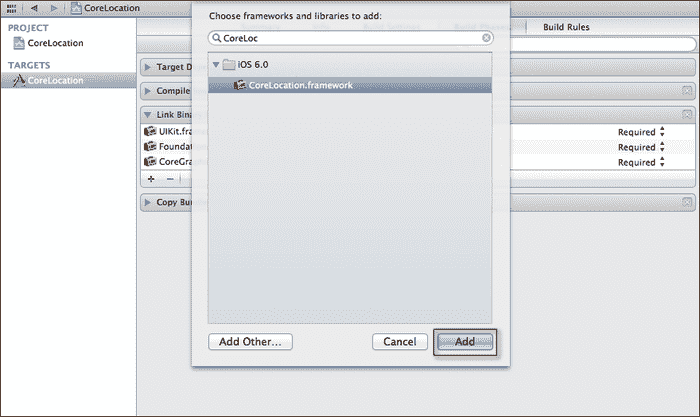
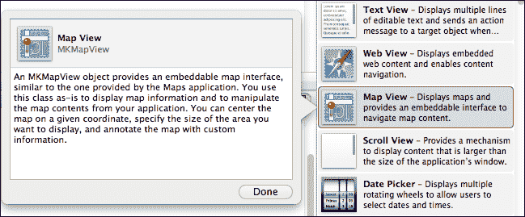
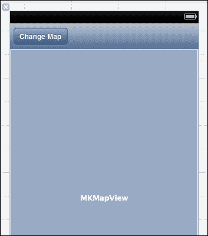
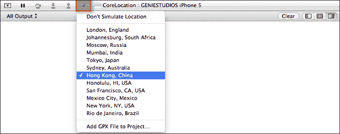
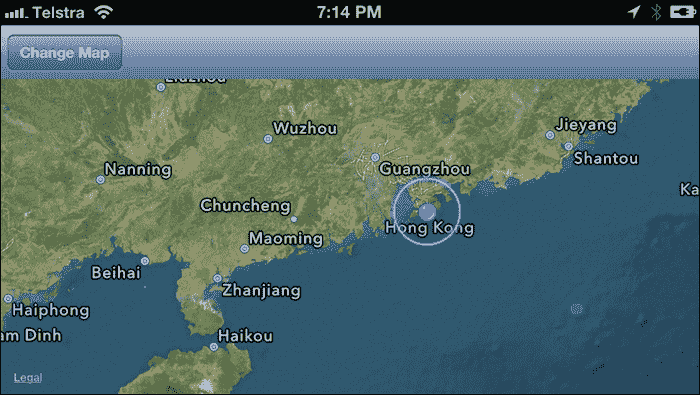
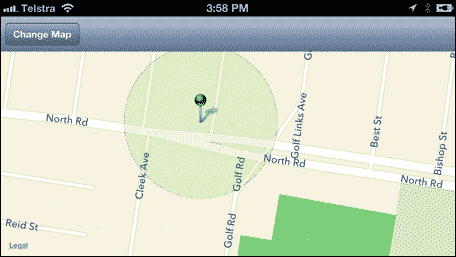
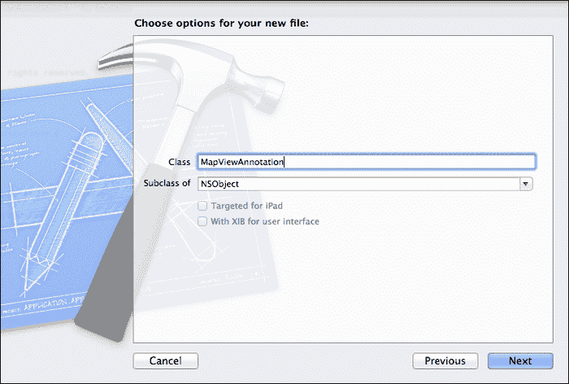
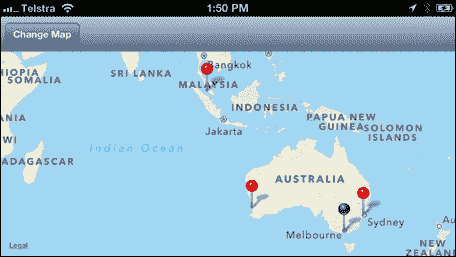
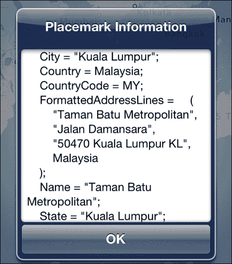
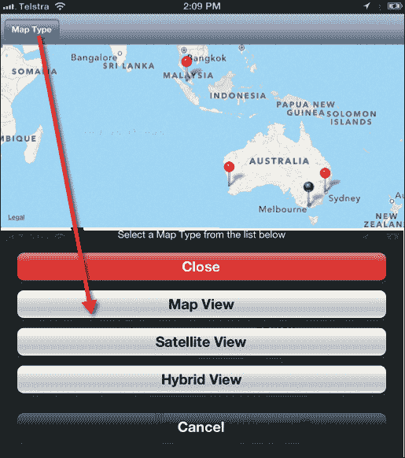

# 第五章：使用位置服务和 MapKit 框架

在本章中，我们将涵盖：

+   添加 CoreLocation 和 MapKit 框架

+   构建简单的 CoreLocation 应用程序

+   确定当前 GPS 位置

+   添加和使用 MapView 控件

+   向地图添加叠加区域

+   向地图添加注释占位符

+   反向地理编码地址信息

+   使用不同的地图类型

# 简介

在本章中，我们将更深入地探讨如何使用 CoreLocation 和 MapKit 框架来确定用户的位置。MapKit 框架基于 Google Earth 和 Google Maps 数据，以及为开发者提供简单机制将详细和交互式地图功能集成到他们自己的应用程序的 API。

MapKit 框架的核心元素是`MKMapView`类。这个类是`UIView`的子类，它提供了一个画布，用于向用户展示地图和/或卫星信息。我们还将学习如何直接在地图上添加占位符并为这些占位符创建注释。

最后，我们将学习如何使用`CLGeoLocation`类来应用地图坐标的反地理编码以显示位置信息，以及应用不同类型的地图视图。

# 添加 CoreLocation 和 MapKit 框架

在本菜谱中，我们将学习如何将 CoreLocation 和 MapKit 框架包含到我们的项目中。

## 准备工作

在本节中，我们将学习如何创建一个新的应用程序并将框架添加到我们的项目中。

## 如何做...

要开始，请按照以下顺序遵循以下简单步骤：

1.  从`/Xcode4/Applications`文件夹启动 Xcode。

1.  选择**创建新的 Xcode 项目**，或转到**文件** | **新建项目**。

1.  从可用模板列表中选择**单视图应用程序**模板。

1.  点击**下一步**按钮，继续向导的下一步。

1.  接下来，输入`CoreLocation`作为您项目的名称。

1.  从**设备**下拉列表中选择**iPhone**。

1.  确保未选中**使用故事板**复选框。

1.  确保选中**使用自动引用计数**复选框。

1.  确保未勾选**包含单元测试**复选框。

1.  点击**下一步**按钮，继续向导的下一步。

1.  指定您希望保存项目的位置。

1.  然后，点击**创建**按钮继续并显示 Xcode 工作空间。

我们下一步是向项目中添加 CoreLocation 框架。这可以通过执行以下简单步骤实现：

1.  在**项目导航器**部分选择**CoreLocation**项目。

1.  然后，从**TARGETS**组下选择您的项目。

1.  选择**构建阶段**标签并展开**链接二进制与库**展开箭头。

1.  点击**+**按钮，并从列表中选择**CoreLocation.framework**。

1.  然后，点击 **Add** 按钮将框架添加到您的项目中，如图所示：

1.  重复步骤 4 和 5，将 `MapKit.framework` 添加到您的项目中。

    ### 注意

    如果您找不到所需的框架，还可以直接从可用的框架列表中搜索此框架。

## 工作原理...

在本食谱中，我们学习了如何将 CoreLocation 和 MapKit 框架添加到我们的项目中，以便我们可以使用这些来确定我们的当前位置并处理地理编码信息以向地图添加占位符。

## 参见

+   *构建 CoreLocation 简单应用程序* 食谱

# 构建 CoreLocation 简单应用程序

在本食谱中，我们将学习如何构建我们的 Core Location 项目的用户界面。

## 准备工作

在本节中，我们将首先构建将构成我们 CoreLocation 应用程序用户界面的组件。

## 如何操作...

首先，按照以下顺序遵循以下简单步骤：

1.  从 **Project Navigator** 部分选择 `ViewController.xib` 文件。

1.  从 **Object Library** 中选择并拖动一个 (**UIToolbar**) 工具栏控件，并将其添加到视图的顶部，并选择我们之前添加的工具栏中的 **Item** 按钮。

1.  从 **Attributes Inspector** 部分更改 **Title** 的值为 **Change Map**。

1.  接下来，从 **Object Library** 中选择并拖动一个 (**MKMapView**) 地图视图控件到 **View Controller** 的中心，并调整 **Map View** 部分的尺寸以填充整个屏幕：

以下截图显示了添加了 UIToolbar 和按钮以及 `MapView` 控件的完成用户界面：



我们的下一步是创建 **Change Map** 按钮 和 **MKMapView** 控件的 `Outlet` 和 `property` 事件。创建这些将允许我们在代码中直接访问相关方法和控制属性。要创建 `Outlet` 事件，请按照以下简单步骤操作：

1.  通过选择 **Navigate** | **Open in Assistant Editor** 或按住 *Option* + *Command* 键来打开 **Assistant Editor**。

1.  确保在 **Assistant Editor** 窗口中显示 `ViewController.h` 接口文件。

1.  选择 **Change Map** (`UIBarButtonItem`) 控件，按住 *Ctrl* 键，并将其拖入 `ViewController.h` 接口文件。

    ### 注意

    为了创建 `IBOutlet` 连接，这些需要在 `@interface` 指令下的花括号内创建，因为这些不是默认创建的。

1.  从 **Connection** 下拉菜单中选择 **Outlet** 以创建连接。

1.  输入 `changeMap` 作为要创建的 **Outlet** 事件的名称。

1.  从 **Storage** 下拉菜单中选择 **Strong**。

1.  重复步骤 4 到 6，为 `MKMapView` 控件创建 `Outlet` 属性，使用名称 `mapView`。

现在我们已经为我们的控件创建了实例变量出口，我们需要为`changeMap`按钮创建关联的动作。创建这些动作允许在按钮按下时触发事件。要创建一个动作，请按照以下简单步骤操作：

1.  在**辅助编辑器**窗口中仍然显示`ViewController.h`接口文件的情况下，选择**更改地图**（`UIBarButtonItem`）控件，并按住*Ctrl*键将其拖入`ViewController.h`接口文件。

1.  从**连接**下拉列表中选择**动作**以创建连接。

1.  在**名称**中输入`changeMapType`以创建方法。

    为了使我们的应用程序正确地在视图中显示地图，我们需要导入`<MapKit/MapKit.h>`接口头文件，以便我们可以利用其方法。

1.  打开位于`Classes`文件夹中的`ViewController.h`接口文件，并添加以下突出显示的代码：

    ```swift
    //  ViewController.h
    //  CoreLocation
    //  Created by Steven F Daniel on 23/10/12.
    //  Copyright (c) 2012 GenieSoft Studios. All rights reserved.
    #import  <UIKit/UIKit.h>
    #import <MapKit/MapKit.h>

    ```

以下代码片段显示了完成的`ViewController.h`接口文件，如下所示：

```swift
//  ViewController.h
//  CoreLocation
//  Created by Steven F Daniel on 23/10/12.
//  Copyright (c) 2012 GenieSoft Studios. All rights reserved.

#import <UIKit/UIKit.h>
#import <MapKit/MapKit.h>

@interface ViewController : UIViewController 
{
  IBOutlet UIBarButtonItem *changeMap;
}

@property (strong, nonatomic) IBOutlet MKMapView *mapView;

// Declare our class instance methods
-(IBAction)changeMapType:(id)sender;

@end
```

## 它是如何工作的...

在这个菜谱中，我们首先通过向视图控制器添加`UIToolbar`和`MKMapView`控件来构建用户界面。然后，我们创建了在按下`changeMapType`按钮时需要执行必要的出口和动作事件方法。然后，我们将`MapKit.h`接口文件导入到`ViewController.h`接口文件中，以便我们可以访问`MKMapView`类的类方法。

在我们的下一个菜谱中，我们将探讨如何使用`MKMapView`类和`CLLocationManager`类来确定我们的当前地理 GPS 位置。

## 参见

+   *确定当前 GPS 位置*菜谱

+   *显示和使用地图*菜谱

+   在第一章的*使用 Xcode 创建 iOS 项目*和*创建到 Interface Builder 对象的出口*菜谱中，*获取和安装 iOS SDK 开发工具*

# 确定当前 GPS 位置

在这个菜谱中，我们将学习如何确定我们 iOS 设备的当前 GPS 位置。

## 准备工作

在本节中，我们将看到如何使用 CoreLocation 框架确定我们的纬度和经度 GPS 位置，并在`alertView`对话框中输出此信息。

## 如何操作...

首先，按照以下顺序遵循以下简单步骤：

1.  从**项目导航器**部分打开`ViewController.h`接口文件。

1.  接下来，修改接口文件，如下面的代码片段中突出显示的代码部分所示：

    ```swift
    //  ViewController.h
    //  CoreLocation
    //  Created by Steven F Daniel on 23/10/12.
    //  Copyright (c) 2012 GenieSoft Studios. All rights reserved.

    #import <UIKit/UIKit.h>
    #import <MapKit/MapKit.h>
    #import <CoreLocation/CoreLocation.h>

    @interface ViewController : UIViewController < MKMapViewDelegate, CLLocationManagerDelegate>
    {
     CLLocationManager     *locationManager;
      IBOutlet UIBarButtonItem *changeMap;
     BOOL                  foundLocation;

       // Obtain the user's current Longitude/Latitude
     float                 curLat;
     float                 curLong;
    }

    @property (strong, nonatomic) IBOutlet MKMapView *mapView;
    @property float curLat;
    @property float curLong;
    // Declare our class instance methods
    -(IBAction)changeMapType:(id)sender;

    @end
    ```

1.  从**项目导航器**部分打开`ViewController.m`实现文件，并在`@implementation`指令语句下添加以下突出显示的代码语句：

    ```swift
    //
    //  ViewController.m
    //  CoreLocation
    //
    //  Created by Steven F Daniel on 23/10/12.
    //  Copyright (c) 2012 GenieSoft Studios. All rights reserved.
    //

    #import "ViewController.h"

    @implementation ViewController

    @synthesize mapView, curLat, curLong;

    ```

1.  接下来，修改`viewDidLoad`方法，如下面的代码片段中突出显示的代码部分所示：

    ```swift
    - (void)viewDidLoad {

    [super viewDidLoad];

    // Do any additional setup after loading the view, 
     // typically from a nib.
    foundLocation= NO;

    // Make this controller the delegate for the map view.
    self.mapView.delegate = self;

    // Instantiate a new location object.
    locationManager = [[CLLocationManager alloc] init];

    // Make this controller the delegate for the location
    // manager.
    [locationManager setDelegate:self];
    // Set some parameters for the location object.
    [locationManager setDistanceFilter:kCLDistanceFilterNone];
    [locationManager setDesiredAccuracy:kCLLocationAccuracyBest];

    // Determine the current geographic location coordinates
     // of the user on the map
    [locationManager startUpdatingLocation];
    }
    ```

1.  接下来，创建`didUpdateToLocation:`方法，如下面的代码片段所示：

    ```swift
    #pragma mark Work out the current user location on the map 
    - (void)locationManager:(CLLocationManager *)manager didUpdateToLocation:(CLLocation *)newLocation fromLocation:(CLLocation *)oldLocation
    {
    // If this is the first launch of the app, then set the 
      // center point of the map to the user's location.
    if (!foundLocation) {
    // Determine the current geographic location coordinates
    self.curLat  = mapView.userLocation.coordinate.latitude;
    self.curLong = mapView.userLocation.coordinate.longitude;

    // Show the current user location within an Alert dialog
      UIAlertView *alert = [[UIAlertView alloc] 
                 initWithTitle:@"You are located at"
                 message:[NSString stringWithFormat:@"Latitude: %f 
                 and Longitude: %f", self.curLat, self.curLong]
                 delegate:nil
                 cancelButtonTitle:@"OK"
                 otherButtonTitles:nil];

        // Display the alert view dialog 
        [alert show];

        // Reset so that this does not get called again.
        foundLocation = YES;
      }
    }  

    #pragma mark If an error occurred, we need to tell our location Manager to stop updating location
    - (void)locationManager:(CLLocationManager *)manager 
       didFailWithError:(NSError *)error {
      [locationManager stopUpdatingLocation];
    }
    ```

1.  然后，通过选择**产品** | **运行**从**产品**菜单，或者按*Command* + *R*来构建和运行应用程序。

您会注意到一旦程序执行，核心位置将与 iOS 设备通信以确定您的位置，并在`UIAlertview`对话框中显示此信息。

## 工作原理...

在这个菜谱中，我们导入了`MapView.h`头文件信息到我们的`CoreLocation.h`接口文件，以便我们可以访问其类方法。然后我们需要扩展我们的类以包含`CLLocationManagerDelegate`的类协议，这样我们就可以访问协议的相关方法。然后初始化我们超类的继承成员，并将`foundLocation`设置为`NO`第一次运行，并将视图控制器设置为`mapView`的代理，这样我们就可以在地图移动时传递通知。

接下来，我们实例化`locationManager`类，并将其代理属性设置为我们的`mapView`，并将`locationManager`类对象的`desiredAccuracy`属性设置为`kCLLocationAccuracyBest`，这指定了`locationManager`类提供的位置和航向信息应尽可能精确，作为一个测试，最好在实际的 iOS 设备上进行测试。

最后，我们声明了`didUpdateToLocation`方法来处理`CLLocationManger`类更改 iOS 设备当前位置的情况。从这里，我们然后获取当前的纬度和经度坐标，并在`UIAlertview`对话框中显示这些信息，最后将`foundLocation`变量设置为`YES`。

### 注意

关于`CLLocationManager`类的更多信息，您可以参考以下 URL 的 Apple 开发者文档：

[`developer.apple.com/library/ios/#documentation/CoreLocation/Reference/CLLocationManager_Class/CLLocationManager/CLLocationManager.html`](https://developer.apple.com/library/ios/#documentation/CoreLocation/Reference/CLLocationManager_Class/CLLocationManager/CLLocationManager.html)

## 还有更多...

我们实现了`locationManager:didFailWithError`类，该类在无法使用位置服务或无法立即检索位置时会被调用。我们使用`error`属性来确定发生的错误类型，然后调用`locationManager`对象的`stopUpdatingLocation`方法。

以下表格显示了每个有效的错误代码及其描述，这些描述由`locationManager:didFailWithError`方法返回：

| 核心位置错误代码 | 位置管理器错误描述 |
| --- | --- |
| `kCLErrorLocationUnknown` | 此错误告诉您位置管理器目前无法获取位置。 |
| `kCLErrorDenied` | 此错误通知您用户拒绝了位置服务的访问。 |
| `kCLErrorNetwork` | 此错误告诉您网络不可用或发生了网络错误。 |
| `kCLErrorHeadingFailure` | 此错误告诉您无法确定航向位置。 |
| `kCLErrorRegionMonitoringDenied` | 此错误告诉您用户拒绝了区域监控服务的访问。 |
| `kCLErrorRegionMonitoringFailure` | 此错误告诉您无法监控已注册的区域。 |
| `kCLErrorRegionMonitoringSetupDelayed` | 此错误告诉您核心位置无法立即初始化区域监控服务。 |

### 注意

关于核心位置类`didFailWithError`错误代码的更多信息，您可以参考位于[`developer.apple.com/library/ios/#documentation/CoreLocation/Reference/CLLocationManagerDelegate_Protocol/CLLocationManagerDelegate/CLLocationManagerDelegate.html`](https://developer.apple.com/library/ios/#documentation/CoreLocation/Reference/CLLocationManagerDelegate_Protocol/CLLocationManagerDelegate/CLLocationManagerDelegate.html)的 Apple 开发者文档。

## 相关内容

+   *添加和使用 MapView 控件*配方

+   *反转地理编码地址信息*配方

# 添加和使用 MapView 控件

在本配方中，我们将学习如何使用位置模拟器来提供您在应用程序中测试基于位置的功能的能力，而无需离开您的办公桌。

## 准备工作

在本节中，我们将了解如何使用位置模拟器让您在 iOS 模拟器中选择预设的位置和路线，并选择具有精度的自定义纬度和经度。

## 如何操作...

要开始，请按照以下顺序遵循以下简单步骤：

1.  从**项目导航**部分打开`ViewController.m`实现文件。

1.  接下来，修改如下代码片段中突出显示的`viewDidLoad`方法：

    ```swift
    - (void)viewDidLoad {

       [super viewDidLoad];

      // Do any additional setup after loading the view, 
      // typically from a nib.
      foundLocation = NO;

      // Ensure that you can view your own location 
      // in the map view.
     [self.mapView setShowsUserLocation:YES];

      // Instantiate a location object.
     locationManager = [[CLLocationManager alloc] init];
     // Make this controller the delegate for 
     // the location manager.
     [locationManager setDelegate:self];

     // Set some parameters for the location object.
     [locationManager setDistanceFilter:kCLDistanceFilterNone];
      [locationManager 
      setDesiredAccuracy:kCLLocationAccuracyBest];

      // Determine the current geographic location 
      // coordinates of the user on the map
      [locationManager startUpdatingLocation];
    }
    ```

1.  然后，通过从**产品**菜单选择**运行**或按*Command* + *R*来构建并运行应用程序。

您会注意到，一旦程序执行，核心位置会与 iOS 设备通信以确定您的位置，并使用蓝色闪烁标记显示此信息。

您还可以选择在 iOS 设备上运行应用程序时使用 Xcode 导航到不同的位置。为此，请按照以下简单步骤操作：

1.  从 Xcode 调试控制台，点击如下截图所示的**模拟位置**图标。这将显示一个可用位置的列表：

1.  从显示的位置列表中选择**中国香港**或类似选项。

1.  然后，iOS 设备将更新以反映所选位置。您需要放大并手动滚动到该位置以查看更改，如下截图所示：

## 它是如何工作的...

在本食谱中，我们学习了如何通过使用地图视图控制器的 `setShowsUserLocation` 属性来设置 `MapView` 控制器以在地图上显示我们的当前位置，以及如何使用 Xcode 允许我们的 iOS 设备通过使用 **模拟位置** 功能来模拟不同的位置。

## 参见

+   *确定当前 GPS 位置* 食谱

+   *添加覆盖区域到地图* 食谱

# 添加覆盖区域到地图

在本食谱中，我们将学习如何创建一个覆盖物来标记我们的地图视图控制器对象上的一个区域。这些覆盖对象基本上是包含表示地图区域所需地理数据的对象。例如，覆盖物可以采用常见的形状，如矩形和圆形。

## 准备工作

在本节中，我们将了解如何使用 `MKOverlayView` 类和 `MKOverlay` 协议来允许我们在地图上表示一个点和一个区域。

## 如何操作...

首先，按照以下顺序遵循以下简单步骤：

1.  从 **项目导航器** 部分打开 `ViewController.m` 实现文件。

1.  接下来，创建如以下代码片段所示的 `overlayCurrentUserLocation` 函数：

    ```swift
    #pragma mark draws an overlay showing the current user's location
    -(void)createOverlayArea
    {
      // Show the current user location with 100km radius
      MKCircle *circle = [MKCircle 
       circleWithCenterCoordinate:mapView.userLocation.coordinate 
       radius:100];
      circle.title = @"Current Location";
      [self.mapView addOverlay:circle];

      // Zoom into the current user's location using a 2 km span
      MKCoordinateRegion mapRegion;
       mapRegion.center = mapView.userLocation.coordinate;
      mapRegion.span = MKCoordinateSpanMake(0.2, 0.2);

       [mapView setRegion:mapRegion animated: YES];
    }
    ```

1.  接下来，创建如以下代码片段所示的 `mapView:viewForOverlay:` 方法：

    ```swift
    -(MKOverlayView *)mapView:(MKMapView *)mapView viewForOverlay:(id)overlay
    {
        MKCircleView* circleView = [[MKCircleView alloc] 
        initWithOverlay:overlay];
        circleView.strokeColor = [UIColor redColor];
        circleView.lineWidth = 1.0;
        circleView.fillColor = [UIColor colorWithRed:0.0 
        green:255.0 blue:0.0 alpha:0.1];

        return circleView;
    }
    ```

1.  修改 `locationManager:didUpdateToLocation:` 方法，并输入以下突出显示的代码部分，如代码片段所示：

    ```swift
    #pragma mark Work out the current user location on the map 
    - (void)locationManager:(CLLocationManager *)manager didUpdateToLocation:(CLLocation *)newLocation fromLocation:(CLLocation *)oldLocation
    {
       // If this is the first launch of the app, then set the 
       // center point of the map to the user's location.
       if (!foundLocation)
       {
          // Determine the current geographic location coordinates
         self.curLat  = mapView.userLocation.coordinate.latitude;
         self.curLong = mapView.userLocation.coordinate.longitude;

        // Show the current user location within an Alert dialog
       UIAlertView *alert = [[UIAlertView alloc] 
             initWithTitle:@"You are located at"
             message:[NSString stringWithFormat:@"Latitude: %f and 
             Longitude: %f", self.curLat, self.curLong]
             delegate:nil
             cancelButtonTitle:@"OK"
             otherButtonTitles:nil];

         // Display the alert view dialog
         [alert show];

        // Display our overlaid area on the map
     [self createOverlayArea];
         // Reset so that this does not get called again.
          foundLocation = YES;
      }
    }
    ```

1.  然后，通过从 **产品** 菜单中选择 **产品** | **运行** 或按 *Command* + *R* 键来构建和运行应用程序。

你会注意到一旦程序执行，核心位置服务会与 iOS 设备通信以确定你的位置，然后放大并显示一个圆圈，显示我们指定的区域的半径：



## 它是如何工作的...

在本食谱中，我们创建了一个名为 `createOverlayArea` 的函数，该函数基于当前用户位置创建了一个半径为 100 公里的圆圈，然后使用 `MKCircle` 类的标题属性为该位置创建了一个标题，并使用 `addOverlay` 方法将我们的圆覆盖并添加到 `mapView` 控制器中。

在我们的下一步中，我们使用 `MKCoordinateRegion` 创建了一个 2 公里的区域范围，然后使用 `setRegion` 设置器方法放大到由半径分配的区域。然后我们创建了 `mapView:viewForOverlay:` 方法，该方法在对象被覆盖到地图视图控制器上时被调用，并使用 `MKCircleView` 类填充覆盖区域的圆圈，然后通过设置圆的 `strokeColor`、`lineWidth` 和 `fillColor` 属性来设置圆的外观和感觉。在我们的最后部分，我们修改了 `locationManager:didUpdateToLocation:` 方法，以包含对 `ceateOverlayArea` 函数的调用。

### 注意

关于 `MKOverlayView` 类的更多信息，你可以参考位于以下 URL 的 Apple 开发者文档：

[`developer.apple.com/library/ios/documentation/MapKit/Reference/MKOverlayView_class/Reference/Reference.html`](https://developer.apple.com/library/ios/documentation/MapKit/Reference/MKOverlayView_class/Reference/Reference.html)

## 参见

+   *向地图添加注释占位符*配方

+   *反转地理编码地址信息*配方

# 向地图添加注释占位符

在本配方中，我们将学习如何创建我们自己的自定义类，这将使我们能够向地图视图控制添加注释。

## 准备工作

在本节中，我们将了解如何使用`MKAnnotation`和`MKAnnotationView`类，使我们能够根据地理纬度和经度值应用一系列基于地理的注释标记到我们的`mapView`控制。

## 如何做到这一点…

要开始，请按照以下顺序遵循以下简单步骤：

1.  选择**CoreLocation**组，选择**文件** | **新建** | **文件…**或按*Command* + *N*。

1.  从可用模板列表中选择`Objective-C`类模板。

1.  点击**下一步**按钮继续向导的下一步。

1.  输入`MapViewAnnotation`作为要创建的类的名称。

1.  确保您已从**子类为**下拉列表中选择**NSObject**作为要创建的子类的类型：

1.  点击**下一步**按钮继续向导的下一步。

1.  然后，点击**创建**按钮将文件保存到指定的文件夹位置。

我们下一步是实现此类使用的功能和方法。

1.  从**项目导航器**部分打开`MapViewAnnotation.h`接口文件，并输入以下代码片段：

    ```swift
    //  MapViewAnnotation.h
    //  CoreLocation
    //  Created by Steven F Daniel on 23/10/12.
    //  Copyright (c) 2012 GenieSoft Studios. All rights reserved.

    #import <Foundation/Foundation.h>
    #import <MapKit/MapKit.h>

    @interface MapViewAnnotation : NSObject <MKAnnotation> {
      NSString *title;
       NSString *subtitle;
      CLLocationCoordinate2D coordinate;  
    }

    @property (nonatomic, copy) NSString *title;
    @property (nonatomic, copy) NSString *subtitle;
    @property (nonatomic, readonly) CLLocationCoordinate2D coordinate;

    - (id)initWithTitle:(NSString *)header subtitle:(NSString *)subtitle andCoordinate:(CLLocationCoordinate2D)coord2D;

    @end
    ```

1.  从**项目导航器**部分打开`MapViewAnnotation.m`实现文件，并输入以下代码片段：

    ```swift
    //  MapViewAnnotation.m
    //  CoreLocation
    //  Created by Steven F Daniel on 23/10/12.
    //  Copyright (c) 2012 GenieSoft Studios. All rights reserved.

    #import "MapViewAnnotation.h"

    @implementation MapViewAnnotation

    @synthesize title, subtitle, coordinate;

    - (id)initWithTitle:(NSString *)header subtitle:(NSString *)subtitles andCoordinate:(CLLocationCoordinate2D)coord2D {

      title = header;
       subtitle = subtitles;
      coordinate = coord2D;
      return self;
    }

    @end
    ```

1.  接下来，从**项目导航器**部分打开`ViewController.m`实现文件，并输入以下代码片段中的高亮代码部分：

    ```swift
    //  ViewController.m
    //  CoreLocation
    //  Created by Steven F Daniel on 23/10/12.
    //  Copyright (c) 2012 GenieSoft Studios. All rights reserved.

    #import  "ViewController.h"
    #import "MapViewAnnotation.h"

    @interface ViewController ()
    @end

    @implementation ViewController

    @synthesize mapView, curLat, curLong;

    ```

1.  接下来，创建如以下代码片段所示的`plotGeographicalData`方法：

    ```swift
    #pragma mark Plots the geographic locations onto the Map
    -(void)plotGeographicalData
    {
      // Remove any existing custom annotations but not the user 
      // location blue dot.
      for (id <MKAnnotation> annotation in mapView.annotations) {
       if ([annotation isKindOfClass:[MapViewAnnotation class]]) {
           [mapView removeAnnotation:annotation];
       }
      }
      // Add the annotation to our map view
      NSString          *pinName;
      MapViewAnnotation *newAnnotation;

      pinName = @"Kuala Lumpur";
      newAnnotation = [[MapViewAnnotation alloc] 
      initWithTitle:pinName
            subtitle:@"Malaysia"
      andCoordinate:
      CLLocationCoordinate2DMake(3.13900,101.68685)];

      [self.mapView addAnnotation:newAnnotation];

      // Add the annotation to our map view
      pinName = @"Western Australia";
      newAnnotation = [[MapViewAnnotation alloc] 
      initWithTitle:pinName
            subtitle:@"Perth, WA"
                andCoordinate:
                CLLocationCoordinate2DMake(-31.93285, 115.86194)];
      [self.mapView addAnnotation:newAnnotation];

      // Zoom in so that all pins fit within the map region
      [self zoomToFitMapAnnotations];
    }
    ```

1.  然后，创建如以下代码片段所示的`mapView:viewForAnnotation:`方法：

    ```swift
    #pragma mark sets up the properties for each of the annotations on the map
    -(MKAnnotationView *)mapView:(MKMapView *)mapView viewForAnnotation:(id <MKAnnotation>)annotation {

    // Define the identifier for the MapViewAnnotation Class.
    static NSString *identifier = @"MapViewAnnotation";

    // Place the current user location onto the Map at the 
    // location determined using the MKUserLocation class.
    if ([annotation isKindOfClass:[MKUserLocation class]]) {
         MKPinAnnotationView *annotationView = 
        (MKPinAnnotationView *) [self.mapView 
        dequeueReusableAnnotationViewWithIdentifier:identifier];
        if (annotationView == nil) {
          annotationView = [[MKPinAnnotationView alloc] 
          initWithAnnotation:annotation 
          reuseIdentifier:identifier];
    } 
    else {
       annotationView.annotation = annotation;
    }
    annotationView.enabled = YES;
    annotationView.canShowCallout = YES;
    annotationView.animatesDrop = NO;
    annotationView.pinColor = MKPinAnnotationColorGreen;
    return annotationView;
    }

    return nil;
    }
    ```

1.  然后，通过选择**产品** | **运行**从**产品**菜单或按*Command* + *R*来构建和运行应用程序。

## 它是如何工作的...

在本配方中，我们创建了一个新的自定义`MapViewAnnotation`类，然后扩展此类以使用`MKAnnotation`协议，这样我们就可以访问其关联的类方法。接下来，我们在`MapViewAnnotation.m`实现文件中创建了一个名为`initWithTitle:`的方法，用于存储我们的标题和坐标以放置标记。

在下一步中，我们修改了`ViewController.m`实现文件，并创建了一个名为`plotGeographicalData`的新函数，该函数用于使用`CLLocationCoordinate2DMake`创建数组中每个地理位置的纬度和经度值，以创建多个不同的地理位置。

然后，我们将地理坐标传递给`MapViewAnnotation`类的`addAnnotation`方法，以将注释添加到地图上。最后，我们通过使用我们的`MapViewAnnotation`类实例创建`mapView:viewForAnnotation`方法，将注释对象放置到地图上。

### 注意

想要了解更多关于`MKAnnotationView`类的信息，您可以参考以下网址的 Apple 开发者文档：

[`developer.apple.com/library/ios/#documentation/MapKit/Reference/MKAnnotationView_Class/Reference/Reference.html`](https://developer.apple.com/library/ios/#documentation/MapKit/Reference/MKAnnotationView_Class/Reference/Reference.html)`#//apple_ref/occ/cl/MKAnnotationView`

## 还有更多…

为了确保地图注释发生，我们需要修改`locationManager:didUpdateToLocation`方法。该方法在 iOS 设备在地图上找到用户的当前位置或地图位置发生变化后调用。

1.  修改`locationManager:didUpdateToLocation:`方法，并输入以下高亮显示的代码部分，如代码片段所示：

    ```swift
    #pragma mark Work out the current user location on the map 
    - (void)locationManager:(CLLocationManager *)manager didUpdateToLocation:(CLLocation *)newLocation fromLocation:(CLLocation *)oldLocation
    {
       // If this is the first launch of the app, then set the 
       // center point of the map to the user's location.
    if (!foundLocation)
    {
    // Determine the current geographic location coordinates
    self.curLat  = mapView.userLocation.coordinate.latitude;
    self.curLong = mapView.userLocation.coordinate.longitude;

    // Show the current user location within an Alert dialog
      UIAlertView *alert = [[UIAlertView alloc] 
       initWithTitle:@"You are located at"
       message:[NSString stringWithFormat:@"Latitude: %f and 
       Longitude: %f", self.curLat, self.curLong]
       delegate:nil
       cancelButtonTitle:@"OK"
       otherButtonTitles:nil];

       // Display the alert view dialog
       [alert show];

      // Display our overlaid area on the map
     [self createOverlayArea];

      // Plot the geographic positions on the map
     [self plotGeographicalData];

      // Reset so that this does not get called again.
       foundLocation = YES;
      }
    }
    ```

1.  接下来，创建`zoomToFitMapAnnotations`函数，如以下代码片段所示：

    ```swift
    #pragma mark Zooms in to the map so that all visible annotations are displayed
    - (void)zoomToFitMapAnnotations 
    {
    if ([self.mapView.annotations count] == 0) return;

    int i = 0;
    MKMapPoint points[[self.mapView.annotations count]];

      // Cycle through all annotations on the map and 
      // build array of annotation points
      for (id<MKAnnotation> annotation in [self.mapView 
           annotations]) {
           points[i++] = 
           MKMapPointForCoordinate(annotation.coordinate);
      }  
      // Create a rectangle view around the visible region 
      // that the user can move around in.
      MKPolygon *pv= [MKPolygon polygonWithPoints:points count:i];
      [self.mapView setRegion:MKCoordinateRegionForMapRect([pv
      boundingMapRect]) animated:YES];
    }
    ```

    在之前的代码片段中，使用`zoomToFitMapAnnotations`方法创建了一个围绕可见区域的可滚动区域，用户可以在其中移动。这是通过使用`MKPolygon`类创建围绕地图上每个注释的一系列点来实现的。

1.  然后，通过从**产品**菜单中选择**产品** | **运行**，或通过按*Command* + *R*来构建和运行应用程序。

    ### 注意

    想要了解更多关于`MKPolygon`类的信息，您可以参考以下网址的 Apple 开发者文档：

    [`developer.apple.com/library/ios/#documentation/MapKit/Reference/MKPolygon_class/Reference/Reference.html`](https://developer.apple.com/library/ios/#documentation/MapKit/Reference/MKPolygon_class/Reference/Reference.html)

## 参考信息

+   *向地图添加覆盖区域*教程

+   *反向地理编码地址信息*教程

# 反向地理编码地址信息

在本教程中，我们将学习如何将地址信息反向地理编码成可读信息。

## 准备工作

在本节中，我们将了解“反向地理编码”这个短语，以及如何将经纬度信息转换为人类可识别的地址信息。

## 如何操作...

首先，按照以下顺序遵循以下简单步骤：

1.  从**项目导航器**部分打开`ViewController.m`实现文件。

1.  修改`viewDidLoad`方法，如以下代码片段中高亮显示的代码部分所示：

    ```swift
    - (void)viewDidLoad {

    [super viewDidLoad];

    // Do any additional setup after loading the view, 
     // typically from a nib.
    foundLocation= NO;

    // Make this controller the delegate for the map view.
    self.mapView.delegate = self;

    // Ensure that you can view your own location 
     // in the map view.
    [self.mapView setShowsUserLocation:YES];

    // Instantiate a new location object.
    locationManager = [[CLLocationManager alloc] init];

    // Make this controller the delegate for the location
     // manager.
    [locationManager setDelegate:self];

    // Set some parameters for the location object.
    [locationManager setDistanceFilter:kCLDistanceFilterNone];
    [locationManager setDesiredAccuracy:kCLLocationAccuracyBest];

    // Determine the current geographic location coordinates
     // of the user on the map
    [locationManager startUpdatingLocation];
    [self getGeocodingInformation];
    }
    ```

1.  接下来，创建`getGeocodingInformation`方法，如以下代码片段所示：

    ```swift
    #pragma mark Reverse Geocoding location details
    -(void)getGeocodingInformation
    {
    // Declare the coordinates to reverse geocode
      CLGeocoder *geoCoder = [[CLGeocoder alloc] init];
      CLLocationCoordinate2D placeCoord =  
    CLLocationCoordinate2DMake(3.13900, 101.68685);

      CLLocation *location = [[CLLocation alloc] 
    initWithLatitude:placeCoord.latitude 
    longitude:placeCoord.longitude];

    [geoCoder reverseGeocodeLocation:location 
    completionHandler: ^(NSArray *placemarks, NSError *error) 
    {
        // Get nearby address and print it out to the Console
        CLPlacemark *placemark = [placemarks objectAtIndex:0];

        // Show the placemark information within an Alert dialog
        UIAlertView *alert = [[UIAlertView alloc] 
    initWithTitle:@"Placemark Information"
    message:[placemark.addressDictionary description]
    delegate:nil
    cancelButtonTitle:@"OK"
    otherButtonTitles:nil];

    // Display the alert view dialog
    [alert show];
      }];

      return;
    }
    ```

1.  然后，通过从**产品**菜单中选择**产品** | **运行**，或通过按*Command* + *R*来构建和运行应用程序。

你会注意到一旦程序执行，提供的纬度和经度信息已经被转换成人类可识别的地址信息。



## 它是如何工作的...

在这个菜谱中，我们在`viewDidLoad`方法中添加了一个新的方法调用，`getGeocodingInformation`，它将负责在`UIAlertView`对话框窗口中显示我们的地理位置信息。然后我们创建了一个新的对象变量`geoCoder`，它是`CLGeoCoder`类，然后传递一组纬度和经度值到`CLLocation`类，然后它被传递到`CLGeoCode`类的`reverseGeocodeLocation`方法以确定坐标的地理位置细节。

一旦`reverseGeocodeLocation`方法做出判断，结果将返回到`placemarks`数组对象中，该对象包含实际数据。最后，我们调用`CLPlacemark`类，使用`placemark`对象的`addressDictionary`检索位置信息。

下面的表格简要描述了`CLPlacemark`类返回的一些不同类型的信息：

| 地标属性 | 描述 |
| --- | --- |
| `Name` | 这个属性包含地标的名称。 |
| `Country` | 这个属性是自解释的，只是简单地存储国家名称。 |
| `CountryCode` | 这个属性为你提供了国家缩写名称。 |
| `Thoroughfare` | 这包含与地标相关的街道地址。 |
| `Sublocality` | 这个属性为你提供了地标的城市级别额外信息。 |
| `SubAdministrativeArea` | 这个属性为你提供了地标额外的信息。 |
| `ZIP` | 这通常是地标的邮政编码。 |

除了之前显示的这些属性之外，地址字典为你提供了一个`FormattedAddressLines`条目，它存储了有关地址的预格式化字符串数组。

你可以使用这些字符串来显示地址，例如：“Taman Batu Metropolitan, Jalan Damansara, 50470 Kuala Lumpur KL, Malaysia”，下面的代码片段展示了如何实现这一点：

```swift
NSLog(@"Location: %@",[[placemark.addressDictionary valueForKey:@"FormattedAddressLines"] componentsJoinedByString:@", "]);
```

## 还有更多…

一个`CLPlacemark`对象存储了与给定纬度和经度相关的地标数据，并包含国家、州、城市以及与指定坐标相关的街道地址信息。此类还包括兴趣点和地理相关数据。地标通常是通过`CLGeocoder`对象生成的。

### 注意

关于`CLGeoCoder`和`CLPlacemark`类的更多信息，你可以参考位于以下 URL 的 Apple 开发者文档：

+   [`developer.apple.com/library/ios/#documentation/CoreLocation/Reference/CLGeocoder_class/Reference/Reference.html`](https://developer.apple.com/library/ios/#documentation/CoreLocation/Reference/CLGeocoder_class/Reference/Reference.html)

+   [`developer.apple.com/library/ios/#documentation/CoreLocation/Reference/CLPlacemark_class/Reference/Reference.html`](https://developer.apple.com/library/ios/#documentation/CoreLocation/Reference/CLPlacemark_class/Reference/Reference.html)`#//apple_ref/occ/cl/CLPlacemark`

## 参见

+   *确定当前 GPS 位置*配方

# 使用不同的地图类型

在本配方中，我们将学习如何在不同的地图视图之间切换。

## 准备工作

在本节中，我们将开始实现一个方法，该方法将负责处理 MapKit 框架提供的不同地图视图的更改。

## 如何做...

要开始，请按照以下顺序遵循以下简单步骤：

1.  从**项目导航器**部分打开`ViewController.h`接口文件。

1.  接下来，修改接口文件，如下面的代码片段中突出显示的代码部分所示：

    ```swift
    //  ViewController.h
    //  CoreLocation
    //  Created by Steven F Daniel on 23/10/12.
    //  Copyright (c) 2012 GenieSoft Studios. All rights reserved.

    #import <UIKit/UIKit.h>
    #import <MapKit/MapKit.h>
    #import <CoreLocation/CoreLocation.h>
    @interface ViewController : UIViewController <UIActionSheetDelegate, MKMapViewDelegate, CLLocationManagerDelegate>
    {
    CLLocationManager        *locationManager;
      IBOutlet UIBarButtonItem *changeMap;
    BOOL                   foundLocation;

        // Obtain the user's current Longitude/Latitude
        float                  curlatitude;
        float                  curlongitude;
    }

    @property (strong, nonatomic) IBOutlet MKMapView *mapView;

    @property float curlatitude;
    @property float curlongitude;

    // Declare our class instance methods
    -(IBAction)changeMapType:(id)sender;

    @end
    ```

1.  从**项目导航器**部分打开`ViewController.m`实现文件。

1.  接下来，修改`changeMapType:`方法，如下面的代码片段所示：

    ```swift
    // Called when the user presses the Map Type button
    - (IBAction)changeMapType:(id)sender{

    // Define an instance of our action sheet
    UIActionSheet *actionSheet;

    // Initialize our action sheet with the 
     // differen't mapping types
    actionSheet = [[UIActionSheet alloc]
    initWithTitle:@"Select a Map Type from the list below"
    delegate:self
    cancelButtonTitle:@"Cancel"
    destructiveButtonTitle:@"Close"
    otherButtonTitles:@"Map View",@"Satellite View",
    @"Hybrid View", nil];
    // Set our ActionSheet style and display it to the user
        actionSheet.actionSheetStyle =  
    UIBarStyleBlackTranslucent;
        [actionSheet showInView:self.view];
    }
    ```

1.  接下来，创建以下`clickedButtonAtIndex:`方法，如下面的代码片段所示：

    ```swift
    // Delegate that handles the chosen action sheet options
    -(void)actionSheet:(UIActionSheet *)actionSheet clickedButtonAtIndex:(NSInteger)buttonIndex
    {
        // Determine the chosen item
        switch (buttonIndex) {
            case 1:  mapView.mapType = MKMapTypeStandard;  break;
            case 2:  mapView.mapType = MKMapTypeSatellite; break;
            case 3:  mapView.mapType = MKMapTypeHybrid;    break;
            default: break;  // Catch the Close button and exit.
        }
    }
    ```

1.  通过选择**产品**菜单中的**运行**或按*Command* + *R*来构建和运行应用程序。

## 工作原理...

在本配方中，我们首先扩展了我们的接口文件类，以便我们可以包含我们的`UIActionSheetDelegate`协议，这样我们就可以访问相应的方法。然后我们声明并实例化了一个基于`UIActionSheet`类的`actionSheet`对象，然后初始化我们的`actionSheet`对象以显示可选择的不同的地图类型。然后我们使用`UIActionSheet`类的`actionSheetStyle`属性设置`actionSheet`的样式，然后使用`showInView:self.view`方法将`actionSheet`显示在当前视图中。

在下一部分中，我们声明了一个代理方法，用于从`actionSheet`对象中确定被按下的按钮，使用`acionSheet`属性的`clickedButtonIndex`方法。最后，我们检查`buttonIndex`变量的值以确定被按下的按钮索引。在使用`buttonIndex`变量时，请注意，起始值始终为 0。

下表简要描述了每种不同的地图视图：

| 地图类型 | 描述 |
| --- | --- |
| `MKMapTypeStandard` | 这是默认的地图类型，如果没有指定，则显示。此设置将显示包含街道和道路名称的正常地图。 |
| `MKMapTypeSatellite` | 此类型的地图将显示卫星视图信息。 |
| `MKMapTypeHybrid` | 此类型的地图将显示卫星视图与叠加在地图上的道路和街道信息的组合。 |

以下截图显示了在 iOS 设备上运行的 CoreLocation 应用程序，显示了当前的位置以及绘制到地图上的不同地理位置，以及当按下**地图类型**按钮时可选的地图类型。



### 注意

关于`MapKit`类的更多信息，您可以参考以下 URL 处的 Apple 开发者文档：

[`developer.apple.com/library/ios/#documentation/MapKit/Reference/MKMapView_Class/MKMapView/MKMapView.html`](https://developer.apple.com/library/ios/#documentation/MapKit/Reference/MKMapView_Class/MKMapView/MKMapView.html)

## 参见

+   将注释占位符添加到地图中的配方

+   确定当前 GPS 位置的配方
