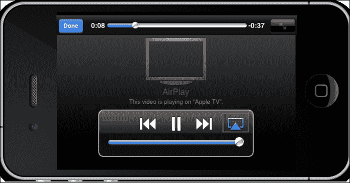
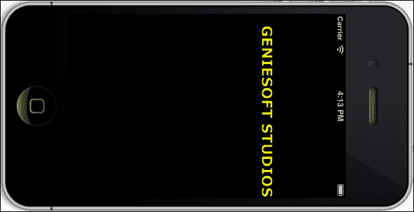
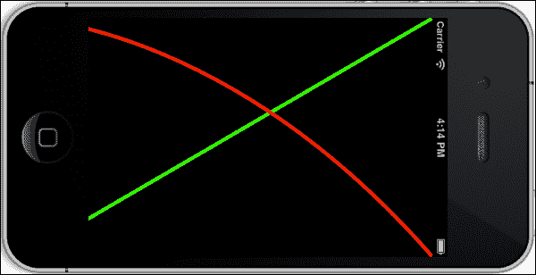
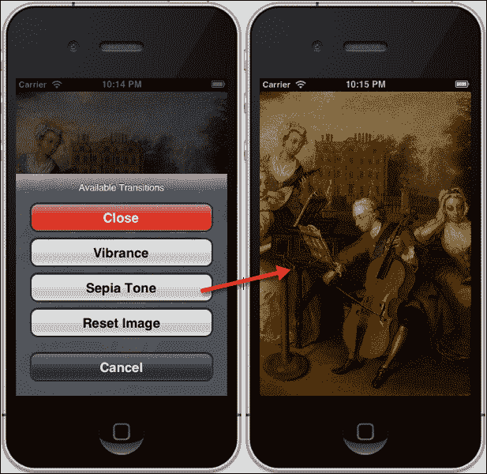
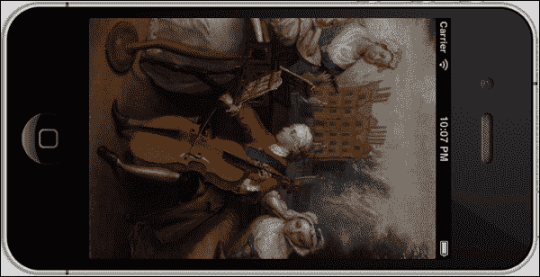

# 第七章.处理不同的多媒体资源

在本章中，我们将涵盖：

+   从相册选择图片和视频

+   使用相机捕获媒体

+   使用 AppleTV 集成播放视频

+   使用 MediaPlayer 框架播放音乐

+   使用 iOS 设备麦克风进行录音

+   动画视图

+   绘制自定义文本

+   绘制线条和曲线

+   绘制和填充形状

+   使用 Core Image 应用颜色效果

+   应用过渡效果

# 简介

**Core Image**框架是一个硬件加速框架，它提供了一种更简单的方法，让您可以使用几个内置过滤器（颜色效果、扭曲和过渡）以及一些高级功能（自动增强、红眼减少和面部识别）来增强您的照片和视频。

在本章中，我们将更深入地探讨这些框架以及如何使用`CIFilter`类应用图像过滤效果，以及实现 Airplay，使我们能够使用 Apple TV 将内容输出到另一台设备。我们将学习如何使用**AVFoundation**框架通过 iOS 设备的内置麦克风录制和播放音频内容。最后，我们将学习如何使用**CoreGraphics**框架使我们能够绘制形状和文本信息到视图中。

# 从相册选择图片和视频

在本食谱中，我们将学习如何让用户能够从 iOS 设备的相册中选择图片和视频。

## 准备工作

创建一个新的**单视图应用程序**，并将其命名为**MediaPickerExample**。

## 如何做到这一点...

首先，按照以下顺序遵循以下简单步骤：

1.  从**项目导航器**窗口中选择`ViewController.xib`文件。

1.  从**对象库**中选择并拖动一个`UIToolbar`对象，并将其添加到我们的视图中，并选择工具栏中的**项目**按钮。

1.  在**属性检查器**部分，将**标识符**属性更改为**组织**。

1.  为此`UIBarButtonItem`创建一个出口，并将其命名为`btnBrowse`。

1.  为**组织**按钮创建一个动作方法，并将其命名为`btnBrowse`。

1.  从**对象库**中选择并拖动一个`UIImageView`对象，并将其添加到我们的视图中，并调整大小以填充屏幕区域。

1.  为此`UIImageView`创建一个出口，并将其命名为`imageView`。

1.  我们的下一步是创建代码功能，该功能将负责在点击**组织**按钮时允许选择图片和视频。

    1.  从**项目导航器**打开`ViewController.h`接口文件。

    1.  接下来，根据以下代码片段中突出显示的代码部分修改界面文件：

        ```swift
        //  ViewController.h
        //  MediaPickerExample
        //  Created by Steven F Daniel on 20/11/12.
        //  Copyright (c) 2012 GenieSoft Studios. All rights reserved.

        #import<UIKit/UIKit.h>

        @interface ViewController : UIViewController<UIImagePickerControllerDelegate, UINavigationControllerDelegate> 
        {

        }

        // Declare the Getters and Setters for each of our objects.
        @property (strong, nonatomic) IBOutlet UIBarButtonItem         *btnBrowse;
        @property (strong, nonatomic) IBOutlet UIImageView             *imageView;
        @property (nonatomic, retain) UIImagePickerController *imagePicker;

        // Declare our class Instance methods
        - (IBAction)btnBrowse:(id)sender;
        ```

    1.  从**项目导航器**打开`ViewController.m`实现文件，并输入以下突出显示的代码部分。

        ```swift
        @synthesize btnBrowse;
        @synthesize imagePicker;
        @synthesize imageView;

        ```

    1.  接下来，根据代码片段修改`btnBrowse:`方法：

        ```swift
        #pragma mark called when the user presses the Organize button
        - (IBAction)btnBrowse:(id)sender {

           // Create image picker controller
           imagePicker = [[UIImagePickerController alloc] init];

           // Checks to make sure that the Photo Library is available.
          if ([UIImagePickerController isSourceTypeAvailable:
               UIImagePickerControllerSourceTypePhotoLibrary]) {
               // Set source to the Photo Library
               self.imagePicker.delegate = self;
               self.imagePicker.sourceType =  
               UIImagePickerControllerSourceTypePhotoLibrary;
               self.imagePicker.mediaTypes =[UIImagePickerController
               availableMediaTypesForSourceType:
               self.imagePicker.sourceType];
               self.imagePicker.allowsEditing = NO;
               [self presentViewController:imagePickeranimated:YES
               completion:nil];
            }
            else {
                NSLog(@"Unable to access the Photo Library.");
            }
        }
        ```

    1.  然后，根据代码片段中的指定创建以下代码部分：

        ```swift
        #pragma mark - Image Picker Delegate Methods
        - (void)imagePickerControllerDidCancel:(UIImagePickerController *)picker {
           [picker dismissViewControllerAnimated:YES completion:nil];
        }

        #pragma mark Method is called when the user has chosen an item from the image picker.
        - (void)imagePickerController:(UIImagePickerController *)picker   didFinishPickingMediaWithInfo:(NSDictionary *)info {
           // Determine the media type of the chosen item 
           NSString *mediaType = [info 
           objectForKey:UIImagePickerControllerMediaType];

           // Determine if we have chosen a image file from library.
           if ([mediaType isEqualToString:@"public.image"]) {
                UIImage *photoImage = [info 
                objectForKey:UIImagePickerControllerOriginalImage];
                self.imageView.image = photoImage;
                self.imageView.contentMode = 
                UIViewContentModeScaleAspectFit;
            }
           else if ([mediaType isEqualToString:@"public.movie"]) {
                    NSURL *movieURL = [info 
                    valueForKey:UIImagePickerControllerMediaURL];
                    NSLog(@"Movie URL: %@", movieURL);
           }
        // Dismiss the imagePicker Dialog
           [picker dismissViewControllerAnimated:NO completion:nil];
        }
        ```

    1.  然后，通过从**产品**菜单中选择**产品 | 运行**，或者按*Command + R*来**构建**和**运行**应用程序。

当编译完成后，点击**组织**按钮以显示图片选择器，通过点击其缩略图来选择一个图片。图片将在图像视图中显示。或者，如果您选择了一个视频，完整路径将在控制台窗口中显示。

## 它是如何工作的...

在这个菜谱中，我们首先扩展我们的类，包括以下每个类协议：`UIImagePickerControllerDelegate`、`UINavigationControllerDelegate`，以便我们可以访问它们各自的属性和方法。我们可以通过检查`UIImagePickerController`类的`isSourceTypeAvailable`属性来查看我们是否能够访问 iOS 设备的照片库，并将`ImagePicker`类的属性初始化为仅显示来自我们照片库的图片。接下来，我们将代理指向自身，然后将`sourceType`属性设置为使用相机，并将`cameraDevice`属性的值设置为使用后置相机并显示相机界面，然后关闭`UIImagePickerController`对象。

在下一节中，我们为我们的图片选择器控制器声明一个代理方法`imagePickerControllerDidCancel`，它将负责处理和照顾关闭相机会话，不进行图像选择，或者当点击**取消**按钮时拍照。最后，我们通过使用`UIImagePickerControllerMediaType`属性检查`UIImagePickerController`中选择的媒体类型，并确定我们是否选择了图像或电影。

如果我们选择了一张图片，我们将创建一个视频的缩略图图像表示，并将`imageView`控制的`image`属性设置为该图片。如果选择了一个视频，我们使用`UIImagePickerControllerMediaURL`方法获取所选文件的文件位置，并在我们的控制台窗口中显示这个位置。

## 参见

+   **使用相机捕捉媒体**菜谱

# 使用相机捕捉媒体

在这个菜谱中，我们将学习如何使用 iOS 设备的相机来捕捉媒体。

## 准备工作

在我们之前的菜谱基础上，创建一个新的**单视图应用程序**，并将其命名为**CameraPickerExample**。

## 如何做到这一点...

首先，按照以下顺序执行以下简单步骤：

1.  从**项目导航器**窗口中选择`ViewController.xib`文件。

1.  从**对象库**中选择并拖动一个`UIToolbar`对象，并将其添加到我们的视图中，然后点击工具栏中的**项目**按钮。

1.  在**属性检查器**部分，将**标识符**属性更改为**Camera**。

1.  为这个`UIBarButtonItem`创建一个出口，并将其命名为`btnCamera`。

1.  为**Camera**按钮创建一个动作方法，并将其命名为`btnCamera`。

1.  我们接下来的步骤是创建代码功能，该功能将在点击**相机**按钮时负责显示相机视图。

1.  从**项目导航器**打开`ViewController.h`接口文件。

1.  接下来，按照以下代码片段中突出显示的代码部分修改接口文件：

    ```swift
    //  ViewController.h
    //  CameraPickerExample
    //  Created by Steven F Daniel on 20/11/12.
    //  Copyright (c) 2012 GenieSoft Studios. All rights reserved.

    #import<UIKit/UIKit.h>

    @interface ViewController : UIViewController<UIImagePickerControllerDelegate, UINavigationControllerDelegate>
    {
    }

      // Declare the Getters and Setters for each of our objects.
      @property (strong, nonatomic) IBOutlet UIBarButtonItem           
      *btnCamera;
     @property (nonatomic, retain) 
     UIImagePickerController *imagePicker;

      // Declare each of our Class methods
      - (IBAction)btnCamera:(id)sender;
    ```

1.  从**项目导航器**窗口打开`ViewController.m`实现文件，并输入以下突出显示的代码部分：

    ```swift
    @synthesize btnCamera;
    @synthesize imagePicker;

    ```

1.  接下来，按照代码片段中显示的修改`btnCamera:`方法：

    ```swift
    #pragma mark called when the user presses the camera button
    - (IBAction)btnCamera:(id)sender {

       // Checks device to make sure that the Camera is available.
       if ([UIImagePickerController isSourceTypeAvailable:
       UIImagePickerControllerSourceTypeCamera]) {

          // Create image picker controller
          imagePicker = [[UIImagePickerController alloc] init];

          // Set our source to the Camera
          self.imagePicker.sourceType =  
          UIImagePickerControllerSourceTypeCamera;
          self.imagePicker.delegate = self;
          self.imagePicker.cameraDevice = 
          UIImagePickerControllerCameraDeviceRear;
          self.imagePicker.allowsEditing = NO;
          [self presentViewController:imagePicker animated:YES
                                     completion:nil];
       }
       else{
          NSLog(@"Use of the Camera is not available.");
       }
    }
    ```

1.  然后，根据代码片段中的说明创建以下代码部分：

    ```swift
    #pragma mark - Image Picker Delegate Methods
    - (void)imagePickerControllerDidCancel:(UIImagePickerController *)picker {
       [picker dismissViewControllerAnimated:YES completion:nil];
    }

    #pragma mark method is called when the user has finished taking a photo with the camera.
    - (void)imagePickerController:(UIImagePickerController *)picker 
    didFinishPickingMediaWithInfo:(NSDictionary *)info {

       // Access the uncropped image and Save the image
       UIImage *image = [info 
       objectForKey:@"UIImagePickerControllerOriginalImage"];
       UIImageWriteToSavedPhotosAlbum(image, self, 
       @selector(image:didFinishSavingWithError:contextInfo:), nil);
       // Then dismiss the imagePicker Dialog
       [picker dismissViewControllerAnimated:NO completion:nil];
    }

    - (void)image:(UIImage *)image didFinishSavingWithError:(NSError *)error contextInfo:(void *)contextInfo {
       // Handle any errors detected during the save
       if (error) {
          NSLog(@"Unable to save the image to the Photo Album");
       }
       else {
          NSLog(@"Image successfully saved to the Photo Album");
       }
    }
    ```

1.  然后，通过从**产品**菜单选择**产品 | 运行**或按*Command + R*来**构建**和**运行**应用程序。

当编译完成后，点击**相机**按钮打开相机并拍照。照片将被保存在 iOS 设备的相册中。

## 它是如何工作的...

在这个食谱中，我们首先扩展我们的类，包括以下每个类协议：`UIImagePickerControllerDelegate`，`UINavigationControllerDelegate`，以便我们可以访问它们各自的属性和方法。然后，我们检查是否能够使用`UIImagePickerController`类的`isSourceTypeAvailable`属性访问 iOS 设备的相机，然后创建我们`UIImagePickerController`类的新实例。接下来，我们将委托指向自身，然后将`sourceType`属性设置为使用相机，并将`cameraDevice`属性的值设置为使用后置摄像头。最后，我们显示相机界面，并关闭`UIImagePickerController`对象。接下来，我们声明一个用于我们的图像选择器控制器的委托方法`imagePickerControllerDidCancel`，该方法将负责处理和照顾关闭相机会话，不进行图像选择，或当点击**取消**按钮时拍照。

接下来，当用户使用相机拍照时，它不会自动保存在设备上。要保存它，我们调用`UIImageWriteToSavedPhotosAlbum`方法，这是`UIImage`类的方法。此方法接受一个类型为`UIImageconextInfo`的委托，如果出现问题将报告错误并立即调用`didFinishSavingWithError:`方法来处理错误类型。

## 参见

+   *从相册选择图片和视频*的食谱

# 使用 Apple TV 集成播放视频

**AirPlay**框架是一个更新的框架，允许您从任何 iOS 设备流式传输音频和视频内容到任何启用了 AirPlay 功能的设备，这些设备能够播放音频和视频，例如电视和音频系统。

从 iOS 5 开始，开发者现在可以灵活地将 Airplay 内容集成到他们的应用程序中，并将此信息输出到附近的 Apple TV 接收器。在本节中，我们将探讨如何创建一个简单的应用程序，在 iOS 设备上播放视频内容，然后查看将内容输出到 Apple TV 设备的步骤。

## 准备工作

在我们之前的菜谱之后，创建一个新的**单视图应用程序**，并将其命名为**PlayVideoExample**。

## 如何操作...

首先，按照以下顺序遵循以下简单步骤：

1.  将对`MediaPlayer.framework`的引用添加到您的项目中。

1.  从**项目导航器**窗口选择`ViewController.xib`文件。

1.  从**对象库**中拖动一个`UIButton`对象，并将其添加到我们的视图中。

1.  从**属性检查器**部分，将**标题**属性更改为**播放视频**。

1.  为此`UIButton`创建一个出口，并命名为`btnPlayVideo`。

1.  为**播放视频**按钮创建一个动作方法，并命名为`btnPlayVideo`。

1.  我们接下来的步骤是创建当**播放视频**按钮被点击时负责播放视频的代码功能。

1.  从**项目导航器**窗口打开`ViewController.h`接口文件。

1.  接下来，创建以下代码部分，如代码片段中突出显示的：

    ```swift
    //  ViewController.h
    //  PlayVideoExample
    //  Created by Steven F Daniel on 20/11/12.
    //  Copyright (c) 2012 GenieSoft Studios. All rights reserved.
    #import  <UIKit/UIKit.h>
    #import <MediaPlayer/MediaPlayer.h>

    @interface ViewController : UIViewController

    // Declare the Getters and Setters for each of our objects.
    @property  (strong, nonatomic) IBOutlet UIButton *btnPlayVideo;
    @property (strong, nonatomic) MPMoviePlayerController *moviePlayerController;

    ```

1.  从**项目导航器**窗口打开`ViewController.m`实现文件，并输入以下突出显示的代码部分：

    ```swift
    @synthesize btnPlayVideo;
    @synthesize moviePlayerController;

    ```

1.  接下来，修改`btnPlayVideo:`方法，如代码片段所示：

    ```swift
    #pragma mark Handle Playback of the video when button is pressed.
    - (IBAction)btnPlayVideo:(id)sender
    {
       // Initialize our moviePlayer Controller with the video path
       NSString *moviePath = [[NSBundle
       mainBundle]pathForResource:@"GenieCompanyVideo" 
       ofType:@"mp4"];
       NSURL  *movieURL = [NSURL fileURLWithPath:moviePath
       isDirectory:NO];
       self.moviePlayerController = [[MPMoviePlayerController alloc] 
       initWithContentURL:movieURL];

       // Set up our notifications to determine when movie completes
       [[NSNotificationCenter defaultCenter] addObserver:self
       selector:@selector(moviePlaybackComplete:)
       name:MPMoviePlayerPlaybackDidFinishNotification
       object:self.moviePlayerController];

       // Add the movie player controller to the view and 
       // determine if AirPlay is available
       [self.view addSubview:self.moviePlayerController.view];
       if ([self.moviePlayerController
           respondsToSelector:@selector(setAllowsAirPlay:)]){
           [self.moviePlayerController setAllowsAirPlay:YES];
       }
       // Initialize the movie player properties and play the video.
       self.moviePlayerController.fullscreen = YES;
       self.moviePlayerController.scalingMode = 
       MPMovieScalingModeAspectFit;
      [self.moviePlayerController play];
    }
    ```

1.  接下来，创建名为`moviePlaybackComplete:`的方法，如代码片段所示：

    ```swift
    #pragma mark Handle once the video has finished playback.
    - (void)moviePlaybackComplete:(NSNotification *)notification
    {
        self.moviePlayerController = [notification object];
        [[NSNotificationCenter defaultCenter] removeObserver:self
        name:MPMoviePlayerPlaybackDidFinishNotification
        object:self.moviePlayerController];
        [self.moviePlayerController.view removeFromSuperview];
    }
    ```

1.  然后，通过选择**产品**菜单中的**产品 | 运行**或按*Command + R*来**构建**和**运行**应用程序。

编译完成后，以下截图显示了**AirPlay**启用时的图标：



## 它是如何工作的...

在本菜谱中，我们声明了一个变量（`NSString`）`moviePath`，它将包含电影文件的文件路径，然后创建一个（`NSURL`）`movieURL`，将文件路径转换为初始化`MPMoviePlayerController`方法时所需的对象。

接下来，我们设置一个通知方法，通过使用名为`MPMoviePlayerPlaybackDidFinishNotification`的通知方法到`NSNotificationCenter`属性，调用`moviePlaybackComplete:`方法，然后将`MPMoviePlayerController`视图添加到我们的自定义视图控制器中，以便它出现在屏幕上，然后使用`MPMoviePlayerController`对象的`respondsToSelector:`方法来处理不支持`allowsAirPlay`属性的旧 iOS 设备。

为了提供 AirPlay 功能，我们在 `MPMoviePlayerController` 对象上启用一个特殊属性，通过将 `allowsAirPlay` 属性设置为 `YES`，然后指定我们想要全屏显示我们的视频。

然后我们告诉 `moviePlayerController` 方法开始播放，并修改 `MPMoviePlayerController` 对象的 `scalingMode` 属性。通过设置此属性，它将确定电影图像如何适应填充您定义的播放大小。以下是目前存在的缩放模式，并在此处显示：

+   `MPMovieScalingModeNone`

+   `MPMovieScalingModeAspectFit`

+   `MPMovieScalingModeAspectFill`

+   `MPMovieScalingModeFill`

最后，我们创建 `moviePlaybackComplete:` 方法，并使用 `[notificationobject]` 语句检索对象，然后使用新的 `moviePlayerController` 指针引用它。然后我们向 `NSNotificationCenter` 方法发送消息，移除我们在 `playVideo` 方法中先前注册的观察者。我们最后清理我们的自定义视图控制器。

### 注意

关于 `MPMoviePlayerController` 类的更多信息，您可以参考以下位置的 Apple 开发者文档：[`developer.apple.com/library/ios/#documentation/mediaplayer/reference/MPMoviePlayerController_Class/Reference/Reference.html`](https://developer.apple.com/library/ios/#documentation/mediaplayer/reference/MPMoviePlayerController_Class/Reference/Reference.html)`#//apple_ref/occ/cl/MPMoviePlayerController`

## 参见

+   *使用 MediaPlayer 框架播放音乐* 食谱

# 使用 MediaPlayer 框架播放音乐

在本食谱中，我们将学习如何播放存储在 iOS 设备上的歌曲。

## 准备工作

在我们之前的食谱基础上，创建一个新的 **单视图应用程序**，并将其命名为 **MusicPlayerExample**。

## 如何做到...

要开始，请按照以下顺序遵循以下简单步骤：

1.  将 `MediaPlayer.framework` 添加到您的项目中。

1.  从 **项目导航器** 窗口中选择 `ViewController.xib` 文件。

1.  从 **对象库** 窗口中，选择并拖动一个 `UIToolbar` 对象，并将其添加到我们的视图中，并选择工具栏中的 **项目** 按钮。

1.  从 **属性检查器** 部分更改 **标题** 属性，使其显示为 **浏览**。

1.  为此 `UIBarButtonItem` 创建出口，并将其命名为 `btnBrowse`。

1.  为 **浏览** 按钮创建 `action` 方法，并将其命名为 `btnBrowse`。

1.  从 **对象库** 窗口中，选择并拖动一个 `UIBarButtonItem` 对象，并将其添加到我们的工具栏中的 **浏览** 按钮旁边。

1.  从 **属性检查器** 部分更改 **标题** 属性，使其显示为 **播放**。

1.  为此 `UIBarButtonItem` 创建出口，并将其命名为 `btnPlay`。

1.  创建 **播放** 按钮的 `action` 方法，并将其命名为 `btnPlay`。

1.  我们的下一步是创建代码功能，该功能将负责在从媒体库中选择并播放歌曲时播放音乐。

1.  从**项目导航器**窗口中打开`ViewController.h`接口文件。

1.  接下来，创建以下代码部分，如代码片段中突出显示：

    ```swift
    //  ViewController.h
    //  MusicPlayerExample
    //  Created by Steven F Daniel on 20/11/12.
    //  Copyright (c) 2012 GenieSoft Studios. All rights reserved.

    #import  <UIKit/UIKit.h>
    #import <MediaPlayer/MediaPlayer.h>

    @interface ViewController : UIViewController<MPMediaPickerControllerDelegate>
    {
    }

    // Declare the Getters and Setters for each of our objects.
    @property (nonatomic, retain) MPMusicPlayerController *mPlayer;
    @property (nonatomic, retain) MPMediaPickerController *mPicker;

    ```

1.  从**项目导航器**窗口中打开`ViewController.m`实现文件，并输入以下突出显示的代码部分：

    ```swift
    @synthesize btnBrowse;
    @synthesize btnPlay;
    @synthesize mPicker;
    @synthesize mPlayer;

    ```

1.  接下来，按照代码片段中的修改`viewDidLoad:`方法：

    ```swift
    - (void)viewDidLoad
    {
       [super viewDidLoad];

       // Create the Media Picker and Music Player controller's
       self.mPicker = [[MPMediaPickerController alloc] 
       initWithMediaTypes:MPMediaTypeMusic];
       self.mPlayer = [[MPMusicPlayerController alloc] init];

       [mPlayer prepareToPlay];   
       self.view.backgroundColor = [UIColor blackColor];
    }
    ```

1.  然后，创建以下代码部分，如代码片段中指定：

    ```swift
    #pragma mark called when the user presses the Browse button
    - (IBAction)btnBrowse:(id)sender {
       self.mPicker.delegate = self;
       self.mPicker.allowsPickingMultipleItems = YES;
       [self presentViewController:mPicker animated:YES
       completion:nil];
    }
    -(IBAction)btnPlay:(id)sender {
       // Check to see if we are already playing our audio.
       if (!self.mPlayer.playbackState == 
           MPMusicPlaybackStatePlaying) {
           [self.btnPlay setTitle :@"Stop"];
           [self.mPlayer play];
       }
       else {
           [self.btnPlay setTitle:@"Play"];
           [self.mPlayer stop];
       }
    }
    #pragma mark - Image Picker Delegate Methods
    -(void)mediaPicker:(MPMediaPickerController *)mediaPicker
    didPickMediaItems:(MPMediaItemCollection *)mediaItemCollection{
        [self.mPlayer
        setQueueWithItemCollection:mediaItemCollection];
        [self.mPicker dismissViewControllerAnimated:YES
        completion:nil];
    }
    #pragma mark called when the user cancels the media picker
    -(void)mediaPickerDidCancel:(MPMediaPickerController *)mediaPicker {
         [self.mPicker dismissViewControllerAnimated:YES
       completion:nil];
    }
    ```

1.  然后，通过从**产品**菜单中选择**产品 | 运行**或按*Command + R*键，**构建**和**运行**应用程序。

当编译完成后，点击**浏览**按钮，选择一首或多首歌曲，然后按**播放**来播放所选歌曲。

## 它是如何工作的...

在本配方中，我们首先扩展我们的类，包括以下每个类协议：`MPMediaPickerControllerDelegate`，以便我们可以访问它们各自的属性和方法。然后，我们初始化媒体选择器，并传递我们希望它查找的媒体类型，然后初始化并创建`MPMusicPlayerController`类的实例。接下来，我们声明我们的`btnBrowse`方法，该方法将显示 iOS 设备音乐库界面，并允许选择多个文件。在我们的`btnPlay:`方法中，我们检查是否有歌曲正在播放，这是通过检查`playbackState`属性来确定的。通过`MPMusicPlayerController`类对象的`play`和`stop`方法实现歌曲的播放和停止。在`mediaPicker:didPickMediaItems:`方法中，我们通过使用`setQueueWithItemCollection:`方法将用户选择的歌曲设置到音乐播放器中，并通过关闭模态媒体选择器控制器来关闭。

## 参见

+   *使用 Apple TV 集成播放视频*配方

+   *使用相机捕获媒体*配方

# 使用 iOS 设备的麦克风录音

在本配方中，我们将学习如何使用 iOS 设备的麦克风来录音。

## 准备工作

在我们之前的配方之后，创建一个新的**单视图应用程序**，并将其命名为**RecorderExample**。

## 如何做...

首先，按照以下顺序遵循以下简单步骤：

1.  将`AVFoundation.framework`引用添加到您的项目中。

1.  从**项目导航器**窗口中选择`ViewController.xib`文件。

1.  从**对象库**窗口中，选择并拖动一个`UIToolbar`对象，并将其添加到我们的视图中，然后选择工具栏内的**项目**按钮。

1.  在**属性检查器**部分，将**标题**属性更改为**开始录音**。

1.  为此`UIBarButtonItem`创建出口，并将其命名为`btnStart`。

1.  为按钮创建`action`方法，并将其命名为`startRecord`。

1.  从**对象库**窗口中，选择并拖动一个`UIBarButtonItem`对象，并将其添加到工具栏中**开始录音**按钮的右侧。

1.  从**属性检查器**部分，将**标题**属性更改为读取**播放**。

1.  为此`UIBarButtonItem`创建出口，并将其命名为`btnPlay`。

1.  为按钮创建`action`方法，并将其命名为`startPlayback`。

1.  我们下一步要创建的代码功能将负责录音和播放我们的音频内容。

1.  从项目导航器窗口打开`ViewController.h`接口文件。

1.  接下来，创建以下代码部分，如代码片段中突出显示：

    ```swift
    //  ViewController.h
    //  RecorderExample
    //  Created by Steven F Daniel on 20/11/12.
    //  Copyright (c) 2012 GenieSoft Studios. All rights reserved.

    #import<UIKit/UIKit.h>
    #import<AVFoundation/AVFoundation.h>

    @interface ViewController : UIViewController

    // Declare the getters and setters for our Outlets
    @property (nonatomic, strong) IBOutlet UIBarButtonItem *btnPlay;
    @property (nonatomic, strong) AVAudioRecorder *aRecorder;
    @property (nonatomic, strong) AVAudioPlayer   *aPlayer;

    // Declare our class instance methods
    - (IBAction)startRecord:(id)sender;
    - (IBAction)startPlayback:(id)sender;
    ```

1.  从**项目导航器**窗口打开`ViewController.m`实现文件，并输入以下突出显示的代码部分：

    ```swift
    @synthesize btnStart, btnPlay;
    @synthesize aPlayer, aRecorder;

    ```

1.  接下来，修改`viewDidLoad:`方法，如代码片段所示：

    ```swift
    - (void)viewDidLoad
    {
      [super viewDidLoad];

       // Initialize our recording sample file properties.
       NSString *fileName = @"RecorderExample.caf";
       NSArray  *dirPaths = 
       NSSearchPathForDirectoriesInDomains(NSDocumentDirectory,
                                         NSUserDomainMask, YES);
       NSString *docsDir = [dirPaths objectAtIndex:0];
       NSString *soundFilePath = [docsDir
       stringByAppendingPathComponent:fileName];
       NSURL *soundFileURL = [NSURL fileURLWithPath:soundFilePath];

       // Initialize the recorder with default settings.
       NSDictionary *recordSettings = [NSDictionary
       dictionaryWithObjectsAndKeys:
          [NSNumber numberWithInt:AVAudioQualityMin],
                            AVEncoderAudioQualityKey,
                               [NSNumber numberWithInt:16],
                               AVEncoderBitRateKey,
                               [NSNumber numberWithInt:2],
                               AVNumberOfChannelsKey,
                               [NSNumber numberWithFloat:44100.0],
                               AVSampleRateKey, nil];

       // Initialize our audio Recorder settings 
       aRecorder = [[AVAudioRecorder alloc] initWithURL:soundFileURL
                                        settings:recordSettings
                                        error:nil];

       [aRecorder prepareToRecord];
       aRecorder.meteringEnabled = YES;
       btnPlay.enabled = NO;

       // Set the background color of our view to black
       self.view.backgroundColor = [UIColor blackColor];
    }
    ```

1.  然后，创建以下代码部分，如代码片段中指定：

    ```swift
    #pragma mark Handles recording of the audio
    - (IBAction)startRecord:(id)sender {
    // Check to see if we are already recording.
       if (!aRecorder.recording) {
           [btnStart setTitle :@"Stop Recording"  ];
           btnPlay.enabled = NO;
           [aRecorder record];
       }
       else {
          [btnStart setTitle:@"Start Recording"  ];
          btnPlay.enabled = YES;
          [aRecorder stop];
       }
    }
    #pragma mark  Handles playback of our recording.
    -(IBAction)startPlayback:(id)sender
    {
       // Check to see if we are already playing.
       if (!aPlayer.playing) {
            [btnPlay setTitle :@"Stop Playing"];

          // Grab the recorded file from the url location.
          aPlayer = [[AVAudioPlayer alloc]
                   initWithContentsOfURL:aRecorder.url error:nil];

           // Play our audio file
          [aPlayer prepareToPlay];
          [aPlayer play];
       }
       else {
          // Stop the audio playback
          [btnPlay setTitle :@"Play"];
          [aPlayer stop];
       }
    }
    ```

1.  然后，通过选择**产品**菜单中的**产品 | 运行**或按*Command + R*来**构建**和**运行**应用程序。

当编译完成后，点击**开始录音**按钮来录制你的声音样本，然后按下**播放**按钮来听你录音的回放。

## 它是如何工作的...

在这个菜谱中，我们首先在应用程序首次启动时创建`AVAudioRecorder`类的实例。然后，使用指向默认文件名的 URL 初始化此方法，并声明一个`NSDictionary`对象来初始化和设置音频的录音设置。接下来，我们使用`NSSearchPathForDirectoriesInDomains`类来识别应用程序的文档目录，然后构造一个指向该位置名为`RecorderExample.caf`的文件的 URL，并准备`aRecorder`实例在用户请求时开始录音。

接下来，在我们的`startRecord`方法中，我们使用`aRecorder`对象来确定我们是否正在录音。如果没有在录音，我们将`startRecord`方法的文本更改为显示**停止录音**，禁用`btnPlay`按钮，然后设置我们的`aRecorder`对象开始录音。如果我们正在录音，我们将`startRecord`方法的文本更改为显示**开始录音**按钮，并禁用`btnPlay`按钮，并停止`aRecorder`对象的录音。

在我们的下一步中，我们初始化`aPlayer`对象，使用`aRecorder`对象的 URL 方法播放文件录音，并在调用`Play`方法开始播放之前设置我们的`aPlayer`对象以使用`prepareToPlay`方法。如果我们已经决定我们现在正在播放我们的声音录音，我们就在我们的`aPlayer`对象上调用`stop`方法，这将停止播放。

### 注意

关于 `AVFoundation` 类的更多信息，请参阅位于以下位置的 Apple 开发者文档：[`developer.apple.com/library/ios/#documentation/AVFoundation/Reference/AVAudioRecorder_ClassReference/Reference/Reference.html`](https://developer.apple.com/library/ios/#documentation/AVFoundation/Reference/AVAudioRecorder_ClassReference/Reference/Reference.html)`#//apple_ref/occ/cl/AVAudioRecorder`

## 相关内容

+   *使用 MediaPlayer 框架播放音乐* 的教程

# 视图动画

在本教程中，我们将学习如何使用 `UIKit` 动画在屏幕上移动 `UILabel` 控件。

## 准备工作

在我们之前的教程基础上，创建一个新的 **单视图应用程序**，并将其命名为 **AnimateViewExample**。

## 如何实现...

首先，按照以下顺序执行以下简单步骤：

1.  从 **项目导航器** 窗口选择 `ViewController.xib` 文件。

1.  从 **对象库** 窗口，将一个 `UILabel` 对象拖放到视图中。

1.  调整 `UILabel` 控件的大小，使其内容填充视图的宽度。

1.  接下来，为这个 `UILabel` 创建一个出口，并将其命名为 `lblAnimateMsg`。

1.  接下来，从 **对象库** 窗口，将一个 `UIButton` 对象拖放到视图中，并将其放置在我们之前添加的 `UILabel` 下方。

1.  在 **属性检查器** 部分中，修改 **标题** 属性，使其显示为 **开始**。

1.  接下来，为这个 `UIButton` 创建一个出口，并将其命名为 `btnAnimate`。

1.  接下来，为 **开始** 按钮创建动作方法，并将其命名为 `doAnimation`。

1.  在添加按钮后，通过从菜单栏选择 **文件 | 保存** 来保存文档。

1.  我们接下来的步骤是创建代码功能，该功能将在按下 **开始** 按钮时负责动画 `UILabel` 控件。

1.  从 **项目导航器** 窗口打开 `ViewController.m` 实现文件。

1.  创建以下变量声明，如代码片段中突出显示：

    ```swift
    //  ViewController.m
    //  AnimateViewExample
    //  Created by Steven F Daniel on 20/11/12.
    //  Copyright (c) 2012 GenieSoft Studios. All rights reserved.

    #import "ViewController.h"

    @interface ViewController ()
    @end

    @implementation ViewController

    @synthesize lblAnimateMsg;
    @synthesize btnAnimate;

    CGRect origPos;

    ```

1.  接下来，修改 `viewDidLoad:` 方法，如下代码片段所示：

    ```swift
    - (void)viewDidLoad
    {
       [super viewDidLoad];

       // Set the color of our Animation Label and disable button
       lblAnimateMsg.text = @"Animating Views Example";
       lblAnimateMsg.textColor = [UIColor yellowColor];
       [self.view setBackgroundColor:[UIColor blackColor]];
    }
    ```

1.  接下来，修改 `doAnimation:` 方法，如下代码片段所示：

    ```swift
    #pragma mark Perform the animation of our Label
    - (IBAction)doAnimation:(id)sender {

       // Save the original position of our Label
       origPos = lblAnimateMsg.frame;
       CGRect AnimateFrame = origPos;

       // Initialize and specify the height of our frame
       AnimateFrame.size.height = 700;

       // Set the color of our Animation Label and disable button
       lblAnimateMsg.text = @"Animating Views Example";
       lblAnimateMsg.textColor = [UIColor yellowColor];
       btnAnimate.enabled = NO;

       // Set up our Animations
       [UIView beginAnimations:@"AnimationBegin" context:nil];
       [UIView setAnimationDuration:5];
       [UIView setAnimationDelegate:self];
       [UIView setAnimationCurve:UIViewAnimationCurveEaseInOut];
       [UIView setAnimationDidStopSelector:
       @selector(doAnimationStop)];

       // Increase the frame of our Animation message
       self.lblAnimateMsg.frame = AnimateFrame;
       [UIView commitAnimations];
    }
    ```

1.  接下来，创建 `doAnimationStop:` 方法，如下代码片段所示：

    ```swift
    #pragma mark Method is called when animation stops.
    -(void)doAnimationStop
    {
       lblAnimateMsg.frame = origPos;
       btnAnimate.enabled = YES;
       lblAnimateMsg.text = @"Animation has Completed.";
       lblAnimateMsg.textColor = [UIColor greenColor];
    }
    ```

1.  然后，通过从 **产品** 菜单选择 **产品 | 运行** 或按 *Command + R* 来 **构建** 和 **运行** 应用程序。

当编译完成后，iOS 模拟器将出现。点击 **开始** 按钮以查看标签开始动画，并在动画完成后显示消息。

## 工作原理...

在本教程中，我们探讨了如何使用 `UIKit` 框架在视图中的对象上执行动画。我们首先保存标签的原始位置，并将其存储在一个名为 `origPos` 的变量中，然后创建一个新的变量 `AnimateFrame`，该变量将用于指定标签将动画到的具体高度。

在我们的下一步中，我们开始使用 `beginAnimations` 方法标记动画块的开始，然后指定动画的名称，在将图形上下文设置为 `nil` 之前。接下来，我们使用 `setAnimationDuration` 属性指定动画的长度（以秒为单位），然后设置动画代理对象。

接下来，我们通过使用 `setAnimationCurve` 方法定义动画开始和结束点将应用到的默认缓动函数。然后，我们设置一个选择器对象，当动画完成时将被调用。最后，我们使用 `commitAnimations` 方法停止动画块，以标记动画的结束。最后，在我们的 `doAnimationStop:` 方法中，我们将标签控件恢复到下一次循环的原始位置。

### 注意

关于 `UIKit` 框架的更多信息，您可以参考以下 Apple 开发者文档位置：[`developer.apple.com/library/ios/#documentation/UIKit/Reference/UIKit_Framework/_index.html`](https://developer.apple.com/library/ios/#documentation/UIKit/Reference/UIKit_Framework/_index.html)

## 参见

+   [使用 Xcode 创建 iOS 项目](https://wiki.example.org/ch01.html "第一章。获取和安装 iOS SDK 开发工具")中的 *使用 Xcode 创建 iOS 项目* 菜单，*获取和安装 iOS SDK 开发工具*

+   第一章中的 *创建到 Interface Builder 对象的出口* 菜单，*获取和安装 iOS SDK 开发工具*

# 绘制自定义文本

在本菜谱中，我们将看看如何轻松地在视图中绘制带有轮廓的样式化文本。

## 准备工作

在我们之前的菜谱基础上，创建一个新的 **单视图应用程序**，并将其命名为 **DrawTextExample**。

## 如何做...

首先，按照以下顺序遵循以下简单步骤：

1.  选择 `DrawTextExample` 文件夹，选择 **文件 | 新建 | 文件…**

1.  从可用的模板列表中选择 **Objective-C 类** 模板。

1.  点击 **下一步** 按钮以进入向导的下一步。

1.  输入 `DrawTextView` 作为要创建的类名。

1.  确保您已从 **子类类型** 下拉列表中选择 `UIView` 作为要创建的子类的类型。

1.  点击 **下一步** 按钮以进入向导的下一步。

1.  然后，点击 **创建** 按钮以将文件保存到指定的文件夹位置。

1.  我们已成功完成创建我们的 `DrawTextView` 类。我们的下一步是实现该类使用的功能和方法。

1.  从 **项目导航器** 窗口中打开 `DrawTextView.m` 实现文件。

1.  修改如下代码片段所示的 `drawRect:` 方法。

    ```swift
    - (void)drawRect:(CGRect)rect
    {
       // Set up and initialize our Graphics Context
       CGContextRef context = UIGraphicsGetCurrentContext();
       CGContextClearRect(context, rect);

       // Specify the text color and font fill style
       CGContextSetFillColorWithColor(context, [UIColor
       yellowColor].CGColor);
       CGContextSetTextDrawingMode(context, kCGTextFillStroke);

       // Finally, draw the text using the specified font.
       NSString *theString = @"GENIESOFT STUDIOS...";
       [theString drawAtPoint:CGPointMake(20.0f, 100.0f) 
       withFont:[UIFont fontWithName:@"Verdana-Bold" 
       size:25]];
    }
    ```

我们的下一步是创建代码功能，该功能将负责将我们的自定义视图作为子视图添加到现有的视图控制器中。

1.  从**Project** **Navigator**窗口打开`ViewController.m`实现文件。

1.  在代码片段中突出显示以下类引用：

    ```swift
    //  ViewController.m
    //  TextDrawExample
    //  Created by Steven F Daniel on 20/11/12.
    //  Copyright (c) 2012 GenieSoft Studios. All rights reserved.

    #import  "ViewController.h"
    #import "DrawTextView.h"

    ```

1.  接下来，按照以下代码片段修改`viewDidLoad:`方法：

    ```swift
    - (void)viewDidLoad
    {
      [super viewDidLoad];

      // Declare and add our custom view as a subView
      // to the current view.
      DrawTextView *drawTextView = [[DrawTextView alloc] 
      initWithFrame:self.view.bounds];
      [self.view addSubview:drawTextView];
    }
    ```

1.  然后，通过从**Product**菜单中选择**Product | Run**或按*Command + R*，**构建**和**运行**应用程序。

编译完成后，iOS 模拟器出现并显示在这个菜谱中创建的文本。图像已在设备中旋转。



## 工作原理...

在这个菜谱中，我们创建了一个新的自定义`DrawTextView`类，它继承自`UIView`类。然后我们修改了`drawRect:`方法，该方法将用于将文本绘制到视图中。然后我们声明了变量`context`，它将使用`UIGraphicsGetCurrentContext`函数来获取当前的图形上下文。

接下来，我们使用`CGContextClearRect`函数清除视图，并设置文本的颜色，将`FillStroke`值传递给我们的`CGContextSetTextDrawingMode`方法，然后调用我们的`drawAtPoint:`方法来使用`UIFont`类指定的字体细节绘制文本。最后，我们初始化我们的`DrawTextView`自定义类，并将其作为子视图添加，尺寸与父视图控制器相同。

### 注意

关于`CoreGraphics`类的更多信息，您可以参考以下网址的 Apple 开发者文档位置：[`developer.apple.com/library/ios/#documentation/coregraphics/reference/coregraphics_framework/_index.html`](https://developer.apple.com/library/ios/#documentation/coregraphics/reference/coregraphics_framework/_index.html)

## 参见

+   *绘制线条和曲线*菜谱

# 绘制线条和曲线

在这个菜谱中，我们将看看如何轻松地将线条和曲线绘制到视图中。

## 准备工作

在我们之前的菜谱之后，创建一个新的**Single View Application**，并将其命名为**LinesCurvesExample**。创建一个自定义视图，并将其命名为`LinesCurvesView`。

## 如何做...

要开始，请按照以下顺序遵循以下简单步骤：

1.  从**Project** **Navigator**窗口打开`LinesCurvesView.m`实现文件。

1.  按照以下代码片段修改`drawRect:`方法：

    ```swift
    - (void)drawRect:(CGRect)rect
    {
       // Set up and initialize our Graphics Context
       CGContextRef context = UIGraphicsGetCurrentContext();
       CGContextClearRect(context, rect);

       // Draw our Line to our View
       CGContextSetLineWidth(context, 5);
       CGContextSetStrokeColorWithColor(context, [UIColor
       greenColor].CGColor);
       CGContextMoveToPoint(context, 0, 0);
       CGContextAddLineToPoint(context, self.bounds.size.width, 
       self.bounds.size.height);
       CGContextStrokePath(context);

       // Then, draw and Add the Curve
       CGContextSetStrokeColorWithColor(context, [UIColor
       redColor].CGColor);
       CGContextMoveToPoint(context, 0, self.bounds.size.height);
       CGContextAddCurveToPoint(context, 0, self.bounds.size.height, 
       5, self.bounds.size.height / 2, self.bounds.size.width, 0);
       CGContextStrokePath(context); 
    }
    ```

1.  我们的下一步是创建代码功能，该功能将负责将我们的自定义视图作为子视图添加到现有的视图控制器中。

1.  从**Project** **Navigator**窗口打开`ViewController.m`实现文件。

1.  添加对之前所做的`LinesCurvesView.h`接口文件的引用。

1.  接下来，按照以下代码片段修改`viewDidLoad:`方法：

    ```swift
    - (void)viewDidLoad
    {
       [super viewDidLoad];

       // Declare and add our custom view as a subView
       // to the current view.
      LinesCurvesView *linesCurvesView = [[LinesCurvesView alloc] 
      initWithFrame:self.view.bounds];
      [self.view addSubview:linesCurvesView];
    }
    ```

1.  然后，通过从**Product**菜单中选择**Product | Run**或按*Command + R*，**构建**和**运行**应用程序。

当编译完成时，iOS 模拟器将出现。以下截图显示了我们在本菜谱中创建的线条和曲线。我已经在设备内旋转了这张图片。



## 它是如何工作的...

在这个菜谱中，我们创建了一个新的自定义`linesCurvesView`类，它继承自`UIView`类。然后我们修改了`drawRect:`方法，并继续声明一个变量`context`，该变量用于使用`UIGraphicsGetCurrentContext`函数获取当前的图形上下文，就像我们在先前的示例中所做的那样。

在我们的下一步中，我们继续设置线宽、颜色，并使用`CGContextAddLineToPoint`方法添加线条，该方法接受每条线的起始点和终点，并调用`CGContextStrokePath`方法将线条显示到视图中。

为了将曲线添加到我们的视图中，我们相应地重复这些步骤，然后调用`CGContextMoveToPoint`方法，该方法移动当前点，然后我们调用`CGContextAddCurveToPoint`方法，以便在由`CGContextMoveToPoint`方法确定的当前点处发生曲线。

接下来，我们调用`CGContextStrokePath`方法将曲线显示到视图中。最后，我们初始化我们的`LinesCurvesView`自定义类，然后使用与父视图控制器相同的尺寸将其添加为子视图。

## 相关内容

+   *绘制自定义文本*菜谱

+   在第二章的*添加和自定义视图*菜谱中，*用户界面 - 创建用户界面*

# 绘制和填充形状

在这个菜谱中，我们将看看如何在屏幕上绘制和填充一系列形状是多么容易。

## 准备工作

在我们之前的菜谱基础上，创建一个新的**单视图应用程序**，并将其命名为**ShapesDrawExample**。创建一个自定义视图，并将其命名为**ShapesView**。

## 如何做...

首先，按照以下顺序遵循以下简单步骤：

1.  从**项目导航器**窗口打开`ShapesView.m`实现文件。

1.  修改以下代码片段中的`drawRect:`方法。

    ```swift
    - (void)drawRect:(CGRect)rect
    {
       // Set up and initialize our Graphics Context
       CGContextRef context = UIGraphicsGetCurrentContext();
       CGContextClearRect(context, rect);

       // Draw our Circle to our view
       CGContextSetFillColorWithColor(context, [UIColor
       redColor].CGColor);
       CGContextAddEllipseInRect(context, CGRectMake(50,50,150,150));
       CGContextFillPath(context);

       // Draw Square to the Screen
       CGContextSetFillColorWithColor(context, [UIColor
       yellowColor].CGColor);
       CGContextAddRect(context, CGRectMake(50,200,200,200));
       CGContextFillPath(context);

       // Draw a Triangle to the Screen
       CGContextMoveToPoint   (context, 150, 100);  // Top    left
       CGContextAddLineToPoint(context, 300, 100);  // Middle right
       CGContextAddLineToPoint(context, 150, 300);  // Bottom left
       CGContextSetFillColorWithColor(context, [UIColor
       greenColor].CGColor);
       CGContextFillPath(context);
    }
    ```

1.  我们下一步是创建代码功能，该功能将负责将我们的自定义视图作为子视图添加到现有的视图控制器中。

1.  从**项目导航器**窗口打开`ViewController.m`实现文件。

1.  添加对之前所做的`ShapesView.h`接口文件的引用。

1.  接下来，修改以下代码片段中的`viewDidLoad:`方法：

    ```swift
    - (void)viewDidLoad
    {
       [super viewDidLoad];

       // Declare and add our custom view as a subView
       // to the current view.
       ShapesView *shapesView = [[ShapesView alloc] 
       initWithFrame:self.view.bounds];
       [self.view addSubview:shapesView];
    }
    ```

1.  然后，通过从**产品**菜单中选择**产品 | 运行**或按*Command + R*来**构建**和**运行**应用程序。

当编译完成时，iOS 模拟器将出现。以下截图显示了我们的每个着色形状都已填充。我已经在设备内旋转了这张图片。


## 它是如何工作的...

在这个菜谱中，我们创建了一个新的自定义 `ShapesView` 类，它继承自 `UIView` 类。然后我们修改了 `drawRect:` 方法，并声明了一个变量 `context`，用于使用 `UIGraphicsGetCurrentContext` 函数获取当前的图形上下文，就像我们在之前的例子中做的那样。在我们的下一步中，我们通过使用 `CGContextSetFillColorWithColor` 方法设置圆的填充颜色，然后调用 `CGContextAddEllipseInRect` 方法，并传递 `CGRectMake` 对象。`CGRectMake` 方法定义了圆的边界矩形。接下来，我们调用 `CGContextFillPath` 方法，该方法填充对象，并将其显示到屏幕上。

每当你需要定义一个矩形时，你需要使用 `CGContextAddRect` 方法，并使用 `CGRectMake` 方法指定尺寸，就像我们在定义圆时做的那样。接下来，我们通过使用 `CGContextMoveToPoint` 方法指定三角形的第一点来定义我们的三角形，然后对构成三角形的每个顶点调用 `CGContextAddLineToPoint` 方法，在指定三角形的颜色后，使用 `CGContextFillPath` 方法将三角形对象显示到屏幕上。最后，我们初始化我们的 `LinesCurvesView` 自定义类，然后使用与父视图控制器相同的尺寸将其添加为子视图。

## 相关内容

+   *绘制线条和曲线* 菜谱

+   在 第二章 的 *添加和自定义视图* 菜谱中，*用户界面 - 创建用户界面*

# 使用 Core Image 应用颜色效果

在这个菜谱中，我们将看看我们如何使用 Core Image 将颜色效果应用到图像上。

## 准备工作

在我们之前的菜谱之后，创建一个新的 **单视图应用程序**，并将其命名为 **ColorEffectsExample**。

## 如何做...

要开始，请按照以下顺序遵循以下简单步骤：

1.  将 `CoreImage.framework` 添加到你的项目中。

1.  从 **项目导航器** 窗口中选择 `ViewController.xib` 文件。

1.  从 **对象库** 窗口中，将一个 `UIImageView` 对象拖放到视图中。

1.  根据需要调整控件的大小，使其占据整个屏幕区域，并在 **属性检查器** 选项卡中将图像视图 **模式** 设置为 **缩放填充**。

1.  接下来，为这个 `UIImageView` 创建出口，并将其命名为 `imageView`。

1.  我们下一步要创建的代码功能将负责将各种颜色效果应用到图像上。

1.  从 **项目导航器** 窗口中打开 `ViewController.h` 接口文件。

1.  接下来，修改接口文件，如下面的代码片段中突出显示的代码所示：

    ```swift
    //  ViewController.h
    //  ColorEffectsExample
    //  Created by Steven F Daniel on 20/11/12.
    //  Copyright (c) 2012 GenieSoft Studios. All rights reserved.

    #import <UIKit/UIKit.h>

    #define IMAGENAME @"Frederick_Prince_of_Wales.jpg"

    @interface ViewController : UIViewController<UIActionSheetDelegate>

    // Declare the Getters and Setters for each of our objects.
    @property (strong, nonatomic) IBOutlet UIImageView *imageView;
    ```

1.  从 **项目导航器** 窗口中打开 `ViewController.m` 实现文件，并输入以下突出显示的代码部分：

    ```swift
    @synthesize imageView;

    ```

1.  接下来，修改 `viewDidLoad:` 方法，如下面的代码片段所示：

    ```swift
    - (void)viewDidLoad
    {
      [super viewDidLoad];

      // Set up and initialize our ImageView Controller.
      self.imageView.image = [UIImage imageNamed:IMAGENAME];
      self.imageView.contentMode = UIViewContentModeScaleAspectFill;
    }
    ```

1.  接下来，创建如代码片段中所示的`touchesBegan:`方法：

    ```swift
    #pragma mark method called when the user taps the screen.
    -(void)touchesBegan:(NSSet *)touches withEvent:(UIEvent *)event {
       // Initialize our Action Sheet with options
       UIActionSheet *actionSheet = [[UIActionSheet alloc]
       initWithTitle:@"Available Transitions"
       delegate:self
       cancelButtonTitle:@"Cancel"
       destructiveButtonTitle:@"Close"
       otherButtonTitles:@"Vibrance",@"Sepia Tone",@"Reset", nil];

       // Display the actionsheet to the view.
       [actionSheet showInView:self.view];
    }
    ```

1.  接下来，创建如代码片段中所示的`actionSheet:`方法：

    ```swift
    #pragma mark Delegate which handles the option buttons selected
    - (void)actionSheet:(UIActionSheet *)actionSheetclickedButtonAtIndex:(NSInteger)buttonIndex {
       CIImage*inputImage = [CIImage
       imageWithCGImage:[self.imageView.image CGImage]];
       CIContext *context = [CIContextcontextWithOptions:nil];
       CIImage   *outputImage;
       CIFilter  *filter;

       // Determine the button selected and handle accordingly.
       switch (buttonIndex) {
          case 1: // Adjusts the saturation of the image 
             filter = [CIFilter filterWithName:@"CIVibrance"];
             [filter setDefaults];
             [filter setValue: inputImage forKey: @"inputImage"];
             [filter setValue: [NSNumber numberWithFloat:1.00] 
             forKey: @"inputAmount"];
             outputImage = [filter valueForKey: @"outputImage"];
             break;
          case 2:   // Set the Septia Tone of the image
             filter = [CIFilter filterWithName:@"CISepiaTone"];
             [filtersetDefaults];
             [filter setValue: inputImage forKey:@"inputImage"];
             [filter setValue: [NSNumber numberWithFloat:0.8] 
             forKey: @"inputIntensity"];
             outputImage = [filter valueForKey:@"outputImage"];
             break;
       case 3: // Reset our image to the original state
             self.imageView.image = [UIImage imageNamed:IMAGENAME];
             break;
          default:
             NSLog(@"Unsupported option detected.");
             break;
       }
       // Don't process if the Close and Cancel buttons are pressed
       if (buttonIndex> 0 &&buttonIndex< 3) {
          self.imageView.image = [UIImage imageWithCGImage:
                            [context createCGImage:outputImage
                                     fromRect:outputImage.extent]];
       }
    }
    ```

1.  然后，通过从**产品**菜单中选择**产品 | 运行**或按*Command + R*来**构建**和**运行**应用程序。

当编译完成后，iOS 模拟器将出现。轻触 iOS 设备屏幕以查看各种图像选项。以下截图显示了应用于图像的棕褐色调效果。



## 它是如何工作的...

在这个配方中，我们首先通过扩展我们的类以包括`UIActionSheetDelegate`类的类协议，以便我们可以访问协议的相关方法。然后，我们通过渲染由我们的`#define`指令定义的默认图像来初始化我们的`imageView`控件，并创建了`touchesBegan:`方法，初始化了一个设置可选列表的`actionSheet`变量，并将这些选项应用于图像。接下来，我们创建了`actionSheet:clickedButtonAtIndex:`方法，该方法将用于确定从动作表选项面板中选择了哪个按钮，该按钮是通过`buttonIndex`属性派生的。接下来，我们声明了一个`CIContext`变量`context`。这个变量将用于将`cImage`图像对象渲染到视图中。

我们随后声明了一个类型为`CIImage`的`inputImage`变量对象，它包含指向`imageView`中图像的指针，并声明了一个`CIImageoutputImage`变量，该变量将用于应用图像过滤器更改，然后输出修改后的`imageView`控件。我们随后声明了一个名为`filter`的`CIFilter`变量，它将包含要使用的过滤器效果类型。

### 注意

关于`CoreImage` `过滤器`的更多信息，请参阅以下链接：[`developer.apple.com/library/ios/#documentation/GraphicsImaging/Reference/CoreImageFilterReference/Reference/reference.html`](https://developer.apple.com/library/ios/#documentation/GraphicsImaging/Reference/CoreImageFilterReference/Reference/reference.html)

## 相关内容

+   *应用过渡效果*配方

# 应用过渡效果

在这个配方中，我们将探讨如何应用过渡效果以创建图像的水波纹效果。

## 准备工作

在我们之前的配方基础上，创建一个新的**单视图应用程序**，并将其命名为**TransitionsExample**。

## 如何操作...

首先，按照以下顺序执行以下简单步骤：

1.  将`QuartzCore.framework`引用添加到您的项目中。

1.  从**项目导航器**窗口中选择`ViewController.xib`文件。

1.  从**对象库**窗口中，将一个`UIImageView`对象拖放到视图中。

1.  根据需要调整控件的大小，使其占据整个屏幕区域，并在**属性检查器**选项卡中将图像视图**模式**设置为**填充**。

1.  接下来，为这个`UIImageView`创建一个出口，并将其命名为`imageView`。

1.  我们下一步要创建的代码功能将负责将过渡效果应用到图像上。

1.  从**项目导航器**窗口打开`ViewController.m`实现文件。

1.  包含代码片段中突出显示的`QuartzCore`类引用：

    ```swift
    //  ViewController.m
    //  TransitionsExample
    //  Created by Steven F Daniel on 20/11/12.
    //  Copyright (c) 2012 GenieSoft Studios. All rights reserved.

    #import  "ViewController.h"
    #import "QuartzCore/QuartzCore.h"

    @synthesize imageView;

    ```

1.  接下来，修改如以下代码片段所示的`viewDidLoad:`方法：

    ```swift
    - (void)viewDidLoad
    {
      [super viewDidLoad];

      // Set up and initialize our ImageView Controller.
      self.imageView.image = [UIImage
      imageNamed:@"Prince_Frederick.jpg"];
      self.imageView.contentMode = UIViewContentModeScaleAspectFill;
    }
    ```

1.  接下来，创建如代码片段所示的`touchesBegan:`方法：

    ```swift
    #pragma mark method called when the user taps the screen.
    -(void)touchesBegan:(NSSet *)touches withEvent:(UIEvent *)event
    {
       // Applies the Ripple Effect transition to the view.
       CATransition *animation = nil;
       animation = [CATransition animation];
       [animation setDelegate:self];
       [animation setDuration:3.0f];
       [animation setType:@"rippleEffect" ];
       [self.view.layer addAnimation:animation forKey:NULL];
    }
    ```

1.  然后，通过选择**产品**菜单中的**产品 | 运行**或按*Command + R*组合键来**构建**和**运行**应用程序。

当编译完成后，iOS 模拟器将出现。轻触 iOS 设备屏幕，可以看到应用在图像上的水波纹效果，如图所示，图像已在设备内部旋转。



## 它是如何工作的...

在这个配方中，我们学习了如何轻松地将过渡效果应用到视图中的图像。我们首先声明一个名为 animation 的变量，该变量将负责处理`UIView`层的过渡动画。在下一步中，我们指定了涟漪效果的持续时间，这将用来定义动画的单次迭代显示需要多少秒。

接下来，我们创建`touchesBegan:`方法，当用户将手指放在屏幕上时会被调用。然后，我们指定我们想要使用的动画类型是`rippleEffect`过渡效果，并将动画效果应用到我们的视图中。

### 注意

关于`QuartzCore`框架的更多信息，请参考以下 URL：[`developer.apple.com/library/ios/#documentation/GraphicsImaging/Reference/QuartzCoreRefCollection/_index.html`](https://developer.apple.com/library/ios/#documentation/GraphicsImaging/Reference/QuartzCoreRefCollection/_index.html)

## 参见

+   *使用 Core Image 应用颜色效果*配方
