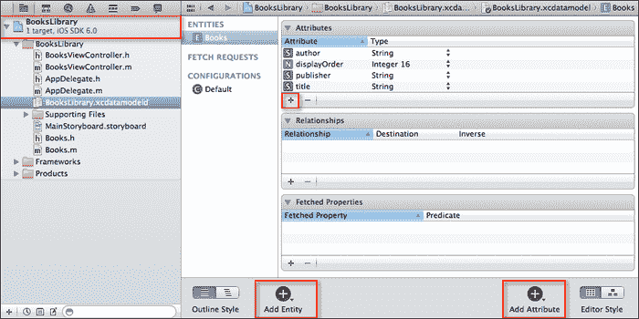
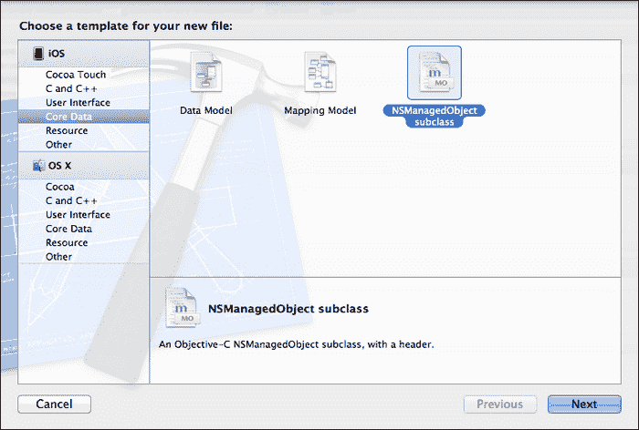
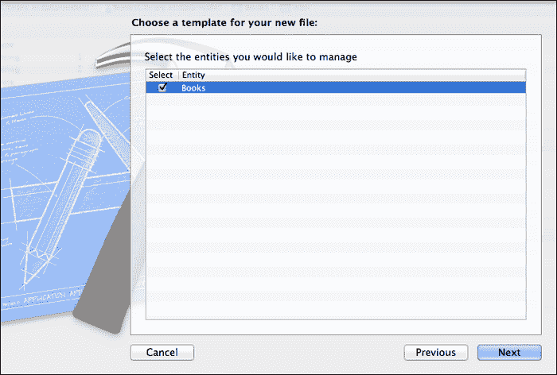
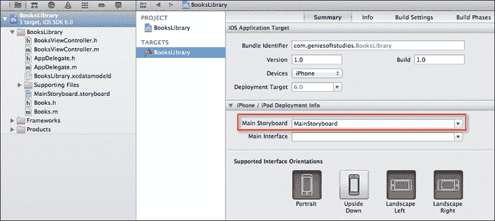
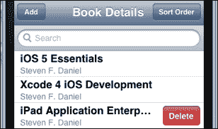
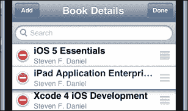
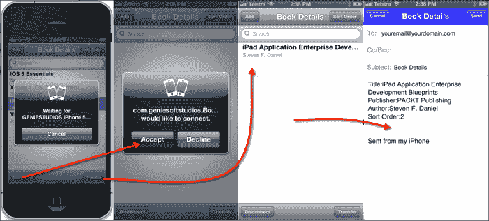

# 第八章. 使用 CoreData 和 GameKit 框架

在本章中，我们将涵盖：

+   添加 GameKit 和 MessageUI 框架

+   构建 Core Data 数据模型

+   创建 Core Data 模型文件

+   添加和配置 Storyboard

+   创建 Books Library 用户界面

+   在表格视图中显示数据

+   在我们的 Core Data 数据模型中插入数据

+   使用 Core Data 从表格视图中删除项目

+   在表格视图中重新排序行

+   在表格视图中过滤和搜索数据

+   使用不同的键盘样式

+   使用蓝牙将数据传输到另一台设备

+   实现电子邮件消息

# 简介

iPhone 和 iPad 设备都内置了蓝牙功能，允许它与其他蓝牙设备通信，例如其他 iOS 设备或蓝牙兼容的耳机。在本章中，我们将探讨如何创建一个简单的`BooksLibrary`应用程序，利用苹果强大的**Core Data**框架，允许您直接通过表单与**SQLite**数据库接口创建和存储客户信息。

然后，我们将看看如何将蓝牙功能集成到您的应用程序中，以便您可以通过与其他 iOS 设备通信来发送此信息，并且这些信息可以在另一端无线接收并存储在数据库中。

这一切一开始可能听起来有些令人困惑，但很快你就会发现，通过使用 iOS SDK，蓝牙编程实际上相当简单，并且这个功能被很好地封装在**GameKit**框架中。最后，我们将探讨如何使用**MessageUI**框架和`MFMailComposeViewController`类发送包含在表格视图中选择的书本详情的电子邮件消息，以及学习如何在`UITableView`控件中重新排序和删除记录。

# 添加 GameKit 和 MessageUI 框架

在本食谱中，我们将学习如何添加`GameKit`和`MessageUI`框架，以提供使用蓝牙发送信息以及发送电子邮件的能力。

## 准备工作

为了继续，我们需要创建一个新的应用程序并将框架添加到我们的项目中。

## 如何操作...

首先，按照以下顺序遵循以下简单步骤：

1.  从`/Xcode4/Applications`文件夹启动`Xcode`。

1.  选择**创建一个新的 Xcode 项目**，或**文件 | 新 | 项目…**。

1.  从可用的模板列表中选择**Empty Application**模板。

1.  点击**Next**按钮继续向导的下一步。

1.  将项目名称输入为**BooksLibrary**。

1.  在**Devices**下拉菜单下选择**iPhone**。

1.  确保已勾选**Use Core Data**复选框。

1.  确保已勾选**Use Automatic Reference Counting**复选框。

1.  确保未勾选**Include Unit Tests**复选框。

1.  点击 **下一步** 按钮继续到向导的下一步，并指定您想要保存项目的位置。

1.  然后，点击 **创建** 按钮继续，并显示 Xcode 工作区。

1.  接下来，将 `GameKit.framework` 和 `MessageUI.framework` 框架添加到您的项目中。

## 工作原理...

在本菜谱中，我们学习了如何将 `GameKit` 和 `MessageUI` 框架添加到我们的项目中，这将使我们能够执行通过蓝牙网络向其他 iOS 设备传输信息的能力，以及使用 `MFMailComposeViewController` 类在我们的应用程序中发送电子邮件消息的能力。

## 相关内容

+   *构建核心数据数据模型* 菜单

+   在 第五章 的 *添加 CoreLocation 和 MapKit 框架* 菜单中，*位置服务和地图*

# 构建核心数据数据模型

在本菜谱中，我们将学习如何使用核心数据模型编辑器为我们的 **BooksLibrary** 应用程序构建数据库模式。

## 准备工作

在上一个菜谱的基础上，确保我们的 **BooksLibrary** 项目文件已打开。

## 如何操作...

要开始，请按照以下顺序遵循以下简单步骤：

1.  从 **项目导航器** 中选择 `BooksLibrary.xcdatamodel` 文件。

1.  接下来，点击 **+添加实体** 按钮，并将此实体命名为 **Books**。

1.  然后点击 **+添加属性** 按钮，或者从 **属性** 面板中。

1.  创建每个 **属性** 和 **类型**，如以下表格所示：

    | 属性 | 类型 |
    | --- | --- |
    | `author` | `String` |
    | `displayOrder` | `Integer 16` |
    | `publisher` | `String` |
    | `title` | `String` |

1.  使用 **文件 | 保存** 保存您的项目，因为我们已经定义了数据库表模式。

## 工作原理...

核心数据数据库模型存储在 `BooksLibrary.xcdatamodel` 中，位于 **项目导航器** 窗口内的 `BooksLibrary` 组中。在本菜谱中，我们学习了如何定义我们的 SQLite 数据库的数据库模式，并创建实体（表）和属性（字段），这将使我们的应用程序能够将这些字段写入数据库，以便以后可以查询。

在我们的下一个菜谱中，我们将探讨如何创建允许我们访问表定义的核心数据模型文件。

## 相关内容

+   *创建核心数据模型文件* 菜单

# 创建核心数据模型文件

在本菜谱中，我们将学习如何为我们的 `BooksLibrary` 数据库模式创建相关的核心数据模型文件对象定义。

## 准备工作

在上一个菜谱的基础上，确保我们的 **BooksLibrary** 项目文件已打开。

## 如何操作...

在我们的应用程序开始使用我们的 `BooksLibrary` 数据库之前，我们需要创建实体类定义，这些定义将定义数据库存储中包含的变量，以便我们可以通过代码访问它们。

1.  从 **项目导航器** 窗口中选择 `BooksLibrary.xcdatamodel` 文件。

1.  选择 **文件 | 新建 | 文件…** 或按 *Command + N*。

1.  接下来，从 **iOS** 组中选择 **Core Data**。

1.  然后，从可用模板列表中选择 **NSManagedObject 子类**。

1.  点击 **下一步** 按钮继续向导中的下一步。

1.  点击 **创建** 按钮将文件保存到指定的文件夹位置。

1.  接下来，我们需要定义我们想要为它们创建 `NSManagedObject` 类的实体。

1.  从 **选择您要管理的实体** 列表中选择 **Books** 实体，然后点击 **下一步** 按钮继续向导中的下一步。

1.  确保未勾选 **对于原始数据类型使用标量属性** 选项，然后点击 **创建** 按钮以生成 `NSManagedObject` 类文件。

## 工作原理...

在这个菜谱中，我们了解了 `NSManagedObject` 类，以及我们如何使用这个类来定义在 Core Data 存储中创建的 `Books` 实体的类，以及定义表模式字段，以便当我们想要使用 `Books` 类时，我们可以在运行时访问属性。

Core Data 模型向导为我们生成了两个文件。`Books.h` 接口文件和 `Books.m` 实现文件。`Books.h` 接口文件包含我们每个实体属性字段，每个字段都是根据其对象类型声明的，而 `Books.m` 实现文件包含我们每个实体属性字段，每个字段都被声明为 `dynamic`。这定义了实体属性属性，以便在向 Core Data 模型写入或从 Core Data 模型检索数据时可以使用。

### 注意

关于动态数据类型的信息，您可以参考以下 Apple 开发者文档：[`developer.apple.com/library/ios/#documentation/Cocoa/Conceptual/CoreData/Articles/cdAccessorMethods.html%23//apple_ref/doc/uid/TP40002154-SW9`](https://developer.apple.com/library/ios/#documentation/Cocoa/Conceptual/CoreData/Articles/cdAccessorMethods.html%23//apple_ref/doc/uid/TP40002154-SW9)

## 更多信息...

在使用 Core Data 时需要注意的一点是，如果你尝试向数据模型模式中添加新字段，你的应用程序将会崩溃。你需要重新生成 `NSManagedObject` 文件，然后重置模拟器或从 iOS 设备中删除应用程序。

## 相关内容

+   *添加和配置 Storyboard* 菜谱

# 添加和配置 Storyboard

## 准备工作

在这个菜谱中，我们将学习如何使用 Xcode 添加和配置应用程序的项目属性，以便正确设置以使用 Storyboard 文件。

## 如何操作...

要开始，请按照以下顺序遵循以下简单步骤：

1.  从 **项目导航器** 窗口中选择 **BooksLibrary** 项目。

1.  选择 **文件 | 新建 | 文件…** 或按 *Command + N*

1.  从 **iOS** 部分下的 **用户界面** 选项中，从可用的模板列表中选择 **Storyboard** 模板。

1.  点击 **下一步** 按钮继续向导的下一个步骤。

1.  确保您已从 **设备家族** 下拉菜单中选择 **iPhone**。

1.  点击 **下一步** 按钮继续向导的下一个步骤。

1.  在 **另存为** 字段中指定 `MainStoryboard.storyboard` 作为 Storyboard 文件的名称，作为要创建的文件名称。

1.  点击 **创建** 按钮将文件保存到指定的文件夹中。

1.  我们接下来的步骤是手动配置我们的项目，使其能够识别并使用此文件来构建我们的应用程序。这可以通过以下步骤实现：

1.  从 **项目导航器** 窗口中选择 **BooksLibrary** 项目。

1.  接下来，从 **TARGETS** 组中选择您的项目目标，并选择 **摘要** 选项卡。

1.  从 **主 Storyboard** 下拉菜单中选择 **MainStoryboard**。

## 它是如何工作的…

在本食谱中，我们学习了如何手动将新的 Storyboard 模板添加到项目中。然后我们查看如何配置项目属性，以便应用程序能够使用 Storyboard 用户界面文件。

## 更多内容…

最后，当使用 Storyboards 时，我们不需要创建一个新的 `UIWindow`，因为这将会创建另一个窗口实例，并将其放置在 Storyboard 之上。我们需要修改应用程序的代理类 `AppDelegate.m`，如下面的代码片段所示：

```swift
- (BOOL)application:(UIApplication *)application didFinishLaunchingWithOptions:(NSDictionary *)launchOptions{
   // Override point for customization after 
   // application launch.
   return YES;
}
}
```

### 注意

有关在应用程序中使用 Storyboards 的更多信息，您可以参考位于：[`developer.apple.com/library/ios/#documentation/ToolsLanguages/Conceptual/Xcode4UserGuide/InterfaceBuilder/InterfaceBuilder`](https://developer.apple.com/library/ios/#documentation/ToolsLanguages/Conceptual/Xcode4UserGuide/InterfaceBuilder/InterfaceBuilder)

## 相关信息

+   *创建书籍库用户界面* 食谱

# 创建书籍库用户界面

在本食谱中，我们将学习如何构建我们的书籍库项目的用户界面，以及创建一个自定义的表格视图控制器作为数据源。

## 准备中…

在本节中，我们将首先构建将构成我们应用程序用户界面的组件。

## 如何操作…

首先，按照以下顺序执行以下简单步骤：

1.  在 **项目导航器** 窗口中，选择名为 `MainStoryboard.storyboard` 的文件。

1.  从 **对象库** 中选择并拖动一个新的 (`UITableViewController`) **表格视图控制器** 控件，并将其添加到视图中。

1.  接下来，选择我们刚刚添加的 `UITableViewController` 控件，然后选择 **编辑 | 嵌入 | 导航控制器**。

1.  在**Navigation Controller**窗口中，确保在**Navigation Controller**窗口的**Bar Visibility**部分下，**Shows Navigation Bar**和**Shows Toolbar**都已被勾选。

1.  接下来，选择`UITableViewController`控件，然后点击**Table View Cell**标签，然后从**Prototype Cells**部分选择**Prototype**单元格。

1.  在**Attributes Inspector**部分，将**Style**更改为**Subtitle**。这将改变单元格的外观，使其包含两个标签。

1.  选择**Identifier**项目，并输入**BookCell**作为其唯一标识符。

1.  接下来，从**Object Library**窗口中选择并拖动一个(`UIBarButtonItem`)，并将其添加到我们的**Table View Controller**导航栏的左侧。

1.  在**Attributes Inspector**部分，将**Title**的值更改为**Add**。

1.  在我们的**Table View Controller**的导航栏右侧添加另一个`UIBarButtonItem`，并将**Title**的值更改为**Sort Order**。

1.  在我们的**Table View Controller**的导航栏底部左端添加另一个`UIBarButtonItem`，并将**Title**的值更改为**Connect**。

1.  在**Connect**按钮旁边添加一个**Flexible Space Bar Button**项目。

1.  在我们的**Table View Controller**的导航栏底部右端添加另一个`UIBarButtonItem`，并将**Title**的值更改为**Transfer**。

1.  接下来，我们需要创建并设置我们自己的自定义`UITableViewController`子类，该子类将作为我们表格的数据源。

1.  选择`BooksLibary`文件夹，选择**File | New | File…**或按*Command + N*。

1.  从**Cocoa Touch**组中选择**Objective-C class**模板。

1.  点击向导中的**Next**按钮以进入下一步。

1.  输入**BooksViewController**作为要创建的文件名。

1.  确保您已从**Subclass**下拉菜单中选择**UITableViewController**作为要创建的子类的类型。

1.  接下来，点击向导中的**Next**按钮以进入下一步，然后点击**Create**按钮以保存文件。

1.  接下来，从**Project Navigator**窗口中选择`MainStoryboard.storyboard`文件。

1.  选择`UITableViewController`控件，并点击**Identity Inspector**部分，将**Custom Class**属性的值更改为`BooksViewController`。

1.  接下来，我们将为每个按钮创建和设置`outlets`和`action`方法，名称如下：`btnAdd`、`btnSortOrder`、`btnConnect`和`btnTransfer`。

接下来，我们需要为`NSManagedObjectContext`和`NSFetchedResultsController`对象设置引用。

1.  从**Project Navigator**窗口中打开`BooksViewController.h`接口文件。

1.  接下来，根据突出显示的代码部分修改接口文件。

    ```swift
    //  BooksViewController.h
    //  BooksLibrary
    //  Created by Steven F Daniel on 03/12/12.
    //  Copyright (c) 2012 GenieSoft Studios. All rights reserved.
    #import  <UIKit/UIKit.h>
    #import "Books.h"

    @interface BooksViewController : UITableViewController
    {
     NSManagedObjectContext     *managedObjectContext;
     NSFetchedResultsController *fetchedResultsController;
     NSArray                          *fetchedObjects;
       IBOutlet UIBarButtonItem *btnAdd;
       IBOutlet UIBarButtonItem *btnSortOrder;
       IBOutlet UIBarButtonItem *btnConnect;
       IBOutlet UIBarButtonItem *btnTransfer;

       // Fields for our btnAdd UIAlertView dialog
     UITextField *bookTitle;
     UITextField *bookAuthor;
     UITextField *bookPublisher;
    }
     // Core Data session objects
     @property (strong, nonatomic) NSManagedObjectContext 
     *managedObjectContext;
     @property (strong, nonatomic) 
     NSFetchedResultsController *fetchedResultsController;

       // Property getters and setters for our UI
       @property (strong, nonatomic) IBOutlet UIBarButtonItem         
       *btnAdd;
       @property (strong, nonatomic) IBOutlet UIBarButtonItem     
       *btnSortOrder;
       @property (strong, nonatomic) IBOutlet UIBarButtonItem   
       *btnConnect;
       @property (strong, nonatomic) IBOutlet UIBarButtonItem   
       *btnTransfer;

    // Create the class instance methods
    -(void)populateBookDetails;

    - (IBAction)btnAdd:(id)sender;
    - (IBAction)btnSortOrder:(id)sender;
    - (IBAction)btnConnect:(id)sender;
    - (IBAction)btnTransfer:(id)sender;

    @end
    ```

1.  接下来，打开位于**BooksLibrary**文件夹中的`AppDelegate.m`实现文件，并输入以下突出显示的代码。

    ```swift
    //  AppDelegate.m
    //  BooksLibrary
    //  Created by Steven F Daniel on 03/12/12.
    //  Copyright (c) 2012 GenieSoft Studios. All rights reserved.

    #import  "AppDelegate.h"
    #import "BooksViewController.h"

    @implementationAppDelegate

    @synthesize managedObjectContext = _managedObjectContext;
    @synthesize managedObjectModel = _managedObjectModel;
    @synthesize persistentStoreCoordinator = 
    _persistentStoreCoordinator;
    ```

1.  接下来，修改位于`AppDelegate.m`实现文件中的`didFinishLaunchingWithOptions`方法。

    ```swift
    - (BOOL)application:(UIApplication *)application 
    didFinishLaunchingWithOptions:(NSDictionary *)launchOptions {
     // Point our Books View Controller to our data-model
     UINavigationController *navigationController = 
     (UINavigationController *)
     self.window.rootViewController;
     BooksViewController *booksViewController = 
     [[navigationController
     viewControllers]objectAtIndex:0];
     booksViewController.managedObjectContext = 
     self.managedObjectContext;
      return YES;
    }
    ```

1.  然后，通过从**产品**菜单选择**产品 | 运行**或按*Command + R*来**构建**和**运行**应用程序。

## 它是如何工作的...

在这个菜谱中，我们首先构建了我们的**BooksLibrary**应用程序的用户界面，以及正确配置了我们的**表格****视图****控制器**。然后，我们创建了自己的自定义`UITableViewController`子类，它将作为表格的数据源，以便在从数据库检索信息时知道要显示多少行。

接下来，我们将我们的`UITableViewController`类的类型更新为使用我们新创建的类，而不是默认的`UITableViewController`类，并包含了`NSManagedObjectContext`和`NSFetchedResultsController`对象的引用，这些对象为我们提供了所有与 Core Data 数据检索相关的函数，这些函数在填充我们的表格视图时需要执行。这些函数封装了与表格和 Core Data 模型相关联的常用函数。我们创建了一个`NSArray`数组属性，用于存储检索到的数据。

最后，我们使用`managedObjectContext`方法初始化了`booksViewController`的数据源。这确保了我们的控制器可以访问所有必要的属性和方法，以便从我们的数据模型中添加和检索信息。在此之前，我们需要首先遍历 Storyboard 中的每个场景，以便获取对`BooksViewController`的引用。这样我们就可以初始化其数据源，使其指向我们的数据库。

## 参见

+   **在表格视图中显示数据**的菜谱

# 在表格视图中显示数据

在这个菜谱中，我们将学习如何用一些数据填充表格视图控制。

## 准备工作

在我们之前的菜谱基础上，我们将学习如何从我们的 Core Data 数据库模型中填充我们的`UITableViewControl`。

## 如何做到这一点...

首先，按照以下顺序遵循以下简单步骤：

1.  从**项目导航器**窗口打开`BooksViewController.m`实现文件。

1.  接下来，根据高亮显示的代码部分修改实现文件。

    ```swift
    //  BooksViewController.m
    //  BooksLibrary
    //  Created by Steven F Daniel on 03/12/12.
    //  Copyright (c) 2012 GenieSoft Studios. All rights reserved.

    #import "BooksViewController.h"

    @implementation BooksViewController

    @synthesize fetchedResultsController;
    @synthesize managedObjectContext;
    @synthesize btnAdd;
    @synthesize btnSortOrder;
    @synthesize btnConnect;
    @synthesize btnTransfer;

    ```

1.  根据高亮显示的代码部分修改`viewDidLoad:`和`viewDidAppear:`方法。

    ```swift
    #pragma mark - View lifecycle
    - (void)viewDidLoad {
    [super viewDidLoad];
    // Initialize and reload Book Details.
    self.title = @"Book Details";
    [self populateBookDetails];
    }
    #pragma mark reloads our book details when our view reappears
    - (void)viewDidAppear:(BOOL)animated {
    [super viewDidAppear:animated];
    [self populateBookDetails];
    }
    ```

1.  接下来，根据代码片段中的说明创建以下代码部分。

    ```swift
    #pragma mark Populate our table view with our database records
    -(void)populateBookDetails {
       // Define our table/entity name to use
       NSEntityDescription *entity = [NSEntityDescription
       entityForName:@"Books" 
       inManagedObjectContext:managedObjectContext];

       // Set up the fetch request
       NSFetchRequest *fetchRequest = [[NSFetchRequest alloc] init];
       [fetchRequest setEntity:entity];

       // Define how we are to sort the records
       NSSortDescriptor *sortDescriptor = [[NSSortDescriptor alloc] 
       initWithKey:@"displayOrder" ascending:YES];
       NSArray *sortDescriptors = [NSArray
       arrayWithObject:sortDescriptor];
       [fetchRequest setSortDescriptors:sortDescriptors];
       // Define the FetchResults controller
       fetchedResultsController = [[NSFetchedResultsControlleralloc] 
       initWithFetchRequest:fetchRequest
       managedObjectContext:managedObjectContext
       sectionNameKeyPath:nil cacheName:@"Root"];

       // Fetch the records and handle any errors 
       NSError *error = nil;
       if (![[self fetchedResultsController] performFetch:&error]) {
          NSLog(@"There was an error retrieving the book 
          details.");
        }     
       // Number of rows to populate our Table View controller with.
       fetchedObjects = fetchedResultsController.fetchedObjects;   
       [self.tableView reloadData];
    }
    #pragma mark - Table view data source
    -(NSInteger)numberOfSectionsInTableView:(UITableView *)tableView{
        // Return the number of sections.
    return 1;
    }
    #pragma mark Return the number of rows in the section.
    - (NSInteger)tableView:(UITableView *)tableView
       numberOfRowsInSection:(NSInteger)section {
       return [fetchedObjects count];
    }
    #pragma mark populate our tableview for each book added
    - (UITableViewCell *)tableView:(UITableView *)tableView
      cellForRowAtIndexPath:(NSIndexPath *)indexPath {
      static NSString *CellIdentifier = @"BookCell";
      Books *bookDetails;

      // Populate our tableView with all items from our resultset
      bookDetails = [fetchedResultsController
      objectAtIndexPath:indexPath];

      UITableViewCell *cell = [tableView
      dequeueReusableCellWithIdentifier:CellIdentifier];
      if (cell == nil) {
          cell = [[UITableViewCell alloc] 
          initWithStyle:UITableViewCellStyleSubtitle
          reuseIdentifier:CellIdentifier];
      }
      // Configure the cell...
      cell.textLabel.text = bookDetails.title;
      cell.detailTextLabel.text = bookDetails.author;
      cell.showsReorderControl = YES;
      [tableView setAllowsSelection:YES];
      return cell;
    }
    ```

## 它是如何工作的...

在这个菜谱中，我们首先为我们的导航栏设置标题，然后调用`populateBookDetails`方法，该方法将用于将数据库对象项填充到我们的表格视图中。然后我们定义了我们要用作主要数据源的表格实体，并创建了一个`fetchRequest`对象的实例，该实例将用于存储返回的项。接下来，我们指定我们希望结果按`displayOrder`升序排序，并继续执行记录集，使用`performFetch`方法检查是否发生任何错误，然后将结果集保存到我们的`fetchedObjects`属性中，并在我们的表格视图控件上调用`reloadData`方法以重新显示记录。接下来，我们修改了`viewDidAppear`方法以处理视图出现时表格视图控件的刷新，然后设置表格视图将包含的节数和行数。最后，我们提供了之前设置的`UITableViewController`单元格的重用标识符，然后从我们的`BookDetails`数组中分配每个属性，并将其写入每个单元格标签。

### 注意

每次您将`reuse`标识符作为以下方法`dequeueReusableCellWithIdentifier`的参数时，这会自动创建一个原型的新副本，并将对象返回给您。

## 参见

+   *在我们的 Core Data 数据模型中插入数据*的菜谱

# 在我们的 Core Data 数据模型中插入数据

在这个菜谱中，我们将学习如何写入我们核心数据模型中包含的数据字段。

## 准备工作

在我们之前的菜谱之后，我们将学习如何使用一些数据更新我们的 Core Data 数据库字段内容。

## 如何做...

首先，按照以下顺序遵循以下简单步骤：

1.  从**项目导航器**窗口打开`BooksViewController.m`实现文件。

1.  修改如下代码片段所示的`btnAdd:`方法。

    ```swift
    #pragma mark method called when the user presses the Add button
    -(IBAction)btnAdd:(id)sender{
       UIAlertView *alert = [[UIAlertView alloc] initWithTitle:@"Add 
       Book Details" message:@"\n\n\n\n" delegate:self
       cancelButtonTitle:@"Cancel" otherButtonTitles:@"OK", nil];
       bookTitle = [[UITextField alloc]
       initWithFrame:CGRectMake(12.0, 45.0, 260.0, 25.0)];
       [bookTitle setPlaceholder:@"Book Title:"];
       [bookTitle setBackgroundColor:[UIColor whiteColor]];
       [alert addSubview:bookTitle];
       bookAuthor = [[UITextField alloc] 
       initWithFrame:CGRectMake(12.0, 80.0, 260.0, 25.0)];
       [bookAuthor setPlaceholder:@"Author:"];
       [bookAuthor setBackgroundColor:[UIColor whiteColor]];
       [alert addSubview:bookAuthor];
       bookPublisher = [[UITextField alloc] 
       initWithFrame:CGRectMake(12.0, 80.0+35.0, 260.0, 25.0)];
       [bookPublisher setPlaceholder:@"Publisher:"];
       [bookPublisher setBackgroundColor:[UIColor whiteColor]];
       [alert addSubview:bookPublisher];

       // Show our Alert Dialog
       [alert show];
    }
    ```

1.  接下来，根据代码片段中的指定创建以下代码部分。

    ```swift
    #pragma mark method called and uses the data entered by the btnAdd method
    -(void)alertView:(UIAlertView *)alertView clickedButtonAtIndex:(NSInteger)buttonIndex {
       NSString *title = [alertView buttonTitleAtIndex:buttonIndex];
       if ([title isEqualToString:@"OK"]) {
          // Set a pointer to our Books database table schema
          Books *book = (Books *)[NSEntityDescription
          insertNewObjectForEntityForName:@"Books" 
          inManagedObjectContext:managedObjectContext];

          NSMutableArray *array = [[fetchedResultsController
          fetchedObjects] mutableCopy];

          // Assign our text fields to each of their attributes
          [book setTitle:bookTitle.text];
          [book setAuthor:bookAuthor.text];
          [book setPublisher:bookPublisher.text];
          [book setValue:[NSNumber numberWithInt:[array count] == 0 ? 
          0 : ([array count] + 1)] forKey:@"displayOrder"];

          NSError *error;
          if (![managedObjectContext save:&error]) {
             // Record could not be saved error message
             UIAlertView *alertView = [[UIAlertView alloc] 
             initWithTitle:@"Book Details"
             message:@"There was a problem saving the book details."
             delegate:self
             cancelButtonTitle:@"OK"
             otherButtonTitles:nil];

             [alertView show];
          }
          [self populateBookDetails];
       }
    }
    ```

## 它是如何工作的...

在这个菜谱中，我们首先动态创建每个将接受用户输入的字段，并将这些字段定位在`UIAlertView`对话框中，然后将其添加到初始视图控制器作为子视图。然后，在创建用于创建新管理对象的托管对象上下文之前，我们检查是否已按下**确定**按钮。使用`Books`实体描述。

我们使用每个托管对象模式字段的`getters`和`setters`方法，根据用户之前输入的内容设置托管对象的每个属性值。最后，上下文被指示调用上下文的`save`方法将更改保存到持久存储中。如果在 Core Data 数据模型的保存操作中检测到任何错误，这些错误将在`UIAlertView`对话框中显示。最后，我们刷新表格视图以显示新记录已被添加。

## 相关内容

+   使用 Core Data 从表格视图中**删除一个项目**的配方

# 使用 Core Data 从表格视图中删除一个项目

在这个配方中，我们将学习如何从表格视图中删除一个项目，以及我们的 Core Data 模型。

## 准备工作

在我们之前的配方基础上，我们将学习如何从我们的表格视图中删除一行，并永久从我们的 Core Data 数据库中删除它。

## 如何操作...

要开始，按照以下顺序遵循以下简单步骤：

1.  从**项目导航器**窗口打开`BooksViewController.m`实现文件。

1.  修改如下代码片段所示的`tableView:commitEditingStyle:`方法。

    ```swift
    - (void)tableView:(UITableView *)tableViewcommitEditingStyle:(UITa
    bleViewCellEditingStyle)editingStyleforRowAtIndexPath:(NSIndexPa
    th *)indexPath {
       if (editingStyle == UITableViewCellEditingStyleDelete) {
          // Turn on table view animations
          [self.tableView beginUpdates];

          // Get the item to delete from our row
        Books *itemToDelete = [fetchedResultsController
        objectAtIndexPath:indexPath];
       // Delete the item in Core Data
       [self.managedObjectContext deleteObject:itemToDelete];

       // Commit the deletion
          NSError *error;
          if (![self.managedObjectContext save:&error]) {
             NSLog(@"There was a problem deleting the Book %@",[error 
             domain]);
          }
          // Delete the (now empty) row on the table
          [self.tableView deleteRowsAtIndexPaths:[NSArray
          arrayWithObject:indexPath] 
          withRowAnimation:UITableViewRowAnimationFade];

          [self populateBookDetails];

          // Turn off table animations
          [self.tableView endUpdates];
        }
        // Finally, reload data in view
        [self.tableView reloadData];
    }
    ```

1.  然后，通过从**产品**菜单中选择**产品 | 运行**或按*Command + R*来**构建**和**运行**应用程序。

当编译完成时，从选定的行向左滑动以显示**删除**按钮。



## 工作原理...

在这个配方中，我们首先确定当前在表格视图中正在执行的操作类型，这由`UITableViewCellEditingStyle`类确定。然后，我们将它与`UITableViewCellEditingStyleDelete`常量变量进行比较，如果条件满足，我们将从`Books`数据库中删除所选行的所选书籍详情，然后刷新表格视图数据源。如果在删除过程中检测到任何错误，这些错误将被记录到调试窗口中。

# 在表格视图中**重新排序行**

在这个配方中，我们将学习如何从表格视图中删除一个项目，以及我们的核心数据模型。

## 准备工作

在我们之前的配方基础上，我们将学习如何从我们的表格视图中删除一行，并永久从我们的 Core Data 数据库中删除它。

## 如何操作...

要开始，按照以下顺序遵循以下简单步骤：

1.  从**项目导航器**窗口打开`BooksViewController.m`实现文件。

1.  修改如下代码片段所示的`btnSortOrder:`方法。

    ```swift
    #pragma mark method called when the user presses the Display Order button
    - (IBAction)btnSortOrder:(id)sender {
       if ([btnSortOrder.title isEqualToString:@"Sort Order"]){
          self.tableView.editing = YES;
          [btnSortOrder setTitle:@"Done"];
       }
       else if ([btnSortOrder.title isEqualToString:@"Done"]) {
          [btnSortOrder setTitle:@"Sort Order"];
          self.tableView.editing = NO;
       }
    }
    ```

1.  接下来，创建如下代码片段中指定的以下代码部分。

    ```swift
    #pragma mark method to allow for rows to be moved around.
    - (BOOL)tableView:(UITableView *)sender canMoveRowAtIndexPath:(NSIndexPath *)indexPath {
       return YES;
    }
    #pragma mark Change the order of the data.
    - (void)tableView:(UITableView *)sender 
    moveRowAtIndexPath:(NSIndexPath *)sourcePath
    toIndexPath:(NSIndexPath *)destinationPath
    {
       NSMutableArray *array = [[fetchedResultsController
       fetchedObjects] mutableCopy];

       id objectToMove = [array objectAtIndex:sourcePath.row];
       [array removeObjectAtIndex:sourcePath.row];
       [array insertObject:objectToMove atIndex:destinationPath.row];

       for (int i=0; i<[array count]; i++) {
          [(NSManagedObject *)[array objectAtIndex:i] 
          setValue:[NSNumber numberWithInt:i] 
          forKey:@"displayOrder"];
       }
       NSError *error;
       BOOL success = [[self managedObjectContext] save:&error];
       if (!success) {
          // Handle error
          NSLog(@"There was a problem updating the display order 
               %@",[error domain]);
       }
    }
    ```

1.  然后，通过从**产品**菜单中选择**产品 | 运行**或按*Command + R*来**构建**和**运行**应用程序。

当编译完成时，轻触**排序顺序**按钮以启用我们的表格视图支持编辑，并允许行移动。



## 工作原理...

在这个菜谱中，我们首先在按下**排序顺序**按钮时，通过将`self.tableView.editing`属性设置为`YES`来开启表格编辑。接下来，我们实现`canMoveRowAtIndexPath:`方法，该方法将用于确定行是否可以在表格视图中移动。在`moveRowAtIndexPath:`方法中，我们创建一个`NSMutableArray`，它将用于存储由`NSFetchedResultsController`类返回的数据模型结果。然后，我们遍历项目并更新每个项目的`displayOrder`字段，在保存带有重新排序结果的托管对象上下文之前。

## 更多内容...

我们使用`NSMutableArray`数组的原因是因为我们可以在不触发数据存储任何变化的情况下，从数组中插入和移除管理对象指针。你对对象所做的任何更改都将立即反映出来，这通常是您想要做的，但在这种情况下，我们不想立即应用这些更改。

## 参见

+   *在表格视图中过滤和搜索数据*菜谱

# 在表格视图中过滤和搜索数据

在这个菜谱中，我们将学习如何通过搜索表格来过滤列表项。

## 准备工作

在我们之前的菜谱之后，我们将学习如何使用`UISearchBar`控件来允许我们过滤和缩小书籍详情的结果。

## 如何做到...

首先，按照以下顺序遵循以下简单步骤：

1.  从**项目导航器**窗口选择`MainStoryboard.storyboard`文件。

1.  从**对象库**中选择并拖动一个（`UISearchBar`）**搜索****栏**和**搜索显示控制器**控件到我们在上一步中添加的（`UITableViewController`）控件导航栏的顶部。

1.  接下来，为搜索栏创建`outlet`方法，并将其命名为`filteredResults`。

1.  从**项目导航器**窗口打开`BooksViewController.h`接口文件。

1.  接下来，修改接口文件并添加以下突出显示的代码部分。

    ```swift
    //  BooksViewController.h
    //  BooksLibrary
    //  Created by Steven F Daniel on 03/12/12.
    //  Copyright (c) 2012 GenieSoft Studios. All rights reserved.

    #import <UIKit/UIKit.h>
    #import "Books.h"

    @interface BooksViewController : UITableViewController
    <UISearchBarDelegate>{
    ...
        ...
    IBOutlet UISearchBar *filteredResults;
    }
        ...
        ...
    // Property getters and setters for our UI
    @property (strong, nonatomic) IBOutlet UISearchBar       *filteredResults;
    ```

1.  现在我们已经创建了出口并扩展了我们的类以包括`UISearchBarDelegate`对象，以便我们可以访问属性和方法。我们的下一步是开始向我们的`BooksViewController`类添加额外的内容，这将使我们能够过滤列表的结果。

1.  从**项目导航器**窗口打开`BooksViewController.m`实现文件，并创建以下代码部分，如代码片段中指定。

    ```swift
    //
    //  BooksViewController.m
    //  BooksLibrary
    //
    //  Created by Steven F Daniel on 03/12/12.
    //  Copyright (c) 2012 GenieSoft Studios. All rights reserved.
    //

    #import "BooksViewController.h"

    @implementation BooksViewController

    @synthesize   fetchedResultsController;
    @synthesize   managedObjectContext;
    @synthesize   btnAdd;
    @synthesize   btnSortOrder;
    @synthesize   btnConnect;
    @synthesize   btnTransfer;
    @synthesize filteredResults;

    #pragma mark method called by the UISearchBar Delegates
    -(void)searchBarTextDidBeginEditing:(UISearchBar *)searchBar {
       // Only show the Search Bar's cancel button while in edit mode
       filteredResults.showsCancelButton= YES;
       filteredResults.autocorrectionType = 
       UITextAutocorrectionTypeNo;
    }
    #pragma mark Hides our Search Bar's cancel button when not in edit mode
    -(void)searchBarTextDidEndEditing:(UISearchBar *)searchBar {
       filteredResults.showsCancelButton = NO;
    }
    #pragma mark reload our contact details
    -(void)searchBarCancelButtonClicked:(UISearchBar *)searchBar {
        [self populateBookDetails];
    }
    #pragma mark use an NSPredicate combined with the fetchedResultsController to perform the search
    -(void)searchBarSearchButtonClicked:(UISearchBar *)theSearchBar {
       if (![destinationSearchBar.text isEqualToString:@""]) {
          NSPredicate *predicate =[NSPredicate
          predicateWithFormat:@"publisher contains[cd] %@", 
          self.filteredResults.text];
          [fetchedResultsController.fetchRequest
          setPredicate:predicate];
    }
    else {
          // We have hit the cancel button, reload our TableView
          [filteredResults resignFirstResponder];
          [self.tableView reloadData];
          return;
    }
    NSError *error = nil;
    if (![[self fetchedResultsController] performFetch:&error]) {
        // Handle the error that was caught by the exception
        NSLog(@"Unresolved error %@, %@", error, [error 
        userInfo]);
        exit(-1);
    } 
    // Return the number of rows to populate our Table View 
    // controller with.
    fetchedObjects = fetchedResultsController.fetchedObjects;

    // reload the TableView Controller and hide the keyboard.
    [filteredResults resignFirstResponder];
    [self.tableView  reloadData];

    // Display the total number of matching records found.
      NSString *searchResults = [[NSString alloc] 
      initWithFormat:@"%d matching record(s) 
      found.",[fetchedObjects count]];
      UIAlertView *alertView = [[UIAlertView alloc]
      initWithTitle:@"Search Results" 
      message:searchResults
      delegate:self
      cancelButtonTitle:@"OK" 
      otherButtonTitles:nil];

      [alertView show];   
    }
    ```

## 它是如何工作的...

在这个菜谱中，我们首先扩展我们的`BooksViewController`类以使用`UISearchBarDelegate`类协议，以便我们可以访问其属性和方法，然后当用户点击时更改**搜索**栏的外观。接下来，我们指定在用户处于**编辑**模式时显示**取消**按钮，然后关闭**自动更正**功能，并在用户完成编辑后隐藏**搜索**栏的**取消**按钮。在我们的下一步中，我们调用我们的`populateBookDetails`方法来从数据库中获取更新后的记录，并在继续遍历数据源并选择那些包含搜索字符串的对象之前，将这些记录填充到我们的表格视图控制中。

最后，我们继续用返回的搜索数据重新加载我们的表格视图，然后在`UIAlertView`对话框中显示与我们的搜索字符串匹配的记录总数。如果**搜索**标准为空，我们使用`isEqualToString`方法执行比较，并检查字符串是否为空。然后我们放弃键盘并从我们的数据模型重新加载所有书籍详情。

## 参见

+   *处理不同的键盘样式*菜谱

# 处理不同的键盘样式

在这个菜谱中，我们将学习如何从表格视图中删除一个项目，以及我们的核心数据模型。

## 准备工作

在我们之前的菜谱基础上，我们将学习如何将自定义键盘样式应用到我们`UIAlertView`中的字段，正如我们在之前的菜谱中定义的`btnAdd`方法中所述。

## 如何做到这一点...

要开始，请按照以下顺序遵循以下简单步骤：

1.  从**项目导航器**窗口打开`BooksViewController.m`实现文件。

1.  修改`btnAdd`方法以应用我们的`bookTitle`字段的自定义键盘类型，如下面的代码片段中突出显示的代码部分所示。

    ```swift
       UIAlertView *alert = [[UIAlertView alloc] 
       initWithTitle:@"Add Book Details" message:@"\n\n\n\n" 
       delegate:self cancelButtonTitle:@"Cancel" 
       otherButtonTitles:@"OK", nil];
       bookTitle = [[UITextField alloc] 
       initWithFrame:CGRectMake(12.0, 45.0, 260.0, 25.0)];
       [bookTitle setPlaceholder:@"Book Title:"];
       [bookTitle setBackgroundColor:[UIColor whiteColor]];
     bookTitle.keyboardType = UIKeyboardTypeAlphabet;
       [alertaddSubview:bookTitle];
    ```

## 它是如何工作的...

在这个菜谱中，我们首先更新`bookTitleUITextField`控制的`keyboardType`属性，然后指定`UIKeyboardTypeAlphabet`变量作为要使用的键盘类型。

## 更多内容...

`keyboardType`属性接受一个名为`UIKeyboardType`的枚举类型。

下表解释了这些类型中的一些：

| 键盘类型 | 描述 |
| --- | --- |
| `UIKeyboardTypeDefault` | 当前输入方法的默认键盘。 |
| `UIKeyboardTypeASCIICapable` | 显示标准 ASCII 字符。 |
| `UIKeyboardTypeNumbersAndPunctuation` | 显示数字和标点符号键盘。 |
| `UIKeyboardTypeURL` | 显示一个针对 URL 输入优化的键盘。 |
| `UIKeyboardTypeNumberPad` | 显示一个为 PIN 输入设计的数字键盘。 |
| `UIKeyboardTypePhonePad` | 显示一个为输入电话号码设计的键盘。 |
| `UIKeyboardTypeNamePhonePad` | 显示一个为输入人名或电话号码设计的键盘。 |
| `UIKeyboardTypeEmailAddress` | 显示一个针对指定电子邮件地址优化的键盘。 |
| `UIKeyboardTypeDecimalPad` | 显示一个带有数字和小数点的键盘。 |
| `UIKeyboardTypeTwitter` | 显示一个针对 twitter 文本输入优化的键盘，易于访问@和#字符。 |
| `UIKeyboardTypeAlphabet` | 已弃用，但使用显示标准 ASCII 字符的键盘。 |

### 注意

有关`UIKeyboardType`类以及各种键盘类型的更多信息，请参阅位于[`developer.apple.com/library/ios/#DOCUMENTATION/UIKit/Reference/UITextInputTraits_Protocol/Reference/UITextInputTraits.html`](http://developer.apple.com/library/ios/#DOCUMENTATION/UIKit/Reference/UITextInputTraits_Protocol/Reference/UITextInputTraits.html)的 Apple 开发者文档。

## 参见

+   *在 Core Data 数据模型中插入数据*的食谱

# 使用蓝牙将数据传输到另一台设备

在这个食谱中，我们将学习如何使用允许通过蓝牙网络进行通信的`GameKit`框架 API。

## 准备工作

在我们之前的食谱基础上，我们将探讨如何将这些功能实现到我们的应用程序中，以处理将书籍详情从一个 iOS 设备传输到另一个设备。

## 如何操作...

要开始，请按照以下顺序遵循以下简单步骤：

1.  从**项目导航器**窗口打开`BooksViewController.h`接口文件。

1.  接下来，修改接口文件并添加以下高亮显示的代码部分。

    ```swift
    //  BooksViewController.h
    //  BooksLibrary
    //  Created by Steven F Daniel on 03/12/12.
    //  Copyright (c) 2012 GenieSoft Studios. All rights reserved.

    #import  <UIKit/UIKit.h>
    #import <GameKit/GameKit.h>
    #import  "Books.h"

    @interface BooksViewController : UITableViewController
    <UISearchBarDelegate, GKSessionDelegate, GKPeerPickerControllerDelegate>{
    ...
        ...
     GKSession              *currentSession;
     GKPeerPickerController *peerPicker;
     NSString               *itemSelected;
    }
        ...
        ...
    // Bluetooth session objects
    @property (strong, nonatomic) GKSession *currentSession;

    ```

    现在我们已经创建了我们的属性，并将我们的类扩展到包括`GKSessionDelegate`和`GKPeerPickerControllerDelegate`对象，以便我们可以访问它们的属性和方法。我们的下一步是开始向`BooksViewController`类添加额外的内容，这将使我们能够通过蓝牙发送详情。

1.  从**项目导航器**窗口打开`BooksViewController.m`实现文件，并输入以下高亮显示的代码部分。

    ```swift
    //
    //  BooksViewController.m
    //  BooksLibrary
    //
    //  Created by Steven F Daniel on 03/12/12.
    //  Copyright (c) 2012 GenieSoft Studios. All rights reserved.
    //

    #import "BooksViewController.h"

    @implementation BooksViewController

    @synthesize fetchedResultsController;
    @synthesize managedObjectContext;
    @synthesize btnAdd;
    @synthesize btnSortOrder;
    @synthesize btnConnect;
    @synthesize btnTransfer;
    @synthesize currentSession;
    @synthesize filteredResults;

    ```

1.  接下来，修改`btnConnect`方法，如下面的代码片段所示。

    ```swift
    #pragma mark called when the user presses the Connect button
    - (IBAction)btnConnect:(id)sender {
       if ([btnConnect.title isEqualToString:@"Connect"]) {
          [btnConnect setTitle:@"Disconnect"];
          peerPicker = [[GKPeerPickerController alloc]init];
          peerPicker.delegate = self;
          peerPicker.connectionTypesMask = 
          GKPeerPickerConnectionTypeNearby;
          [peerPicker show];
          btnTransfer.enabled = YES;
       }
       else if ([btnConnect.title isEqualToString:@"Disconnect"]) {
          [btnConnectsetTitle:@"Connect"];
          [self.currentSession disconnectFromAllPeers];
          currentSession = nil;
          btnTransfer.enabled = NO;
       }
    }
    ```

1.  接下来，修改`btnTransfer`方法，如下面的代码片段所示。

    ```swift
    #pragma mark called when the user presses the Transfer button
    - (IBAction)btnTransfer:(id)sender {
       // Converts an NSString object to NSData
       NSData *data;
       data = [itemSelected
       dataUsingEncoding:NSASCIIStringEncoding];

       [self.currentSession sendDataToAllPeers:data
       withDataMode:(GKSendDataReliable) error:nil];
    }
    ```

1.  接下来，根据代码片段中的说明创建以下代码部分。

    ```swift
    #pragma mark Handle Bluetooth capabilities using the GameKit framework.
    -(void)peerPickerController:(GKPeerPickerController *)picker didConnectPeer:(NSString *)peerIDtoSession:(GKSession *)session{
       self.currentSession = session;
       session.delegate = self;
       [sessionsetDataReceiveHandler:self withContext:nil];
       picker.delegate = nil;
       [picker dismiss];
    }
    #pragma mark Called when a connection has been made to Bluetooth,
    #pragma mark details are added to the database on the receiving iOS device.
    -(void)receiveData:(NSData *)data fromPeer:(NSString *)peer inSession:(GKSession *)session context:(void *)context {
       // Convert our NSData type to NSString
       NSString *strData;
       strData = [[NSString alloc] initWithData:data
       encoding:NSASCIIStringEncoding];

       // Split out our data and place the contents into an array.
       NSArray  *stringComponents = [strData
       componentsSeparatedByString:@"~"];
       NSMutableArray *myArray = [[NSMutableArray alloc] 
        initWithCapacity:1000];
       [myArray addObjectsFromArray:stringComponents];

       // Insert the passed record details into our database.
       Books *bookDetails = (Books *)[NSEntityDescription
       insertNewObjectForEntityForName:@"Books" 
       inManagedObjectContext:managedObjectContext];

       [bookDetails setTitle:[myArray objectAtIndex:0]];
       [bookDetails setPublisher:[myArray objectAtIndex:1]];
       [bookDetails setAuthor:[myArray objectAtIndex:2]];
       [bookDetails setDisplayOrder:[myArray objectAtIndex:3]];

       NSError *error;
       if (![managedObjectContext save:&error]) {
           // Display error message stating that record not saved.
           UIAlertView *alertView = [[UIAlertView alloc] 
           initWithTitle:@"Book Library Details" 
           message:@"There was a problem saving the book details."
           delegate:self
           cancelButtonTitle:@"OK" 
           otherButtonTitles:nil];
           [alertView show];   
       }
       // Reload our book details from our database
       [self populateBookDetails];
    }
    #pragma mark called when user cancels the Bluetooth connection
    -(void)peerPickerControllerDidCancel:(GKPeerPickerController *)picker {
       [btnTransfer setTitle:@"Transfer Book"];
       peerPicker = nil;
       peerPicker.delegate = nil;
       [peerPicker dismiss];
    }
    #pragma mark called when a change in state has been detected.
    -(void)session:(GKSession *)session peer:(NSString *)peerIDdidChangeState:(GKPeerConnectionState)state {
       NSString *GKPeerStateInfo;
       switch (state) {
          case GKPeerStateAvailable: 
               GKPeerStateInfo = @"Wi-Fi is Available";      
               break;
          case GKPeerStateUnavailable:  
               GKPeerStateInfo = @"Wi-Fi is not Available";  
               break;
          case GKPeerStateConnecting:   
               GKPeerStateInfo = @"Establishing Connection";
            break;
          case GKPeerStateConnected:    
               GKPeerStateInfo = @"Connection Successful"; 
               break;
          case GKPeerStateDisconnected: 
               GKPeerStateInfo = @"Disconnected from Session";
                 currentSession = nil; 
               break;
       }
       // Display the current connection state.
       NSLog(@"Connection State: %@", GKPeerStateInfo);
    }
    #pragma mark - Table view delegate
    - (void)tableView:(UITableView *)tableViewdidSelectRowAtIndexPath:(NSIndexPath *)indexPath {
       // Get the currently selected item from our resultset
       Books *bookDetails = [fetchedResultsController
       objectAtIndexPath:indexPath];
      // Get the currently selected item within our tableView
      itemSelected =[NSString stringWithFormat:@"%@~%@~%@~%@",
                bookDetails.title,
                bookDetails.publisher,
                bookDetails.author,
                bookDetails.displayOrder];
    }
    ```

## 它是如何工作的...

在这个食谱中，我们首先扩展我们的`BooksViewController`类以使用`GKSessionDelegate`和`GKPeerPickerControllerDelegate`类协议，这样我们就可以访问其属性和方法，这些属性和方法负责处理蓝牙功能，以及一个`NSString`对象变量`itemSelected`，它将用于存储从我们的表格视图中选择的书本项。

接下来，我们声明一个 `GKSessionDelegate` 对象，用于表示两个连接的蓝牙设备之间的活动会话，并允许在两个设备之间发送和接收数据。`GKPeerPickerControllerDelegate` 提供一个标准用户界面，让您的应用程序发现并连接到另一个蓝牙设备，这是在设备之间连接的最简单方法。

`btnConnect:` 方法通过使用 `isEqualToString` 方法检查我们按钮的当前值，如果值显示为 **Connect**，我们将调用 `GKPeerPickerController` 类，该类显示一个标准用户界面，您可以通过它连接到另一个蓝牙设备。或者，如果您点击 **Disconnect**，我们将从 **GKSession** 对象调用 `disconnectFromAllPeers` 方法来关闭两个设备之间的连接。`connectionTypesMask` 属性指示用户可以选择的连接类型。

### 注意

有两种连接类型：`GKPeerPickerConnectionTypeNearby` 和 `GKPeerPickerConnectionTypeOnline`。当使用蓝牙通信时，使用 **GKPeerPickerConnectionTypeNearby** 常量。或者，如果您想使用基于互联网的连接，请使用 **GKPeerPickerConnectionTypeOnline** 常量。

当检测到两个设备之间的蓝牙连接，并且用户已从可用设备列表中选择了一个要连接的项目时，将调用 `peerPickerController:didConnectPeer:toSession:` 方法，并启用我们的 **Transfer** 按钮。一旦用户连接到对等蓝牙设备，您将 `GKSession` 对象保存到 `currentSession` 属性中，这样您就可以使用 `GKSession` 对象与远程设备进行通信。

当用户按下 **Transfer** 按钮时，它调用 `btnTransfer:` 方法，该方法调用 `GKSession` 对象的 `sendDataToAllPeers:` 方法，通过 `NSData` 对象将数据发送到另一台设备。我们使用一个名为 `itemSelected` 的变量，其中包含要发送的联系人地址信息。

### 注意

当使用 `GKSendDataReliable` 常量时，`GKSession` 对象将继续发送数据，直到成功传输数据或连接超时。或者，使用 `GKSendDataUnreliable` 表示 `GKSession` 对象应仅发送一次数据，不进行重试。

当两个设备之间建立连接后，`GKSession` 对象的 `receiveData:fromPeer:inSession:context:` 方法会被调用一次，以处理接收作为 `NSData` 分隔字符串发送的数据。在可以使用 `componentsSeparatedByString` 字符串类将每个字段单独分割出来并将这些放入我们的 `NSMutableArray` 对象变量 `myArray` 之前，需要将这些数据转换为 `NSString` 对象。

接下来，我们创建一个新的`managedObjectContext`实例，该实例指向我们的`Books`实体，并使用我们的`NSManagedObject`的`getter`和`setter`方法将`myArray`对象中的每个数组元素分配给实体的每个字段属性，然后在将详细信息写入数据库之前。在将数据模型 Core Data 的保存操作中检测到的任何错误将在`UIAlertView`对话框中显示。当用户从蓝牙选择器取消时，将调用`peerPickerControllerDidCancel:`方法。一旦发生这种情况，我们更改**连接**按钮的标题并禁用**传输**按钮，然后在关闭`peerPicker`对话框之前释放分配的内存。

当设备连接或从会话断开时，`didChangeState:`方法会被调用，并且足够智能，能够知道连接是否已经建立或结束，通过检查`GKPeerConnectionState`类的`state`属性和常量来确定连接类型。在确定`state`类型后，我们使用`NSLog`语句将连接`state`写入控制台窗口。

在我们的最后一步，我们使用`didSelectRowAtIndexPath:`方法，为所选行构造书籍详细信息。我们使用`indexPath`的行属性在我们的`Books`数组中查找，并提取记录信息。然后我们将记录作为分隔字符串构造，并将其分配给我们的`itemSelected`变量，该变量将被**传输**按钮使用。

### 注意

关于`NSMutableArray`对象的更多信息，您可以参考以下 URL 的 Apple 开发者文档：[`developer.apple.com/library/mac/#documentation/Cocoa/Reference/Foundation/Classes/NSMutableArray_Class/Reference/Reference.html`](https://developer.apple.com/library/mac/#documentation/Cocoa/Reference/Foundation/Classes/NSMutableArray_Class/Reference/Reference.html)

## 参见

+   *实现电子邮件消息*配方

# 实现电子邮件消息

在本配方中，我们将了解`MFMailComposeViewController`类，以及我们如何使用它将电子邮件消息集成到我们的应用程序中。

## 准备工作

在我们之前的配方基础上，我们将探讨如何实现`sendEmail`方法，以便在发生传输时用所选书籍详情编写电子邮件。

## 如何做...

首先，按照以下顺序遵循以下简单步骤：

1.  从**项目** **导航器**窗口打开`BooksViewController.h`接口文件。

1.  接下来，修改接口文件并添加以下高亮代码部分。

    ```swift
    //  BooksViewController.h
    //  BooksLibrary
    //  Created by Steven F Daniel on 03/12/12.
    //  Copyright (c) 2012 GenieSoft Studios. All rights reserved.

    #import  <UIKit/UIKit.h>
    #import  <GameKit/GameKit.h>
    #import <MessageUI/MessageUI.h>
    #import  "Books.h"

    @interface BooksViewController : UITableViewController<UISearchBarDelegate, GKSessionDelegate, GKPeerPickerControllerDelegate, MFMailComposeViewControllerDelegate>

    // Create the class instance methods
    -(void)sendEmail:(NSArray *)bookDetails;

    ```

1.  从**项目导航器**窗口打开`BooksViewController.m`实现文件。

1.  接下来，修改`sendEmail:`方法，如下所示代码片段。

    ```swift
    #pragma mark sends an email for the chosen book details 
    - (void)sendEmail:(NSArray *)bookDetails {

    MFMailComposeViewController *mailComposer = 
    [[MFMailComposeViewController alloc] init];
    mailComposer.mailComposeDelegate = self;

    // Check to make sure that we are set up to send mail
    if ([MFMailComposeViewController canSendMail]) {
        [mailComposer setToRecipients:[NSArray
        arrayWithObjects:@"youremail@yourdomain.com",nil]];
        [mailComposer setSubject:@"Book Details"];
        // Book Details for the body of our email message
        NSString *bookItem = [NSString
        stringWithFormat:@"Title:%@\nPublisher:
        %@\nAuthor:%@\nSort Order:%@",
                   [bookDetails objectAtIndex:0],
                   [bookDetails objectAtIndex:1],
                   [bookDetails objectAtIndex:2],
                   [bookDetails objectAtIndex:3]];

          [mailComposer setMessageBody:bookItem isHTML:NO];
          [mailComposer.navigationBar setTintColor:[UIColor
           blueColor]];
           mailComposer.modalPresentationStyle = 
           UIModalPresentationFormSheet;
           [self presentViewController:mailComposer animated:YES
           completion:nil];
       }
       else {
          // Error sending the email message, so notify the user.
          UIAlertView *alertMessage = [[UIAlertView alloc] 
          initWithTitle:@"Failure"
          message:@"Your device hasn't been set up for email"
          delegate:nil
          cancelButtonTitle:@"OK"
          otherButtonTitles: nil];
          [alertMessage show];
       }
    }
    #pragma mark Dismiss our Mail Controller when the user finishes
    - (void) mailComposeController:(MFMailComposeViewController *)controller didFinishWithResult:(MFMailComposeResult)result error:(NSError *)error {
       NSString *emailMsg = nil;

        // Notifies users about errors associated with the interface
       switch (result) {
               case MFMailComposeResultCancelled: 
                    emailMsg = @"Email cancelled"; break;
               case MFMailComposeResultSent:      
                    emailMsg = @"Email sent Successfully"; break;
               case MFMailComposeResultFailed:    
                    emailMsg = @"Email sending failure";   break;
               default:                           
                    emailMsg = @"Problem sending Email"; break;
       }
       // Display the alert dialog based on the message
       UIAlertView *alert = [[UIAlertView alloc]
                      initWithTitle: @"Book Details Email"
                      message: emailMsg
                      delegate: nil
                      cancelButtonTitle:@"OK"
                      otherButtonTitles:nil];
       [alert show];

       // make the MFMailComposeViewController disappear
       [self dismissViewControllerAnimated:YES completion:nil];
    }
    ```

1.  接下来，我们需要修改`receiveData:`方法以启用电子邮件发送，如下所示代码高亮部分：

    ```swift
    -(void)receiveData:(NSData *)data fromPeer:(NSString *)peer inSession:(GKSession *)session context:(void *)context
    {
       // Convert our NSData type to NSString
       ...
       ...

       NSError *error;
       if (![managedObjectContext save:&error]) {
          ...
       }
       else {
          // Send an email for the received book details
     [self sendEmail:myArray];
       }
       ...
    }
    ```

## 它是如何工作的...

在这个配方中，我们创建了一个新的`MFMailComposeViewController`类代理对象实例，该对象控制邮件对话框视图，从而允许用户在不离开应用程序的情况下编写和发送电子邮件。我们继续使用控制器的`navigationBar:setTintColor:`方法将邮件编写表单的颜色更改为红色，并设置我们的电子邮件消息的主题标题和正文。在下一步中，我们将控制器的`mailComposeDelegate`设置为自身，这确保了当用户完成电子邮件对话框时，我们的控制器会从`MFMailComposeViewControllerDelegate`协议接收到`mailComposeController:didFinishWithResult:error:`消息。最后，我们调用控制器的`dismissViewControllerAnimated:`方法来显示电子邮件对话框。

## 更多内容…

将应用程序部署到两台不同的 iOS 设备上，然后通过从**产品**菜单选择**产品 | 运行**或按*Command + R*来**构建**和**运行**应用程序。

当编译完成后，使用蓝牙连接每个设备，从列表中选择一本书，然后点击**连接**按钮。几秒钟后，会弹出一个窗口，其中包含用户可以选择的附近蓝牙设备列表。一旦用户选择了设备，需要从该设备获取确认，以便 iOS 模拟器能够与其建立连接。一旦建立连接，点击**传输**按钮将书籍详情传输到另一台设备。以下截图显示了在 iOS 模拟器中运行的应用程序以及另一台具有互联网连接和蓝牙连接的 iOS 设备，以及显示在列表中选定的项目的生成电子邮件。



## 参见

+   使用蓝牙将数据传输到另一台设备的配方
