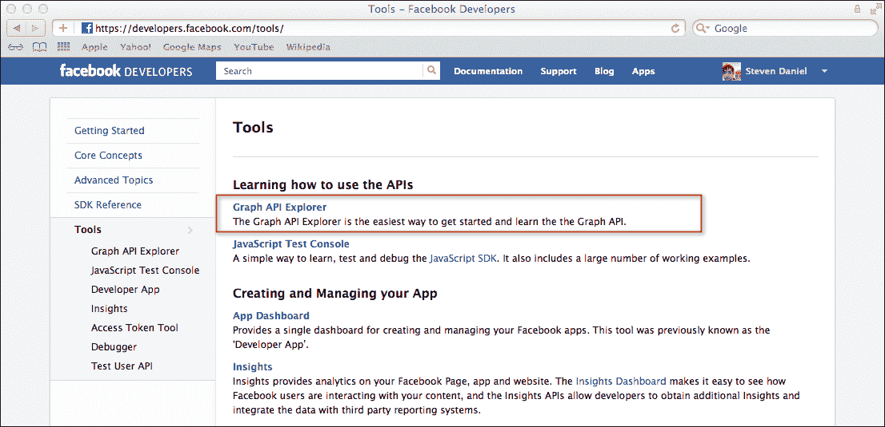

# 第九章：使用 Facebook iOS SDK 创建社交网络应用

在本章中，我们将涵盖：

+   下载 Facebook iOS SDK

+   在 Facebook 上注册您的 iOS 应用

+   构建一个简单的社交网络应用

+   将 Facebook iOS SDK 添加到您的项目中

+   实现单点登录（SSO）功能

+   请求额外的 Facebook 权限

+   实现和使用 Graph API 读取 JSON 数据

+   与 Facebook 社交渠道集成

+   在您的应用中处理 Facebook 错误

# 简介

在 2007 年 5 月 24 日，马克·扎克伯格宣布了 Facebook 平台，这是一个为程序员创建 Facebook 内社交应用的开发平台。

当 Facebook 推出开发平台时，已经建立了许多应用，并且已经有数百万用户在玩这些应用。社交网络应用利用 Facebook 的 API 集合，使您能够连接到 Facebook 并发送应用请求通知，以便您可以将他们添加到您的朋友列表中。

在本章中，我们将探讨如何下载 Facebook iOS SDK 并注册您的 iOS 应用，以便它可以与 Facebook 一起使用。然后，我们将从创建一个简单应用开始，看看我们如何将 Facebook iOS SDK 添加到我们的项目中，以便用户可以登录他们的 Facebook 账户，以便发送通知请求以及直接将新闻源提交到他们的主页墙。

最后，我们将探讨如何实现 Facebook iOS SDK 的**单点登录（SSO**）功能，该功能允许用户使用他们的 Facebook 身份登录您的应用。

# 下载 Facebook iOS SDK

在本食谱中，我们将学习下载 Facebook iOS SDK 所需的步骤。

## 准备工作

为了继续操作，我们首先需要启动我们的浏览器，并从 Facebook 开发者网站下载 Facebook iOS SDK 包。

## 如何操作...

首先，按照以下步骤操作：

1.  启动您的浏览器并输入[`developers.facebook.com/ios/`](http://developers.facebook.com/ios/)。

1.  接下来，点击**下载 SDK**按钮开始下载 Facebook SDK。下载完成后，安装该包。默认安装位置是`~/Documents/FacebookSDK`。

## 它是如何工作的...

在本食谱中，我们探讨了从 Facebook 开发者门户下载 Facebook iOS SDK 所需的必要步骤。与 Facebook SDK 的早期版本相比，现在的 SDK 被包装成一个框架，并提供您所需的所有功能，以便您的应用与 Facebook 平台交互。当使用 Facebook SDK 的 3.1 版及以上版本开发应用时，它需要 Xcode 4.5 及以上版本。

## 更多内容...

Facebook SDK 框架包含所有必需的方法对象和 API，使您能够与 Facebook 交互，发送通知请求，或简单地使用 Facebook iOS SDK 的单点登录功能向当前人的墙页发布消息。

这允许您的用户使用他们的 Facebook 身份登录您的应用程序。在 SDK 的初始版本中，`authorize` 方法总是打开一个包含 `UIWebView` 的内联对话框，其中显示了授权用户界面，并要求用户为每个他们授权的应用程序分别输入他们的凭据。

在 SDK 的更新版本中，这一变化已经发生，不再需要用户为设备上他们想要授权的每个应用程序重新输入凭据。使用 Facebook iOS SDK 允许您执行以下操作：

| Facebook iOS SDK 类型 | 描述 |
| --- | --- |
| 身份验证和授权 | 提示用户登录 Facebook 并授予您的应用程序权限。 |
| 调用 API | 这允许您通过 JSON API 调用获取用户配置文件数据，以及与用户的朋友相关的任何信息。 |
| 显示对话框 | 这允许您通过 `UIWebView` 视图与用户交互。这对于在不要求预先权限的情况下启用与 Facebook 的交互非常有用。 |

## 相关内容

+   *使用 Facebook 注册您的 iOS 应用程序* 的配方

# 使用 Facebook 注册您的 iOS 应用程序

在本配方中，我们将学习如何注册 iOS 应用程序，以便它可以与 Facebook 平台一起使用。

## 准备工作

在我们之前的配方之后，在我们开始将我们的应用程序与 Facebook 平台集成之前，我们需要将应用程序注册到 Facebook 的移动网站上，并提供一些基本的应用程序信息。

## 如何做...

要开始，请按照给定顺序概述的简单步骤进行操作：

1.  打开您的浏览器并输入 [`developers.facebook.com/apps`](http://developers.facebook.com/apps)。

1.  接下来，如果您不是注册用户，请注册 Facebook，或者输入您的 Facebook 账户凭据并点击 **登录** 按钮。

1.  接下来，从 **应用** 页面点击 **+创建新应用** 按钮。

1.  接下来，在 **应用名称** 字段中输入 `Social Networking App`。

1.  点击 **继续** 按钮以进入向导的下一步。这将用于并显示在您向朋友发布或发送通知消息时。

1.  接下来，在您继续下一步之前，系统将提示您输入 **安全验证** 词语。

1.  输入屏幕上显示的词语并点击 **提交** 按钮以继续。显示的词语每次都会不同。

    ### 注意

    如果您输入的单词不正确，您的账户可能会被锁定。如果是这种情况，您需要直接联系 Facebook 以解锁此账户。

    

上述屏幕截图显示了允许您在提交更改之前进行任何最终更改的最终屏幕。一旦您对所有的更改都感到满意，请点击**保存更改**按钮。

### 注意

**App ID**是我们将在 iOS 应用程序中使用的重要字段，用于与 Facebook 通信，并在之前的屏幕截图中被箭头突出显示。

## 它是如何工作的...

在本菜谱中，我们探讨了将我们的应用程序注册到 Facebook 移动开发平台所需的步骤，以便我们的应用程序可以与该平台通信。

我们探讨了如何创建和定义一个新的应用名称，该名称将在发送或发布到您的墙或朋友的通知消息时显示。在下一个菜谱中，我们将看看如何构建我们的社交网络应用的用户界面。

## 参见

+   *构建简单的社交网络应用*菜谱

# 构建简单的社交网络应用

在这个菜谱中，我们将学习如何构建我们的社交网络应用项目的用户界面。

## 准备工作

在本节中，我们将开始构建将构成我们应用程序用户界面的组件。

## 如何做...

首先，按照给定的顺序遵循简单的步骤：

1.  从`/Xcode4/Applications`文件夹启动**Xcode**。

1.  选择**创建新的 Xcode 项目**，或**文件** | **新建项目**。

1.  从可用模板列表中选择**单视图应用程序**。

1.  点击**下一步**按钮，进入向导的下一步。

1.  接下来，输入`SocialNetworkApp`作为您项目的名称。

1.  从**设备**下拉列表中选择**iPhone**。

1.  确保没有选中**使用故事板**的复选框。

1.  确保没有选中**使用自动引用计数**和**包含单元测试**的复选框。

1.  接下来，点击**下一步**按钮，进入向导的下一步，并指定您想要保存项目的位置。

1.  然后，点击**创建**按钮继续，并显示 Xcode 工作区。

现在我们已经创建了`SocialNetworkApp`项目，我们可以开始构建我们的用户界面，该界面将使我们能够与 Facebook 通信：

1.  从**项目导航器**窗口中选择`ViewController.xib`文件。

1.  从**对象库**中选择并拖动一个**UIToolbar**对象，并将其添加到我们的视图中，然后选择工具栏内的**项目**按钮。

1.  在**属性检查器**部分，将**标识符**属性更改为**自定义**，并将**样式**的值更改为**带边框**，将**标题**的值更改为**登录**。

1.  为此`UIBarButtonItem`创建一个出口，并将其命名为`loginButton`。

1.  为**登录**按钮创建一个`action`方法，并将其命名为`loginButton`。

1.  在**登录**按钮旁边添加一个**灵活空间按钮项**。

1.  在灵活空间按钮项的右侧添加另一个`UIBarButtonItem`，并在**属性检查器**中，将**标识符**属性更改为**Action**。

1.  从**对象库**中拖动一个**UIImageView**对象到视图中。

1.  调整`UIImageView`控件的大小，使其能够容纳护照大小的照片。

1.  接下来，为这个`UIImageView`创建一个出口，并将其命名为`imgPhoto`。

1.  从**对象库**中拖动一个**UITextView**对象到视图中。

1.  调整**UITextView**控件的大小，使其占据视图控制器宽度。

1.  接下来，为这个`UITextView`创建一个出口，并将其命名为`userInfoDetails`。

1.  通过选择菜单栏中的**文件** | **保存**来保存**SocialNetworkApp**。

如果您正确地遵循了步骤，完成的视图控制器屏幕应该与之前的截图类似。请随意调整您的屏幕。

## 工作原理...

在本菜谱中，我们首先构建了我们`SocialNetworkApp`应用程序的用户界面，这将使我们能够登录和注销 Facebook 并在我们的墙上发布消息。在我们的下一个菜谱中，我们将探讨如何将 Facebook iOS SDK 添加到我们的项目中，这将允许我们与 Facebook 移动开发平台进行通信，并包括必要的属性和方法，使我们能够向当前用户的墙发布消息。

## 相关内容

+   *将 Facebook SDK 和依赖项添加到您的项目中*菜谱

+   在第一章的*使用 Xcode 创建 iOS 项目*菜谱中，*获取和安装 iOS SDK 开发工具*

+   在第一章的*为 Interface Builder 对象创建出口*菜谱中，*获取和安装 iOS SDK 开发工具*

# 将 Facebook SDK 和依赖项添加到您的项目中

在本菜谱中，我们将学习如何将 Facebook SDK 和框架依赖项作为我们`SocialNetworkingApp`项目的一部分来包含，以便我们能够与 Facebook 移动平台进行通信。

## 准备工作

在我们之前的菜谱基础上，确保我们的`SocialNetworkApp`项目文件已打开。

## 如何操作...

要添加 Facebook SDK 和所需的框架，请按照以下简单步骤操作：

1.  从**项目导航器**窗口中，选择`SocialNetworkApp`文件夹。

1.  选择**将文件添加到 "SocialNetworkApp" …**或 Mac 用户可以按*Option* + *Command* + *A*。

1.  接下来，将`FacebookSDK.framework`文件夹从`Facebook SDK 安装`文件夹拖动到您的**项目导航器**的**框架**部分。

1.  然后，选择**为任何添加的文件夹创建组**，并取消选择**将项目复制到目标组文件夹中**（如果需要）以保持对 SDK 安装文件夹的引用，而不是创建一个副本。

1.  接下来，通过将`FacebookSDKResources.bundle`文件从`FacebookSDK.framework/Resources`文件夹拖动到您的**项目导航器**的**框架**部分，添加 Facebook SDK for iOS 资源包。

1.  接下来，SDK 依赖于其他三个框架（AdSupport、Accounts 和 Social）来使用 iOS6 中内置的 Facebook 功能。要添加这些框架，请转到目标的**摘要**面板中的**链接框架和库**部分，然后点击**+**按钮来添加它们。

1.  接下来，我们需要通过将`DeprecatedHeaders`文件夹从`FacebookSDK.framework/Versions/A/DeprecatedHeaders`文件夹拖动到您的**项目导航器**的**框架**部分来导入 Facebook 对话框调用头文件：

1.  然后，我们需要在**构建设置**面板中将**–lsqlite3.0** SQL 库添加到构建依赖项列表中：

1.  一旦做出更改，您的解决方案应包含以下文件：

1.  通过选择**文件** | **保存**来保存您的项目，因为我们已经完成了添加 Facebook SDK。

## 工作原理...

在这个菜谱中，我们学习了如何使用 Xcode 手动将 Facebook SDK 组件添加到我们的项目中，以便我们能够与 Facebook 平台通信，向当前用户的墙发布消息，或者使用 SSO 功能和 Facebook Graph API 方法检索与用户关联的信息。

当在 iOS6 平台上构建项目时，我们学习了关于依赖于 Facebook SDK 的新框架依赖项，以及将 SQLite SQL 库添加到项目构建设置中的构建依赖项列表。

最后，我们学习了如何导入 Facebook Feed 和 Requests 对话框方法，以确保 Facebook SDK 头文件与 Facebook SDK 2.0 版本中使用的相同方法保持向后兼容性。

在我们的下一个菜谱中，我们将学习如何在我们的应用程序中实现单点登录（SSO）功能，以便我们能够登录和注销 Facebook，以及向当前用户的 Facebook 墙发布消息。

### 注意

有关 Facebook iOS SDK 的更多信息，请参阅 Facebook 开发者文档，可在[`developers.facebook.com/docs/guides/mobile`](http://developers.facebook.com/docs/guides/mobile)找到。

## 相关内容

+   *实现单点登录（SSO）功能*菜谱

# 实现单点登录（SSO）功能

在这个菜谱中，我们将学习如何实现 Facebook iOS SDK 的单点登录功能，这将使我们的应用程序能够与 Facebook 通信。

使用 SSO 的过程是通过将用户重定向到他们设备上的 Facebook iOS 应用程序，并向他们展示一个认证对话框，只显示您的应用程序已配置为使用的那些权限。

## 准备工作

在我们之前的菜谱基础上，确保我们的`SocialNetworkApp`项目文件是打开的。

## 如何做...

要开始，按照给定的顺序遵循以下简单步骤：

1.  从**项目导航器**中打开`AppDelegate.hinterface`文件。

1.  接下来，根据高亮显示的代码部分修改接口文件：

    ```swift
    //  AppDelegate.h
    //  SocialNetworkApp
    //  Created by Steven F. Daniel on 11/12/12.
    //  Copyright (c) 2012 GenieSoft Studios. All rights reserved.
    #import <UIKit/UIKit.h>
    #import "FBConnect.h"

    @class ViewController;

    @interface AppDelegate : NSObject <UIApplicationDelegate, FBSessionDelegate, FBDialogDelegate>
    {
     Facebook *facebook;
    }

    // Create the required class Setters and Getters
    @property (strong, nonatomic) UIWindow       *window;
    @property (strong, nonatomic) ViewController *viewController;
    @property (nonatomic, retain) Facebook  *facebook;

    -(void)fbDidLogin;
    -(void)fbDidLogout;
    -(void)fbSessionInvalidated;

    @end
    ```

1.  接下来，从**项目导航器**中打开`AppDelegate.m`实现文件。

1.  修改实现文件，如高亮显示的代码部分所示：

    ```swift
    //  AppDelegate.m
    //  SocialNetworkApp
    //  Created by Steven F. Daniel on 11/12/12.
    //  Copyright (c) 2012 GenieSoft Studios. All rights reserved.

    #import "AppDelegate.h"
    #import "ViewController.h"

    @implementation AppDelegate

    @synthesize window = _window;
    @synthesize viewController = _viewController;
    @synthesize facebook;

    ```

1.  接下来，修改`didFinishLaunchingWithOptions:`方法，如以下代码片段所示：

    ```swift
    - (BOOL)application:(UIApplication *)application didFinishLaunchingWithOptions:(NSDictionary *)launchOptions
    {
    self.window = [[[UIWindow alloc] initWithFrame:
    [[UIScreen mainScreen] bounds]] autorelease];

    // Override point for customization after application
    // launch.
    self.viewController = [[[ViewController alloc] initWithNibName:@"ViewController" bundle:nil] autorelease];
    self.window.rootViewController = self.viewController;

    // Do any additional setup after loading the view, 
    // typically from a nib.
    self.facebook = [[Facebook alloc] 
    initWithAppId:@"YOUR_APPID_HERE" 
    andDelegate:self];
    // Check and retrieve authorization information
     NSUserDefaults *defaults = [NSUserDefaults standardUserDefaults];
     if ([defaults objectForKey:@"FBAccessTokenKey"] && [defaults objectForKey:@"FBExpirationDateKey"]) {
     self.facebook.accessToken = [defaults objectForKey:@"FBAccessTokenKey"];
     self.facebook.expirationDate = [defaults objectForKey:@"FBExpirationDateKey"];
     }

     // Check to ensure that we have a valid session object
     if (![self.facebook isSessionValid]) {
     [self.facebook authorize:nil];
     }

        [self.window makeKeyAndVisible];
        return YES;
    }
    ```

    ### 注意

    为了确保您的应用程序与您自己的 AppID 一起工作，您需要将`initWithAppId:`后面的`YOUR_APPID_HERE`字符串替换为您自己创建的 Facebook AppID。

1.  接下来，创建以下代码部分，如代码片段中指定：

    ```swift
    -(BOOL)application:(UIApplication *)application handleOpenURL:(NSURL *)url
    {
        return [self.facebook handleOpenURL:url];
    }

    -(BOOL)application:(UIApplication *)application openURL:(NSURL *)urlsourceApplication:(NSString *)sourceApplication annotation:(id)annotation{
       return [self.facebook handleOpenURL:url];
    }

    -(void)fbDidLogin
    {
        // Check and retrieve authorization information
        NSUserDefaults *defaults = [NSUserDefaults standardUserDefaults];
        [defaults setObject:[self.facebook accessToken] forKey:@"FBAccessTokenKey"];
        [defaults setObject:[self.facebook expirationDate] forKey:@"FBExpirationDateKey"];
        [defaults synchronize];
    }

    - (void)fbDidLogout
    {
        // Remove saved authorization information if it exists
        NSUserDefaults *defaults = [NSUserDefaults standardUserDefaults];
        if ([defaults objectForKey:@"FBAccessTokenKey"]) {
            [defaults removeObjectForKey:@"FBAccessTokenKey"];
            [defaults removeObjectForKey:@"FBExpirationDateKey"];
            [defaults synchronize];
        }

        UIAlertView *alertView = [[UIAlertView alloc]
                                  initWithTitle:@"FaceBookSampleApp"
                                  message:@"Your session has logged out."
                                  delegate:nil
                                  cancelButtonTitle:@"OK"
                                  otherButtonTitles:nil,
                                  nil];
        [alertView show];
        [alertView release];
    }
     [alertView show];
     [alertView release];
    }

    #pragma mark Called when the session has expired.
    - (void)fbSessionInvalidated {
        UIAlertView *alertView = [[UIAlertView alloc]
                                  initWithTitle:@"FaceBookSampleApp"
                                  message:@"Your session has expired."
                                  delegate:nil
                                  cancelButtonTitle:@"OK"
                                  otherButtonTitles:nil,
                                  nil];
        [alertView show];
        [alertView release];
        [self fbDidLogout];
    }
    ```

## 它是如何工作的...

在这个菜谱中，我们首先通过扩展我们的类来包含`FBSessionDelegate`和`FBDIalogDelegate`类协议及其方法。然后我们声明了一个名为`facebook`的实例变量，这将使我们能够访问`Facebook`类的方法。接下来，我们添加了一个`Facebook`类的属性实例来创建类获取器和设置器，然后继续在`AppDelegate.h`接口文件中合成我们定义的`facebook`变量。这样做是为了让我们的实现文件知道`facebook`变量，以便我们可以访问对象属性和方法。在我们的`didFinishLaunchingWithOptions:`方法中，我们初始化我们的`Facebook`对象以调用 SSO，通过传递我们在注册 iOS 移动应用时创建的应用程序 AppID 以及我们应用内的 Graph API 和平台对话框。一旦对象被实例化，我们需要检查任何之前保存的访问令牌信息，然后使用这些保存的信息来设置一个有效的会话，通过将保存的信息分配给 Facebook 访问令牌和过期日期属性，以确保您的应用不会重定向到 Facebook 应用程序。如果应用程序已经有一个有效的`access_token`，则调用授权对话框。

我们继续检查有效的会话，如果会话无效，我们调用`authorize`方法，这将登录用户并提示用户授权应用程序，然后声明两个 iOS 在 SSO 过程中将应用程序重定向到应用时将被调用的方法。这些方法为应用程序提供了用户的凭据。

你会注意到我们声明了两种不同的方法来处理 iOS 应用的不同版本。`The handleOpenURL:` 方法用于版本低于 4.2 的版本，而 `openURL` 方法用于 4.2 版本及以上。在我们的下一步中，我们实现了 `FBSessionDelegate` 的 `fbDidLogin:` 方法。在 SSO 过程成功登录并 Facebook 应用将用户重定向回调用应用后，我们使用 `FBAccessTokenKey` 和 `FBExpirationDateKey` 键保存用户的凭据，然后将这些信息保存到用户偏好设置 `NSUserDefaults` 中。

然后，我们继续实现 `FBSessionDelegate` 的 `fbDidLogout:` 方法。在 SSO 过程成功从 iOS 应用中注销后，`callback` 方法被调用。在移除存储的用户凭据之前，我们需要检查是否有成功的访问令牌键，使用 `FBAccessTokenKey` 和 `FBExpirationDateKey` 键。

然后，我们使用 `NSUserDefaults` 对象从用户偏好设置中删除这些详细信息。最后，我们创建一个 `UIAlertView` 对话框的实例来通知用户已成功注销。在我们之前的章节中，我们实现了 `FBSessionDelegate` 的 `fbSessionInvalidated` 方法。当请求向当前用户的墙发布新消息或向您的朋友发送通知时，会调用 `fbSessionInvalidated` 方法以确保存在有效的会话。这使用了 SSO 过程在您的应用登录时创建的 `session` 对象。如果会话状态已过期，我们声明一个 `UIAlertView` 类的实例来向用户显示一条消息，然后最终调用 `fbDidLogout` 方法以确保所有必需的访问令牌都被干净地移除。

## 还有更多...

如果用户已经在他们的设备上登录了 Facebook iOS 应用，则无需再次提供。使用 SSO 的过程是通过将用户重定向到他们设备上的 Facebook iOS 应用，并向他们展示一个身份验证对话框来实现的，该对话框只显示您的应用已配置为使用的权限。一旦用户允许了 iOS 应用请求的权限，他们将被重定向回您的应用，并带有适当的访问令牌。

当使用 Facebook SSO 过程时，某些行为可能会根据用户 iOS 设备上安装的 Facebook iOS 应用的版本有所不同。

以下表格解释了在特定条件下运行 Facebook SSO 过程时会发生什么：

| Facebook SSO 条件 | 描述 |
| --- | --- |
| iOS 应用运行支持多任务的 iOS 版本，并且运行 3.2.3 或更高版本的 Facebook iOS 应用。 | Facebook SDK 将尝试在 Facebook 应用内打开授权对话框。在用户授权或拒绝授权后，用户将被重定向回调用应用，并带有一个授权令牌、过期时间以及 Facebook `oAuth`认证服务器可能返回的任何其他参数。 |
| iOS 设备运行支持多任务的 iOS 版本，并且不是运行 3.2.3 或更高版本的 Facebook iOS 应用。 | Facebook SDK 将在 Safari 中打开授权对话框。在用户授权或拒绝授权后，Safari 将用户重定向回调用应用。此过程类似于 Facebook 应用的授权，允许多个应用通过 Safari cookie 共享相同的 Facebook 用户`access_token`。 |
| 如果 iOS 应用运行不支持多任务的 iOS 版本。 | SDK 将使用弹出内联`UIWebView`网页视图控件的老机制，提示用户登录并授权。 |

### 注意

Facebook 建议您始终确保您的设备运行的是最新版本的 Facebook iOS 应用。

## 参见

+   *实现视图控制器类*菜谱

# 实现视图控制器类

在这个菜谱中，我们将开始为我们的`ViewController`类实现额外的功能，以及导入一些非常重要的头文件并扩展我们的类。

## 准备工作

在我们之前的菜谱基础上，确保我们的`SocialNetworkApp`项目文件已打开。

## 如何做...

要开始，请按照给定顺序遵循以下简单步骤：

1.  从**项目导航器**打开`ViewController.h`接口文件。

1.  接下来，根据高亮代码部分修改接口文件：

    ```swift
    //  ViewController.h
    //  SocialNetworkApp
    //  Created by Steven F. Daniel on 11/12/12.
    //  Copyright (c) 2012 GenieSoft Studios. All rights reserved.

    #import  <UIKit/UIKit.h>
    #import "AppDelegate.h"

    @interface ViewController : UIViewController<UIActionSheetDelegate, FBRequestDelegate>
    {
    AppDelegate *mainDelegate;
    IBOutlet UIBarButtonItem  *loginButton;
    IBOutlet UIBarButtonItem  *postMessage;
    IBOutlet UIImageView      *imgPhoto;
    IBOutlet UITextView       *userInfoDetails;
     Facebook       *facebook;
    }

    // Create the required class Setters and Getters
    @property (nonatomic, strong) UIBarButtonItem  *loginButton;
    @property (nonatomic, strong) UIBarButtonItem  *postMessage;
    @property (nonatomic, strong) UIImageView      *imgPhoto;
    @property (nonatomic, strong) UITextView       *userInfoDetails;
    @property(nonatomic, retain) Facebook    *facebook;
    @property(nonatomic, retain) AppDelegate *mainDelegate;

    // Declare our Instance methods
    -(void)SendNotificationRequest;
    -(void)PostMessagetoWall;
    -(void)getGraphAPIData;
    -(void)dialogDidComplete:(FBDialog *)dialog;
    -(void)request:(FBRequest *)request didLoad:(id)result;
    -(void)request:(FBRequest *)request didFailWithError:(NSError *)error;

    @end
    ```

1.  接下来，从**项目导航器**打开`ViewController.m`实现文件，并根据高亮代码部分修改实现文件：

    ```swift
    //  ViewController.m
    //  SocialNetworkApp
    //  Created by Steven F. Daniel on 11/12/12.
    //  Copyright (c) 2012 GenieSoft Studios. All rights 
    // reserved.

    #import "ViewController.h"
    #import "FBConnect.h"

    @interface ViewController ()
    @end

    @implementation ViewController

    @synthesize mainDelegate, loginButton, postMessage;
    @synthesize imgPhoto,userInfoDetails, facebook;

    - (void)viewDidLoad{
      [super viewDidLoad];

     // Set up our delegate object
     self.mainDelegate = (AppDelegate *)[[UIApplication
     sharedApplication]delegate];
     self.facebook = mainDelegate.facebook;

     // Initialize our form fields
     userInfoDetails.text = @"";
    }

    #pragma mark Handle when the login button is pressed.
    - (IBAction)loginButton:(id)sender{
     if ([loginButton.title isEqualToString:@"Sign In"]) {
     if (![self.facebook isSessionValid]) {
     NSLog(@"facebook session");
     NSArray *permissions = [[NSArray alloc] 
     initWithObjects:@"email",@"publish_actions", nil];
     [self.facebook authorize:permissions];
     [permissions release];
     }
     else {NSLog(@"session still valid");}
     [loginButton setTitle:@"Sign Out"];
     }
     else if([loginButton.title isEqualToString:@"Sign 
    Out"]) {
     [loginButton setTitle:@"Sign In"];
     [self.facebook logout:self.mainDelegate];
     }
    }

    ```

## 它是如何工作的...

在这个菜谱中，我们首先扩展了我们的类以包含`UIActionSheetDelegate`和`FBRequestDelegate`类协议及其方法。然后我们声明了一个名为`facebook`的实例变量，这将使我们能够访问`Facebook`类的方法。接下来，我们添加了一个`Facebook`类的属性实例以创建类获取器和设置器，然后继续合成我们在`AppDelegate.h`接口文件中定义的`facebook`变量。

接下来，我们导入我们的`FBConnect.h`接口文件的接口文件头信息，以便我们可以访问请求对话框类方法。接下来，我们声明一个指向我们的`delegate`类中属性和类方法的`mainDelegate`应用程序委托对象。接下来，我们在`ViewController`中初始化我们的`facebook`对象，使用与我们在`delegate`类中实例化的相同对象实例。最后，我们使用`UITextView`控件初始化我们的用户信息详情。

接下来，我们创建我们的`loginButton:`方法，并检查按钮的状态。如果按钮读取为**登录**，我们使用`facebook`对象的`isSessionValid`方法来确定我们是否仍然与`facebook`实例保持有效连接。

如果它证明我们的会话已过期，我们初始化并将请求访问用户电子邮件的权限传递给我们的`facebook`类的`authorize`方法，并允许 iOS 发布到**Open Graph API**操作。最后，我们释放由我们的`permissions`对象分配的内存，然后更新按钮的标题为**注销**。如果我们的按钮通过`loginButton:`方法读取为**注销**，我们更新按钮的标题为**登录**，然后调用`Facebook`类的`logout`方法，并传入我们的`mainDelegate`对象。当这个方法被调用时，它将在我们的`AppDelegate`类中调用`FBSessionDelegate`的`fbDidLogout`方法来处理任何注销后的操作和对象的释放，以及通知用户已成功注销。

### 注意

当调用`logout`方法时，你的应用程序权限不会被撤销；它只会清除你应用程序的`access_token`值。如果之前已经从你的应用程序注销的用户决定再次运行它，他们只会看到一个通知，表明他们正在重新登录你的应用程序，而不是请求权限的通知。有关 Facebook 协议方法的更多信息，请参阅以下 URL：[`developers.facebook.com/docs/reference/iossdk/#protocols`](http://developers.facebook.com/docs/reference/iossdk/#protocols)

## 参见

+   *请求额外的 Facebook 权限*食谱

# 请求额外的 Facebook 权限

在这个食谱中，我们将学习如何指定我们的应用程序要使用的额外权限。

## 准备工作

在我们之前的食谱基础上，我们将学习如何实现额外的权限。

## 如何做...

要开始，按照以下顺序遵循给定的简单步骤：

1.  从**项目导航器**打开`AppDelegate.m`实现文件。

1.  接下来，修改`didFinishLaunchingWithOptions:`方法，如下面的代码片段所示：

    ```swift
    - (BOOL)application:(UIApplication *)application didFinishLaunchingWithOptions:(NSDictionary *)launchOptions
    {
      self.window = [[[UIWindow alloc] initWithFrame:[[UIScreen 
      mainScreen] bounds]] autorelease];

      // Override point for customization after 
      // application launch.
     self.viewController = [[[ViewController alloc] 
     initWithNibName:@"ViewController" bundle:nil] autorelease];
     self.window.rootViewController = self.viewController;

     // Do any additional setup after loading the view, 
     // typically from a nib.
     self.facebook = [[Facebook alloc] 
     initWithAppId:@"YOUR_APPID_HERE" andDelegate:self];

     // Check and retrieve authorization information
     NSUserDefaults *defaults = [NSUserDefaults
     standardUserDefaults];
     if ([defaults objectForKey:@"FBAccessTokenKey"] &&
         [defaults objectForKey:@"FBExpirationDateKey"]) {
         self.facebook.accessToken = [defaults 
         objectForKey:@"FBAccessTokenKey"];
        self.facebook.expirationDate = [defaults 
        objectForKey:@"FBExpirationDateKey"];
      }
     // Set up the permissions to use for this App
     NSArray *permissions = [[NSArray alloc]
     initWithObjects:
     @"user_likes",
     @"user_birthday",
     @"user_interests",
     @"read_stream",nil];

      // Check to ensure that we have a valid session object
      if (![self.facebook isSessionValid]) {
     [self.facebook authorize:permissions];
      }

     [permissions release];
      [self.window makeKeyAndVisible];
      return YES;
    }
    ```

## 它是如何工作的...

在这个示例中，我们首先声明一个用于存储我们想要请求的每个权限的 `NSArray` 对象变量 `permission`。然后，我们将此变量传递给 `facebook` 对象的 `authorize` 方法，最后释放对象分配的内存。

### 注意

有关您可用的完整权限列表的更多信息，请参阅以下 URL 的 Facebook 权限参考：[`developers.facebook.com/docs/authentication/permissions/`](https://developers.facebook.com/docs/authentication/permissions/)

## 还有更多...

当在您的应用程序中使用 Facebook 集成时，您可以指定应用程序要使用的额外权限。当您未指定额外权限启动应用程序时，这将使用默认权限，并且只能读取用户的基本信息，这包括 `User` 对象的某些属性，如 id、姓名、图片、性别和他们的地区。如果您想读取额外的数据或将数据发布回 Facebook，您将需要请求这些额外权限。

这些额外权限分为以下几部分，如给定的表格所示：

| 请求的权限 | 描述 |
| --- | --- |
| 基本信息（无权限） | 当用户授权您的应用程序且您未指定额外权限时，您的应用程序将只能访问用户的基本信息。这包括某些属性，如他们的 id、姓名、性别、地区和他们的个人资料图片。 |
| 用户和好友权限 | 作为授权过程的一部分，您还可以请求对用户个人资料的额外访问权限。您可以访问诸如他们的生日、活动、签到和教育历史等信息。然而，用户必须在启动时授权，以便继续并授权您的应用程序。 |
| 扩展权限 | 如果您正在使用增强型授权对话框，则将向用户展示扩展权限。这类权限允许您读取您用户的朋友列表、读取用户的邮件收件箱、访问您用户的朋友请求，并代表用户创建和修改事件。 |
| 开放图权限 | 这类权限允许您的应用程序向 Open Graph API 发布操作，并使其能够检索任何其他应用程序已发布的任何操作。 |
| 页面权限 | 这类权限允许您检索用户管理的页面和应用程序的 `access_tokens`，并且仅与 Graph API 兼容。 |

## 参见

+   *实现单点登录（SSO）功能的配方*

+   *使用 Graph API 读取 JSON 数据* 的配方

# 使用 Graph API 读取 JSON 数据

在这个菜谱中，我们将学习关于图形 API 和 Facebook 查询语言（FQL）的内容。图形 API 是 Facebook 的核心，它通过表示图中每个对象（例如，人、照片、活动和页面）以及它们之间的连接（例如，朋友关系、共享内容和照片标签）来表示一个简单的社会图。

## 准备工作

在我们之前的菜谱之后，我们将学习如何通过将图形路径传递给`request`方法来访问图形 API，这是非常简单的。这可以通过遵循以下步骤来实现。

## 如何做...

在**facebook DEVELOPERS**网站上，您可以访问**图形 API 探索器**来了解更多关于返回的信息类型，并查看**Facebook 查询语言**（**FQL**）产生的数据模式的视觉表示。

1.  登录到以下地址的**facebook DEVELOPERS**网站：[`developers.facebook.com/tools`](http://developers.facebook.com/tools)。

1.  接下来，从**工具**部分，点击**图形 API 探索器**链接。

    这将显示**图形 API 探索器**窗口，并在中心视图中显示返回的每个数据字段的说明。

1.  接下来，从**应用程序**部分，从下拉菜单中选择**社交网络应用程序**。

1.  然后，点击**提交**按钮以检索当前用户 ID 的所有基本信息。

您已经看到使用图形 API 探索器检索各种类型信息的数据视觉表示是多么容易。让我们看看我们如何访问当前登录用户的信息。

1.  打开位于`SocialNetworkApp`文件夹中的`ViewController.m`实现文件。

1.  接下来，创建以下代码部分，如代码片段中指定：

    ```swift
    #pragma mark - Facebook GraphAPI Method
    -(void)getGraphAPIData {
      // Make a call using the Facebook Query Language to 
      // get the current user details.
      NSMutableDictionary *params = [NSMutableDictionary
      dictionaryWithObjectsAndKeys:
      @"SELECT quotes, uid, name, pic FROM user
      WHERE uid = me()", @"query",nil];

     [self.facebook requestWithMethodName:@"FQL.query"
      andParams:params
      andHttpMethod:@"POST"
      andDelegate:self];
    }
    #pragma markCalled when the Graph API call has completed.
    -(void)request:(FBRequest *)request didLoad:(id)result
    {
      if ([result isKindOfClass:[NSArray class]]) {
      result = [result objectAtIndex:0];
    }
    // This callback can be a result of getting the users
    // basic information or getting the user's permissions.
    if ([result objectForKey:@"name"]) {
      // Retrieve back the basic user information.
      NSString *concatString = [[NSString alloc] 
      initWithFormat:@"ID: %@\nName: %@\nQuotes: %@\n", 
      [result objectForKey:@"uid"],
      [result objectForKey:@"name"], 
      [result objectForKey:@"quotes"]];

      // Get the profile image
      UIImage *image = [UIImage imageWithData:[NSData
      dataWithContentsOfURL:[NSURL URLWithString:[result 
      objectForKey:@"pic"]]]];
      self.imgPhoto.image = image;
      self.userInfoDetails.text = concatString;
     }
    }
    #pragma markCalled when an error has occurred while 
    #pragma mark retrieving GraphAPI details
    -(void)request:(FBRequest *)request didFailWithError:(NSError *)error
    {
      NSLog(@"An error occurred obtaining details: %@",error);
    }
    ```

## 它是如何工作的...

在这个菜谱中，我们首先声明一个`NSMutableDictionary`对象变量`param`，它将被用来将 SQL 查询传递给 FQL 对象。这使得我们能够使用 SQL 风格的接口通过图形 API 查询数据。

然后，我们调用`facebook`对象的`requestWithMethodName`方法，并将`type`设置为`FQL.query`，这告诉该方法我们正在传递一个查询字符串，并返回一个字典数组对象的内容。当我们的`requestWithMethodName`方法完成后，它调用`request`方法的`didLoad`方法。此方法使用 JSON 调用解析结果。

接下来，我们检查返回的类型。如果返回多个结果，则返回一个`NSArray`对象，否则对于单个结果值返回一个`NSDictionary`对象。然后，我们将我们的结果设置为指向数组中的第一个位置，然后检索`uid`、`name`和`quotes`的每个字段。然后我们声明一个`UIImage`变量`image`，然后将个人资料图片类型转换为`UIImage`，将其分配给我们的表单上的`imgPhoto`控件，并显示相关的个人资料详情。最后，如果我们的`requestWithMethodName`方法完成时确定存在 JSON 解析错误，则调用`didFailWithError`方法。任何错误信息都包含在`NSError`变量`error`对象中。

### 注意

有关 Graph API 和 FQL 查询语言的更多信息，请参阅以下位置的 Facebook API 和 FQL 参考材料：[`developers.facebook.com/docs/reference/api/`](https://developers.facebook.com/docs/reference/api/) 和 [`developers.facebook.com/docs/reference/fql/`](https://developers.facebook.com/docs/reference/fql/)

## 参见

+   *与 Facebook 社交渠道集成*的示例

# 与 Facebook 社交渠道集成

在这个示例中，我们将学习如何从表格视图中删除一个项目，以及我们的 Core Data 模型。

## 准备工作

在我们的前一个示例之后，我们将学习如何从我们的表格视图中删除一行，并将其永久地从我们的 Core Data 数据库中删除。

## 如何操作...

首先，按照给定的顺序遵循简单的步骤：

1.  打开位于`SocialNetworkApp`文件夹中的`ViewController.m`实现文件。

1.  接下来，创建以下代码部分，如代码片段中指定：

    ```swift
    #pragma markSend a notification request to a group of friends
    - (void)sendNotificationRequest{
      NSMutableDictionary *params =
      [NSMutableDictionary dictionaryWithObjectsAndKeys:
      @"invites you to check out some great stuff.", @"message",
      @"Check this out", @"notification_text",nil];

    // Display the Facebook Request Notifications DialogBox
    [self.facebook dialog:@"apprequests" 
      andParams:params andDelegate:self.mainDelegate];
    }
    #pragma markFBDialogDelegate
    - (void)dialogDidComplete:(FBDialog *)dialog {
      NSLog(@"dialog completed successfully");
    }
    #pragma markPost a message to the current user's Wall.
    - (void)postMessagetoWall{
      NSMutableDictionary *params =
      [NSMutableDictionary dictionaryWithObjectsAndKeys:
      @"Testing FacebookSampleApp Feed Dialog", @"name",
      @"Using Feed Dialogs within iOS are great.", @"caption",
      @"Click to check out my BlockHeadz game on the AppStore", 
      @"description",
      @"http://itunes.apple.com/app/blockheadz/
      id386884355?mt=8#", @"link",
      @"http://geniesoftstudios.com/blog/wp-
      content/uploads/2011/03/blockhead.png",@"picture",nil];

      // Display the Facebook feed dialog with our array.
      [self.facebook dialog:@"feed" andParams:params
      andDelegate:self.mainDelegate];
    } 
    #pragma mark called when user presses the Post Message Button
    - (IBAction)postMessage:(id)sender {

      // Define an instance of our action sheet
      UIActionSheet *actionSheet;

      // Initialize our action sheet with the 
      // differen't mapping types.
      actionSheet = [[UIActionSheet alloc]
      initWithTitle:@"Choose from the list below"
      delegate:self
      cancelButtonTitle:@"Cancel"
      destructiveButtonTitle:@"Close"
      otherButtonTitles:@"Send Notification",@"Submit new post",
      @"Obtain User Details",nil];

      // Set our Action Sheet style and then 
      // display it to the user.
      actionSheet.actionSheetStyle = UIBarStyleBlackTranslucent;
      [actionSheet showInView:self.view];
    }
    // Delegate that handles the chosen action sheet options
    -(void)actionSheet:(UIActionSheet *)actionSheetclickedButtonAtIndex:(NSInteger)buttonIndex{

     // Determine the chosen item
     switch (buttonIndex) {
      case 1:  [self sendNotificationRequest]; break;
      case 2:  [self postMessagetoWall];       break;
      case 3:  [self getGraphAPIData];         break;
      default: break;  // Catch the Close button and exit.
     }
    }
    ```

## 它是如何工作的...

在这个示例中，我们首先声明一个`NSMutableDictionary`对象变量`params`，该变量将用于传递消息和通知文本，使用`@message`和`@notification_text`参数。然后，我们使用`facebook`对象的`dialog`方法，并告诉对话框我们想要使用`apprequests`对话框。接下来，我们声明一个名为`dialogDidComplete`的方法，该方法在`requests`对话框成功显示给用户时被调用。在`postMessagetoWall:`方法中，我们声明一个`NSMutableDictionary`对象变量`params`，该变量将用于传递消息和通知文本，使用`@name`、`@caption`、`@description`、`@link`和`@picture`属性。这些属性定义了在向用户的墙发布消息时显示的信息。接下来，我们使用`facebook`对象的`dialog`方法，并告诉对话框我们想要使用`feed`对话框，因为我们正在向墙发布详细信息。

接下来，在我们的`postMessage:`方法中，我们声明并实例化一个基于`UIActionSheet`类的`actionsheet`对象，然后初始化我们的操作表，以显示我们想要执行的不同类型的操作，作为可供选择的选项列表。接下来，我们使用`UIActionSheet`类的`actionSheetStyle`属性设置我们的操作表样式，然后使用`showInView:self.view`方法将操作表显示在当前视图中。

在我们的下一部分，我们定义一个委托方法来确定从操作表按下的按钮，并使用`actionSheet`属性的`clickedButtonAtIndex`方法。然后我们检查`buttonIndex`变量的值以确定按下的按钮索引。

## 还有更多...

Facebook iOS SDK 为您提供了一个简单的方法，使您的应用程序能够与 Facebook 社交渠道集成。使用这些社交渠道允许您的用户向他们的墙提交帖子，或向他们的朋友发送通知请求。

iOS SDK 为您提供了一个通过 Facebook 平台对话框使用社交渠道进行集成的功能。以下表格列出了 Facebook 目前支持的对话框：

| 社交渠道对话框 | 描述 |
| --- | --- |
| 喂食对话框 | 此对话框用于向用户的新闻源发布帖子。 |
| 请求对话框 | 此类型对话框允许您向一个或多个朋友发送请求。 |

当使用 Facebook 请求时，这些社交渠道对话框为您提供了允许用户邀请他们的朋友到您的 iOS 应用程序或甚至接受他们朋友礼物的绝佳方式。

请求是通过`Request`对话框发送的，如果用户的 iOS 设备支持`push`通知，那么每当发送通知请求时，他们将通过 Facebook iOS 应用程序收到推送通知。

## 相关内容

+   *如何在您的应用程序中处理 Facebook 错误*配方

# 在您的应用程序中处理 Facebook 错误

在这个配方中，我们将学习如何在我们的应用程序中处理 Facebook 错误。

## 准备工作

在我们之前的配方中，当使用 Facebook SDK 时，在您的应用程序中处理错误非常简单。如果在您的 iOS 应用程序中发生任何错误，`FBRequestDelegate`和`FBDialogDelegateprotocols`将立即处理它们。

## 如何操作...

首先，按照给定的顺序遵循简单的步骤：

1.  从**项目导航器**中打开`ViewController.m`实现文件。

1.  接下来，创建以下代码部分，如以下代码片段中指定：

    ```swift
    # pragma mark method is called when an error has occurred 
    # while pragma mark retrieving GraphAPI details.
    -(void)request:(FBRequest *)request didFailWithError:(NSError *)error{
      NSLog(@"An error occurred obtaining details: %@",error);
    }

    - (void)dialog:(FBDialog*)dialog didFailWithError:(NSError *)error{
      NSLog(@"An error occurred obtaining details: %@",error);
    }
    ```

## 工作原理...

在这个配方中，我们首先创建`request::(FBRequest *)request:didFailWithError:`，当使用 Graph API 请求信息时发生错误时会被调用。任何发生的错误都将被捕获并返回在`error`对象中。

如果在对话框过程中出现错误，将调用`dialog:didFailWithError`方法。发生的任何错误都将被捕获并返回到`error`对象中。

### 注意

关于如何使用 Facebook iOS SDK 处理错误的更多信息，您可以参考以下 URL 的 Facebook iOS 参考文档：[`developers.facebook.com/docs/mobile/ios/build/#errors`](https://developers.facebook.com/docs/mobile/ios/build/#errors)

## 还有更多…

在我们拥有一个完整的运行应用程序之前，我们还需要实现一些功能。我们需要对我们的应用程序属性列表进行一些更改，以便在应用程序运行时启用单点登录（SSO）支持。

这可以通过遵循以下简单步骤实现：

1.  从**项目导航器**中选择`SocialNetworkApp-info.plist`文件。

1.  接下来，在面板中心右键点击，然后从弹出列表中选择**添加行**。

1.  添加一个名为`URL Types`的新条目，并将其类型设置为**数组**。

1.  右键点击，然后在**URL**类型中选择**添加行**。

1.  然后，创建一个名为`Item 0`的新条目，并将其类型设置为**字典**。

1.  接下来，创建一个名为`URL Schemes`的新条目，并将其类型设置为**数组**。

1.  然后，创建一个名为`Item 0`的新条目，并将其类型设置为**字符串**。

1.  最后，使用我们在注册移动应用程序时注册的 Facebook AppID 值，将其输入到**值**字段中。您必须在此前加上`fb`，然后加上您的 App ID，这样才能正确工作。

    如前一个屏幕截图所示，我们已经修改了我们的`.plist`文件，使其能够支持 SSO。我们特别创建并注册了两个 URL 变量：`URL Types`和`URL Schemes`，以便 iOS 能够唯一地识别您的应用程序。

1.  接下来，通过选择**产品** | **从产品菜单运行**，或 Mac 用户可以按*Command*+ *R*来构建和运行应用程序。

以下屏幕截图显示了在 iOS 设备上运行的应用程序：


从前面的屏幕截图可以看出，当我们首次加载我们的社交网络应用程序时，我们会收到带有我们请求的权限的授权对话框。

一旦用户点击了**登录**按钮，对话框将消失，我们的 iOS 应用程序将显示出来（如屏幕截图的第二部分所示）。

然后，我们按下**操作**按钮，并选择**提交新帖子**按钮来显示发布到我们墙上的新消息，这显示在最后的屏幕截图中。

## 参见

+   *集成 Facebook 社交渠道*配方

+   *实现单点登录（SSO）功能*配方
