# 第十章。打包和部署您的应用程序

在本章中，我们将涵盖：

+   设置您的 iOS 开发团队

+   创建 iOS 开发证书

+   从苹果公司获取开发证书

+   注册您的 iOS 设备以进行测试

+   创建您的应用程序 App ID

+   创建开发配置文件

+   使用配置文件在 iOS 设备上安装应用程序

+   使用 iTunes Connect 准备应用程序提交到 App Store

+   使用 Xcode 4 归档和提交应用程序

# 简介

恭喜您做到了这里。您已成功构建了应用程序，现在您准备将其发布到全世界。您现在需要做的就是决定如何部署和推广它。

我们将查看提交您的应用程序到苹果 App Store 所需的内容，并与社区分享您的创作。在本章中，我们将学习如何设置您的 iOS 开发团队以及开发和分发所需的证书。 

我们还将学习如何创建开发和分发所需的配置文件，以及创建与 iOS 应用程序关联的必要应用程序 App ID。最后，我们将学习如何注册用于测试的 iOS 设备，以及提交您的应用程序到苹果 App Store 所需的步骤。

# 设置您的 iOS 开发团队

在本食谱中，我们将学习创建和设置 iOS 开发团队的步骤。

## 准备工作

在您可以将应用程序提交给苹果 App Store 进行审核之前，您需要设置您的 iOS 开发团队。

## 如何操作...

首先，按照以下简单步骤操作：

1.  登录到 iOS 开发者门户网站 [`developer.apple.com/`](http://developer.apple.com/)。

1.  点击屏幕顶部的**会员中心**链接。

1.  使用您的 Apple ID 和密码登录您的账户。这将显示**开发者程序资源**页面，如下面的截图所示：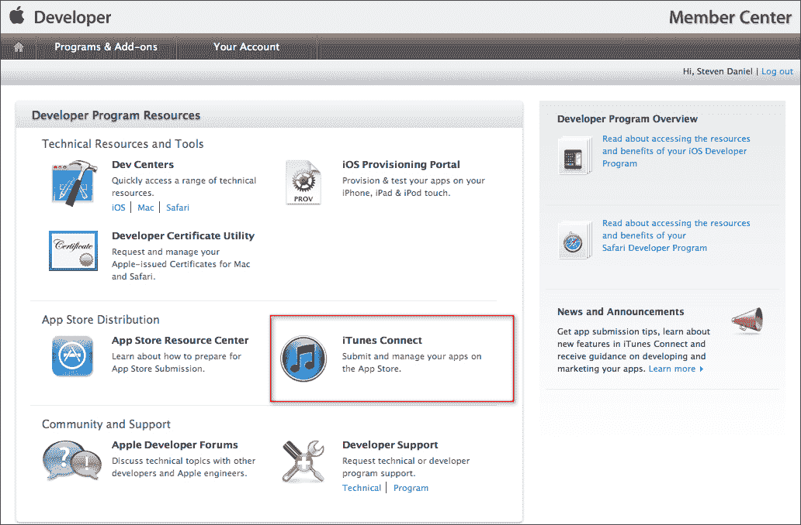

1.  接下来，点击前面截图中突出显示的**iTunes Connect**按钮。这是您可以检查各种事项的地方，例如**销售和趋势**和**管理您的应用程序**。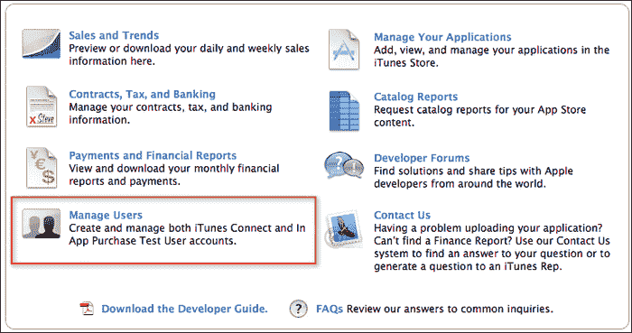

1.  接下来，点击**管理用户**以添加自己或组织内的其他人，他们可以登录到 iOS 开发者程序门户，在 iOS 设备上测试应用程序，并能够将额外的 iOS 设备添加到账户中。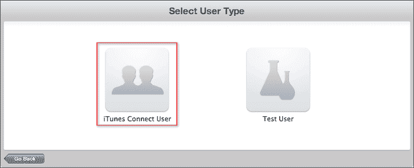

1.  选择前面截图中突出显示的**iTunes Connect 用户**按钮。这将弹出**添加新用户**选项面板，您可以从其中添加新用户，如下面的截图所示：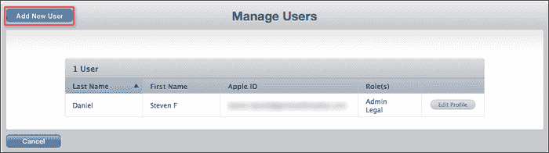

1.  前一个屏幕截图中的列表显示了一个现有用户的列表，这些用户已经预先设置，包括他们的详细信息以及他们被分配的角色，他们被设置以访问这些角色。

1.  接下来，点击如图所示的前一个屏幕截图中的 **添加新用户**。 

1.  然后，填写您将要添加到您的开发团队的人的 **个人信息** 部分。完成之后，点击以下屏幕截图所示的 **继续** 按钮：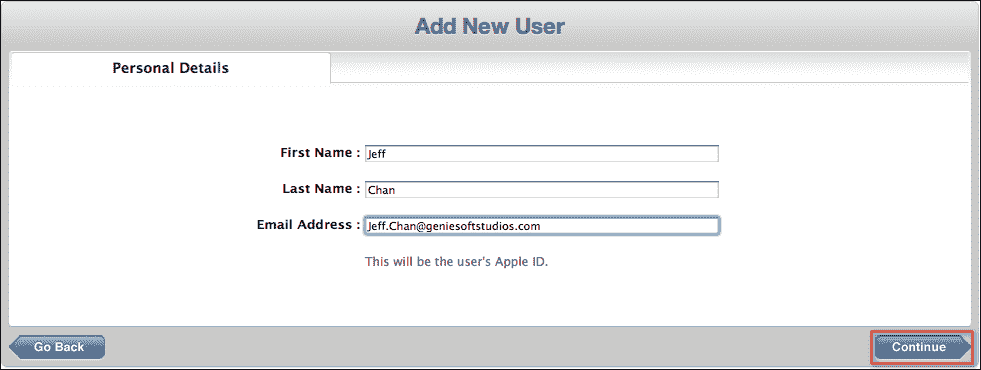

1.  接下来，我们需要分配用户将承担哪些角色，如图所示：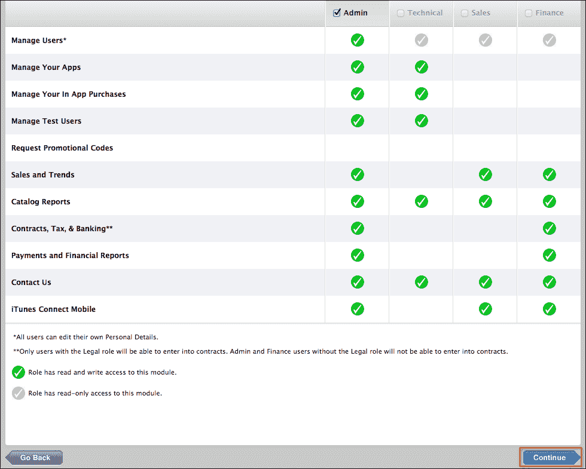

1.  接下来，只需从四个选项中选择一个，然后点击 **继续** 按钮以进入向导的最终步骤。

1.  接下来，选择如图所示的 **通知** 选项卡。此部分是我们将分配相关通知类型和地区的地方：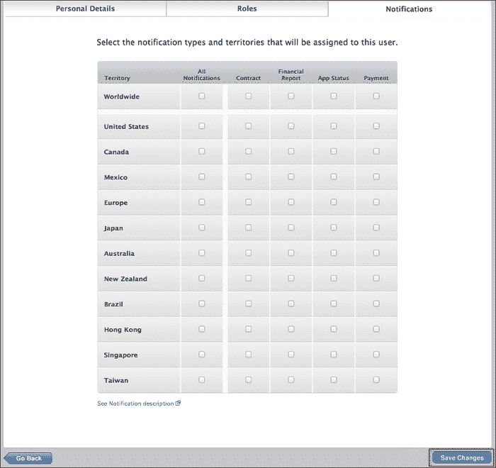

1.  一旦您为每个地区指定了不同类型的通知方法，请点击 **保存更改**。然后，将创建一个新的用户帐户，并发送确认电子邮件到用户的帐户，以便他们激活他们的帐户。

1.  以下表格解释了前一个屏幕截图中显示的每种不同类型的通知：

    | 通知 | 描述 |
    | --- | --- |
    | **应用状态** | 提供带有应用状态更新的电子邮件警报。 |
    | **合同** | 提供带有合同状态更新的电子邮件警报（例如，合同到期警告）或如果 iTunes 需要更多合同信息。 |
    | **财务报告** | 当财务报告在 iTunes Connect 上可供下载时，提供电子邮件警报。 |
    | **支付** | 当您的银行机构返回付款时，提供电子邮件警报。 |

## 工作原理...

在本菜谱中，我们探讨了创建和分配用户角色所需的必要步骤，以及哪些用户角色允许登录 iOS 开发者门户来管理用户、查看销售或趋势、以及支付和财务报告，以及那些有能力添加新设备以在各个不同的 iOS 设备上测试应用程序的用户。

在下一个菜谱中，我们将查看生成 iOS 开发证书所需的步骤。此证书是加密的，作为您的数字身份，您必须在运行和测试您在 iOS 设备上开发的任何应用程序之前使用此证书签名您的应用程序。

## 相关内容

+   *创建 iOS 开发证书* 菜单

# 创建 iOS 开发证书

在本菜谱中，我们将学习如何创建 iOS 开发证书，以便我们能够在 iOS 设备上运行和测试我们的应用。

## 准备工作

我们将首先生成 iOS 开发证书。这个证书是加密的，并作为您的数字身份使用。在您可以在 iOS 设备上运行和测试您开发的任何应用程序之前，您必须使用此证书签名您的应用程序。

## 如何操作…

首先，按照以下步骤操作：

1.  启动 Keychain Access 应用程序，该应用程序可以在`/Applications/Utilities`文件夹中找到。

1.  接下来，从**Keychain Access** | **Certificate Assistant**中选择**从证书颁发机构请求证书…**选项，如图所示：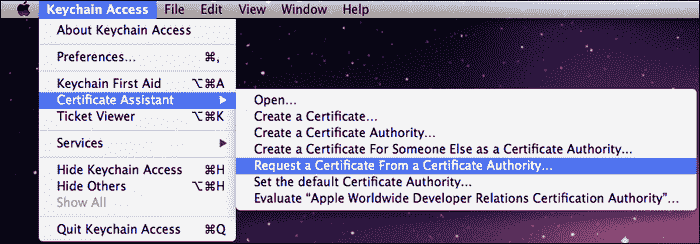

1.  接下来，在生成证书之前，我们需要提供一些信息。按照以下截图所示输入所需信息，确保您已选择**保存到磁盘**和**让我指定密钥对信息**选项：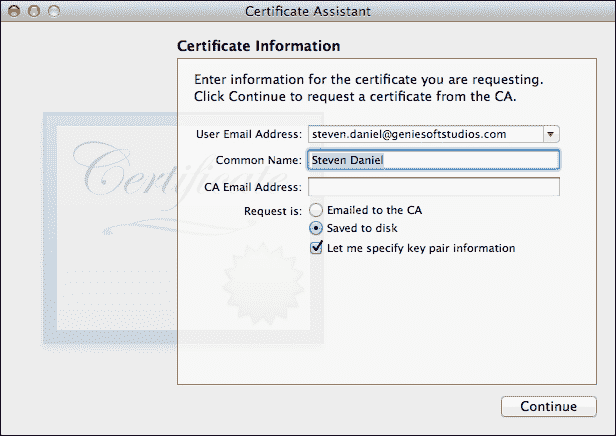

1.  一旦填写完所有信息，请点击**继续**按钮。您将被要求为证书指定一个名称；接受默认建议的名称，然后点击**保存**按钮。

1.  在此阶段，证书正在指定位置创建。您将被要求指定**密钥大小**和**算法**。

1.  接受默认的**2048 位**和**RSA 算法**位。点击**继续**按钮，当出现最终屏幕时，点击**完成**。

## 它是如何工作的...

在本食谱中，我们学习了如何使用预安装的 Mac OS X Keychain Access 应用程序生成 iOS 开发**证书签名请求**（**CSR**）。此证书是必需的，并将用于对 iOS 应用程序进行代码签名，使我们能够将应用程序部署到 iOS 设备进行开发和测试。

接下来，我们学习了如何使用 Keychain Access 应用程序中的证书助手请求证书，该应用程序是预安装的。然后我们学习了如何填写证书信息以及证书的密钥对信息，这些信息将被开发和分发配置文件使用。**通用** **名称**字段是在您开始对应用程序进行代码签名时使用的名称。

## 相关内容

+   **从苹果获取开发证书**食谱

# 从苹果获取开发证书

在本食谱中，我们将学习如何从苹果请求开发证书。

## 准备工作

基于之前的食谱，现在我们将学习如何从苹果获取开发证书。

## 如何操作…

首先，按照以下步骤操作：

1.  打开您的浏览器，并在地址栏字段中登录以下链接 [`developer.apple.com/devcenter/ios/index.action`](https://developer.apple.com/devcenter/ios/index.action) 的 iOS 开发者门户。

1.  确保您已使用 Apple 凭据登录。

1.  接下来，点击页面右侧的**iOS 配置文件门户**。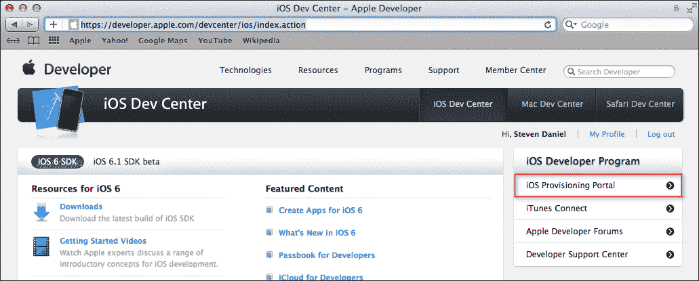

1.  点击面板左侧的**证书**选项卡，然后点击以下截图所示的**开发**选项卡：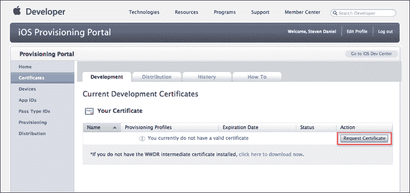

1.  点击**请求****证书**按钮，然后点击**选择文件**按钮。

1.  接下来，选择您在之前菜谱中创建的证书请求文件，完成后点击**提交**按钮。

1.  在这一点上，您应该看到证书将显示**待发行**状态。这如图所示：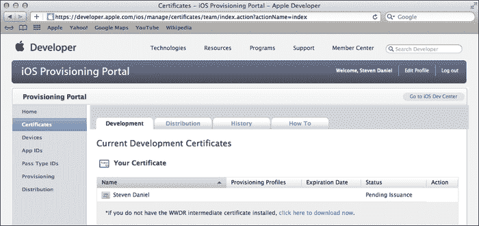

1.  几秒钟后，页面将刷新，证书将准备好，您将能够下载它。

1.  下载后，双击文件，在 Keychain Access 应用程序中安装它，如图所示：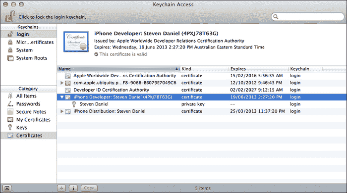

## 它是如何工作的…

在本菜谱中，我们首先从 Apple 请求开发证书，这将用于提供给我们代码签名我们的应用程序的能力，以便将我们的应用程序部署到 iOS 设备上。接下来，我们查看如何使用之前菜谱中创建的生成的证书请求文件来生成开发证书，此时证书将处于**待发行**状态，几秒钟后您的证书将可供下载。

最后，我们查看如何使用下载的证书，并使用 Keychain Access 应用程序安装它。在我们的下一个菜谱中，我们将看看如何注册 iOS 设备以用于开发和测试。

## 相关内容

+   **注册您的 iOS 设备以进行测试**菜谱

# 注册您的 iOS 设备以进行测试

在本菜谱中，我们将学习如何注册 iOS 设备，以便它可以通过使用**唯一设备标识符**（UDID）支持移动配置文件。

## 准备工作

在我们之前的菜谱基础上，我们将学习如何使用 UDID（或**通用唯一标识符**（UUID））注册 iOS 设备，以便它可以用于开发和测试。

## 如何操作…

要开始，请按照以下简单步骤操作：

1.  从`/Xcode4/Applications`文件夹中启动 Xcode。

1.  通过选择**窗口** | **组织者**打开**组织者**窗口。

1.  确保您已将您的 iOS 设备连接到 Mac。

1.  接下来，复制以下截图所示的**标识符**字段，并使用您喜欢的文本编辑器保存它。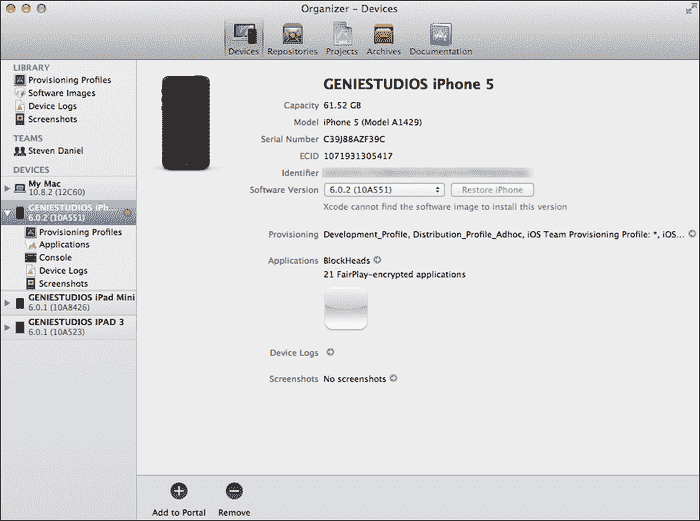

1.  点击**用于开发**选项。

1.  **用于开发**按钮选项可能并不总是可见，因为这取决于您之前是否指定了使用 iOS 设备。

1.  接下来，重新登录到**Apple iOS 开发者中心**页面，并点击页面右侧的**iOS 配置文件门户**链接。

1.  然后，从**iOS 配置文件门户**页面，点击**设备**标签页。

1.  之后，点击**管理**标签页，然后点击以下截图所示的**添加设备**按钮：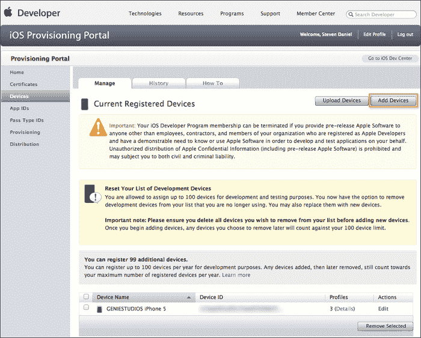

1.  接下来，为将用于测试的每个设备提供一个有意义的名称。

1.  最后，为**设备名称**和**设备 ID**的 UDID 提供值，然后点击**提交**按钮以保存更改。

## 工作原理...

在本教程中，我们探讨了注册用于开发和测试的 iOS 设备所需的步骤，这些设备将使用移动配置文件。我们了解到，为了实现这一点，您需要使用配置文件中每个设备 UDID。如果未能提供此信息，则在尝试部署应用程序时将出现错误。

在接下来的步骤中，我们继续登录到**iOS 配置文件门户**，为每个设备添加配置文件，并粘贴每个设备的 UDID 信息。点击**+**按钮可以一次性添加多个设备。点击**提交**按钮后，您将成功注册您提供的每个设备。如果您打算部署到更多设备，则需要执行相同的过程。

## 相关内容

+   **创建您的应用程序 App ID**教程

# 创建您的应用程序 App ID

在本教程中，我们将学习如何创建应用程序 App ID，以便我们可以使用这些 ID 将我们的应用程序部署到 iOS 设备上进行测试。

## 准备工作

基于我们之前的教程，我们将学习创建应用程序 App ID 所需的步骤。

## 如何操作...

首先，按照以下简单步骤操作：

1.  登录到**Apple iOS 开发者中心**页面。

1.  接下来，点击页面右侧的**iOS 配置文件门户**链接。

1.  然后，点击页面左侧的**App IDs**菜单。

1.  接下来，点击以下截图所示的**新建 App ID**按钮：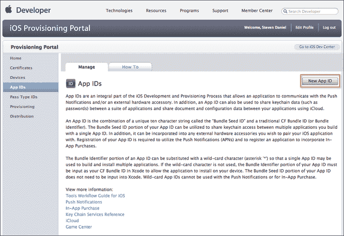

1.  接下来，提供一个描述，该描述将用于识别`CoreLocation`，因为这是您稍后将要使用的 App ID。

1.  点击**使用团队 ID**为**捆绑种子 ID（App ID 前缀）**，确保您为您的**捆绑标识符（App ID 后缀）**提供一个合适的名称。

1.  **使用团队 ID**选项可能并不总是可见的，因为这取决于您是作为个人还是公司设置的。捆绑标识符需要与您的应用程序的捆绑标识符相同。这可以指定为`12345678.com.yourcompany.yourappname`，或者可以是提交日期，即`20130512.com.yourcompany.yourappname`。

1.  最后，点击**提交**按钮。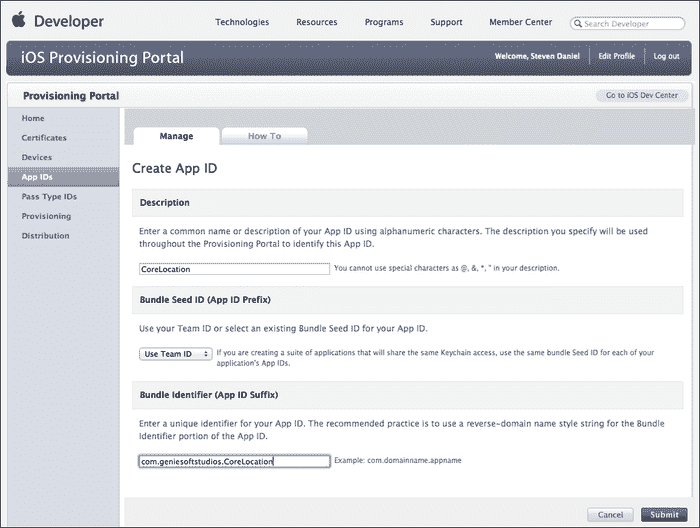

1.  在以下截图中，您现在应该看到您在上一步骤中创建的新 App ID，以及您可能之前创建的 App ID：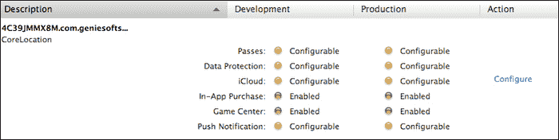

## 工作原理...

在这道菜谱中，我们探讨了创建应用程序 App ID 所需的必要步骤，这是每个 iOS 应用程序都必须包含的，并且必须包含一个唯一的应用程序 ID 来标识自己。App ID 是配置文件的一部分，用于标识一个应用程序或一系列相关应用程序。当您的应用程序与 iOS 硬件配件、Apple 推送通知服务进行通信，以及当您的应用程序之间共享数据时，都会使用 App ID。

## 相关内容

+   *创建开发配置文件*菜谱

# 创建开发配置文件

在这道菜谱中，我们将学习如何创建开发配置文件，以便应用程序可以安装到 iOS 设备上。

## 准备工作

在上一道菜谱的基础上，我们将学习创建我们的开发配置文件所需的步骤，以便在部署到 Apple App Store 之前，可以在 iOS 设备上进行测试安装。

## 如何操作...

首先，按照以下简单步骤操作：

1.  登录到**Apple iOS 开发者中心**页面。

1.  接下来，点击页面右侧的**iOS 配置文件门户**链接。

1.  点击**配置文件**选项卡，然后点击以下截图所示的**新建配置文件**按钮：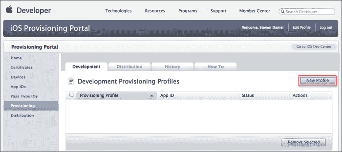

1.  接下来，将`Development_Profile`作为**配置文件名称**的值输入，确保您选择了所有希望与该配置文件关联的证书。

1.  将**App ID**的值选择为**CoreLocation**，然后检查所有您希望配置的设备，完成后点击**提交**按钮。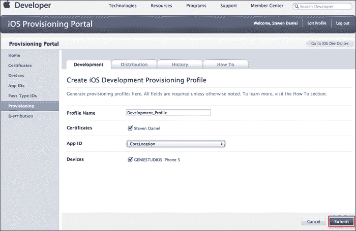

    ### 小贴士

    您可以选择通过点击**iOS 配置文件门户**中的**设备**选项卡来注册额外的设备，然后按照本章中*注册测试设备*菜谱中的步骤操作。

1.  在这一点上，配置文件将显示为**待批准**状态。几秒钟后，您应该看到状态从**待批准**变为**活动**。如果这种情况没有发生，您可能需要刷新浏览器。此时，您将能够下载您的移动配置文件。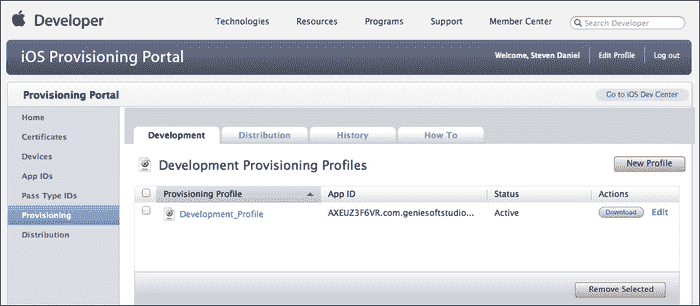

1.  点击**下载**按钮以下载您的**配置文件**。您会注意到，当您下载移动配置文件时，文件将被命名为`Development_Profile.mobileprovision`。在下一道菜谱中，我们将探讨如何使用此证书将应用程序部署到 iOS 设备上。

## 工作原理...

在这道菜谱中，我们学习了如何创建配置文件，以便您的应用程序可以安装到真实的 iOS 设备上。这使您能够指派有权在各自的设备上安装和测试应用程序的团队成员。

每当您将应用程序部署到 iOS 设备上时，它将包含每个团队成员的 iOS 开发证书，以及 UDID 和 App ID。

## 参见

+   **使用配置文件在 iOS 设备上安装应用程序**配方

# 使用配置文件在 iOS 设备上安装应用程序

在本配方中，我们将学习如何使用开发配置文件，以便应用程序可以安装到 iOS 设备上。

## 准备工作

在我们之前的配方基础上，我们将学习如何修改我们在前一章中创建的一个现有示例，以便它可以在 iOS 设备上进行测试。

## 如何操作...

首先，按照以下简单步骤操作：

1.  从`/Xcode4/Applications`文件夹中启动 Xcode。

1.  导航到**文件** | **打开**或按*Command* + *O*。

1.  选择`CoreLocation.xcodeproj`文件。

1.  接下来，点击**打开**按钮继续，并将应用程序打开到 Xcode 工作区环境中。

1.  接下来，通过导航到**窗口** | **组织者**或按*Shift* + *Command* + *2*打开**组织者**窗口。![如何操作...]

1.  此过程将使我们能够将我们在前几节中创建的移动配置文件添加到我们的项目中。

1.  然后点击**导入**按钮，选择`Development_Profile.mobileprovision`文件，并点击**打开**按钮。

1.  接下来，从**项目导航器**中选择`CoreLocation`项目。

1.  然后从**构建设置**选项卡，转到**代码签名**部分。

1.  选择**任何 iOS SDK**，并从下拉列表中选择您的证书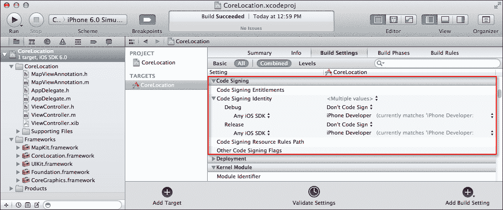

1.  您的证书将以粗体显示，您的配置文件以灰色显示。如果您没有导入有效的配置文件证书，您将无法部署或上传 iOS 应用程序到苹果 App Store。

1.  接下来，从**项目导航器**窗口中，点击您的项目，点击**目标**部分，然后点击**摘要**页面。

1.  滚动直到到达**权限**部分，并勾选**启用权限**复选框。这将向您的项目添加一个名为`CoreLocation.entitlements`的文件。

1.  当您勾选**启用权限**复选框时，Xcode 会为您创建一个`entitlements`文件（如果不存在），并添加一个密钥链访问组键值对，您需要记住它们直接绑定到您的应用程序配置文件。

1.  构建并运行您的应用程序以查看是否一切正常。您将被要求授权证书。点击**始终允许**。

## 它是如何工作的...

在这个菜谱中，我们学习了如何导入我们的开发证书的移动配置文件，然后修改我们在前一章中创建的`CoreLocation`示例应用程序，以便可以使用此配置文件将其部署到 iOS 设备。然后我们查看如何修改项目的**代码签名权限**部分，以确保**代码签名标识**字段反映了移动配置文件的详细信息。

在我们的最后几步中，我们学习了如何将`entitlements`文件添加到项目中。这是一个重要的文件，每当应用程序需要部署到 iOS 设备进行测试或部署到 Apple App Store 时都需要此文件。

## 参见

+   *使用 Xcode 4 存档和提交应用程序*的菜谱

+   第六章中的*请求 iCloud 存储权限*菜谱

# 使用 iTunes Connect 准备应用程序提交到 App Store

在这个菜谱中，我们将学习如何准备应用程序提交到 Apple App Store。

## 准备工作

在我们之前的菜谱之后，当您测试了您的应用程序以确保一切正常且无错误，并且您已设置好所有账户后，您将想要开始上传您的应用程序到 Apple App Store。

## 如何操作...

要开始，请按照以下简单步骤操作：

1.  登录**iTunes Connect**，然后点击**管理您的应用程序**选项。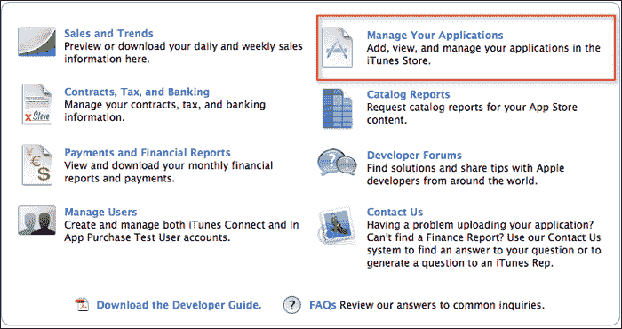

1.  接下来，点击**添加新应用**链接以开始将您的应用程序添加到 App Store。

1.  接下来，继续输入我们上传的应用程序的应用程序详细信息。

1.  点击**继续**按钮以进行下一步。**SKU 编号**是您为您的应用程序创建的唯一标识符，如下截图所示：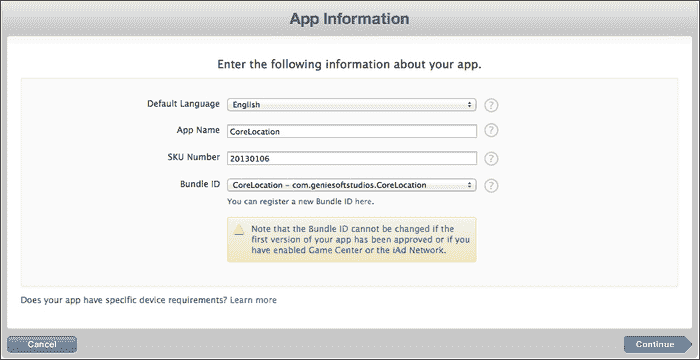

1.  在下一步中，我们将指定应用程序的**可用日期**和**价格层级**，以便在以下屏幕截图中显示时可供下载：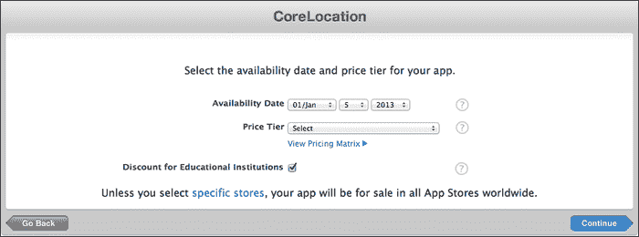

1.  有超过 87 个价格层级可供选择，包括免费销售应用程序的选项。点击**继续**按钮后，您将被引导到元数据屏幕，您需要填写有关您应用程序的信息。该屏幕上的字段及其描述如下表所示：

    | 屏幕字段 | 描述 |
    | --- | --- |
    | **版本号** | 这可以是您喜欢的任何内容。最好从`1.0`开始。 |
    | **描述** | 这是应用程序描述，最多可包含 4,000 个字符。 |
    | **主要类别** | 这些包含多达 20 个不同的类别供您选择，包括**游戏**、**娱乐**、**商业**、**书籍**等。 |
    | **Secondary Category** (optional) | 您可以从**二级类别**中进行选择。 |
    | **Keywords** | 这些关键词有助于在客户在 iTunes 中搜索应用程序时更快地返回结果。 |
    | **Copyright** | 拥有应用程序独家权利的个人或实体的名称，前面是获得权利的年份（例如，`2013 GENIESOFT STUDIOS`）。 |
    | **Contact Email Address** | 用户在应用程序出现问题时可以联系您的电子邮件地址。 |
    | **Support URL** | 一个提供您要添加的应用程序支持的 URL。此信息将在 App Store 中对客户可见。 |
    | **App URL** (optional) | 一个包含您要添加的应用程序信息的 URL。如果提供，此信息将在 App Store 中对客户可见。 |
    | **Review Notes** (optional) | 关于您的应用程序和/或您的应用内购买的附加信息。**Review Notes**不能超过 4000 字节。 |

当苹果发布 iOS 3.0 时，他们包括了一个评级方案，允许父母控制他们的孩子可以下载哪些应用程序。这是应用程序分发流程的强制区域，必须在您提交应用程序之前完成。评级方案可以在以下屏幕截图中看到：

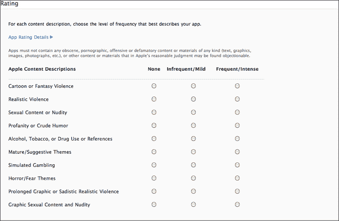

年龄限制将根据您如何对应用程序进行评级而变化。请确保您正确评级，因为苹果在内部流程中使用此信息，并审查您对应用程序的评分。

### 注意

如需了解更多关于提交您的应用程序的信息，请查看以下链接：[`developer.apple.com/library/ios/#documentation/LanguagesUtilities/Conceptual/iTunesConnect_Guide/11_EditingandUpdatingAppInformation/EditingandUpdatingAppInformation.html`](https://developer.apple.com/library/ios/#documentation/LanguagesUtilities/Conceptual/iTunesConnect_Guide/11_EditingandUpdatingAppInformation/EditingandUpdatingAppInformation.html)`#//apple_ref/doc/uid/TP40011225-CH14-SW40`。

## 工作原理...

在这个菜谱中，我们学习了准备将应用程序提交到 Apple App Store 使用 iTunes Connect 所需的步骤。我们了解到，在将您的应用程序提交给 Apple App Store 进行审批之前，您必须确保它运行正常且无问题。接下来，我们探讨了如何为在 Apple App Store 上上传的应用程序创建一个新的应用程序 ID，提供有关应用程序的详细信息，以及它何时可用。

在下一步中，我们探讨了如何指定正在上传的应用程序的定价层级，您可以从超过 87 个定价层级中进行选择，如果您需要免费销售应用程序，也提供了这一功能。

您应该为您的应用程序收取多少费用是开发者和在 App Store 上销售应用程序的公司之间一个棘手的问题。我发现许多开发者似乎采用的一种策略是，开始以 6.99 美元的价格销售他们的应用程序，然后在发布后不久，他们暂时将价格降低几美元，或者有时在有限的时间内提供 50 至 80%的折扣。

通过降低价格，这将创造一个必胜的销售，鼓励人们在限时结束前抢购，这也可以增加您在 iTunes App Store 中的应用程序的销售数量，从而使其进入前十名，甚至达到第一名。

## 更多内容...

在将您的应用程序提交给苹果 App Store 进行审核之前，最好确保您的应用程序运行正确且无错误，iOS 模拟器是一个良好的起点。尽管在模拟器中不能测试所有内容，但它是一个良好的起点。虽然您的应用程序可能在模拟器中运行得很好，但当它部署到 iOS 设备上时，问题可能仍然存在。因此，始终最好将其部署到运行最新 iOS 版本的实时 iOS 设备上。

您还可以使用 Instruments 应用程序来确保您的应用程序中没有内存泄漏，并避免您的应用程序在用户的 iOS 设备上崩溃。如果您的应用程序崩溃，它也可能阻止您的应用程序成功通过苹果的审核并在 App Store 中显示。

无论何时您想要提交您的应用程序到苹果 App Store，请记住，只有可上传的发布版本。

## 参见

+   *使用 Xcode 4 存档和提交应用程序*的菜谱

# 使用 Xcode 4 存档和提交应用程序

在本菜谱中，我们将学习如何使用 Xcode 4 集成开发环境存档应用程序，以便提交到苹果 App Store。

## 准备工作

在我们之前的菜谱中，确保我们的`CoreLocation`项目文件已打开。

## 如何操作...

首先，按照以下简单步骤操作：

1.  从项目导航器窗口中，点击您的项目，然后点击**TARGETS**部分，然后点击**Build Settings**部分。

1.  接下来，点击**Build Settings**标签，然后导航到**Build Options** | **Validate Built Product** | **Release**并将其设置为**Yes**。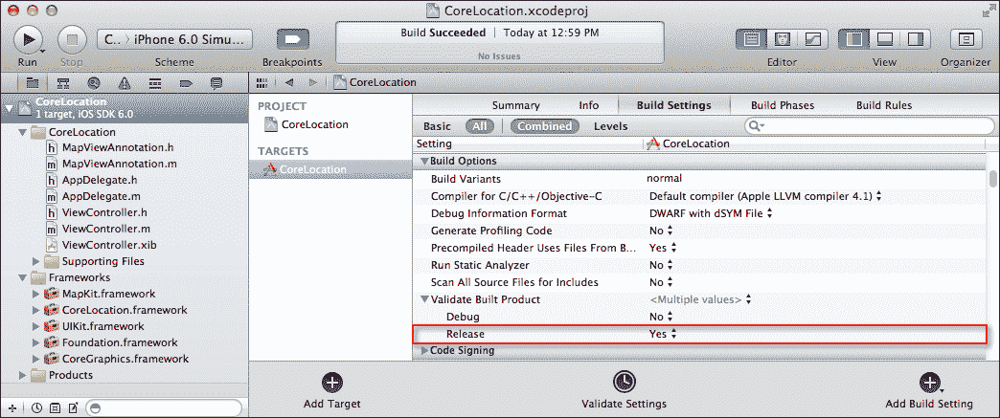

1.  导航到**Product** | **Edit Scheme…**或按*Command* + *<*键组合。

1.  接下来，确保**Destination**已设置为使用**iOS Device**，并且**Build Configuration**已设置为使用**Release**方案。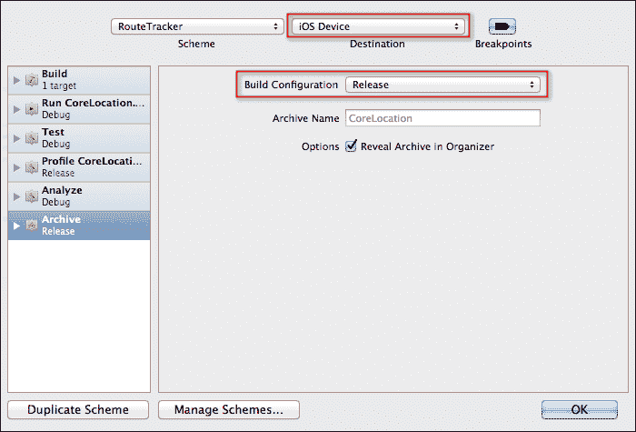

1.  从**Xcode**菜单导航到**Product** | **Archive**，它将开始创建应用程序存档，如下面的截图所示：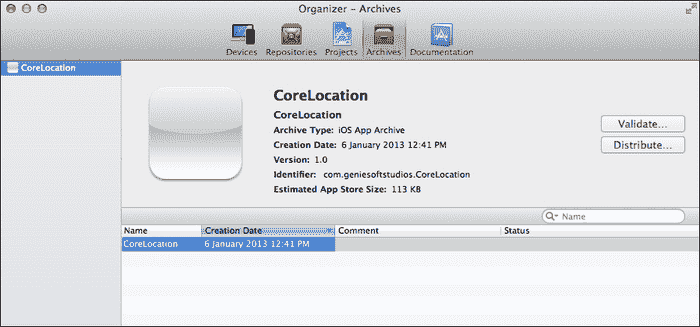

1.  点击**Validate…**按钮让 Xcode 验证你的应用程序。为了继续操作，你需要使用你的 Apple ID 登录。

1.  一旦你满足了必要的验证要求，点击**Distribute…**按钮将你的应用程序提交给 Apple。

1.  关于其他分发应用程序方式的更多信息，请查看通过 Apple Developer Connection 网站提供的链接，链接地址为[`developer.apple.com/library/ios/#documentation/ToolsLanguages/Conceptual/Xcode4UserGuide/090-Distribute_Your_App/distribute_app.html`](http://developer.apple.com/library/ios/#documentation/ToolsLanguages/Conceptual/Xcode4UserGuide/090-Distribute_Your_App/distribute_app.html)。

## 它是如何工作的...

在这个菜谱中，在存档你的应用程序之前，你需要确保目标应用程序文件是自包含的。这意味着，如果目标应用程序文件依赖于任何静态库，它将确保这些库是应用程序二进制文件的一部分，通过在构建和存档应用程序的目标的**构建设置**部分将**Validate Built Product** | **Release**设置为**Yes**。

在我们的下一步中，我们需要确保在提交应用程序到 App Store 或与他人分享之前，该方案中的存档操作已为要存档的应用程序类型设置了适当的目标；你创建一个应用程序存档，这将使你能够与其他开发者和测试者分享你的 App（IPA）或将它分发给用户。为了使你的应用程序有资格被包含在 Apple App Store 中，你必须将存档提交到 iTunes Connect。这是为了确保你的应用程序存档通过必要的 iTunes Connect 验证测试。Xcode 可以在你提交之前为你验证这一点。

## 参见

+   使用 iTunes Connect 将应用程序提交到 App Store 的菜谱
