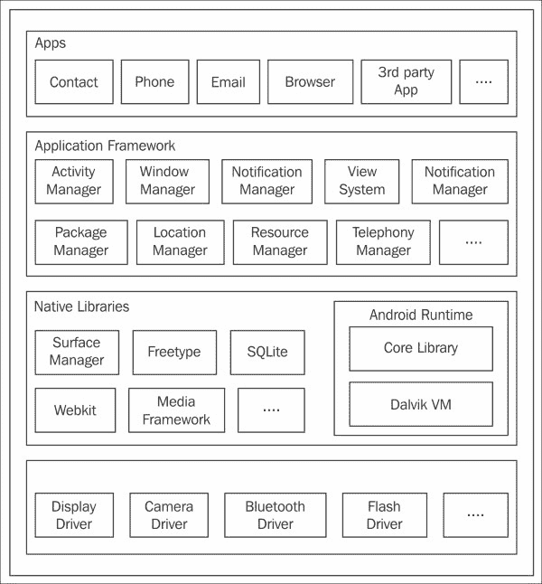
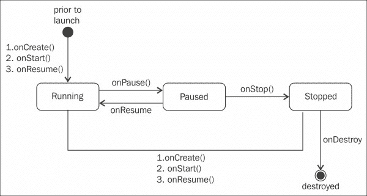
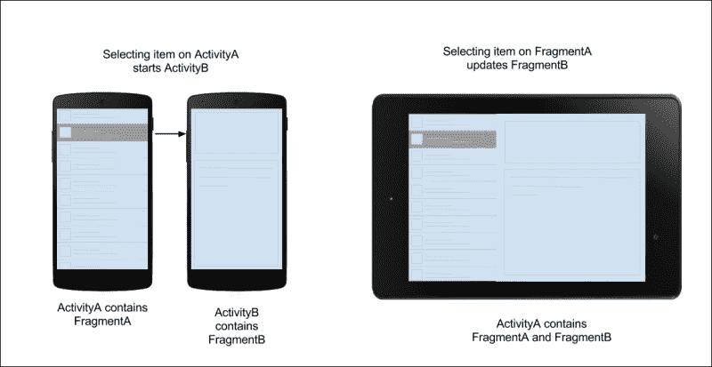
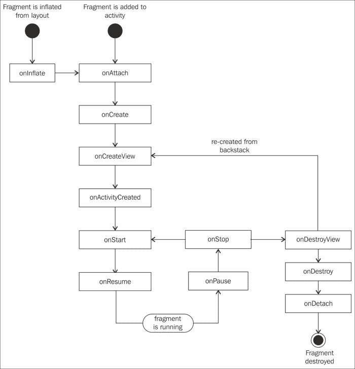
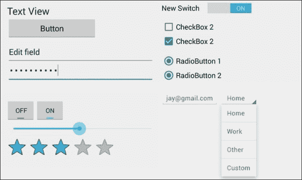
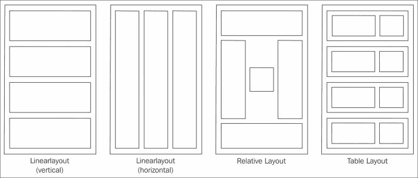
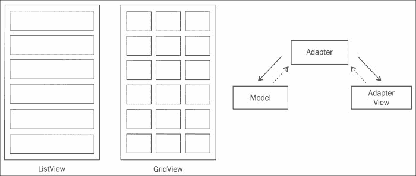

# 第一章：Android 应用程序的解剖结构

我们生活在一个技术正在发展和变得比以往任何时候都更容易获取的时代。移动计算平台的兴起将技术进化提升到了一个新的高度。手机和平板电脑正变得越来越智能，成为传统 PC 的替代品。在这个激烈竞争的移动计算世界中，从传统的 PC 制造商到小型初创公司都在竞相推出各种形态的设备。

在这本书中，我们将向您展示如何利用您现有的 C#技能来编写在 Android 设备上运行的应用程序。虽然这本书的大部分内容将专注于学习如何使用 C#和 Xamarin.Android 开发 Android 应用程序，但我们将从对 Android 的更一般性讨论开始。什么是 Android？Android 如何促进创建优秀的移动应用程序的任务？本章将通过提供以下主题的基础级理解来帮助您回答这些问题：

+   Android 平台概述

+   Android 平台版本和功能发布

+   Android 应用程序（构建块）

# Android 平台

Android 平台是近年来开发的最强大、最进化、最先进的移动操作系统之一，它提供了各种服务和功能，帮助开发者构建丰富的移动应用程序。Android 是一个由 Google 开发和维护的开源操作系统。由于其开源性质，它拥有一个更大的开发者社区和设备制造商基础。

Android 操作系统最初主要是为低功耗计算手机设计的，但后来，其基础被扩展到各种形态，包括智能手机、平板电脑、Android TV 和可穿戴设备。

## Android 版本

自 2007 年 11 月首次发布测试版以来，Android 操作系统经历了一系列频繁的更新。识别 Android 平台的版本可能会有些令人困惑；有一个版本号、API 级别和昵称，有时它们被交替使用。

版本号代表平台的发布。有时，创建一个新的发布是为了提供新的功能，而有时是为了修复错误。

API 级别是一个整数值，代表一组功能。随着 API 级别的提高，新的功能被提供给开发者。

以下表格按逆时间顺序列出了所有主要的 Android 平台发布版本：

平台版本

API 级别

发布日期

功能更新

5.1（棒棒糖）

22

03/09/2015

+   相比 Lollipop 的稳定性和性能改进。

+   添加了对多张 SIM 卡的支持。

5.0（棒棒糖）

21

11/12/2014

+   引入了新的运行时 ART，取代了 Dalvik。

+   完全的 UI 重设计和材料设计的介绍。

+   改进了锁屏通知。

+   更新了媒体 API，以实现更好的相机捕获和媒体播放。

+   添加了 Volta 项目以增加电池寿命。

4.4W, 4.4W.1, 4.4W.2 (奇巧可穿戴)

20

06/25/2014

+   Android Wear 平台智能手表的初始发布。

+   同一 Android 4.4 奇巧代码分支的分支，增加了可穿戴扩展。

4.4.x (奇巧)

19

10/31/2013

+   默认界面改为白色而不是蓝色。

+   添加了无线打印功能。

+   支持半透明导航栏和状态栏。

+   允许应用程序使用沉浸模式，在隐藏导航栏和状态栏的同时保持用户交互。

+   动作溢出菜单按钮始终可见，即使对于具有硬件菜单键的设备也是如此。

+   新的 UI 转换框架（属性动画）。

+   内置屏幕录制功能。

+   引入了新的实验性运行时环境 **Android Runtime**（**ART**）。

+   其他安全增强和错误修复。

4.3.x (蜂巢豆)

18

07/24/2013

+   支持新用户配置文件的受限访问模式。

+   引入了 Khronos OpenGL ES 3.0 的平台支持，为 2D 和 3D 图形渲染提供了更好的性能。

+   支持蓝牙低功耗。

+   优化了位置和传感器功能，包括硬件地理围栏优化。

+   许多安全增强、性能增强和错误修复。

4.2, 4.2.2 (蜂巢豆)

17

11/13/2012

+   改进了硬件加速的 2D 渲染器，使动画更平滑。

+   引入了名为 Daydream 的交互式屏保模式。

+   添加了演示窗口和外部显示支持。

+   完全支持从右到左（**RTL**）布局。

+   数量众多的错误修复。

4.1, 4.1.x (蜂巢豆)

16

07/09/2012

+   界面更快更平滑。

+   双向文本和其他语言支持。

+   引入了可展开的通知。

+   通过 `ActivityOptions` 添加了新的活动启动动画。

+   改进了 `WebView` 以提供更好的 HTML5 视频观看和画布动画。

4.0.3, 4.0.4 (冰淇淋三明治)

15

12/16/2011

+   错误修复和稳定性改进。

+   新的 API，包括联系人提供者的社交流 API。

+   相机性能更好。

+   屏幕旋转更平滑。

4.0, 4.0.1, 4.0.2 (冰淇淋三明治)

14

10/19/2011

+   使用新的 Roboto 字体家族进行了主要界面重整。

+   统一了 UI 框架，使其适用于手机、平板电脑等。

+   改进了锁屏，能够从锁屏访问应用程序。

+   引入了新的语音输入引擎。

+   改进了媒体流传输能力。

+   可以通过滑动从最近应用列表中关闭应用程序。

+   UI 的硬件加速。

3.2.x (蜂巢)

13

07/15/2011

+   为更广泛的平板电脑进行了优化。

+   添加了系统级同步功能，使 SD 卡文件可通过系统媒体存储对应用程序可用。

+   错误修复和其他小改进。

3.1 (蜂巢)

12

05/10/2011

+   USB 配件连接 API。

+   更新了各种 UI 框架。

+   可调整大小的主屏幕应用程序小部件。

+   支持每个连接的 Wi-Fi 接入点的 HTTP 代理。

+   高性能 Wi-Fi 锁定，在设备屏幕关闭时保持高性能 Wi-Fi 连接。

+   更新了动画框架类，增加了`ViewPropertyAnimator`和背景颜色动画。

3.0（蜂巢）

11

02/22/2011

+   添加了新的用户界面，优化了平板电脑。

+   引入了一个操作栏，可在屏幕顶部访问上下文快速操作。

+   添加了片段，一个可以嵌入到活动中的自包含容器。它有自己的生命周期回调，用于设计平板电脑。

+   添加了系统级剪贴板。

+   改进了状态栏通知以支持更多内容丰富的通知。

+   添加了新的动画框架。

2.3.3、2.3.7（姜饼）

10

02/02/2011

+   改进和错误修复。

2.3、2.3.1、2.3.2（姜饼）

9

12/06/2010

+   更新了用户界面设计，以实现简洁和快速。

+   增加了支持**近场通信**（**NFC**）。

+   支持更大的屏幕尺寸和分辨率。

+   原生支持更多传感器，包括陀螺仪和气压计。

+   引入了并发垃圾回收，以改善应用程序响应性和更平滑的动画。

2.2.x（冻酸奶）

8

05/20/2010

+   改进了速度、内存和性能优化。

+   使用即时编译技术提高应用程序速度。

+   支持 Android 云到设备消息服务（**C2DM**）。

+   支持将应用程序安装到 SD 卡内存。

+   USB 网络共享和 Wi-Fi 热点功能。

+   错误修复和安全补丁更新。

2.1（clair）

7

01/12/2010

+   进行了小的 API 更改和错误修复。

2.0.1（clair）

6

12/03/2009

+   进行了小的 API 更改和错误修复。

2.0（甜甜圈）

5

10/26/2009

+   更新了相机功能，包括闪光灯、数码变焦、白平衡、色彩效果和场景模式。

+   优化硬件速度和用户界面全面升级。

+   `MotionEvent`类增强以跟踪多点触摸事件。

+   扩展账户同步功能，允许用户将多个账户添加到设备中。

1.6（甜甜圈）

4

09/15/2009

+   添加了多语言语音合成引擎，用于将文本转换为语音。

+   更新了对 CDMA/EVDO、802.1x、VPN 技术支持。

1.5（纸杯蛋糕）

3

04/27/2009

+   添加了带有文本预测和用户词典的第三方键盘支持。

+   支持 MPEG-4 和 3GP 格式的视频录制和播放。

+   在网页浏览器中添加了复制和粘贴功能。

+   动画屏幕转换。

+   支持主屏幕小部件。

1.1

2

02/09/2009

+   首次 Android 平台更新。

+   更新了地图应用程序。

+   在使用免提电话时，通话屏幕超时默认值现在更长。

+   添加了对从 MMS 保存附件的支持。

+   在布局中添加了对滚动公告的支持。

+   修复了各种错误。

1.0

1

09/23/2008

+   首个 Android 平台的商业版本。

+   包含了如 Android 市场、Gmail、相机、日历、联系人、Google Talk、地图、媒体播放器、图片、设置和浏览器等应用程序。

+   支持 Wi-Fi 和蓝牙。

+   支持即时通讯、短信和 MMS。

Android 平台由应用程序、操作系统、运行时、中间件、服务和库组成。以下图表提供了一个高级视图，说明了 Android 平台中每一层的组织方式，接下来的部分提供了每个主要组件的简要描述：



## Linux 内核

Android 是一个基于 Linux 的操作系统，主要设计和定制用于移动设备，如智能手机和平板电脑。位于 Android 堆栈的底部，Linux 内核为设备硬件和 Android 软件层之间提供了接口。Android 的最新版本基于 Linux 内核版本 3.4 或更高（Android 4.0 之前的版本为 2.6）。

Linux 内核提供了一些核心系统服务，如内存管理、进程和任务管理、电源管理、网络堆栈以及各种设备驱动程序，以与设备硬件交互。

## 本地库

Android 提供了一套用 C/C++编写的本地库，提供各种类型的服务。这些库主要来自开源社区。

## Android 运行时

Android 应用在**Dalvik 虚拟机（Dalvik VM**）中运行，类似于 Java VM，但已针对内存和处理能力有限的设备进行了优化。

Android 应用最初使用 Java 编译器编译成 Java 字节码，但它们有一个额外的编译步骤，使用称为**即时编译（JIT**）的过程将 Java 字节码转换为 Dalvik 字节码。JIT 编译器产生的输出适合在 Dalvik VM 中运行：


Dalvik 与 Android 核心库一起提供。这些库并不与特定的 Java 平台（JSE、JEE 或 JME）对齐，而更像是与 JSE 最接近的混合平台，但不包括以用户界面为中心的组件 AWT 和 Swing。**Android 应用框架（AAF**）提供了一种创建用户界面的替代方法。

虽然 Dalvik 运行得相当不错，但缺点是每次应用启动时都会有一个巨大的延迟。这就是新虚拟机 ART 出现的地方。

ART 是 Dalvik 的前身。它是 Android 4.4（KitKat）中引入的新应用运行时，作为新的实验性运行环境，并在 Android 5.0（Lollipop）中得到完全实现。这主要是为了性能和改进的应用启动时间。ART 与 Dalvik 的主要区别在于编译方法。虽然 Dalvik 使用 JIT，但 ART 采用了一种称为**即时编译（AOT**）的新概念。这意味着新应用在安装期间被编译，甚至在它们启动之前。要了解更多关于 ART 的信息，您可以参考[`source.android.com/devices/tech/dalvik/`](https://source.android.com/devices/tech/dalvik/)。

# 应用框架

应用程序框架是 Android 平台的一部分，这是开发者最熟悉的部分。它作为一组 Java 库提供，允许你构建用户界面，与设备功能（如相机或位置服务）交互，加载和处理各种类型的应用程序资源，并执行许多其他有用任务。以下是一些主要服务：

+   **活动管理器**: 该服务负责活动生命周期、状态管理和控制活动堆栈。稍后，在本章中，我们将了解更多关于活动生命周期的内容。

+   **窗口管理器**: 该服务负责管理屏幕的 z 顺序列表。每个活动都附加到一个窗口上，用于在屏幕上显示内容，该窗口由`WindowManager`控制。

+   **内容提供者**: 这提供了一个接口，用于在应用程序之间发布和共享数据。

+   **视图系统**: 这提供了一套 UI 控件来构建应用程序用户界面。

+   **通知管理器**: 该服务管理应用程序警报和通知。

+   **资源管理器**: 该服务提供对资源（如用户界面布局、字符串、颜色、尺寸等）的访问。

+   **包管理器**: 这包含设备上所有已安装应用程序的元数据。

+   **电话管理器**: 这为应用程序提供有关设备上可用的电话服务的信息，例如状态和订阅者信息。

+   **位置管理器**: 这提供了对系统位置服务的访问。

## 应用程序层

在堆栈的顶部是谦逊的应用程序，这是实际向用户交付价值的组件。Android 自带一系列提供基本功能的应用程序，例如管理联系人、使用电话、检查电子邮件和浏览网页。Android 成功的关键是庞大的第三方应用程序库，用户可以通过安装这些应用程序来完成各种事情，例如直播体育赛事、编辑手机上捕获的电影、通过他们最喜欢的社交媒体网站与朋友互动，等等。

# Android 应用程序的构建块

现在，让我们花些时间讨论应用程序——那些我们编写并提供给用户价值的东西。Android 应用程序由各种类型的类和资源组成。以下各节描述了应用程序可以由哪些不同的构建块组成。

## Android 包（.apk）

应用程序以 Android 包格式交付安装。Android 包是在编译 Android 应用程序的结果中创建的，是一个具有`.apk`扩展名的存档文件。

Android 包包含运行单个应用程序所需的全部代码和支持文件，包括以下内容：

+   Dalvik 可执行文件（.dex 文件）

+   资源

+   原生库

+   应用程序清单

安卓包可以直接通过电子邮件、URL 或内存卡安装。它们也可以通过应用商店（如 Google Play）间接安装。

## 应用程序清单

所有安卓应用程序都有一个清单文件（`AndroidManifest.xml`），它告诉安卓平台运行应用程序所需知道的一切，包括以下内容：

+   应用程序所需的最低 API 级别

+   应用程序使用或要求的硬件/软件功能

+   应用程序所需的权限，如位置或摄像头

+   当应用程序启动时，要开始的初始屏幕（安卓活动）

+   在外部存储中安装应用程序的能力

+   应用程序所需的库（除 AAF 外）等

## 活动

安卓应用中最基本的组成部分之一是活动。活动代表一个用户界面屏幕，用户可以通过它与应用程序进行交互。一个应用程序由许多活动组成。例如，电话簿应用程序可以包含多个活动，代表不同的功能，如列出联系人、添加联系人、捕捉联系人照片等。

用户通过一个或多个视图与活动交互，这些视图将在本章后面进行描述。如果您熟悉**模型-视图-控制器**（**MVC**）模式，您会注意到活动扮演了控制器的角色。

### 活动的生命周期

活动具有一个定义良好的生命周期，可以用状态、转换和事件来描述。以下图表提供了活动生命周期的图形视图：



上图中描述的状态是派生的，这意味着活动上没有明确标识这些状态的`State`变量，但状态是隐含的，并且对讨论很有用。以下表格描述了活动基于其状态的行为：

状态

描述

`运行中`

活动已被创建和初始化，对用户可见并可交互。

`暂停`

活动视图被另一个活动部分遮挡。

`已停止`

活动对用户不再可见。活动尚未被销毁，状态被保留，但被放置在后台，不允许进行任何处理。

### 活动的各种事件

在状态之间的转换过程中，会在活动上调用一系列事件。这些事件为开发者提供了各种类型处理的平台。以下表格描述了不同的回调事件以及通常在每个回调期间在应用程序中执行的处理：

事件

被调用

典型处理

`onCreate`

当活动被创建时，通常是从用户选择启动应用程序开始的

+   这创建了视图

+   这初始化了变量

+   这分配了长期资源

`onStart`

在`onCreate`之后，在活动对用户可见之前

+   这会分配资源

`onResume`

在活动准备好与用户交互以及`onStart`回调之后立即

+   这会初始化用于查看的 UI 小部件

+   这会启动动画或视频

+   这会开始监听 GPS 更新

`onPause`

当一个活动的视图部分被遮挡且不是输入焦点时

+   这会提交未保存的更新

+   这会暂停动画或视频

+   这会停止监听 GPS 更新

`onStop`

当活动的视图对用户不再可见时

+   这会释放资源

`onRestart`

活动正在回到前台，通常是因为用户选择了返回按钮

+   这会分配资源

`onDestroy`

在活动被销毁之前

+   这会清理活动可能分配的资源

对于开发者和 Android 新手来说，框架处理设备方向变化的方式可能并不明显。默认情况下，当设备方向从纵向变为横向时，Android 会销毁并重新创建现有活动，以确保使用最适合当前设备方向的布局。

如果需要，此行为可以被覆盖，活动可以被保留。我们将在第六章“使您的应用方向感知”中讨论处理与此主题相关的状态和其他处理问题的特殊考虑。

## 片段

片段是一个可重用的用户界面组件，自 Android 3.0（API 级别 11）以来引入，主要用于构建适用于不同屏幕尺寸的动态和模块化用户界面。片段始终嵌入在活动中，并且像任何其他视图一样，它存在于视图层次结构中的`ViewGroup`（**ViewGroups**将在本章后面详细解释）中。像活动一样，片段定义自己的布局并有自己的生命周期回调。在设计支持多种形态的应用程序时，可以通过重用片段来优化基于可用屏幕空间的用户体验。

让我们通过以下示例来考察如何使用片段来开发模块化用户界面。

下图展示了新闻阅读器应用的线框图，该应用旨在在智能手机和平板设备上运行。由于平板电脑有更多的屏幕空间，新闻列表和详情以分割视图的形式在一个活动中呈现，而手机则使用两个不同的活动来处理此功能：



安卓智能手机使用两个活动：包含**FragmentA**的**ActivityA**用于显示新闻列表，包含**FragmentB**的**ActivityB**用于显示所选新闻的详情。在平板电脑上，我们有一个包含**FragmentA**和**FragmentB**的单个活动**ActivityA**。

正如你所看到的，**FragmentA**和**FragmentB**是相同的实现，并在不同的布局配置中被重用来在手机和平板电脑上提供不同的用户体验。

### 片段生命周期

与活动生命周期不同，理解片段生命周期可能有点棘手。在下一节中，我们将更深入地探讨片段的行为及其生命周期方法。

Android 片段有自己的生命周期方法，这与活动非常相似。它包含所有活动生命周期方法，并提供了额外的回调方法。片段始终嵌入在活动中，因此其回调直接受到宿主活动生命周期的直接影响。例如，如果宿主活动收到`onStop()`，所有附加的片段也会收到`onStop()`回调。

下面的图提供了片段生命周期的图形视图：



让我们看看每个被调用的片段生命周期事件：

+   `onInflate`: 仅当我们直接在活动布局中使用`fragment`标签定义片段，并且活动的内容视图正在填充时（通常在活动上调用`setContentView()`时），会调用此事件。此方法传递包含所有从`fragment`标签传递的片段属性的`AttributeSet`。这些属性可以存储以供以后使用。在这个阶段，片段甚至还没有与活动关联，因此我们无法执行任何与用户界面相关的任务。

+   `onAttach`: 当片段实例与活动关联时，会调用此方法。

+   `onCreate`: 在`onAttach`之后和`onCreateView`之前调用此事件；当片段实例被创建或重新创建时。在这个时候，持有此片段的基活动正处于创建过程中。在这个时候，你可以使用后台线程为片段获取数据。

+   `onCreateView`: 在这个阶段，片段实例化其用户界面并加载它包含的视图对象层次结构。此方法传递三个参数：`LayoutInflater`、`ViewGroup`和`bundle`。`LayoutInflater`参数可用于为片段填充任何布局。`bundle`指定片段是全新创建还是重新创建。如果是从之前的保存状态重新创建，则该 bundle 将非空。

+   `onActivityCreated`: 当包含片段的活动被创建，并且片段的视图层次结构被实例化时，会调用此方法。在这个时候，你可以使用`findViewById()`方法通过 ID 访问视图，并在它对用户可见之前进行任何更改。

+   `onStart`: 此方法与活动的`onStart()`回调相关联，当片段对用户可见时被调用。在这个时候，片段是可见的，但尚未准备好与用户交互。

+   `onResume`: 在片段准备好开始与用户交互之前调用此方法。在这个时候，片段被认为是正在运行，用户可以自由地对应用执行任何操作。

+   `onPause`: 此方法与活动的`onPause()`回调相关联，并在片段被移出前台时调用。

+   `onStop`: 此方法与活动的`onStop()`回调相关联，并在片段不可见时被调用。

+   `onDestroyView`: 此方法通知片段由`onCreateView()`创建的视图现在已从片段中分离。此回调在`onStop()`之后和`onDestroy()`方法之前被调用。

+   `onDestroy`: 当片段不再使用时，会调用此方法。此方法在`onStop()`之后和`onDetach()`之前被调用。

+   `onDetach`: 在`onDestroy()`之后调用此方法，并且当片段不再附加到活动上时。

## 服务

服务是运行在后台的应用组件，用于执行长时间运行的操作，且没有直接访问用户界面的权限。一个典型的长时间运行的任务可以是定期从互联网下载数据、在数据库中持久化多个记录、执行文件 I/O、获取电话联系人列表等。这些长时间运行的任务可以通过服务实现，以提供平滑的用户体验，允许用户在后台处理长时间运行的任务时与其他活动交互。

## 内容提供者

内容提供者管理对中央数据存储库（如联系人）的访问。它为你提供了一个标准接口，其他应用程序可以通过该接口访问和管理数据存储库。

## 广播接收器

广播接收器是响应系统级广播执行某些类型处理的组件。广播通常由系统为低电量、拍照或开启蓝牙等事件启动。应用程序也可以选择发送广播；当数据（如联系人）更新时，内容提供者可能会发送广播。虽然广播接收器没有用户界面，但它们可能会间接导致状态更新。

## 视图和 ViewGroup

在 Android 应用中，你所看到的一切都是视图；按钮、标签、文本框和单选按钮都是视图的例子。视图通过各种类型的 ViewGroup 组织成层次结构。ViewGroup 是一种特殊的视图，用于在屏幕上排列（布局）其他视图。

## 声明式与程序式视图创建

视图和 ViewGroup 可以使用两种不同的方法创建：程序式或声明式。当使用程序式方法时，开发者通过 API 调用创建和定位屏幕上的每个单独的视图。当使用声明式方法时，开发者创建 XML 布局文件，指定视图应该如何排列。声明式方法具有以下优点：

+   它提供了更好的应用视觉设计和处理逻辑之间的分离

+   它允许创建多个布局以支持单个代码库支持多个设备或设备配置

+   开发工具，如 Android Studio 和 Eclipse 及 Xamarin Studio 的 Android 插件，Android 设计师，允许您在构建用户界面时查看它，无需在每次更改后编译和执行应用程序

虽然大多数开发者更喜欢声明性方法创建 View；在实践中，通常需要程序性和声明性方法的某种组合。

## 用户界面小部件

Android 提供了一套全面的用户界面小部件，可用于构建丰富的用户体验。所有这些小部件都是 View 的子类型，可以使用各种类型的 ViewGroups 组织成复杂的布局。所有用户界面小部件都可以在应用程序框架中的`android.widget`包中找到。

以下截图展示了 Android 中的一些基本小部件：



## 常见布局

应用程序框架有几个`ViewGroup`的子类，每个子类都提供了一种独特且有用的组织内容的方式：



以下图表示例展示了 Android 中的一些常见布局管理器。布局管理器是作为容器来托管子视图或布局的`ViewGroup`类。每个标准布局管理器都提供了一种特定的策略来管理其子的大小和位置。例如，`LinearLayout`类将其子元素水平或垂直排列，一个视图紧邻另一个视图。

以下表格列出了 Android 中可用的不同类型的布局管理器：

布局

描述

场景

线性布局

此布局将子元素组织成单个水平或垂直行，并在需要时创建滚动条。

当小部件的位置水平或垂直流动时使用此布局。

相对布局

此布局将子对象相对于彼此或相对于父对象进行组织。

当小部件的位置最好描述为相对于另一个小部件（在左侧）或父级的边界区域（右侧，居中）时使用此布局。

表格布局

此组织将其子元素排列成行和列。

当小部件的位置自然适合于行和列时使用此布局。当需要多个列的输入和标签时，这非常出色。

对于复杂的布局场景，Android 允许嵌套布局。深度嵌套的布局可能会影响性能，如果可能的话应避免。

### 小贴士

**下载示例代码**

您可以从[`www.packtpub.com`](http://www.packtpub.com)下载您购买的所有 Packt Publishing 书籍的示例代码文件。如果您在其他地方购买了此书，您可以访问[`www.packtpub.com/support`](http://www.packtpub.com/support)并注册以将文件直接通过电子邮件发送给您。

## 适配器布局

对于由动态数据源驱动的布局，应用程序框架有一组从`AdapterView`派生的类：



上述图示描述了两种最常见的适配器布局：

+   **ListView**：这将从数据源组织内容到一个可滚动的单列列表中

+   **GridView**：这将从数据源组织内容到一个列和行的网格中

## XML 布局文件

要使用声明性方法创建 UI，Android 提供了一个带有标签的 XML 词汇表，这些标签定义了可以组成视图的各种类型元素。Android XML 布局文件背后的概念与 HTML 标签用于定义网页或 Microsoft 的 XAML 标签用于定义**Windows Presentation Foundation**（**WPF**）用户界面的方式非常相似。以下示例展示了使用线性布局的简单视图，其中包含搜索输入字段和搜索按钮：

```java
&lt;?xml version="1.0" encoding="utf-8"?&gt;
&lt;LinearLayout xmlns:android="http://schemas.android.com/apk
/res/android"
  android:orientation="vertical"
  android:layout_width="fill_parent"
  android:layout_height="fill_parent"&gt;
   &lt;TextView
    android:text="Enter Search Criteria"
    android:layout_width="fill_parent"
    android:layout_height="wrap_content"
    android:id="@+id/searchCriteriaTextView" /&gt;
     &lt;Button
      android:text="Search"
      android:layout_width="fill_parent"
      android:layout_height="wrap_content"
      android:id="@+id/searchButton" /&gt;
&lt;/LinearLayout&gt;
```

### 元素和属性名称

已经注意将 XML 词汇表中的元素和属性名称与应用程序框架中的类和方法名称对齐。在前面的示例中，元素名称`LinearLayout`、`TextView`和`Button`对应于应用程序框架中的类名称。同样，在`Button`元素中，`android:text`属性对应于类的`setText()`设置器。

### 视图和布局标识符

每个视图都可以与一个唯一的整数 ID 相关联，并可用于在应用程序代码中引用视图。在 XML 文件中，ID 被指定为一个用户友好的文本名称。例如，考虑以下代码行：

```java
android:id="@+id/searchButton"
```

在此示例中，`@`运算符告诉解析器将字符串的其余部分视为 ID 资源；`+`符号告诉解析器这是一个新的资源名称，应该添加到资源文件`R.java`中。资源文件定义了可以用于引用资源的整数常量。

## 在活动中使用 XML 布局

XML 布局可以在应用程序运行时轻松加载。这项任务通常是在活动的`onCreate()`方法中使用`setContentView()`方法来执行的。例如，考虑以下代码行：

```java
setContentView(R.layout.main);
```

## 意图

意图是消息，可以发送到 Android 应用程序中的各种类型组件，以请求执行某种类型的操作。意图可以用于完成以下任何一项：

+   启动一个活动，并可选择接收结果

+   启动或停止服务

+   通知组件条件，例如低电量或时区更改

+   从另一个应用程序请求操作，例如请求地图应用程序显示位置或请求相机应用程序拍照并保存

## 资源

创建 Android 应用程序不仅仅是编写代码。一个丰富的移动应用程序需要诸如图像、音频文件、动画、菜单和样式等元素，仅举几例。应用程序框架提供了可以用于加载和利用各种类型资源的 API。

## R.java 文件

资源通常通过在应用程序中使用一个整数常量来引用，该常量在资源被添加到项目并编译时自动分配。这些常量放置在一个名为`R.java`的 Java 源文件中。以下示例展示了来自一个简单应用程序的`R.java`类：

```java
public final class R {
  public static final class attr {
  }
  public static final class drawable {
    public static final int icon=0x7f020000;
  }
  public static final class id {
    public static final int myButton=0x7f050000;
    public static final int searchButton=0x7f050002;
    public static final int searchCriteriaTextView=0x7f050001;
  }
  public static final class layout {
    public static final int main=0x7f030000;
    public static final int search=0x7f030001;
  }
  public static final class string {
    public static final int app_name=0x7f040001;
    public static final int hello=0x7f040000;
  }
}
```

# 摘要

在本章中，我们提供了一个简洁且充分的介绍，包括 Android 平台及其 Android 应用程序构建块。我们还了解了 Android 平台是如何随着每个平台版本的发布而不断进化，并增加了丰富的功能。

在下一章中，我们将关注 Xamarin.Android 及其提供的功能，这些功能允许使用.NET 和 C#进行 Android 开发。
