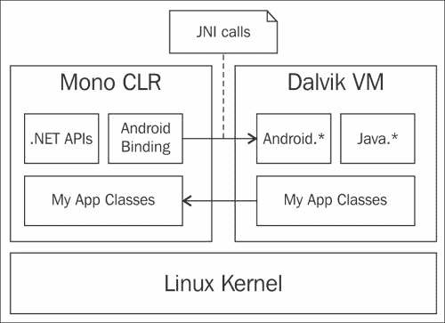
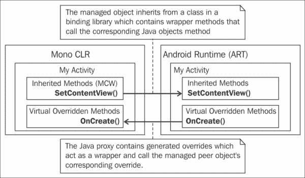
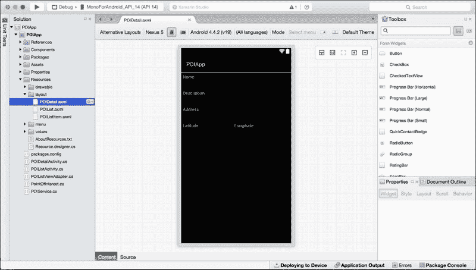
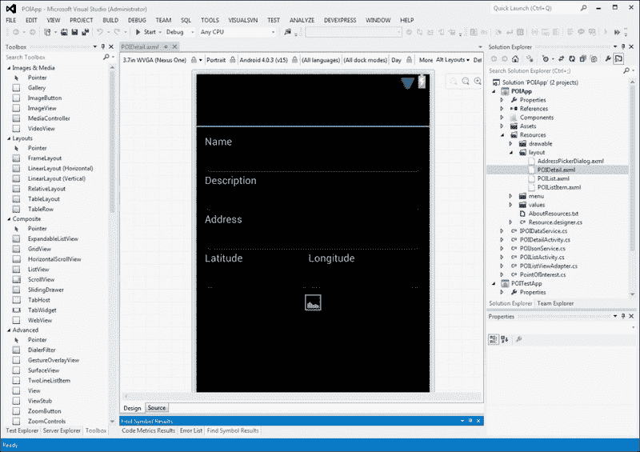

# 第二章：Xamarin.Android 架构

现在我们已经了解了 Android 平台，让我们来谈谈 Xamarin。在本章中，我们将探讨 Xamarin.Android 的架构以及它是如何促进使用 C#和.NET 开发 Android 应用程序的。本章涵盖了以下主题：

+   采用 Xamarin.Android 的优缺点

+   什么是 Mono？

+   Mono 和 Android 运行时并排（对等对象）

+   Xamarin.Android 绑定库

+   开发 IDE 选择

# 开始使用 Xamarin

Xamarin 是一家位于加利福尼亚州旧金山的软件公司，它提供商业软件开发工具，利用 Mono 开源项目，以便你能够使用 C#和.NET 框架为 Android、iOS 和 Mac 开发应用程序。

Xamarin 通过一系列产品简化了跨平台方式下的移动应用程序开发。以下是一些 Xamarin 提供的产品：

+   **Xamarin 平台**: Xamarin 使用.NET 框架的开源实现，称为 Mono。Xamarin 框架实现包括其自己的用 C#编写的编译器和.NET 库。Xamarin 平台包括以下产品：

    +   **Xamarin.iOS**: 这也被称为 MonoTouch。这是用于使用 C#和.NET 构建原生 iOS 应用程序的。

    +   **Xamarin.Android**: 这也被称为 Mono for Android 或正式称为 MonoDroid。这是用于使用 C#和.NET 构建原生 Android 应用程序的。

    +   **Xamarin.Forms**: 在 Xamarin.Android 和 Xamarin.iOS 中，我们无法构建纯跨平台应用程序。应用程序中平台无关的部分可以隔离并跨平台重用；然而，你仍然需要编写特定于平台的代码来设计应用程序的界面。这就是 Xamarin.Forms 的用武之地。Xamarin.Forms 允许你编写可以编译为 iPhone、Android 和 Windows Phone 的用户界面代码。

    +   **Xamarin.Mac**: 这也被称为 Mac 上的 Mono。Xamarin.Mac 允许你使用 C#和.NET 开发完全本地的 Mac 应用程序。

    +   **Xamarin.Windows**: 这也被称为 Windows 上的 Mono。Xamarin.Windows 允许你使用 C#和.NET 开发完全的 Windows 应用程序。

    我们将在本书中使用 Xamarin.Android 来开发 Android 应用程序。

+   **开发 IDE**：除了框架之外，它还带来了所需的开发 IDE，例如 Xamarin Studio 和 Visual Studio 插件。Xamarin Studio 是一个完全集成的 IDE，与 Xamarin 包一起使用非常方便。Xamarin Studio 适用于 Windows 和 Mac 操作系统。Xamarin Studio 包括一些丰富的功能，包括代码补全、调试界面、Android 布局构建器和与 Xcode Interface Builder 的集成，用于 iOS 应用设计。然而，如果你熟悉 Visual Studio，你可以通过 Visual Studio 支持插件继续从前面提到的几乎所有好处中获益。

+   **Xamarin Test Cloud**：移动应用测试相当具有挑战性，因为我们必须考虑各种形态、设备密度、连接类型和不同的操作系统版本。在所有目标设备上测试您的应用程序几乎是不可能的。Xamarin Test Cloud 是解决这个问题的答案。Xamarin Test Cloud 使得在来自世界各地的真实设备集合上测试用任何语言编写的移动应用成为可能。您可以使用 Xamarin 测试框架编写测试脚本，并通过 CI 系统自动化您的应用测试。

# 为什么选择 Xamarin.Android？

在我们深入探讨 Xamarin.Android 的架构之前，让我们首先讨论一下为什么 Xamarin.Android 是我们的选择。像任何重大的平台决策一样，没有一种解决方案适合所有人，有许多事情需要考虑。以下两个列表列出了使用 Xamarin.Android 的一些关键优点和缺点。

## 使用 Xamarin.Android 的好处

+   **它利用现有的 C#和.NET 技能**：开发者投入了大量的时间和精力来掌握 C#语言的众多特性和.NET 框架的有效使用。是的，Java 和所有面向对象的语言有很多相似之处，但从 C#和.NET 的熟练程度过渡到 Java，确实存在一定的成本。那些在 C#和.NET 上投入了大量资金并需要开发 Android 应用的个人和团体，至少应该考虑 Xamarin.Android。

+   **它可以在跨平台开发中重用**：虽然 Xamarin 不会让您构建一个可以部署到 Android、iOS 和 Windows 的单个应用程序，但它确实赋予了您在所有这些平台上重用代码库大部分的能力。一般来说，用户界面代码和处理设备功能的代码通常是针对每个平台编写的，而像服务客户端逻辑、客户端验证、数据缓存和客户端数据存储这样的东西则可能被跨多个平台共享。这可以节省大量的时间和成本。

## 使用 Xamarin.Android 的缺点

+   **许可要求**：Xamarin.Android 以及 Xamarin.iOS 和 Xamarin.Mac 都是商业工具，必须获得许可，因此存在实际的入门成本。请访问 Xamarin 网站，了解当前定价。

+   **等待更新**：Android 平台的新版本与相应的 Xamarin.Android 版本之间存在一些滞后时间。然而，Xamarin 正在努力实现针对 Android 和 iOS 新版本的无缝支持。

+   **分发大小**：Xamarin.Android 应用程序必须与一些运行时库一起分发。我们将在最后一章讨论实际大小以及最小化分发大小的策略。

虽然缺点列表可能看起来很庞大；但在大多数情况下，每个缺点的影响都可以最小化。如果您是一个高度重视这些益处的团队或个人，您应该认真考虑使用 Xamarin.Android。

# 什么是 Mono？

Mono 是一个开源的跨平台 C# 编译器和 **公共语言运行时**（**CLR**）的实现，它与 Microsoft .NET 兼容。Mono CLR 已被移植到许多平台，包括 Android、大多数 Linux 发行版、BSD、OS X、Windows、Solaris，甚至一些游戏机，如 Wii 和 Xbox 360。此外，Mono 还提供了一种静态编译器，允许应用程序为 iOS 和 PS3 等环境编译。

Mono for Android 以原生方式运行，并提供几乎所有典型原生 Android 应用程序可以拥有的功能。它允许开发者在不牺牲主要性能的情况下重用更大比例的代码。

# Mono 和 Dalvik 并行

如您从第一章，“Android 应用的解剖”中回忆的那样，Android 应用在 Dalvik 虚拟机中运行，我们现在知道 Mono 应用在 Mono CLR 中运行。那么 Xamarin.Android 应用程序是如何运行的？一个简单的答案是它同时使用 Mono CLR 和 Dalvik 虚拟机。以下图解展示了运行时是如何共存的：

Xamarin.Android 应用程序同时使用 Mono CLR 和 Dalvik 虚拟机，并在 Linux 内核之上运行。.Net API 作为 Mono CLR 的一部分存在，并提供了一组类（例如，System.Data、System.Net、System.IO 等）以访问各种设备操作系统功能。然而，使用 .Net API，您无法直接访问大多数设备特定功能，如音频、电话、OpenGL 等。它们作为 Android SDK 或 Java API 的一部分提供，并且可以通过 Android 绑定库访问。下一节将详细介绍 Android 绑定库。

自从 Android 5.0（Lollipop）发布以来，Dalvik 虚拟机被其继任者 Android Runtime（ART）所取代。这意味着现在 Xamarin.Android 应用程序与 ART 一起使用 Mono 虚拟机运行。这两个运行时都在 Linux 内核之上运行，并公开了一组类以访问设备功能。

那么，Mono CLR 和 **Android 运行时**（ART）在 Xamarin.Android 应用中是如何协同工作的呢？这个魔法是通过一个称为 JNI 的概念和框架实现的。

## Java 原生接口

**Java 原生接口**（JNI）是一个框架，允许非 Java 代码（如 C++ 或 C#）在 JVM 内运行的 Java 代码中调用或被调用。如前图所示，JNI 是 Xamarin.Android 架构中的关键组件。

## 等价对象

等价对象是一对对象，包括一个位于 Mono CLR 中的托管对象和一个位于 Dalvik VM 中的 Java 对象，它们共同工作以执行 Xamarin.Android 应用程序的功能。

Xamarin.Android 随附一组称为 Android 绑定库的程序集。Android 绑定库中的类对应于 Android 应用框架中的 Java 类，绑定类中的方法作为包装器来调用 Java 类上的相应方法。绑定类被称为 **托管可调用包装器**（MCW）。每次你创建一个从这些绑定类继承的 C# 类时，都会在构建时生成一个相应的 Java 代理类。Java 代理包含为你的 C# 类中每个重写方法生成的重写，并作为包装器来调用 C# 类上的相应方法。

等价对象的创建可以由 Android 应用框架在 Dalvik VM 内启动，或者由你编写的重写方法在 Mono CLR 内启动。每个 MCW 实例都保留着两个等价对象之间的引用，可以通过 `Android.Runtime.IJavaObject.Handle` 属性访问。

下图描述了等价对象如何协作：

## Xamarin.Android 应用程序打包

在第一章《Android 应用的解剖结构》中，我们讨论了 Android 包（.apk 文件）。Xamarin.Android 创建 .apk 文件，但还包括以下附加类型的文件：

+   C# 代码以程序集（包含 IL）的形式存储在存档的程序集文件夹中。

+   Mono 运行时被打包为 apk 内的本地库。Xamarin.Android 应用必须包含所需 Android 架构的本地库。如果没有包含所需的库，应用程序将无法在这些架构上运行。

# Android 绑定设计

Xamarin.Android 的核心部分是对 Android API 的绑定。Xamarin 团队非常专注于开发一种一致的方法来创建绑定，以便 C# .NET 开发者在使用时感到舒适。这导致了一系列关键优势，如下所述：

+   Android API 对 C# .NET 开发者来说感觉非常自然，它允许开发者通过 IDE 内的代码补全和弹出文档来探索 API。

+   C#开发者可以利用大量的 Java/Android 示例和文档，这些示例和文档可以轻松转换为 C#和 Xamarin.Android 使用

## 设计原则

以下是一些 Xamarin.Android 绑定的关键设计原则。完整的设计原则集合可以在 Xamarin 网站上找到：

+   允许开发者从 Android 应用框架中继承 Java 类

+   公开强类型 API

+   将 JavaBean 属性公开为 C#属性

+   将 Java 事件监听器公开为 C#委托

## C#属性

当适当的时候，将 JavaBean 属性、getter 和 setter 方法转换为 C#属性。以下规则用于确定何时创建属性：

+   为 getter 和 setter 方法对创建读写属性

+   为没有相应 setter 方法的 getters 创建只读属性

+   在仅存在 setter 方法的情况下，不会创建只写属性

+   当类型为数组时，不会创建属性

    ### 注意

    如你所知，Java 没有属性构造，而是遵循 JavaBean 规范中定义的设计模式。为了定义一个属性，开发者只需创建公共的 getter 和 setter 方法，其中只提供 getter 方法的可读属性。

## 委托

Android API 遵循 Java 模式来定义和连接事件监听器。C#开发者更熟悉使用委托和事件，因此 Android 绑定尝试使用以下规则来简化这一过程：

+   当`listener`回调有一个`void`返回时，基于`EventHandler`委托生成一个事件

+   当`listener`回调没有`void`返回时，会生成一个支持适当签名的特定委托

这些事件或属性仅在以下条件下创建：

+   Android 事件处理方法有一个前缀，例如，`setOnClickListener`

+   Android 事件处理器的返回类型为`void`

+   Android 事件处理器有一个单一参数

## 常量到枚举

在 Android API 中，常见的方法接受或返回`int`类型，这些类型必须映射到常量以确定其含义。当可能时，Xamarin 团队创建.NET 枚举来替换这些常量，并调整相应的方法以与枚举一起工作。这通过在 IDE 中使用 IntelliSense 以及增强方法类型安全性，提供了显著的生产力提升。

# 开发环境

选择合适的 IDE 进行开发是绝对必要的，因为它可以极大地简化并加快你的开发速度，如果你选择了正确的 IDE。在 IDE 方面有两个选择：Xamarin Studio 或 Visual Studio。

对于在 Windows 机器上开发 iOS 应用，你可以使用 Xamarin Studio 或 Xamarin iOS Visual Studio 插件。然而，你无法在 Windows 操作系统上构建和运行 iOS 应用。你必须拥有一台 Mac 计算机。

Windows 用户在开发 Android 应用时有两个 IDE 选择。你可以使用 Xamarin Studio 或 Visual Studio。如果你在 Mac OS 上，那么你必须使用 Android Studio IDE。本书中的所有示例都是使用 Mac 上的 Xamarin Studio 开发的。

以下部分列出了 Xamarin Studio 和 Visual Studio IDE 的一些独特功能。

## Xamarin Studio

Xamarin Studio 是 MonoDevelop IDE 的定制版本，可用于开发 Android、iOS 和 OS X 应用。Xamarin Studio 可在 OS X 和 Windows 上使用，并具有许多高级功能，如下所示：

+   代码补全

+   智能语法高亮

+   代码导航

+   代码工具提示

+   集成调试器，用于在模拟器或设备上运行的移动应用

+   Git 和 subversion 内置的源代码控制集成

+   Xamarin 组件存储库

+   NuGet 包浏览器

以下截图显示了在 Mac OS 上打开的 Xamarin Studio 的 Android 用户界面设计器：

## Xamarin for Visual Studio

Xamarin for Visual Studio 是一个支持开发 Xamarin.Android 和 Xamarin.iOS 应用的插件。Xamarin 的 Visual Studio 插件至少需要一个商业或企业许可证。它不适用于基本的独立许可用户。如果你已经拥有 Visual Studio 许可证并且熟悉该环境，那么由于采用简单，插件可能比 Xamarin Studio 更吸引人。除了基本功能，如代码补全、语法高亮、智能导航和工具提示之外，Xamarin Visual Studio 插件还扩展了 IDE 功能，使移动开发变得轻松。以下是从 Xamarin for Visual Studio 中提供的某些专用功能，这些功能作为插件提供：

+   **IntelliSense**：这有助于开发者快速查看 iOS 和 Android API 的语言参考。

+   **可视化设计器**：使用可视化设计器时，你不必一定记住视图的所有属性，同时构建适用于多个分辨率的 UI 布局。这也集成了属性编辑器，可以轻松配置颜色、字体、大小、边距、视图 ID 等属性。

以下截图显示了打开 Android 用户界面设计器的 Visual Studio 2012：

## IDE 比较

每个 IDE 都为开发者提供基本的核心功能，并有一些自己独特的功能，这并不奇怪。以下表格描述了两个不同 IDE 选择的优缺点，这些 IDE 可用于 Xamarin.Android 开发：

IDE

优点

缺点

Xamarin Studio

+   它包含 Xamarin.Android，无需额外许可证。它可以在 Windows 和 OS X 上运行。

+   Xamairn.Android 许可证在 Windows 和 Mac OS 上运行。

+   默认情况下，它不支持使用 TFS 进行源代码控制。

Visual Studio

+   大多数 C#开发者已经熟悉并习惯使用 Visual Studio。

+   当使用 TFS 进行源代码控制时，这在许多.NET 商店中很常见，这会很有用。在 Visual Studio 中使用 TFS 时，不需要额外的第三方工具或配置。

+   使用 Visual Studio 需要 Xamarin Android 的商业或企业许可证。

+   它仅在 Windows 上运行。

## 兼容性

由 Xamarin Studio 创建和更新的解决方案和项目文件与 Visual Studio 兼容，这使得在整个项目期间轻松地在两个环境之间切换。这也允许团队成员采用他们最舒适或在其首选平台上运行的工具。

# 摘要

在本章中，我们讨论了 Xamarin.Android 的架构以及它如何通过 C#和.NET 创建 Android 应用的神奇之处。我们还回顾了采用 Xamarin.Android 的好处和缺点。在下一章中，我们将安装 Xamarin.Android 并创建一个项目，我们将为本书的剩余部分构建该项目。
