# 第三章：创建兴趣点应用

在本章中，我们将转向创建应用的实践方面，并介绍 Xamarin.Android 为开发者提供的创建、执行和调试应用程序的设施。本章涵盖了以下主题：

+   示例应用的概述

+   安装和配置 Xamarin.Android

+   创建示例应用

+   运行和调试应用

# 示例 POIApp

在本章中，我们将首先构建一个示例**兴趣点**（**POIApp**）应用，该应用将通过本书剩余章节完成。此应用将允许用户捕捉、保存和管理`POIApp`，并支持以下功能：

+   它捕捉关于`POIApp`的信息，包括名称、描述、地址、纬度、经度和照片

+   它使用设备的定位功能捕捉`POIApp`的地址、纬度和经度

+   它使用设备的相机捕捉并保存`POIApp`的照片

+   它在云上保存`POIApp`的详细信息

+   它从云中检索并显示`POIApp`的列表

+   它存储/缓存`POIApp`以供离线查看

# 安装 Xamarin.Android

在我们继续之前，我们需要安装 Xamarin.Android。本节将指导您在 Mac 操作系统上安装最新的 Xamarin 开发平台（Xamarin.Android 版本 5.1.3 和 Xamarin Studio 版本 5.9.3）。

### 小贴士

在撰写本书时，本章中提供的安装说明是准确的。然而，工具正在快速更新，因此这些说明在您阅读时可能已过时。您可以参考官方 Xamarin 网站以获取更新的安装说明。

您可以选择在 Windows 操作系统上安装 Xamarin.Android 并完成示例；在这种情况下，您将遇到一些方向上的微小偏差。如果您选择在 Windows 操作系统上安装，您可以参考官方 Xamarin 开发者门户上的安装指南，网址为[`developer.xamarin.com/guides/android/getting_started/installation/windows/`](http://developer.xamarin.com/guides/android/getting_started/installation/windows/)。

要安装 Xamarin.Android，请执行以下步骤：

1.  要使用 Xamarin 开发 Android 应用，Xamarin Studio IDE 和 Xamarin.Android 平台是必备条件。请访问[`xamarin.com/`](http://xamarin.com/)的下载部分，填写您的个人信息，下载适用于您操作系统的统一安装程序，并启动它：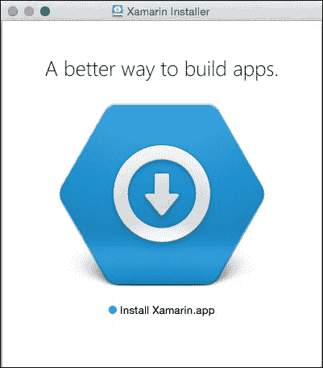

1.  点击安装程序页面和协议页面，直到到达**产品选择**页面。安装程序允许安装 Xamarin.Android 和 Xamarin.iOS，如下截图所示：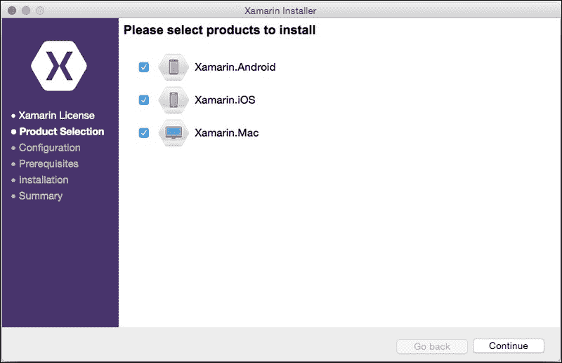

1.  在本书的练习中不需要 Xamarin.iOS；您可以在安装程序窗口中取消选中 Xamarin.iOS，然后点击**继续**。

1.  现在安装程序将继续配置安装目录。你可以更改计算机上的安装位置，或者继续安装: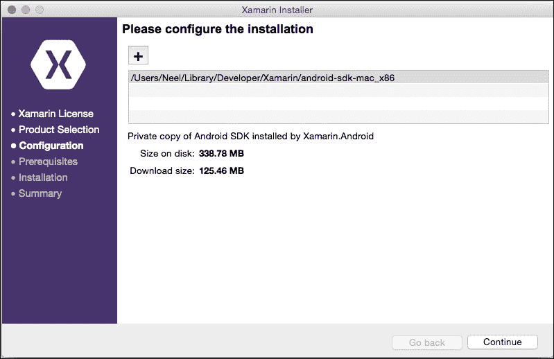

1.  接下来，将列出安装的先决条件，如下面的截图所示。它需要安装 Mono 框架、Android SDK、Xamarin Studio 和 Xamarin.Android 组件。点击 **继续** 以继续安装: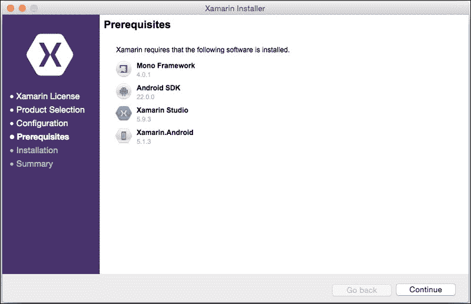

1.  你现在将看到 Android SDK 协议页面。只需接受并点击 **继续** 以进行安装。将显示一个安装进度页面，描述组件安装的进度: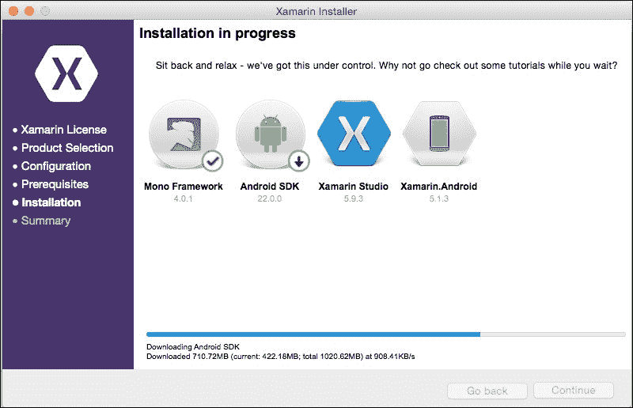

    ### 注意

    在安装 Xamarin.Android 期间，如果你遇到 Android SDK 下载问题，请确保下载没有被你的企业网络或防火墙阻止。对于此类事件，你可以从 [`developer.android.com/sdk/index.html`](https://developer.android.com/sdk/index.html) 下载和安装独立的 Android SDK。一旦 Android SDK 安装在你的计算机上，你就可以继续使用 Xamarin 软件包安装程序。

1.  随着每个组件的安装，将在组件旁边放置一个勾选标记，一旦所有项目都安装完毕，将显示一个最终的安装完成页面。

1.  现在点击 **启动 Xamarin Studio**: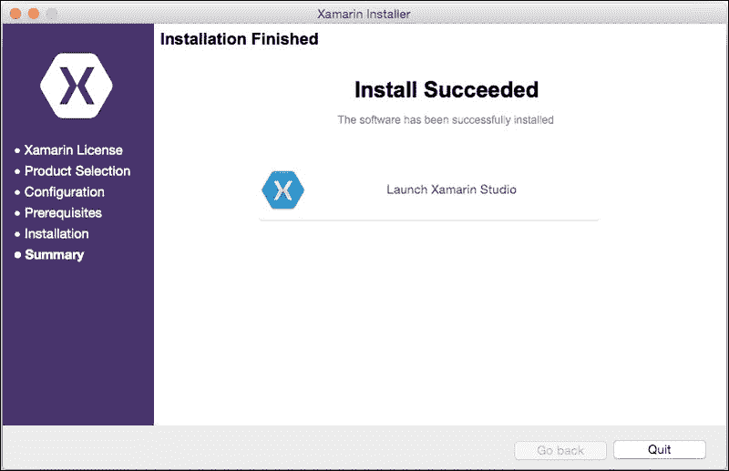

# 安装平台和工具

Android 平台安装附带 Android SDK 管理器工具包，允许你选择和下载构建 Android 应用程序所需的工具和平台。例如，当 Android 新版本发布时，你可以通过使用 SDK 管理器下载新捆绑包来测试你的应用程序与新的平台兼容性。

**Android SDK 管理器**可以通过在 Xamarin Studio 中导航到 **工具** | **打开 Android SDK 管理器...** 选项来启动：

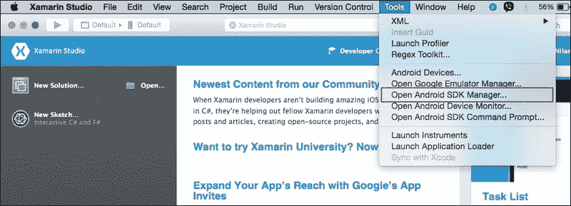

注意到 Android SDK 管理器现在已经打开，并列出了以下选项供你安装或删除。

## 工具

**工具**部分是 Android 安装的核心部分之一。这是在设备上构建、安装和调试 Android 应用程序所必需的：

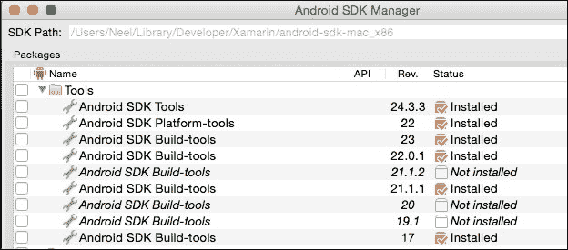

工具的简要描述如下：

+   **Android SDK 工具**: 这些是必须安装以编译 Xamarin.Android 应用程序的开发工具。当你安装 Xamarin 平台时，它将自动安装；然而，你可能需要保持其更新。

+   **Android SDK 平台工具**: SDK 平台工具是连接设备以部署构建和调试应用程序所必需的。你应该始终拥有最新版本的平台工具以确保与最新版本的 Android API 兼容；因此，也要保持其更新。

+   **Android SDK 构建工具**：构建工具用于将源代码编译成可在 Android 设备或模拟器上运行的应用程序。默认情况下，Xamarin Studio 安装了最新版本的构建工具。始终建议您安装最新的 SDK 构建工具版本。

更多信息，您可以访问以下官方 Android 文档：

+   [`developer.android.com/tools/revisions/build-tools.html`](https://developer.android.com/tools/revisions/build-tools.html)

+   [`developer.android.com/tools/sdk/tools-notes.html`](http://developer.android.com/tools/sdk/tools-notes.html)

## Android 平台 API

Android 操作系统每个后续版本也包括 Android 框架 API，供开发者利用新包、类构建应用程序。平台 API 部分列出了所有 Android API 版本以及 API 级别：

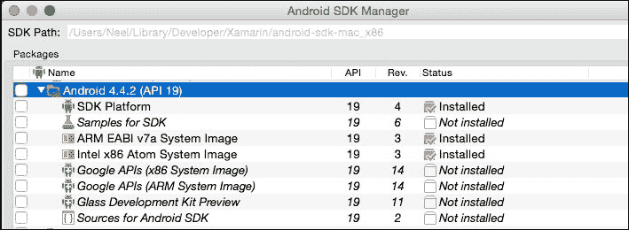

以下是对各种平台的简要描述：

+   **SDK 平台**：给定 API 级别的 SDK 平台允许您针对该版本的 Android 进行编译。当发布新平台时，它需要更新的 SDK 平台工具和 SDK 工具；因此，您需要保持这些工具的最新状态。

+   **SDK 示例**：这些是使用 Java 开发的每个 API 级别的 Android 示例应用程序。Xamarin 开发者不需要这些示例。除非您有特定的需求或想要分析并将 Java 示例迁移到 C#，否则不需要安装这些示例。

+   **系统镜像**：系统镜像与 **Android 虚拟设备**（**AVD**）一起使用。所有最新的 Android 版本都包括 ARM 和 x86 系统镜像。x86 镜像运行速度明显更快，因此比 ARM 镜像更受欢迎。请注意，一些系统镜像以 **Google APIs** 为前缀。它们包括 Google Play 服务运行时，并且对于测试使用 Google Play 服务功能（如地图、应用内购买等）的应用程序非常有用。

## Android 平台额外工具

**额外工具**部分包括一些在开发过程中可能需要的附加可选工具，如下面的截图所示：

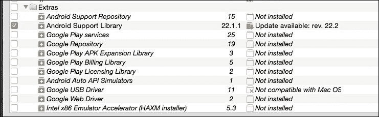

以下部分将简要介绍 Android 平台的一些额外工具的重要部分：

+   **Android 支持库**：**Android 支持库**是一组代码库，用于为旧设备提供对新 API 功能的向后兼容性。在开发某些功能时使用支持库被视为最佳实践，因为它使得应用与旧版本设备兼容。

+   **Google Play 服务**：Google Play 服务运行时提供了一组 API，用于开发某些 Android 功能，如 Google Maps、与 Google+集成、Google Play 订阅等。所有 Android 设备都包含 Google Play 服务运行时。然而，Android 模拟器默认不包含 Google Play 服务运行时，但可以单独安装。

+   **Google USB 驱动程序**：如果您正在运行 Windows 操作系统，您将需要安装这些驱动程序以启用 Android 设备的 USB 调试。对于某些设备，您可能还需要安装设备制造商提供的特定设备驱动程序的软件。如果您使用 Mac OS X 进行开发，则不需要安装此驱动程序。

# 创建 Android 虚拟设备

Android 模拟器，也称为**Android 虚拟设备**（**AVD**），用于在没有设备的情况下测试 Android 应用程序。模拟器作为 Xamarin 安装的一部分进行安装。您可以为模拟的设备创建自己的模拟器或根据所需的设备配置自定义现有的模拟器。

为了创建或修改现有的模拟器，请执行以下步骤：

1.  从主菜单栏导航到**工具**并打开**Google 模拟器管理器**。它将打开**Android 虚拟设备管理器**窗口：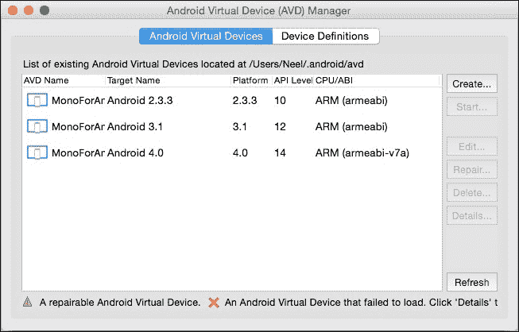

1.  要创建新的模拟器，请单击右侧面板上的**创建**按钮。提供配置，例如**AVD 名称**、**设备**、**目标**、**内存选项**等。

1.  要编辑现有的模拟器，选择您要编辑的模拟器并单击**编辑**按钮：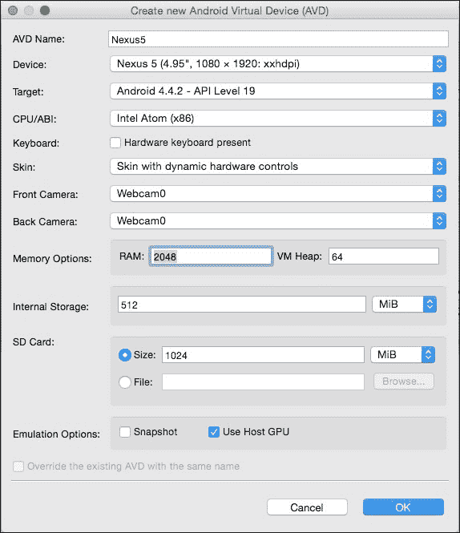

1.  注意**目标**设置；这指定了模拟器将使用的 Android 平台版本和 API 级别。

1.  从**设备**字段下拉菜单中选择设备皮肤。在我的情况下，我选择了**Nexus 5**。

1.  将**目标**字段设置为**Android 4.4.2**。如果需要，取消选中**硬件键盘存在**选项，然后单击**确定**。

1.  选择**使用主机 GPU**选项。此选项使模拟器使用主机计算机的 OpenGL 实现，这使得渲染速度显著提高。

1.  您可以选择**快照**选项来加速模拟器的启动时间。当此选项启用时，它将在第一次启动时保存其 RAM 的快照，并在未来的使用中从该快照恢复。您不能同时启用**快照**和**使用主机 GPU**选项。

# 克隆虚拟设备

有许多选项可以修改，以便模拟任何所需的设备和配置。Android 虚拟设备管理器对话框还有一个名为**设备定义**的选项卡，可以用来设置配置 AVD 时可用设备。以下截图显示了可以作为设备定义一部分进行配置的内容：

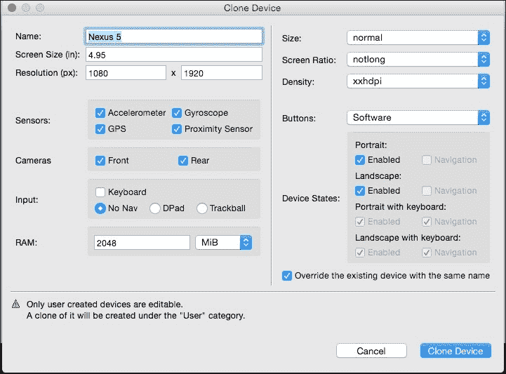

# 加速 Android 模拟器

随 Android 开发工具包一起提供的默认 Android 模拟器相当缓慢。在 Android 设备模拟器中测试应用程序常常令人失望且痛苦。对于开发者来说，更明智的选择是拥有真实的 Android 设备进行测试。然而，由于 Android 生态系统具有各种形态和设备制造商，实际上不可能购买每个目标设备来测试应用程序。您必须寻找一些成本效益高的解决方案来测试您的应用程序。

以下部分将指导您了解一些使您的 Android 模拟器更快以及可用于测试 Android 应用程序的替代选项的技巧。

## 使用 x86 模拟器

Android 提供了一个 x86 模拟器，可以显著加快开发速度，因为 AVD 的启动和执行时间更快。x86 模拟器不是基础 Xamarin 安装的一部分，但安装说明可以在 Xamarin 网站以及 Android 开发者网站上找到。可能需要非常具体的版本，尤其是如果您正在使用 OS X Mavericks，因此我们在此不重复说明。

安装完成后，您可以在编辑 AVD 配置时通过选择的 Intel Atom (x86) CPU/ABI 利用 x86 模拟器。

## 第三方模拟器解决方案

x86 解决方案应在具有良好内存的计算机上运行良好。除了原生 Android 模拟器之外，您还可以使用一些第三方工具，如 Xamarin Android Player 或 Genymotion。

### Xamarin Android Player

Xamarin 最近宣布了自己的 Android 模拟器，名为 Xamarin Android Player。Xamarin Player 在 Android x86 硬件加速虚拟化和 OpenGL 2.0 上运行，以实现快速启动和流畅的用户界面。这适用于 Windows 和 Mac 平台。您的系统需要具有与 OpenGL 2.0 兼容的图形卡，至少 2 GB 的硬盘空间和至少 2 GB 的 RAM 来安装和运行 Xamarin Player。

以下截图显示了带有播放器设置面板的 Xamarin Android Player：

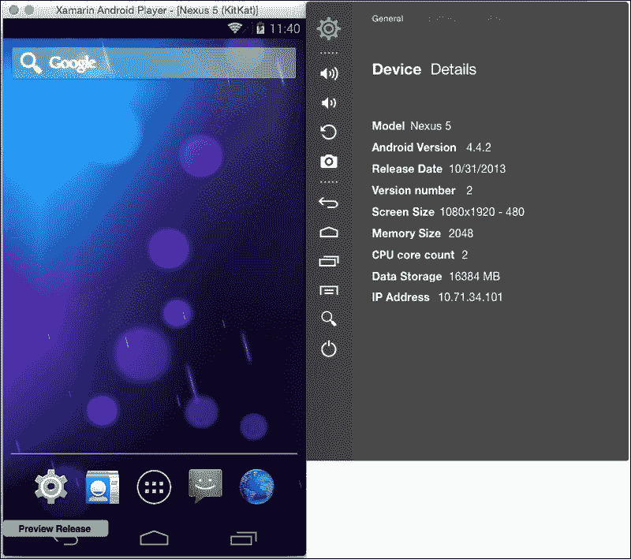

Xamarin Player 设置面板允许您模拟一些模拟器控件，例如电池寿命、地理位置、音量和电源控制。

### Genymotion

Genymotion 是在更快的 Android 模拟器竞赛中又一个替代选择。Genymotion 基于开源项目 Android VM，由法国公司 Genymobile 开发。它也适用于所有主要平台，包括 Mac、Windows 和 Linux。Genymotion 的基本版本可以免费下载；然而，商业版本的功能远超免费版本。Genymotion 的付费版本可以模拟多点触控、摄像头、GPS、网络质量模拟、加速度计等等。这可以成为 Android AVD 的最佳替代选择。

以下截图显示了 Mac OS 上的 Xamarin Android Player：

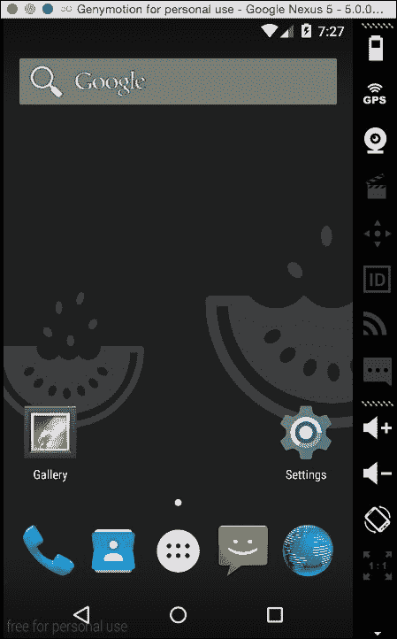

# 创建 POI 应用程序

现在我们已经准备好了开发环境，让我们开始构建`POIApp`。

以下部分将指导您完成创建、构建并将 POI 应用程序部署到 Android 设备所需的几个步骤：

1.  启动 Xamarin Studio。

1.  从**文件**菜单中，导航到**新建** | **解决方案**。将显示**新建解决方案**视图，如下截图所示：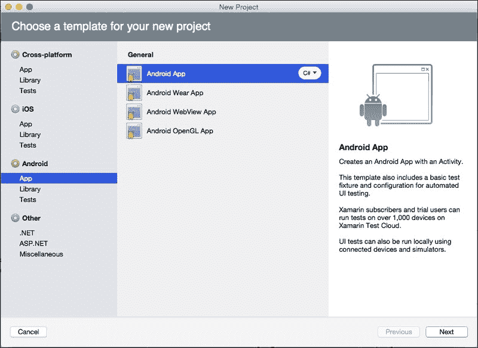

1.  在屏幕左侧选择**Android**部分，导航到**应用** | **Android 应用**，然后点击**下一步**。

1.  将应用名称输入为`POIApp`，并将应用程序标识符设置为`com.packt.poiapp`。

1.  在**兼容性**选择中，选择**最大兼容性**以使您的应用程序在广泛的设备上兼容。

1.  从**主题**下拉菜单中，您可以从提供的主题范围中选择，然后点击**下一步**：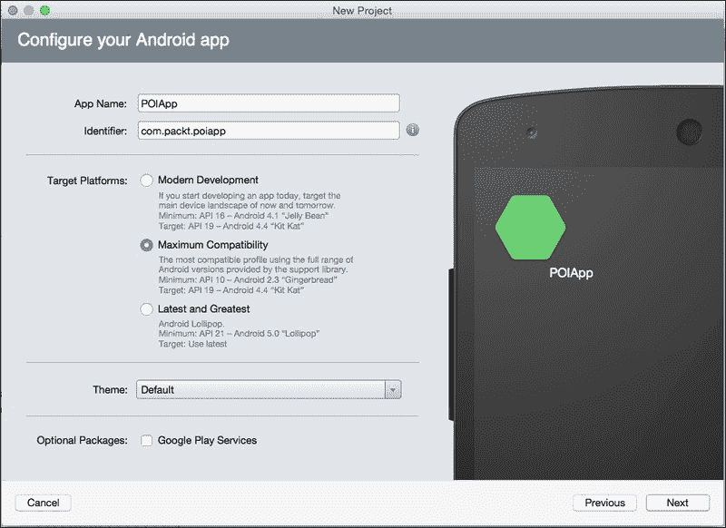

1.  检查项目位置，并根据需要调整。点击**创建**：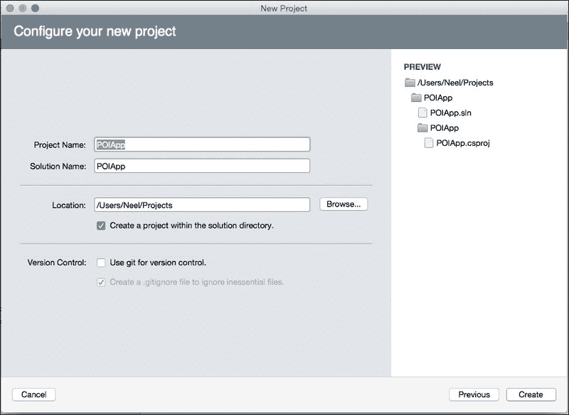

1.  Xamarin Studio 将创建一个解决方案和所需的项目文件夹。项目文件夹将包含一个默认的`MainActivity.cs`类和一个`Main.axml`布局文件。

# Xamarin Studio IDE

创建`POIApp`后，项目将在环境中打开。

以下截图展示了创建项目后 Xamarin Studio 的状态：

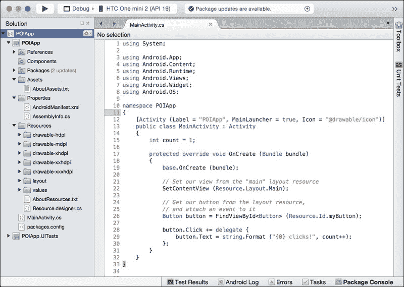

与任何其他现代 IDE 一样，Xamarin Studio 通过屏幕顶部的菜单、下面的上下文相关工具栏和一系列可停靠的垫片来组织，用于查看和操作各种类型的内容。默认情况下，Xamarin Studio 配置了以下选项：

+   **解决方案**垫片停靠在左侧，允许您探索项目中的结构和内容。

+   编辑窗口位于中间，用于查看和操作文件内容。

+   任务特定垫片在右侧和底部折叠，可以通过悬停在图标和标题上展开。

可以通过导航到**视图** | **垫片**来访问额外的垫片。

# 项目选项视图

有许多可设置的选项，这些选项会影响应用程序的构建和执行方式。这些选项可以从**项目选项**视图中进行调整。以下部分将向您展示如何使用 Xamarin Studio 项目资源管理器中可用的不同选项来设置各种项目配置。

## 理解项目结构

项目是一个组织单元，它代表**解决方案**垫片中的完整 Xamarin Android 应用程序。它不仅包含源代码，还包含依赖库、资源和其他项目配置。在我们开始编写任何代码之前，我们必须了解 Xamarin.Android 项目结构和每个文件夹的重要性。以下截图展示了 Xamarin Android 应用程序由哪些不同组件组成：

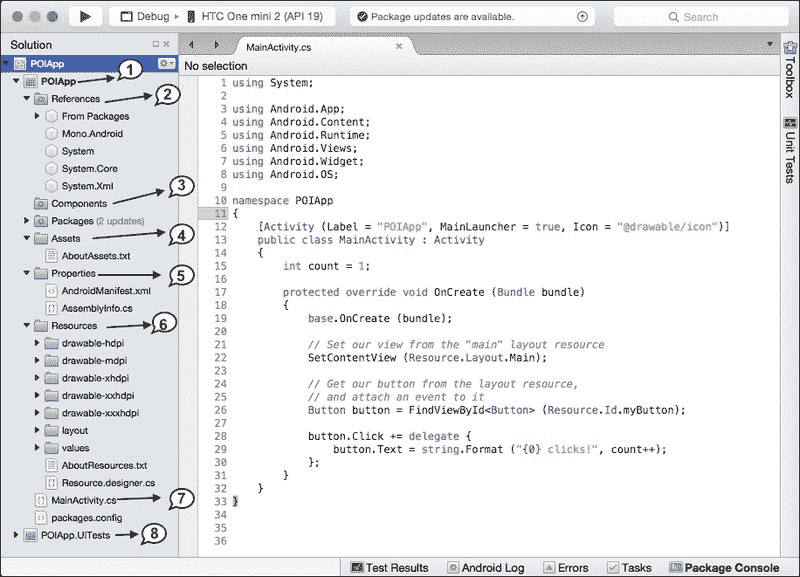

Xamarin Studio 项目向导创建默认的项目结构，并将所需的文件和目录添加到 **解决方案** 面板中。Xamarin.Android 项目的最重要的构建块包括：

+   主要项目（`POIApp`）是包含整个项目上下文的根目录。右键单击项目名称以获取各种选项，例如清理、构建、运行、项目配置选项等。

+   `References` 目录包含应用程序中使用的基类库和程序集的引用。右键单击 **编辑引用** 以添加基类库或第三方程序集。

+   `Components` 文件夹包含由社区开发者构建并共享在 Xamarin 组件商店中的可重用代码片段。组件使您能够快速将新的控件和功能添加到 Xamarin 应用程序中。例如，如果您的应用程序使用数据库操作，您可以通过编写几行代码快速集成 SQLite.Net 组件以执行 SQL 操作。我们将在第四章 *添加列表视图* 中讨论如何从 Xamarin 组件商店将组件添加到您的应用程序中。

+   `Assets` 文件夹包含可以与应用程序捆绑的原始资产。它可以包含第三方 `.ttf` 字体、游戏纹理等文件。

+   `Properties` 文件夹通常包含两个文件：`AndroidManifest.xml` 和 `AssemblyInfo.cs` 文件。`AndroidManifest.xml` 文件包含 Android 应用的元数据，而 `AssemblyInfo.cs` 文件则包含有关程序集的信息，例如名称、描述、版本等。

+   `Resources` 文件夹是主要构建块，由图像（在 Android 中称为可绘制资源）、布局描述符、字符串、颜色、主题等组成。所有添加的资源都被分组到不同的文件夹中，并使用唯一的资源 ID 进行引用。

    Xamarin Studio 自动在 `Resources` 目录下创建一个新的 `Resource.designer.cs` 文件。此文件包含每个资源的唯一 ID。这与在本地 Android 应用程序中自动创建的 `R.java` 文件类似。此文件由 Xamarin.Android 维护，并且每当应用程序的资源发生变化时，都会定期重新生成。

    以下是在 `Resources` 目录内可以创建的一些子目录：

    +   **Resources/drawable-xxx**：可绘制文件夹用于存储图像，如 `.png`、`.jpeg` 等。请注意，默认项目结构包含多个具有限定符的可绘制文件夹后缀，例如 hdpi、mdpi、xhdpi 等。限定符表示该目录中的资源仅在特定情况下使用。您可以创建另一个目录 `Resources/drawable` 来放置不需要针对不同设备配置的图像。

        在第七章“为多种屏幕尺寸设计”中，对资源限定符的更详细讨论被解释了。

    +   **资源/布局**：这个文件夹包含 XML 布局描述符文件。在我们的例子中，创建了`Main.axml`文件。

    +   **资源/值**：这个文件夹包含用于声明应用中所有字符串的文件，例如`string.xml`。这对于应用本地化很有帮助。

    +   **资源/菜单**：菜单文件夹包含每个活动的基于 XML 的菜单规范。

+   应用程序源代码可以管理在多个不同的文件夹中。默认情况下，Xamarin Studio 项目模板是在`MainActivity.cs`文件中创建的。

+   新版本的 Xamarin Studio 创建了`Xamarin.UITest`项目，该项目用于自动化的 UI 验收测试。`Xamarin.UITest`框架基于 Calabash，使用它可以编写 C#和 NUnit 的测试用例，并在 Android 和 iOS 平台上执行。本书在第八章“创建数据存储机制”中介绍了使用 NUnitLite 进行 Android 单元测试。现在，如果你愿意，你可以安全地删除测试项目。

# Xamarin Studio 布局设计器

从解决方案资源管理器中打开位于`Resources/layout/Main.axml`的`Main.axml`文件。注意图形布局编辑器将是默认布局编辑器。目前，`Main.axml`布局包含一个位于`LinearLayout`内的按钮。现在让我们继续了解 Xamarin Studio 布局设计器的不同选项。

## 设计内容布局

Android Studio 布局设计器包含两个按钮：**内容**和**源**，这两个按钮位于设计视图的底部。这些按钮允许你在布局的可视表示（**内容**）和布局的 XML 源代码视图之间切换。这对于直接在 XML 源视图中进行编辑的任务来说非常有用；然而，内容视图对于查看和排列小部件来说也很实用。

内容视图的实用性在一定程度上有限，仅因为大多数时候视图的一部分必须在运行时使用代码构建；然而，当视图可以完全在 XML 中指定时，内容视图就非常有用。在内容视图中，你会在窗口顶部注意到一组有用的工具，如下面的截图所示：

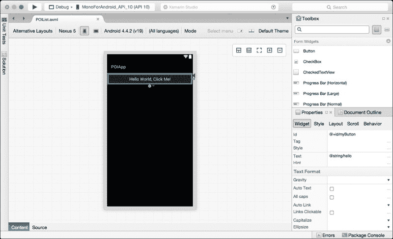

在右上角，你可以找到一组缩放控件。这些控件允许你根据你的显示器大小和想要查看的细节级别来放大或缩小布局。在页面顶部，你可以找到下拉菜单，这些菜单也允许你选择一些选项，例如要模拟的设备屏幕大小、设备的方向以及要模拟的 Android 平台版本。

## 文档大纲和属性面板

在 IDE 的右下角，你会注意到**文档大纲**和**属性**面板。

**文档大纲**面板提供了方便的导航和选择小部件的方法，尤其是在布局变得更加复杂时。选择**listView1**然后点击**属性**选项卡。激活**文档大纲**面板以查看您的布局大纲，列出其中包含的所有小部件、视图或视图组。

在设计窗口中选择任何视图并点击**属性**选项卡以激活**属性**窗口。**属性**窗口允许您编辑/选择所选视图的属性。Xamarin Studio 负责生成源代码以反映在设计视图中所做的更改。

## 工具箱

**工具箱**面板按照基本小部件在列表顶部，容器小部件如 ListView 等在列表下方。

默认情况下，**工具箱**面板显示在 Xamarin Studio IDE 的右上角。顶部有一个搜索框，允许您过滤列表中的小部件，并且搜索框右侧有两个按钮，允许您调整小部件的显示方式。

## 设置目标框架

目标框架设置确定在开发和测试期间可用的 API 级别。让我们选择自动设置；使用目标框架版本。在这种情况下，它自动选择了`API 级别 19 Android 4.4`。

最小 SDK 版本告诉您应用程序运行所需的最低 API 级别。根据最小 SDK 中指定的值，Google Play 商店会阻止用户安装 API 级别低于指定值的系统应用程序。

为了设置目标框架，请执行以下步骤：

1.  在**解决方案**面板中，选择`POIApp`解决方案下的`POIApp`项目。

1.  右键单击它并点击**选项**。

1.  导航到页面左侧的**构建** | **常规**：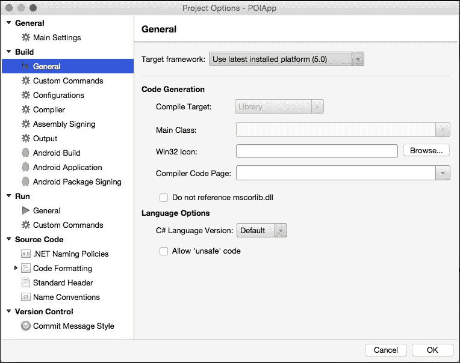

1.  在**目标框架**字段中，选择**使用最新安装的平台**并点击**确定**。

# 设置应用图标和包名

Xamarin.Android 为应用提供了默认的图标和包名。图标将在 Android 设备的首页抽屉中显示，与其他应用程序列表并列，以及在每个视图顶部的操作栏上。

为了调整这些设置的默认值，请执行以下步骤：

1.  应用程序图标图像在代码包的`Assets`文件夹中提供。

1.  使用**Finder/Windows 资源管理器**，将`ic_launcher.png`从您的计算机硬盘复制到相应的`Resources\drawable`文件夹。

1.  从 Xamarin Studio 导航到`Resources\drawable`，右键单击它，并点击**添加文件**或您也可以将启动器图像拖放到 Xamarin Studio 的`Resource/drawable`文件夹中。

1.  您现在应该在**解决方案**面板的`drawable`下看到`ic_launcher.png`。

1.  选择`POIApp`项目，右键单击它，并点击**选项**。

1.  导航到**构建** | **Android 应用程序**。

1.  将应用程序名称更改为`POIApp`。这将导致生成的 APK 文件被命名为`POIApp.apk`。

1.  将应用程序图标选择更改为`@drawable/ic_launcher`。

1.  点击**确定**。

在我们准备应用程序部署的过程中，我们将在第十一章“将应用程序发布到应用商店”中介绍更多选项。

# 启动活动

当从 Android 设备的首页启动应用程序时，Android 操作系统会创建一个活动实例，该活动实例是你声明的启动活动。在用 Android SDK 进行开发时，这会在`AndroidManifest.xml`文件中指定。以下是从`AndroidManifest.xml`文件中摘录的代码，展示了如何指定一个活动为启动活动：

```java
&lt;?xml version="1.0" encoding="utf-8"?&gt;
&lt;manifest 
package="com.paket.POIApp" &gt;
&lt;application
android:allowBackup="true"
android:icon="@drawable/ic_launcher"
android:label="POIApp"
android:theme="@style/AppTheme" &gt;
&lt;activity
android:name=".MainActivity"
android:label="POIApp" &gt;
&lt;intent-filter&gt;
&lt;action android:name="android.intent.action.MAIN" /&gt;
&lt;category android:name="android.intent.category.LAUNCHER" /&gt;
&lt;/intent-filter&gt;
&lt;/activity&gt;
&lt;/application&gt;
&lt;/manifest&gt;
```

Xamarin.Android 通过使用.NET 属性提供了一种更方便的方法来指定这一点。这些.NET 属性在构建时用于构建`ApplicationManifest.xml`文件，因此你很少需要直接处理该文件。在指定要启动的初始活动的情况下，将`MainLauncher`设置为`true`即可完成工作，如下面的代码示例所示：

```java
[Activity (Label = "POIApp", MainLauncher = true)]
public class MainActivity : Activity
{
 ... 
}
```

# 运行和调试应用程序

你运行和调试应用程序的方式对开发者来说非常重要，因为它对生产力和时间表有重大影响。Xamarin Studio 和 Android 模拟器团队协作，使测试和调试周期尽可能无痛苦。让我们按照以下步骤进行：

1.  通过点击任务栏左侧的**播放**按钮、按*F5*键或导航到**运行** | **开始调试**来启动调试会话：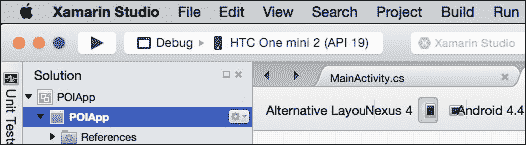

1.  从列表中选择**Nexus 6**（模拟器）并点击**启动模拟器**按钮。模拟器启动可能需要一些时间。让我们等待它完全加载。

1.  在设备列表的顶部选择**Nexus 6**，然后点击**确定**。Xamarin Studio 会将编译后的应用程序部署到模拟器。部署进度可以通过工具栏中间的状态视图和 IDE 底部的**应用程序输出**面板进行监控。

1.  切换到 Android 模拟器并解锁屏幕。POI 应用程序将显示在屏幕上：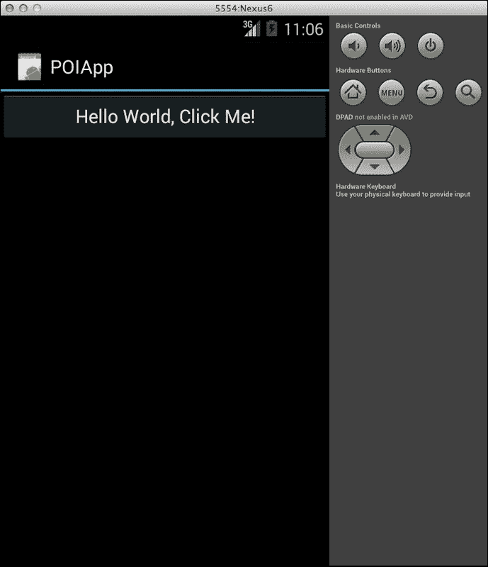

    ### 注意

    Android 模拟器在开发过程中用于测试 Android 应用程序。屏幕的左侧显示了设备上会看到的内容，右侧提供了复制设备硬件的按键。

1.  点击**Hello World**按钮，应用程序将增加计数器并更新按钮的标题。

1.  切换回 Xamarin Studio，通过点击工具栏最左侧的**停止**按钮来停止应用程序。

1.  打开`MainActivity.cs`文件，通过点击编辑器左侧的空白边缘（位于行号左侧）在第 21 行设置断点。

1.  通过点击**开始**按钮重启应用。由于 Android 模拟器仍在运行，您不需要进行设备选择。应用将在之前设置的断点处停止！

1.  您会注意到工具栏中有一组调试控件。有继续执行的控件，即跳过当前行、进入当前函数和退出当前函数：

1.  您还会注意到在 IDE 底部出现了一组与调试应用相关的新垫片。这些垫片允许您查看对象、断点、线程和调用堆栈！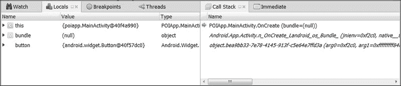

1.  点击**单步执行**两次以观察执行进度，然后点击**继续**以让应用开始。

如您从本节中看到的那样，Xamarin Studio 和 Android 模拟器提供了一种强大且直观的方式来执行和调试应用。

# 使用 Android 设备进行调试

应用可以在实际设备上以与使用模拟器相同的方式简单执行和调试。为了使用物理设备做准备，您需要执行以下步骤：

1.  在设备上启用 USB 调试。

1.  为设备安装适当的 USB 驱动程序（仅限 Windows）。

## 启用 USB 调试

为了在运行 Android 4.0 及更高版本的设备上启用 USB 调试，请执行以下步骤：

1.  对于运行 Android 4.2 或更高版本的设备，有一个额外的步骤；“开发者选项”最初是隐藏的。导航到**设置** | **关于手机**并连续点击**构建号**七次。在某些配置中，确切的菜单结构可能不同。在我的运行 Android 4.3 的 HTC One 上，菜单是**设置** | **关于** | **软件信息** | **更多**。

1.  导航到**设置** | **开发者选项**。

1.  点击**USB 调试**。

## 安装 USB 驱动程序

Windows 用户需要安装设备制造商提供的 USB 驱动程序。您可以在“使用硬件设备”标题下的 Android 开发者网站上找到更多详细信息，或者咨询您的设备制造商。[`developer.android.com/tools/device.html`](http://developer.android.com/tools/device.html)。

OS X 用户应该可以顺利使用。

## 在设备上运行应用

完成前面的步骤后，只需使用 USB 线将设备连接到您的开发计算机，从 Xamarin Studio 启动应用，并在设备选择视图中选择实际硬件设备，而不是启动模拟器。

## 背后的事情

在这一点上，快速查看一些我们在第二章“Xamarin.Android 架构”中讨论过的幕后事情，是非常有趣的。

## 同伴对象

让我们从第二章“Xamarin.Android 架构”中讨论的同伴对象（代理对象）开始。在您的`Finder/Windows Explorer`窗口中导航到`POIApp\POIApp\obj\Debug\android\src\poiapp`目录代码包，使用记事本打开`MainActivity.java`。

以下代码片段展示了源文件的一些关键部分：

```java
packagepoiapp;
public class MainActivity extends android.app.Activity implements
mono.android.IGCUserPeer
{
. . .
public void onCreate (android.os.Bundle p0)
{
n_onCreate (p0);
}
private native void n_onCreate (android.os.Bundle p0);
. . .
}
```

注意以下要点：

+   `MainActivity` 类继承自 `android.app.Activity`，正如你所期望的那样

+   创建了一个 `onCreate()` 代理方法，该方法调用本地的 `n_onCreate()` 方法，该方法指向我们托管 C# 类中重写的 `OnCreate()` 方法

+   `MainActivity` 类包含一个静态初始化块和一个构造函数，该构造函数建立了 Java 类与其管理的 C# 对等类之间的联系，包括初始化 `n_onCreate()`

# AndroidManifest.xml 文件

在代码包中导航到 `POIApp\POIApp\obj\Debug\android`，并打开 `AndroidManifest.xml` 文件。以下代码片段展示了清单文件的一部分：

```java
&lt;?xml version="1.0" encoding="utf-8"?&gt;
&lt;manifest  android:versionCode="1" android:versionName="1.0" package="com.packt.poiapp"&gt;
  &lt;uses-sdk android:minSdkVersion="10" /&gt;
  &lt;application android:label="POIApp" android:name="mono.android.app.Application" android:debuggable="true"&gt;
    &lt;activity android:icon="@drawable/icon" android:label="POIApp" android:name="md56a0a1b7026a61848924491193f52dfa6.MainActivity"&gt;
      &lt;intent-filter&gt;
        &lt;action android:name="android.intent.action.MAIN" /&gt;
        &lt;category android:name="android.intent.category.LAUNCHER" /&gt;
      &lt;/intent-filter&gt;
    &lt;/activity&gt;
    &lt;provider android:name="mono.MonoRuntimeProvider" android:exported="false" android:initOrder="2147483647" android:authorities="com.packt.poiapp.mono.MonoRuntimeProvider.__mono_init__" /&gt;
    &lt;receiver android:name="mono.android.Seppuku"&gt;
      &lt;intent-filter&gt;
        &lt;action android:name="mono.android.intent.action.SEPPUKU" /&gt;
        &lt;category android:name="mono.android.intent.category.SEPPUKU.com.packt.poiapp" /&gt;
      &lt;/intent-filter&gt;
    &lt;/receiver&gt;
  &lt;/application&gt;
  &lt;uses-permission android:name="android.permission.INTERNET" /&gt;
  &lt;uses-permission android:name="android.permission.READ_EXTERNAL_STORAGE" /&gt;
&lt;/manifest&gt;
```

注意以下要点：

+   在 `<uses-sdk>` 元素中将最小 SDK 设置为 `15`

+   初始活动是通过活动定义中的 `<category>` 元素设置的

我们介绍了使用 Xamarin Studio 创建的 Xamarin.Android 项目的结构。我们使用 Mac 平台上的 Xamarin Studio 完成了本书中的所有示例。我们可以确认，之前提到的所有项目配置选项也都在 Visual Studio IDE 中可用。

# 摘要

在本章中，我们从一本书的剩余章节中完成的一个示例应用程序开始，并展示了我们执行和调试应用程序的设施。

在下一章中，我们将从创建基本布局和构建 `ListView` 以显示从服务器获取的 `POIApp` 开始。
