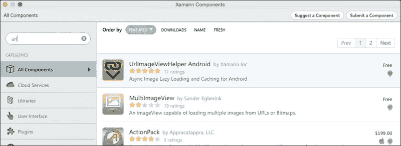

# 第四章：添加列表视图

在本章中，我们终于到达了很多人一直在等待的部分，即开发用户界面。我们将向您介绍创建和填充`ListView`的相关活动，包括以下主题：

+   创建 POIApp 活动布局

+   创建自定义列表行项布局

+   `ListView`和`ListAdapter`类

+   将`BaseAdapter`扩展以向`ListView`小部件提供数据

+   在 Xamarin.Android 中处理网络服务

+   与`ActionBar`菜单选项一起工作

+   处理列表项点击事件

+   处理网络状态

# 创建 POI ListView 布局

从技术上讲，您可以使用 C#代码创建并将用户界面元素附加到您的活动上。然而，这会有些混乱。我们将采用最常见的方法，通过声明基于 XML 的布局。考虑到这一点，让我们从创建一个用于显示 POI 列表项的布局开始这一章。

当我们在上一章（第三章，*创建兴趣点应用*）中创建新的`POIApp`解决方案时，作为 Xamarin Studio 项目模板的一部分，创建了一个默认布局和活动。

而不是删除这些文件，让我们给它们更合适的名字并删除不必要的内客，如下所示：

1.  在**资源** | **布局**中选择`Main.axml`文件并将其重命名为`POIList.axml`。

1.  双击`POIList.axml`文件以在布局设计器窗口中打开它。

    目前，`POIList.axml`文件包含的是作为默认 Xamarin Studio 模板的一部分创建的布局。根据我们的要求，我们需要添加一个占满整个屏幕宽度的`ListView`小部件和一个位于屏幕中间的`ProgressBar`。在从服务器下载数据时，将向用户显示不确定的进度条。一旦下载完成且数据准备就绪，不确定的进度条将在 POI 数据在列表视图中渲染之前被隐藏。

1.  现在，在设计师窗口中打开**文档大纲**选项卡并删除按钮和`LinearLayout`。

1.  现在，在设计师**工具箱**中搜索`RelativeLayout`并将其拖动到设计师布局预览窗口中。

1.  在**工具箱**搜索框中搜索`ListView`并将其拖动到布局设计器预览窗口中。或者，您也可以将其拖放到**文档大纲**选项卡中的`RelativeLayout`上。

我们刚刚将`ListView`小部件添加到了`POIList.axml`中。现在，在设计师窗口中打开**属性**面板视图并编辑一些属性：


如我们回忆第三章，*创建兴趣点应用*，**属性**面板允许您修改所选小部件的属性。面板顶部有五个按钮，用于切换正在编辑的属性集。**@+id**表示通知编译器需要创建一个新的资源 ID 来识别 API 调用中的小部件，而`listView1`标识常量的名称。现在，执行以下步骤：

1.  将 ID 名称更改为`poiListView`并保存更改。切换回**文档大纲**面板，并注意`ListView` ID 已更新。

1.  再次，切换回**属性**面板，并点击**布局**按钮。

1.  在布局属性的**视图组**部分，将**宽度**和**高度**属性都设置为`match_parent`。

1.  `Height`和`Width`属性的`match_parent`值告诉我们，`ListView`可以使用父级提供的整个内容区域，不包括指定的任何边距。在我们的例子中，父级将是顶级的`RelativeLayout`。

    ### 提示

    在 API 级别 8 之前，使用`fill_parent`代替`match_parent`以实现相同的效果。在 API 级别 8 中，`fill_parent`被弃用，并替换为`match_parent`以提高清晰度。目前，这两个常量被定义为相同的值，因此它们具有完全相同的效果。然而，`fill_parent`可能会在未来版本的 API 中被移除；因此，从现在开始，应该使用`match_parent`。

    到目前为止，我们已经将`ListView`添加到`RelativeLayout`中，现在让我们将**进度条**添加到屏幕的中心。

1.  在**工具箱**搜索字段中搜索**进度条**。你会注意到将列出几种类型的进度条，包括水平、大、普通和小。将普通进度条拖到`RelativeLayout`上。

    默认情况下，**进度条**小部件与其父布局的左上角对齐。要将它对齐到屏幕中心，请在**文档大纲**选项卡中选择进度条，切换到**属性**视图，并点击**布局**选项卡。现在选择**在父级中居中**复选框，你会注意到进度条已对齐到屏幕中心，并将出现在列表视图的顶部。

1.  目前，进度条在屏幕中心可见。默认情况下，这可以在布局中隐藏，并且只有在数据正在下载时才会显示。

1.  将**进度条**ID 更改为`progressBar`并保存更改。

1.  要从布局中隐藏**进度条**，请点击**属性**视图中的**行为**选项卡。从**可见性**中选择**框**，然后选择**消失**。

    此行为也可以通过在任意视图中调用`setVisibility()`并通过传递以下任何行为来实现控制。在本章的后面部分，我们将看到如何使用活动代码以编程方式隐藏视图。

`View.Visibility`属性允许您控制视图是否可见。它基于`ViewStates`枚举，该枚举定义了以下值：

值

描述

`Gone`

此值告诉父`ViewGroup`将视图视为不存在，因此不会在布局中分配空间

`Invisible`

此值告诉父`ViewGroup`隐藏视图的内容；然而，它仍然占据布局空间

`Visible`

此值告诉父`ViewGroup`显示视图的内容

点击**源**选项卡以将 IDE 上下文从可视化设计器切换到代码，查看我们迄今为止所构建的内容。注意以下代码是为`POIList.axml`布局生成的：

```java
&lt;?xml version="1.0" encoding="utf-8"?&gt;
&lt;RelativeLayout 
    p1:layout_width="match_parent"
    p1:layout_height="match_parent"
    p1:id="@+id/relativeLayout1"&gt;
    &lt;ListView
        p1:minWidth="25px"
        p1:minHeight="25px"
        p1:layout_width="match_parent"
        p1:layout_height="match_parent"
        p1:id="@+id/poiListView" /&gt;
    &lt;ProgressBar
        p1:layout_width="wrap_content"
        p1:layout_height="wrap_content"
        p1:id="@+id/progressBar"
        p1:layout_centerInParent="true"
        p1:visibility="gone" /&gt;
&lt;/RelativeLayout&gt;
```

# 创建 POIListActivity

当我们创建`POIApp`解决方案时，除了默认布局外，还创建了一个默认活动（`MainActivity.cs`）。让我们将`MainActivity.cs`文件重命名为`POIListActivity.cs`：

1.  从解决方案资源管理器中选择`MainActivity.cs`文件并将其重命名为`POIListActivity.cs`。

1.  在代码编辑器中打开`POIListActivity.cs`文件并将类重命名为`POIListActivity`。

1.  `POIListActivity`类目前包含在创建解决方案时自动创建的代码。我们将编写自己的活动代码，因此让我们从`POIListActivity`类中删除所有代码。

1.  重写`OnCreate()`活动生命周期回调方法。此方法将用于附加活动布局、实例化视图以及编写其他活动初始化逻辑。将以下代码块添加到`POIListActivity`类中：

    ```java
    namespace POIApp
    {
     [Activity (Label = "POIApp", MainLauncher = true, Icon = "@
    drawable/icon")]
     public class POIListActivity : Activity
     {
      protected override void OnCreate (Bundle savedInstanceState)
      {
       base.OnCreate (savedInstanceState);
      }
     }
    }
    ```

1.  现在让我们通过调用`SetContentView(layoutId)`方法来设置活动内容布局。此方法将布局内容直接放置到活动的视图层次结构中。让我们提供之前步骤中创建的`POIList`布局的引用。

    在这一点上，`POIListActivity`类看起来如下：

    ```java
    namespace POIApp
    {
      [Activity (Label = "POIApp", MainLauncher = true, Icon = "@drawable/icon")]
      public class POIListActivity : Activity
      {
        protected override void OnCreate (Bundle savedInstanceState)
        {
          base.OnCreate (savedInstanceState);
          SetContentView (Resource.Layout.POIList);
        }
      }
    }
    ```

注意，在前面的代码片段中，`POIListActivity`类使用了`[Activity]`属性的一些属性，例如`Label`、`MainLauncher`和`Icon`。在构建过程中，Xamarin.Android 使用这些属性在`AndroidManifest.xml`文件中创建一个条目。正如我们在第一章“Android 应用的解剖结构”中学到的，`AndroidManifest.xml`文件是描述您的 Android 应用程序功能和要求的一种简单应用程序配置文件。Xamarin 通过允许使用属性设置所有 Manifest 属性，从而使其更容易，这样您就无需手动在`AndroidManifest.xml`中修改它们。

到目前为止，我们已经声明了一个活动并将布局附加到它。在此阶段，如果您在 Android 设备或模拟器上运行应用程序，您将注意到将显示一个空白屏幕。本章的后续部分将带您了解使`POIListActivity`活动完全功能化的魔法。

# 创建 POI 列表行布局

现在，我们将注意力转向`ListView`小部件中每一行的布局。Android 平台提供了一些默认布局，可以直接与`ListView`小部件一起使用：

布局

描述

`SimpleListItem1`

一行，包含一个标题字段

`SimpleListItem2`

两行布局，第一字段使用较大字体和较亮的文本颜色

`TwoLineListItem`

两行布局，两行字体大小相等，第一行文本颜色较亮

`ActivityListItem`

一行文本，包含一个图像视图

所有的前三个布局都提供了一个相当标准的布局，但为了更好地控制内容布局，也可以创建一个自定义布局，这正是`poiListView`所需要的。

要创建一个新的布局，请执行以下步骤：

1.  在**解决方案**面板中，导航到**资源** | **布局**，右键单击它，然后导航到**添加** | **新建文件**。

1.  从左侧的列表中选择**Android**，从模板列表中选择**Android 布局**，在名称列中输入`POIListItem`，然后单击**新建**。

在我们开始为列表中每一行的项目布局设计之前，我们必须在纸上绘制并分析 UI 将如何呈现。在我们的例子中，POI 数据将组织如下：


实现这种布局有几种方法，但我们将使用`RelativeLayout`来实现相同的结果。这个图表中有很多内容。让我们如下分解：

+   `RelativeLayout`视图组用作顶级容器；它提供了一系列灵活的选项来定位相对内容、其边缘或其他内容。

+   使用`ImageView`小部件来显示 POI 的照片，并将其锚定在`RelativeLayout`实用工具的左侧。

+   使用两个`TextView`小部件来显示 POI 名称和地址信息。它们需要锚定在`ImageView`小部件的右侧，并在父`RelativeLayout`实用工具内居中。完成此操作的最简单方法是，将两个`TextView`类放置在另一个布局中；在这种情况下，一个方向设置为垂直的`LinearLayout`小部件。

+   使用一个额外的`TextView`小部件来显示距离，并将其锚定在`RelativeLayout`视图组的右侧，并垂直居中。

现在，我们的任务是把这个定义放入`POIListItem.axml`中。接下来的几节将描述如何在可行时使用设计器的`内容`视图，在需要时使用`源`视图来完成这项任务。

## 添加 RelativeLayout 视图组

`RelativeLayout`布局管理器允许其子视图相对于彼此或相对于容器或另一个容器进行定位。在我们的案例中，为了构建行布局，如前图所示，我们可以使用`RelativeLayout`作为顶级视图组。当创建`POIListItem.axml`布局文件时，默认添加了一个顶级`LinearLayout`。首先，我们需要将顶级`ViewGroup`更改为`RelativeLayout`。以下部分将指导您完成 POI 列表行布局设计的步骤：

1.  在内容模式下打开`POIListItem.axml`，通过点击内容区域选择整个布局。您应该看到一个蓝色轮廓围绕边缘。按*Delete*键。`LinearLayout`视图组将被删除，您将看到一个指示布局为空的提示信息。

1.  或者，您也可以从**文档大纲**选项卡中选择`LinearLayout`视图组，然后按*Delete*键。

1.  在工具箱中找到`RelativeLayout`视图组，并将其拖放到布局中。

1.  从**文档大纲**中选择`RelativeLayout`视图组。打开**属性**面板，并更改以下属性：

    +   **填充**选项设置为`5dp`

    +   **布局高度**选项设置为`wrap_content`

    +   **布局宽度**选项设置为`match_parent`

    填充属性控制每个项目周围作为边距的空间量，而高度决定了每行列表的高度。将**布局宽度**选项设置为`match_parent`将使`POIListItem`内容消耗整个屏幕的宽度，而将**布局高度**选项设置为`wrap_content`将使每行等于最长的控件。

1.  切换到**代码**视图以查看已添加到布局中的内容。注意以下代码行已添加到`RelativeLayout`中：

    ```java
    &lt;RelativeLayout 
        p1:minWidth="25px"
        p1:minHeight="25px"
        p1:layout_width="match_parent"
        p1:layout_height="wrap_content"
        p1:id="@+id/relativeLayout1"
        p1:padding="5dp"/&gt;
    ```

    ### 提示

    Android 运行在多种设备上，这些设备提供不同的屏幕尺寸和密度。在指定尺寸时，您可以使用多种不同的单位，包括像素（px）、英寸（in）和密度无关像素（dp）。密度无关像素是基于在 160 dpi 屏幕上 1 dp 等于 1 像素的抽象单位。在运行时，Android 将根据实际屏幕密度调整实际大小。使用密度无关像素指定尺寸是一种最佳实践。

## 添加 ImageView 小部件

Android 中的`ImageView`小部件用于显示来自不同来源的任意图像。在我们的案例中，我们将从服务器下载图像并在列表中显示它们。让我们在布局的左侧添加一个`ImageView`小部件，并设置以下配置：

1.  在工具箱中找到`ImageView`小部件，并将其拖放到`RelativeLayout`中。

1.  在选择`ImageView`小部件时，使用**属性**面板将 ID 设置为`poiImageView`。

1.  现在，点击**属性**面板中的**布局**选项卡，并将**高度**和**宽度**值设置为`65 dp`。

1.  在名为 `RelativeLayout` 的属性分组中，将 **Center Vertical** 设置为 **true**。简单地点击复选框似乎不起作用，但你可以点击右侧看起来像编辑框的小图标，然后输入 `true`。如果其他方法都失败了，只需切换到 **Source** 视图并输入以下代码：

    ```java
    p1:layout_centerVertical="true"
    ```

1.  在名为 `ViewGroup` 的属性分组中，将 **Margin Right** 设置为 `5dp`。这会在 POI 图像和 POI 名称之间留出一些空间。

1.  切换到 **Code** 视图查看已添加到布局中的内容。注意以下行代码被添加到 `ImageView`：

    ```java
    &lt;ImageView
            p1:src="img/ic_menu_gallery"
            p1:layout_width="65dp"
            p1:layout_height="65dp"
      p1:layout_marginRight="5dp"
            p1:id="@+id/poiImageView" /&gt;
    ```

## 添加一个 `LinearLayout` 小部件

`LinearLayout` 是最基础的布局管理器之一，根据其 `orientation` 属性的值，水平或垂直地组织其子视图。让我们添加一个 `LinearLayout` 视图组，它将用于布局 POI 名称和地址数据，如下所示：

1.  在工具箱中定位垂直的 `LinearLayout` 视图组。

1.  添加此小部件稍微有些复杂，因为我们希望它锚定到 `ImageView` 小部件的右侧。

1.  将 `LinearLayout` 视图组拖动到 `ImageView` 小部件的右侧，直到边缘变成蓝色虚线，然后释放鼠标。它将与 `ImageView` 小部件的右侧对齐。

1.  在 **Layout** 部分的名为 `RelativeLayout` 的属性分组中，将 **Center Vertical** 设置为 `true`。和之前一样，你需要在编辑框中输入 `true` 或手动将其添加到 **Source** 视图。

1.  切换到 **Code** 视图查看已添加到布局中的内容。注意以下行代码被添加到 `LinearLayout`：

    ```java
    &lt;LinearLayout
            p1:orientation="vertical"
            p1:minWidth="25px"
            p1:minHeight="25px"
            p1:layout_width="wrap_content"
            p1:layout_height="wrap_content"
            p1:layout_toRightOf="@id/poiImageView"
            p1:id="@+id/linearLayout1"
            p1:layout_centerVertical="true" /&gt;
    ```

## 添加名称和地址的 `TextView` 类

添加 `TextView` 类以显示 POI 名称和地址：

1.  在 **Toolbox** 中定位 `TextView` 并将其添加到布局中。这个 `TextView` 需要添加到我们刚刚添加的 `LinearLayout` 视图组中，所以将 `TextView` 拖动到 `LinearLayout` 视图组上，直到它变成蓝色，然后释放鼠标。

1.  将 `TextView` 的 ID 命名为 `nameTextView` 并设置 `text size` 为 `20sp`。文本大小可以在 **Properties** 面板的 **Style** 部分设置；你需要通过点击右侧的省略号（**...**）按钮来展开 **Text Appearance** 组。

    ### 小贴士

    **Scale-independent pixels** （**sp**）类似于 dp 单位，但它们也会根据用户的字体大小偏好进行缩放。Android 允许用户在设置中的可访问性部分选择字体大小。当使用 sp 指定字体大小时，Android 不仅会在缩放文本时考虑屏幕密度，还会考虑用户的可访问性设置。建议使用 sp 来指定字体大小。

1.  使用相同的技术将另一个`TextView`添加到`LinearLayout`视图组中，除了将新小部件拖动到`nameTextView`的底部边缘，直到它变成蓝色虚线，然后放下。这将导致第二个`TextView`添加到`nameTextView`下方。设置字体大小为`14sp`。

1.  将新添加的`TextView`的 ID 更改为`addrTextView`。

1.  现在，将`nameTextView`和`addrTextView`的示例文本更改为**POI 名称**、**城市**、**州**、**邮政编码**。

1.  要编辑`TextView`中显示的文本，只需在内容面板上双击小部件。这将启用一个小型编辑器，允许您直接输入文本。或者，您可以通过在**属性**面板的**小部件**部分的**文本**属性中输入值来更改文本。

1.  在`Resources/values/string.xml`文件中声明所有静态字符串是一种设计实践。通过在`strings.xml`文件中声明字符串，您可以轻松地将整个应用程序翻译成支持其他语言。让我们将以下字符串添加到`string.xml`文件中：

    ```java
    &lt;string name="poi_name_hint"&gt;POI Name&lt;/string&gt;
    &lt;string name="address_hint"&gt;City, State, Postal Code.&lt;/string&gt;
    ```

1.  您现在可以通过选择**属性**面板的**小部件**部分的**文本**属性旁边的省略号（**…**）按钮来更改`nameTextView`和`addrTextView`的**文本**属性。注意这将打开一个对话框窗口，列出了在`string.xml`文件中声明的所有字符串。为两个`TextView`对象选择适当的字符串。

1.  现在，让我们切换到**代码**视图，看看布局中添加了什么。注意在`LinearLayout`内部添加的以下代码行：

    ```java
    &lt;TextView
      p1:layout_width="match_parent"
      p1:layout_height="wrap_content"
      p1:id="@+id/nameTextView "
      p1:textSize="20sp"
      p1:text="@string/app_name" /&gt;
    &lt;TextView
      p1:text="@string/address_hint"
      p1:layout_width="match_parent"
      p1:layout_height="wrap_content"
      p1:id="@+id/addrTextView "
      p1:textSize="14sp" /&gt;
    ```

## 添加距离`TextView`

添加一个`TextView`来显示从 POI 的距离：

1.  在工具箱中定位`TextView`，并将一个`TextView`添加到布局中。这个`TextView`需要锚定到`RelativeLayout`视图组的右侧，但没有办法通过视觉方式完成；因此，我们将使用多步骤过程。最初，通过将其拖动到左侧，直到边缘变成虚线蓝色，然后将它放下，将`TextView`与`LinearLayout`视图组的右侧边缘对齐。

1.  在**属性**面板的**小部件**部分，将小部件命名为`distanceTextView`，并设置字体大小为`14sp`。

1.  在**属性**面板的**布局**部分，将**Align Parent Right**设置为**true**，**Center Vertical**设置为**true**，并在**To Right Of**布局属性中清除`linearLayout1`视图组名称。

1.  将示例文本更改为**204 英里**。为此，让我们在`string.xml`中添加一个新的字符串条目，并从**属性**面板的**小部件**部分的**文本**属性中设置**文本**属性。

以下截图显示了此时内容视图应该显示的内容：


切换回布局设计器中的**源**选项卡，注意为`POIListItem.axml`布局生成的以下代码：

```java
&lt;?xml version="1.0" encoding="utf-8"?&gt;
&lt;RelativeLayout 
    p1:minWidth="25px"
    p1:minHeight="25px"
    p1:layout_width="match_parent"
    p1:layout_height="wrap_content"
    p1:id="@+id/relativeLayout1"
    p1:padding="5dp"&gt;
    &lt;ImageView
        p1:src="img/ic_menu_gallery"
        p1:layout_width="65dp"
        p1:layout_height="65dp"
  p1:layout_marginRight="5dp"
        p1:id="@+id/poiImageView" /&gt;
    &lt;LinearLayout
        p1:orientation="vertical"
        p1:layout_width="wrap_content"
        p1:layout_height="wrap_content"
        p1:layout_toRightOf="@id/poiImageView"
        p1:id="@+id/linearLayout1"
        p1:layout_centerVertical="true"&gt;
        &lt;TextView
            p1:layout_width="match_parent"
            p1:layout_height="wrap_content"
            p1:id="@+id/nameTextView "
            p1:textSize="20sp"
            p1:text="@string/app_name" /&gt;
        &lt;TextView
            p1:text="@string/address_hint"
            p1:layout_width="match_parent"
            p1:layout_height="wrap_content"
            p1:id="@+id/addrTextView "
            p1:textSize="14sp" /&gt;
    &lt;/LinearLayout&gt;
    &lt;TextView
        p1:text="@string/distance_hint"
        p1:layout_width="wrap_content"
        p1:layout_height="wrap_content"
        p1:id="@+id/textView1"
        p1:layout_centerVertical="true"
        p1:layout_alignParentRight="true" /&gt;
&lt;/RelativeLayout&gt;
```

# 创建 PointOfInterest 应用程序实体类

首先需要的类是代表应用程序主要焦点的 `PointofInterest` 类。`POIApp` 将允许 Point Of Interest 应用程序捕获以下属性：

+   `ID`

+   `名称`

+   `描述`

+   `地址`

+   `纬度`

+   `经度`

+   `图片`

POI 实体类可能只是一个简单的 .NET 类，它包含这些属性。

要创建 POI 实体类，请执行以下步骤：

1.  从 Xamarin Studio 的解决方案资源管理器中选择 `POIApp` 项目。选择 `POIApp` 项目，而不是解决方案，它是 **解决方案** 选项卡中的顶级节点。

1.  右键单击并选择 **新建文件**。

1.  在 **新建文件** 对话框的左侧，选择 **通用**。

1.  在模板列表的顶部，在对话框的中间，选择 **空类 (C#)**。

1.  输入名称 `PointOfInterest` 并单击 **确定**。该类将在 `POIApp` 项目文件夹中创建。

1.  将类的可见性更改为公共，并根据之前确定的列表填写属性。

以下代码片段来自本书提供的代码包中的 `\POIApp\POIApp\PointOfInterest.cs`：

```java
public class PointOfInterest
   {
     public int Id { get; set;}
     public string Name { get; set; }
     public string Description { get; set; }
     public string Address { get; set; }
     public string Image  { get; set; }
     public double? Latitude { get; set; }
     public double? Longitude { get; set; }
}
```

注意，**纬度**和**经度**属性都被标记为可空。在纬度和经度的案例中，(0, 0) 实际上是一个有效的位置，因此空值表示这些属性从未被设置。

# 填充 ListView 项

所有适配器视图，如 `ListView` 和 `GridView`，都使用一个 `Adapter` 作为数据与视图之间的桥梁。`Adapter` 遍历内容并为列表中的每个数据项生成视图。

Android SDK 提供了三种不同的适配器实现，如 `ArrayAdapter`、`CursorAdapter` 和 `SimpleAdapter`。`ArrayAdapter` 期望输入一个数组或列表，而 `CursorAdapter` 接受 `Cursor` 的实例，`SimpleAdapter` 将资源中定义的静态数据映射。适合您应用程序的适配器类型纯粹基于输入数据类型。

`BaseAdapter` 是所有三种适配器类型的泛型实现，它实现了 `IListAdapter`、`ISpinnerAdapter` 和 `IDisposable` 接口。这意味着 `BaseAdapter` 可以用于 `ListView`、`GridView` 或 `Spinners`。

对于 `POIApp`，我们将创建 `BaseAdapter<T>` 的子类型，因为它满足我们的特定需求，在许多场景中表现良好，并允许使用我们的自定义布局。

# 创建 POIListViewAdapter

为了创建 POIListViewAdapter，我们将首先创建一个自定义适配器，如下所示：

1.  创建一个名为 `POIListViewAdapter` 的新类。

1.  打开 `POIListViewAdapter` 类文件，将类设为公共类，并指定它继承自 `BaseAdapter<PointOfInterest>`。

现在适配器类已经创建，我们需要提供一个构造函数并实现四个抽象方法。

## 实现构造函数

让我们实现一个构造函数，它接受我们将需要用于填充列表的所有信息。

通常，你需要传递至少两个参数：一个活动实例，因为我们需要在访问标准公共资源时使用活动上下文，以及一个可以枚举的输入数据列表，用于填充 `ListView`。以下代码展示了代码包中的构造函数：

```java
private readonly Activity context;
private List&lt;PointOfInterest&gt; poiListData;
public POIListViewAdapter (Activity _context, List&lt;PointOfInterest&gt; _poiListData)
     :base()
{
    this.context = _context;
    this.poiListData = _poiListData;
}
```

## 实现 `Count { get }`

`BaseAdapter<T>` 类提供了一个只读 `Count` 属性的抽象定义。在我们的情况下，我们只需要提供 `poiListData` 中提供的 POI 的数量。以下代码示例展示了代码包中的实现：

```java
public override int Count {
      get { 
        return poiListData.Count; 
      }
}
```

## 实现 `GetItemId()`

`BaseAdapter<T>` 类提供了一个返回数据源中行长 ID 的方法的抽象定义。我们可以使用 `position` 参数访问列表中的 POI 对象并返回相应的 ID。以下代码示例展示了代码包中的实现：

```java
public override long GetItemId (int position)
{
     return position;
}
```

## 实现 `index getter` 方法

`BaseAdapter<T>` 类提供了一个基于索引参数返回类型对象的索引获取方法的抽象定义。我们可以使用位置参数从 `poiListData` 访问 POI 对象并返回一个实例。以下代码示例展示了从代码包中的实现：

```java
public override PointOfInterest this[int index] {
  get{ 
      return poiListData [index]; 
     }
}
```

## 实现 `GetView()`

`BaseAdapter<T>` 类提供了一个 `GetView()` 的抽象定义，它返回一个表示 `ListView` 项中单个行的视图实例。与其他场景一样，你可以选择完全在代码中构建视图，或者从布局文件中填充它。我们将使用之前创建的布局文件。以下代码示例展示了从布局文件中填充视图：

```java
view = context.LayoutInflater.Inflate (Resource.Layout.POIListItem, null, false);
```

`Inflate` 的第一个参数是一个资源 ID，第二个参数是一个根 `ViewGroup`，在这个例子中可以留为 `null`，因为视图将在返回时被添加到 `ListView` 项中。

## 重复使用行视图

`GetView()` 方法会在源数据集的每一行上被调用。对于行数众多的数据集，比如数百行甚至数千行，为每一行创建一个单独的视图将需要大量的资源，而且由于在任何给定时间只有少数几行是可见的，这看起来似乎是浪费的。`AdapterView` 架构通过将行视图放入一个队列中来解决这个需求，这些视图在滚动出用户视野时可以被重复使用。`GetView()` 方法接受一个名为 `convertView` 的参数，其类型为 `view`。当一个视图可供重复使用时，`convertView` 将包含对该视图的引用；否则，它将是 `null`，此时应该创建一个新的视图。以下代码示例展示了如何使用 `convertView` 来促进行视图的重复使用：

```java
var view = convertView; 
if (view == null){
        view = context.LayoutInflater.Inflate (Resource.Layout.POIListItem, null);
}
```

# 填充行视图

现在我们已经有一个视图实例，我们需要填充字段。`View` 类定义了一个命名的 `FindViewById<T>` 方法，它返回视图中包含的小部件的泛型实例。您通过传递在布局文件中定义的资源 ID 来指定您希望访问的控制。

以下代码返回对 `nameTextView` 的访问权限并设置 **Text** 属性：

```java
PointOfInterest poi = this [position];
view.FindViewById&lt;TextView&gt;(Resource.Id.nameTextView).Text = poi.Name;
```

填充 `addrTextView` 稍微复杂一些，因为我们只想使用我们拥有的地址部分，并且当地址的任何组件都不存在时，我们想要隐藏 `TextView`。

`View.Visibility` 属性允许您控制视图的可见性属性。在我们的情况下，如果我们没有地址的任何组件，我们想要使用 `ViewState.Gone` 值。以下代码展示了 `GetView` 中的逻辑：

```java
if (String.IsNullOrEmpty (poi.Address)) {
     view.FindViewById&lt;TextView&gt; (Resource.Id.addrTextView).Visibility = ViewStates.Gone;
  } else{
   view.FindViewById&lt;TextView&gt;(Resource.Id.addrTextView).Text = poi.Address;
}
```

填充距离文本视图的值需要了解位置服务。我们需要进行一些计算，考虑到用户的当前位置与 POI 的纬度和经度。这部分将在第九章 *使 POIApp 具有位置感知能力* 中介绍。

## 填充列表缩略图图像

图像下载和处理是一个复杂的过程。您需要考虑各种方面，例如网络逻辑，从服务器下载图像，为了性能而缓存下载的图像，以及为了避免内存溢出条件而调整图像大小。我们不必为执行所有上述任务编写自己的逻辑，我们可以使用 `UrlImageViewHelper`，这是一个在 Xamarin 组件商店中可用的免费组件。

Xamarin 组件商店提供了一套可重用的组件，包括免费和付费组件，可以轻松地集成到任何基于 Xamarin 的应用程序中。

### 使用 UrlImageViewHelper

以下步骤将指导您从 Xamarin 组件商店添加组件的过程：

1.  要在 `POIApp` 中包含 `UrlImageViewHelper` 组件，您可以在 **解决方案** 面板中双击 `Components` 文件夹，或者右键单击并选择 **编辑组件**。

1.  注意，组件管理器将加载已下载的组件以及一个 **获取更多组件** 按钮，允许您从窗口中打开 **组件** 商店。请注意，要访问组件管理器，您需要登录您的 Xamarin 账户！

1.  在左侧窗格中可用的组件搜索框中搜索 `UrlImageViewHelper`。现在点击下载按钮以添加您的 Xamarin Studio 解决方案。

1.  现在我们已经添加了 `UrlImageViewHelper` 组件，让我们回到 `POIListViewAdapter` 类中的 `GetView()` 方法。让我们看一下以下代码段：

    ```java
    var imageView = view.FindViewById&lt;ImageView&gt; (Resource.Id.poiImageView);
    if (!String.IsNullOrEmpty (poi.Address)) {
    Koush.UrlImageViewHelper.SetUrlDrawable (imageView,  poi.Image, Resource.Drawable.ic_placeholder);
    }
    ```

让我们来看看前面的代码片段是如何工作的：

1.  在`UrlImageViewHelper`组件中定义的`SetUrlDrawable()`方法提供了一条使用单行代码下载图像的逻辑。它接受三个参数：一个`imageView`实例，图像下载后将在其中显示，图像源 URL 和占位图像。

1.  将新的图像`ic_placeholder.png`添加到`drawable Resources`目录。在图像下载期间，占位图像将在`imageView`上显示。

1.  在网络上下载图像需要互联网权限。以下部分将指导您在`AndroidManifest.xml`文件中定义权限的步骤。

### 添加互联网权限

在访问某些功能时，例如从互联网下载数据、在存储中保存图像等，Android 应用必须被授予权限。您必须在`AndroidManifest.xml`文件中指定应用所需的权限。这允许安装程序在安装时向潜在用户展示应用所需的权限集合。

要设置适当的权限，执行以下步骤：

1.  双击**Solution**面板中**Properties**目录下的`AndroidManifest.xml`。文件将在 manifest 编辑器中打开。屏幕底部有两个标签：**Application**和**Source**，可以用来在编辑文件的表单视图和原始 XML 之间切换，如下面的截图所示：

1.  在**Required permissions**列表中，勾选**Internet**并导航到**File** | **Save**。

1.  切换到**Source**视图以查看 XML，如下所示：

# 连接 POIListViewAdapter

我们已经准备好了列表布局和适配器；现在让我们继续将数据连接到`poiListView`。我们需要切换回`POIListActivity`类并添加以下更改：

1.  在`POIListActivity`类内部声明以下变量：

    ```java
    private ListView poiListView;
    private ProgressBar progressBar;
    private List&lt;PointOfInterest&gt; poiListData;
    private POIListViewAdapter poiListAdapter;
    ```

1.  现在，在`OnCreate`方法中，实例化`ListView`和`ProgressBar`：

    ```java
    poiListView = FindViewById&lt;ListView&gt; (Resource.Id.poiListView);
    progressBar = FindViewById&lt;ProgressBar&gt; (Resource.Id.progressBar);
    ```

1.  目前，我们将创建一个`Async`方法，该方法负责从服务器下载数据并在`POIListActivity`中显示。将以下方法添加到`POIListActivity`类中：

    ```java
    public async void DownloadPoisListAsync(){
     }
    ```

1.  从`OnCreate()`活动生命周期回调中调用`DownloadPoisListAsync()`方法。

1.  注意，本章使用 Android 设备的网络功能从 REST 网络服务下载数据。本章的以下部分将详细介绍如何进行网络请求从服务器获取数据。

    现在为了测试目的，让我们添加以下方法，该方法提供了一个虚拟的 POI 列表对象。在本章的后面部分，我们将集成 REST 网络服务时移除此方法：

    ```java
    private List&lt;PointOfInterest&gt; GetPoisListTestData(){
      List&lt;PointOfInterest&gt; listData = new List&lt;PointOfInterest&gt; ();
      for(int i=0; i&lt;20; i++){
        PointOfInterest poi = new PointOfInterest ();
        poi.Id = i;
        poi.Name = "Name " + i;
        poi.Address = "Address " + i;
        listData.Add (poi);
      }
      return listData;
    }
    ```

1.  让我们在`downloadPoisAsync()`方法中添加以下逻辑，使我们的`POIApp`完全功能化：

    ```java
    public async void DownloadPoisListAsync(){
      progressBar.Visibility = ViewStates.Visible;
      poiListData = GetPoisListTestData();
      progressBar.Visibility = ViewStates.Gone;
       poiListAdapter = new POIListViewAdapter (this, poiListData);
      poiListView.Adapter = poiListAdapter;
    }
    ```

注意以下代码中的内容：

+   下载开始时，向用户显示进度条。下载完成后，隐藏`progressBar`。

+   目前，`GetPoiListTestData()`方法模拟网络请求并提供 POI 对象列表。

+   数据下载完成后，通过传递下载的 POI 列表结果实例化`POIListViewAdapter`类，然后将其设置为列表视图。

我们已经做了大量的工作！现在，让我们在 Android 模拟器或设备上构建并运行应用程序。您将看到以下截图所示的输出：


`ListView`与测试数据配合得很好。现在，我们需要担心从 REST 网络服务中消耗真实的 POI 数据。以下部分将指导您通过 Android 设备建立 HTTP 网络请求。

# 消耗互联网服务

到目前为止，我们已经为列表视图和列表适配器创建了布局；现在，我们需要担心如何消耗互联网服务以下载数据并将其连接到屏幕。以下部分将指导您如何从互联网服务异步下载数据。

## 互联网服务简介

互联网服务是**万维网**（**WWW**）基础设施的组成部分之一。它允许服务器应用程序通过 REST 和 SOAP 等网络协议以及 XML 和 JSON 等数据格式，与连接的客户端共享数据或逻辑。

互联网服务公开了一组**应用程序编程接口**（**APIs**），为客户端应用程序提供统一的数据访问机制。无论互联网服务是用哪种编程语言编写的，只要客户端应用程序遵循互联网服务 API 规范，无论它们使用的是不同的操作系统或不同的编程语言，都可以无缝地访问服务。例如，用 Java 编写并托管在 Apache Tomcat 上的互联网服务可以被.NET 网络表单、iOS 或 Android 应用程序使用。

SOAP 和 REST 是两个在行业中广泛使用的标准互联网服务架构。Microsoft 开发了 SOAP，而 REST 是由 W3C 技术架构组开发的。虽然 SOAP 带来了自己的协议和额外的安全层，但 REST 实现要容易得多。像 Google 和 Microsoft 这样的公司正在将它们的大部分现有服务迁移到 REST。哪个互联网服务架构更好是一个无休止的辩论，值得 Google 搜索；然而，选择适合您的架构纯粹是一个基于您需求的架构决策。

本书提供的`POIApp`示例代码将使用 REST 架构消耗用 Java（JAX-RS）开发的互联网服务。以下部分将指导您如何部署和设置您的系统以测试`POIApp`。

## 部署 POI 互联网服务

本书提供的代码包包括 POI Web 服务项目代码，这些代码将用于完成本书剩余章节的内容。代码包包括一个*readme*文件，描述了部署 POI Web 服务所需的步骤。以下部分将指导您完成 readme 文件中的步骤，并在您继续本章之前部署 Web 服务。

POI Web 服务示例应用程序提供了两个 API：一个用于获取服务器上可用的 POI 列表，另一个用于在服务器数据库中创建新的 POI 记录。

在本章中，我们将使用以下 API 规范从 Web 服务器获取 POI 列表：

+   **请求方法**：`GET`

+   **资源 URI**：`/com.packet.poiapp/api/poi/pois`

+   **内容类型**：`application/json`

+   **接受类型**：`application/json`

+   **响应体**：

    ```java
    {
      "poi": [
        {
          "description": "The London Eye is a giant Ferris wheel on the South Bank of the River Thames in London",
          "id": "1",
          "image": "http://&lt;YOUR_IP&gt;:8080/poiapp/api/poi/image.png",
          "latitude": "50.59938",
          "longitude": "80.8897",
          "address": "London SE17PB, UK",
          "name": "London Eye"
        }, 
        {
        ...
        ...
        },
        {
        ...
        ...
        } ]
    }
    ```

## 异步消费 REST Web 服务

在 Xamarin Android 应用程序中消费 REST Web 服务比看起来要简单。有各种框架类，如`WebClient`、`WebRequest`、`HttpWebRequest`、`HttpClient`，以及其他第三方库，如`RestSharp`和`Service Stack`，可供 Xamarin 消费 REST Web 服务。

在开发`POIApp`时，我们将讨论的重点放在`HttpClient`上。`HttpClient`是.NET 4.5 中新引入的，提供了一些高级功能，例如强类型头、共享缓存、缓存控制等。以下部分将指导您如何使用`HttpClient`从 Xamarin Android 应用程序中异步发起 Web 服务请求。

## 创建 POIService 类

现在，我们将创建一个标准的 C#类，该类抽象了所有用于消费 REST Web 服务的逻辑，从而使我们的活动看起来更加整洁。要创建新的`POIService`类，请执行以下步骤：

1.  在 Xamarin Studio 的**解决方案**面板中选择`POIApp`项目。

1.  右键单击并选择**新建文件**。

1.  在**新建文件**对话框的左侧选择**通用**。

1.  在模板列表的顶部，在对话框的中间，选择**空类(C#)**。

1.  输入名称`POIService`并点击**确定**。

1.  声明一个表示资源 URI 端点的字符串常量，用于访问 POI Web 服务以获取服务器上可用的 POI 列表。在此阶段，我假设 Web 服务代码托管在本地计算机的 8080 端口上。在实际应用中，您的应用程序将使用端点所在的主机域：

    ```java
    private const string GET_POIS = "http://&lt;YOUR_IP&gt;:8080/com.packet.poiapp/api/poi/pois";
    ```

    由于任何技术原因/限制，您无法完成 Web 服务安装，您仍然可以使用 Apiary 模拟数据继续测试您的应用程序。对于使用模拟数据测试，您可以使用以下数据源 URL：

    ```java
    private const string GET_POIS = "http://private-e451d-poilist.apiary-mock.com/com.packt.poiapp/api/poi/pois";
    ```

## 使用 async 和 await 进行异步编程

从服务器下载数据是一个长时间运行并阻塞的操作，对于移动应用来说，建议在主线程之外执行所有此类长时间运行的任务。为了实现响应和流畅的用户体验，移动应用需要为任何长时间运行的操作创建一个新的线程。自从 **.NET 4.5** 发布以来，`async` 和 `await` 关键字被用来轻松实现多线程，而不必在线程上动手。由 `async` 和 `await` 关键字定义的方法通常被称为 `async` 方法。

在实现 `async` 方法之前，你必须了解以下关键事项：

+   `async` 关键字用于通知 .NET 语言 **公共语言运行时** (**CLR**) 创建一个新的执行线程并异步执行任务。

+   `await` 关键字会自动暂停调用线程，并在新线程上执行任务；一旦任务完成，控制权将返回。单个 `async` 方法可以有一个或多个 `await` 关键字。

+   `async` 方法始终返回 `Task<T>`，其中 **T** 代表执行后期望的结果的数据类型。当不需要结果时，可以使用 void 返回类型。

+   作为一种约定，Microsoft 建议将 `async` 方法的名称后缀为 `async`。然而，这并非强制性的，但它有助于提醒调用者使用 `await` 关键字。

现在我们已经了解了创建异步方法的基本知识，让我们在 `POIService` 类中定义一个方法，并将其命名为 `GetPOIListAsync`。`GetPOIListAsync` 方法将用于异步消费 REST 网络服务，反序列化 POI 列表集合中的响应，并将结果返回给活动以在列表中显示结果：

```java
public async Task&lt;List&lt;PointOfInterest&gt;&gt; GetPOIListAsync() {

}
```

注意，`GetPOIListAsync` 方法的返回类型是 `Task<List<PointOfInterest>>`，而 `List<PointOfInterest>` 是在 `POIListActivity` 上渲染列表视图时期望的结果。

`GetPOIListAsync` 方法现在创建了一个 `HttpClient` 实例，将 HTTP 头部接受类型设置为 `application/json`，并通过传递网络服务 URL 调用 `GetAsync()` 方法。接受类型头部元数据告诉服务器客户端期望的响应媒体格式。`GetAsync()` 方法启动对指定端点的 GET 请求，并返回 `HttpResponseMessage` 实例。

如果响应状态码返回成功 **(** `200OK` **)**，我们可以继续获取内容。正如我们从网络服务规范中了解的那样，响应是一个结构化的 JSON 字符串；我们可以通过调用 `GetStringAsync` 方法来检索值。对于除成功状态码之外的状态码，我们可以放置处理错误情况的逻辑。为了简化这个示例，我们将在控制台上打印错误日志：

```java
HttpClient httpClient = new HttpClient ();
httpClient.DefaultRequestHeaders.Accept.Add (new MediaTypeWithQualityHeaderValue ("application/json"));
HttpResponseMessage response = await httpClient.GetAsync (GET_POIS);
if (response != null || response.IsSuccessStatusCode) {
  string content = await response.Content.ReadAsStringAsync ();
  Console.Out.WriteLine ("Response Body: \r\n {0}", content);
 } else {
  Console.Out.WriteLine("Failed to fetch data. Try again later!");
  return null;
}
```

注意，前面用于消费 REST 服务的 `GetPOIListAsync` 方法需要互联网权限。由于我们已经添加了互联网权限，在下载图片时使用 `UrlImageViewHelper` Xamarin 组件，我们不需要再次添加权限。

`await` 关键字期望下载结果继续进行，因此它等待当前的下载任务完成。一旦下载任务完成，POI 网络服务响应 JSON 字符串将被分配给一个内容变量。此时，字符串结果需要反序列化为 .NET 对象，并将结果返回给 `POIListActivity`。以下部分将指导您如何将内容字符串反序列化为 JSON 对象。

虽然 HttpClient 与 `async` 和 `await` 关键字结合提供了处理异步网络请求的本地 API 支持，但您也可以利用功能强大且流行的框架，如 Service Stack 或 Rest Sharp。以下是一些您可以参考的链接：

+   [`msdn.microsoft.com/en-us/library/hh191443.aspx`](https://msdn.microsoft.com/en-us/library/hh191443.aspx)

+   [`github.com/restsharp/RestSharp`](https://github.com/restsharp/RestSharp)

+   [`servicestack.net/`](https://servicestack.net/)

## 使用 Json.NET 进行序列化和反序列化

在序列化和反序列化 JSON 数据时，我们需要做出的另一个重要决定是如何将响应字符串转换为 .NET 对象，反之亦然。有多个选项可供选择，包括来自 .NET 的 `DataContractJsonSerailzier`。Json.NET 是由 James Newton-King 创建的开源组件库，这绝对值得考虑，原因如下：

+   它体积小、速度快、可靠

+   它作为免费组件在 Xamarin 组件商店和 NuGet 中可用

+   它使简单任务变得极其简单

考虑到这些特性，我们将通过将 Json.NET 组件添加到 `POIApp` 从 Xamarin 组件商店中继续操作。要添加 Json.NET 组件，请遵循我们添加 `UrlImageViewHelper` 组件时执行的相同步骤。

一旦将 Json.NET 组件添加到解决方案中，下一步是将响应字符串转换为 `PointOfInterest` 对象的列表。

1.  在 `POIListActivity.cs` 文件中包含以下命名空间指令：

    ```java
    using Newtonsoft.Json.Linq;
    using System.Collections.Generic;
    using Newtonsoft.Json;
    using System.Linq;
    ```

1.  在 `GetPOIListAsync()` 方法中声明一个列表集合以保存 POI 列表响应：

    ```java
    private List&lt;PointOfInterest&gt; poiListData = null;
    ```

1.  在 `downloadPoisAsync()` 方法中 `Console.Out.WriteLine` 语句之后初始化 `poiListData` 列表集合。放置以下代码片段：

    ```java
    poiListData = new List&lt;PointOfInterest&gt; ();
    ```

现在，是时候将 JSON 字符串反序列化为 .NET 对象了。请注意，响应 JSON 字符串是一个具有 `pois` 键的对象，该键代表 `PointOfInterest` 对象的数组。将以下代码片段添加到 `GetPOIListAsync()` 方法中以将字符串反序列化为 .NET 对象。

以下行代码将完整的 JSON 响应字符串转换为 `JObject`：

```java
JObject jsonResponse = JObject.Parse (content);
```

现在获取 `pois` 键的值并遍历它以转换为 .NET 列表：

```java
IList&lt;JToken&gt; results = jsonResponse ["pois"].ToList ();
foreach (JToken token in results) {
  PointOfInterest poi = token.ToObject&lt;PointOfInterest&gt;(); 
  poiListData.Add (poi);
}
return poiListData;
```

`JToken` 是任何类型的 JSON 值的通用表示。它可以是一个字符串、对象、数组、属性等等。`ToList()` 方法返回 `JToken` 对象的集合。`token.ToObject` 方法将每个 poiJSON 标记转换为 `PointOfInterest` 对象类型，并将其添加到 `poiListData` 集合中。最后，我们将列表结果返回给调用者。

## 更新 POIListActivity

到目前为止，我们已经下载了数据，并且我们准备在 `POIListActivity` 中使用这些数据。让我们在 `POIListActivity` 中进行以下更改：

1.  从 `POIListActivity` 类中删除 `GetPoiListTestData()` 方法。

1.  在 `DownloadPoisListAsync` 方法中创建 `POIService` 的实例并调用 `GetPOIListAsync` 方法：

    ```java
    public async void DownloadPoisListAsync(){
      progressBar.Visibility = ViewStates.Visible;
      POIService service = new POIService ();
      poiListData = await service.GetPOIListAsync ();
      progressBar.Visibility = ViewStates.Gone;
       poiListAdapter = new POIListViewAdapter (this, poiListData);
      poiListView.Adapter = poiListAdapter;
    }
    ```

我们已经做了很多工作；现在是时候编译并运行应用程序了。使用我们在前几章中使用的程序编译并运行应用程序。

Bingo！你会注意到应用程序将从 POI 网络服务下载数据并在可滚动的列表视图中显示 POI 列表：


# 向 ActionBar 添加操作

从 Android 3.0（Honeycomb，API 级别 11）开始，Android 引入了一个统一标题，例如一个停靠在屏幕顶部的小部件，称为 **ActionBar**。它允许应用程序在设备屏幕顶部（状态栏下方）添加特定于活动的操作。我们将为 `POIListActivity` 类定义两个操作：`新建`，用于创建新的 POI，以及 `刷新`，用于刷新设备本地存储中的 POI 缓存。

`Activity` 类提供了以下虚拟方法，可以重写以添加操作：

虚拟方法

描述

`OnCreateOptionsMenu`

它允许通过 API 调用或通过填充 XML 定义来创建操作

`OnOptionsItemSelected`

当点击 `ActionBar` 中的操作时调用

# 定义菜单 XML 文件

可以在位于 `Resources/menu` 文件夹中的菜单 XML 文件中定义操作，或者可以通过 API 调用程序化创建。我们将在名为 `POIListViewMenu.xml` 的 XML 文件中定义 **新建** 和 **刷新** 操作。

要创建 `POIListViewMenu.xml`，请执行以下步骤：

1.  在 `POIApp` 中选择 `Resources` 文件夹，右键单击它，然后导航到 **添加** | **新建文件夹**。

1.  将文件夹命名为菜单。

1.  选择菜单文件夹，右键单击它，然后导航到 **添加** | **新建文件**。

1.  导航到 **XML** | **空 XML** 文件，输入 `POIListViewMenu.xml` 作为名称，然后单击 **新建**。

您现在需要填写我们确定的两个操作的定义。不幸的是，Xamarin Studio 不包含菜单 XML 文件的模板，因此您必须从 Android 文档或在线示例中查找格式。以下代码包含了 `actionNew` 和 `actionRefresh` 的定义：

```java
&lt;menu &gt;
     &lt;item android:id="@+id/actionNew"
       android:icon="@drawable/ic_new"
       android:title="New"
     android:showAsAction="ifRoom" /&gt;
     &lt;item android:id="@+id/actionRefresh"
       android:icon="@drawable/ic_refresh"
       android:title="Refresh"
     android:showAsAction="ifRoom" /&gt;
&lt;/menu&gt;
```

注意，从菜单定义中，我们已经引用了两个新的可绘制资源：`ic_new` 和 `ic_refresh`。我们需要以与第三章“创建兴趣点应用”中为 `ic_app` 图标所做的方式相同，将这些图像添加到项目中。这些图像可以在 `assets` 位置下的 `drawable` 文件夹中找到。

# 在 `OnCreateOptionsMenu()` 中设置菜单

`OnCreateOptionsMenu()` 方法被调用，以给 `Activity` 参数一个定义 `ActionBar` 上的操作的机会。`Activity` 类提供了一个 `MenuInflater` 方法，它读取 XML 定义文件并将定义在 `ActionBar` 上的操作放置进去。以下代码显示了代码块中的实现：

```java
public override bool OnCreateOptionsMenu(IMenu menu)
{
    MenuInflater.Inflate(Resource.Menu.POIListViewMenu, menu);
    return base.OnCreateOptionsMenu(menu);
}
```

# 在 `OnOptionsItemSelected()` 中处理选择

当点击 ActionBar 中的操作时，会调用 `OnOptionsItemSelected()` 方法，并传递一个 `IMenuItem` 实例。`IMenuItem ItemId` 实例对应于项目定义中指定的 ID，可用于确定点击了哪个操作。以下代码显示了代码块中 `OnOptionsItemSelected()` 的实现：

```java
public override bool OnOptionsItemSelected (IMenuItem item)
{
    switch (item.ItemId)
    {
        case Resource.Id.actionNew:
            // place holder for creating new poi
            return true;
        case Resource.Id.actionRefresh:
            DownloadPoisListAsync(url);
            return true;
        default :
            return base.OnOptionsItemSelected(item);
     }
}
```

注意，我们只是为 `actionNew` 创建了一个占位符，并为 `actionRefresh` 放置了两个方法调用。

调用 `DownloadPoisListAsync()` 方法来下载并刷新列表上的数据。

现在运行 `POIApp` 并注意 POI 列表活动标题上的两个按钮，**添加** 和 **刷新**：


# 处理 ListView 点击事件

当用户点击一行时，POI 应用将导航到一个详细视图，以便您查看和更新完整的信息集。我们将在下一章构建详细视图，但现在我们将讨论如何处理点击。 

可以使用传统的事件处理器来处理点击。`ListView` 项目提供了一个 `ItemClick` 事件处理器，它接受一个 `ListView.ItemClickEventArgs` 参数。`ListView.ItemClickEventArgs` 参数提供了以下信息，可用于处理事件：

属性

描述

`ID`

它是点击的行的相关数据的 ID。这将是从 `GetItemId()` 返回的值。

`位置`

它是被点击行的 `ListView` 项中的位置。

`视图`

它是被点击行的相关视图。这将是从 `GetView()` 返回的视图。

`父级`

它是包含被点击行的 `AdapterView` 架构。在我们的例子中，它是 `ListView`。

在 `POIListActivity` 中创建一个事件处理器来处理 `ListView` 项的点击事件。由于我们尚未创建详细视图，所以我们现在只展示一个 `Toast` 消息。以下代码来自代码块：

```java
protected void POIClicked(object sender, ListView.ItemClickEventArgs e)
{
   // Fetching the object at user clicked position
   PointOfInterest poi = result.poiListData[(int)e.Id];
   Console.Out.WriteLine("POI Clicked: Name is {0}", poi.Name);
}
```

我们还需要连接事件处理器。将以下行代码添加到 `OnCreate` 方法的末尾：

```java
poiListView.ItemClick += POIClicked;
```

运行 `POIApp` 项目并点击一个 **POI**；注意相应的行中的 POI 名称被打印在控制台上。

# 处理无网络条件

移动设备中的网络条件是不确定的。有时，用户会手动禁用网络连接，或者由于各种外部原因而不可用。对于使用网络数据的应用程序，您必须处理不同的网络状态。应用程序应通过向用户显示适当的消息来优雅地做出反应。

在 `POIApp` 中，在开始下载之前，我们必须确认网络数据连接的可用性。如果网络不可用，我们应该使用适当的消息通知用户，否则继续进行下载请求。

存在于 `System.Net` 包中的 `ConnectivityManager` 类可以用来查询设备网络连接的状态。此类还可以用来监控网络连接，并在网络状态发生变化时通知。在我们的案例中，我们只是查询网络信息，以便知道网络是可用的。

使用 `ConnectivityManager` 类访问网络状态需要在 `AndroidManifest.xml` 文件中请求 `ACCESS_NETWORK_STATE` 用户权限。按照我们之前添加互联网权限时的相同步骤进行，或者您可以直接将以下代码添加到 `AndroidManifest.xml` 源编辑器中：

```java
&lt;uses-permission android:name="android.permission.ACCESS_NETWORK_STATE" /&gt;
```

现在将以下实用方法添加到 `POIService` 类中，该方法读取网络信息，如果设备已连接则返回 `true`：

```java
public bool isConnected(Context activity){
  var connectivityManager = (ConnectivityManager)activity.GetSystemService (Context.ConnectivityService);
  var activeConnection = connectivityManager.ActiveNetworkInfo;
  return (null != activeConnection &amp;&amp; activeConnection.IsConnected);
}
```

现在请对 `POIService` 类中的 `DownloadPoisListAsync` 方法进行以下更改：

```java
public async void DownloadPoisListAsync(){
  POIService service = new POIService ();
  if (!service.isConnected (this)) {
    Toast toast = Toast.MakeText (this, "Not conntected to internet. Please check your device network settings.", ToastLength.Short);
    toast.Show ();
  } else {
    progressBar.Visibility = ViewStates.Visible;
    poiListData = await service.GetPOIListAsync ();
    progressBar.Visibility = ViewStates.Gone;
     poiListAdapter = new POIListViewAdapter (this, poiListData);
    poiListView.Adapter = poiListAdapter;
  }
}
```

你一定会对 `Toast` 感到惊讶。嗯，我们将在下一节中学习它。

# Toast

`Toast` 是一个非交互式、自动可丢弃的视图，用于在指定时间内显示一条简短的消息，并自行销毁。Android 推荐您仅使用 `Toast` 来通知用户，在这种情况下，用户的注意力不是强制性的。对于任何需要用户注意或交互的通知，请考虑使用对话框。

创建`Toast`很简单，您只需通过传递三个参数调用`MakeText()`静态方法：应用程序上下文、要显示的消息以及`Toast`显示的时间长度。时间长度是一个非负整数，单位为毫秒，但建议您使用在`ToastLength`枚举中定义的标准`Long`和`Short`常量。`MakeText()`方法使用给定的属性初始化`Toast`，并返回一个`Toast`实例，我们可以调用其`Show()`方法来显示`Toast`。

在前面的代码片段中，我们在设备离线时显示`Toast`消息。以下代码展示了调用`MakeText()`和`Show()`方法在`Delete`操作上显示`Toast`：

```java
Toast toast = Toast.MakeText (this, "Not conntected to internet. Please check your device network settings.", ToastLength.Short);
toast.Show ();
```

# 摘要

在本章中，我们详细介绍了如何使用不同的布局管理器和控件（如`TextView`、`ImageView`、`ProgressBar`和`ListView`）来创建用户界面元素。

我们还介绍了如何使用 Xamarin.Android 的`HttpClient`类来消费 REST 网络服务，使用 Json.NET 组件反序列化 JSON 响应，并在屏幕上填充数据。

下一章将向您介绍更多视图组，并构建更复杂的用户界面。我们将继续使用`POIApp`，添加详细视图，并允许用户创建或删除兴趣点。
