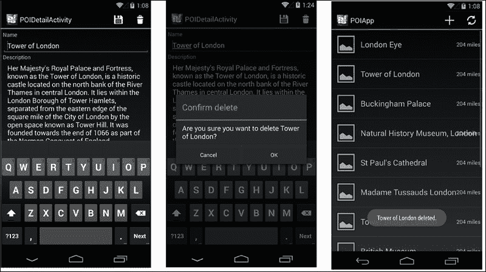

# 第五章。添加详情视图

在本章中，我们将向您介绍创建一个新活动以显示所选 POI 详情的过程。此活动还允许用户从服务器创建、更新和删除 POI。本章将涵盖以下主题：

+   创建用于显示 POI 详情的布局和活动

+   使用`LinearLayout`、`TableLayout`和`ScrollView`来布局活动

+   使用 Intent 捆绑在活动之间传递数据

+   消耗 Web 服务以执行 HTTP `POST`和`DELETE`操作

+   使用`EditText.Error`属性执行`EditText`验证

+   显示确认提示

# 创建 POIDetail 布局

到目前为止，我们已经构建了`POIApp`来显示从服务器获取的 POI 列表。目前，列表视图仅显示有关 POI 的有限信息，例如名称、地址、图像和距离。现在让我们通过添加另一个活动来扩展`POIApp`，该活动显示所选 POI 的详细信息。当用户从列表中点击任何 POI 项或用户从导航栏中选择**新建**（**+**）操作时，将显示 POI 详情活动。此外，详情活动将允许用户创建新的 POI、更新或删除现有 POI。

考虑到所有前面的用例，让我们为 POI 详情创建一个新的布局：

1.  在**解决方案**面板中选择`Resources/layout`文件夹。

1.  右键单击**添加**并选择**新建文件**。

1.  在**新建文件**对话框中，点击**Android**并选择**布局**，在**名称**字段中输入 POI 详情，然后选择**新建**。

注意，已创建了一个新文件，其顶级容器为`LinearLayout`。`POIDetail`视图将包含多个字段，并且在小屏幕尺寸的设备上可能需要滚动。默认的 Android 布局管理器，如`LinearLayout`、`RelativeLayout`、`FrameLayout`或`TableLayout`，在内容增长且数据超出其实际屏幕大小时不提供自动滚动。

在我们之前的章节中，为了显示 POI 列表，布局为我们提供了免费滚动，因为我们使用了`ListView`；然而，在 POI 详情活动的案例中，我们需要使用`ScrollView`来使项目可滚动。

## 理解`ScrollView`

`ScrollView`是一种特殊的布局，用于容纳比其实际尺寸更大的视图。当子视图的大小超过`ScrollView`大小时，它会自动添加滚动条并可以垂直滚动。在使用`ScrollView`之前，你必须了解以下关键事项：

+   `ScrollView`最多可以容纳一个直接子项。这意味着如果您有一个具有多个子项的复杂布局，那么您必须将它们包含在另一个标准布局中，例如`LinearLayout`、`TableLayout`或`RelativeLayout`。

+   与任何其他标准布局管理器一样，可以使用`layout_height`和`layout_width`属性来调整`ScrollView`的高度和宽度。

+   `ScrollView`对于需要滚动的屏幕来说很理想，但当滚动视图用于渲染大量数据时，它将增加开销。在这种情况下，您应考虑使用专门的适配器视图，如`ListView`和`GridView`。

+   永远不要在`ScrollView`内放置`ListView`或`GridView`，因为它们都负责自己的垂直滚动。这样做的话，`ListView`子项将永远不会接收到手势，因为它将由父`ScrollView`处理。

+   `ScrollView`仅支持垂直滚动。对于水平滚动，可以使用`HorizontalScrollView`。

+   `android:fillViewport`属性定义了`ScrollView`是否应该将其内容拉伸以填充视口。您可以通过在`ScrollView`上调用`setFillViewport(true)`方法来设置相同的属性。

现在我们已经了解了`ScrollView`，让我们回到`POIDetail`布局，并添加一个`ScrollView`以支持小屏幕尺寸设备的垂直内容滚动：

1.  在`Content`视图中打开`POIDetail.xaml`文件，选择顶级`LinearLayout`并按*Delete*键。

1.  在**工具箱**面板中，找到**ScrollView**小部件并将其拖动到内容视图。

1.  在**工具箱**面板中，找到**LinearLayout**（垂直）小部件并将其拖动到`ScrollView`内的内容视图中。

1.  在选择`LinearLayout`后，在**属性**面板的布局部分设置**填充**为`5dp`。

现在我们已经准备好向布局中添加标签和编辑控件。以下截图显示了我们试图实现的布局：


我们将使用简单的`TextView`小部件作为标签，并使用`EditText`小部件作为输入控件。`EditText`小部件包含一些可以用来自定义其行为的属性。其中一个属性名为`InputType`，它控制输入时使用的键盘类型（字母、数字等）以及允许的文本行数。**工具箱**面板在**文本字段**组名下提供了一些模板或预配置的`EditText`小部件。

以下截图显示了列表：


将一系列`TextView`和`EditText`控件添加到**名称**、**描述**和**地址**字段中。根据以下表格命名`EditText`小部件，并使用相应的工具箱小部件，以便应用适当的编辑特性：

名称

小部件工具箱名称

`nameEditText`

**纯文本**

`descrEditText`

**多行文本**

`addrEditText`

**多行文本**

现在我们准备处理**纬度**和**经度**字段，我们将使用一个新的布局管理器`TableLayout`。

## 使用 TableLayout 管理器

`TableLayout`管理器是`LinearLayout`的扩展。正如其名所示，`TableLayout`用于以行和列格式对子视图元素进行对齐。

`TableLayout`的概念与 HTML 表格类似。`TableLayout`由`<table>`标签组成，`TableRow`类似于`<tr>`元素。您可以在表格单元格内添加任何视图或视图组。

我们想在表格中添加**纬度**和**经度**字段。让我们添加一个两行两列的`TableLayout`，顶部行用于标签，底部行用于编辑字段。为了做到这一点，请执行以下步骤：

1.  在**工具箱**面板中找到`TableLayout`，将其拖放到`addrEditText`小部件下方的**内容**视图中，并放下。将创建一个三行三列的`TableLayout`。

1.  在`TableLayout`中选择一行，右键点击并选择**删除行**。

1.  在`TableLayout`中选择一列，右键点击并选择**删除列**。

1.  选择第一列，右键点击并选择**拉伸列**。同样，对第二列也进行此操作。

您现在应该有一个`TableLayout`，其可见轮廓为两行，每行有两个列，如下面的截图所示：


我们现在需要添加第一行中两个标签的`TextView`小部件和用于**纬度**和**经度**编辑控制的数字（十进制）小部件，分别命名为`latEditText`和`longEditText`。

我们现在已经完成了`POIDetail`布局，您看到的**内容**视图应该与前面的截图相同。

## 使用 EditText 的 InputType

`EditText`元素提供了一个名为`InputType`的属性，该属性检查在输入数据时控件的行为。当添加描述和地址小部件时，我们从**工具箱**面板选择了**多行文本**。以下代码显示在这种情况下`inputType`被自动设置：

```java
&lt;EditText
     android:inputType="textMultiLine"
     android:layout_width="fill_parent"
     android:layout_height="wrap_content"
     android:id="@+id/descrEditText" /&gt;
```

`InputType` 属性也可以在**输入格式**部分的**Widget**选项卡下的**属性**面板中设置或更改。可能不明显的是，`inputType`可以组合值，这在我们的情况下非常有用。以下表格显示了`inputType`的合理值集；请随意实验：

小部件

输入类型

`nameEditText`

`inputType="textCapWords"`

`descrEditText`

`inputType="textMultiLine|textCapSentences"`

`addrEditText`

`inputType="textMultiLine"`

`latEditText`

`inputType="numberDecimal|numberSigned"`

`longEditText`

`inputType="numberDecimal|numberSigned"`

切换到代码视图以查看已添加到布局的内容：

```java
&lt;?xml version="1.0" encoding="utf-8"?&gt;
&lt;ScrollView 
    p1:minWidth="25px"
    p1:minHeight="25px"
    p1:layout_width="match_parent"
    p1:layout_height="match_parent"
    p1:id="@+id/scrollView1"&gt;
    &lt;LinearLayout
        p1:orientation="vertical"
        p1:minWidth="25px"
        p1:minHeight="25px"
        p1:layout_width="fill_parent"
        p1:layout_height="fill_parent"
        p1:id="@+id/linearLayout1"
        p1:padding="5dp"&gt;
        &lt;TextView
            p1:text="Name"
            p1:layout_width="fill_parent"
            p1:layout_height="wrap_content"
            p1:id="@+id/textView10" /&gt;
        &lt;EditText
            p1:layout_width="fill_parent"
            p1:layout_height="wrap_content"
            p1:id="@+id/nameEditText"
            p1:inputType="textCapWords" /&gt;
        &lt;TextView
            p1:text="Description"
            p1:layout_width="fill_parent"
            p1:layout_height="wrap_content"
            p1:id="@+id/textView11" /&gt;
        &lt;EditText
            p1:inputType="textMultiLine|textCapSentences"
            p1:layout_width="fill_parent"
            p1:layout_height="wrap_content"
            p1:id="@+id/descrEditText" /&gt;
        &lt;TextView
            p1:text="Address"
            p1:layout_width="fill_parent"
            p1:layout_height="wrap_content"
            p1:id="@+id/textView12" /&gt;
        &lt;EditText
            p1:inputType="textMultiLine"
            p1:layout_width="fill_parent"
            p1:layout_height="wrap_content"
            p1:id="@+id/addrEditText" /&gt;
        &lt;TableLayout
            p1:minWidth="25px"
            p1:minHeight="25px"
            p1:layout_width="fill_parent"
            p1:layout_height="wrap_content"
            p1:id="@+id/tableLayout1"
            p1:stretchColumns="*"&gt;
            &lt;TableRow
                p1:id="@+id/tableRow2"&gt;
                &lt;TextView
                    p1:text="Latitude"
                    p1:layout_column="0"
                    p1:id="@+id/textView21" /&gt;
                &lt;TextView
                    p1:text="Longitude"
                    p1:layout_column="1"
                    p1:id="@+id/textView22" /&gt;
            &lt;/TableRow&gt;
            &lt;TableRow
                p1:id="@+id/tableRow3"&gt;
                &lt;EditText
                    p1:inputType="numberDecimal|numberSigned"
                    p1:layout_column="0"
                    p1:id="@+id/latEditText" /&gt;
                &lt;EditText
                    p1:inputType="numberDecimal|numberSigned"
                    p1:layout_column="1"
                    p1:id="@+id/longEditText" /&gt;
            &lt;/TableRow&gt;
        &lt;/TableLayout&gt;
    &lt;/LinearLayout&gt;
&lt;/ScrollView&gt;
```

# 创建 POIDetailActivity

现在我们已经准备好了`POIDetail`布局，我们需要一个相应的活动。按照以下步骤创建一个新的 POI 详情活动：

1.  在**解决方案**面板中选择`POIApp`项目，右键点击并导航到**添加** | **新建文件**。

1.  在 **新建文件** 对话框中，点击 **Android** 并选择 **Activity**，将 **名称** 输入为 `POIDetailActivity`，然后点击 **新建**。

如您从第三章中回忆起的，在创建活动时需要做的第一件事之一是设置布局内容，这是通过调用 `SetContentView(layoutId)` 来实现的。将以下行代码添加到 `POIDetailActivity` 的 `OnCreate()` 方法中：

```java
SetContentView (Resource.Layout.POIDetail);
```

# 将导航添加到 POIDetailActivity

有两种情况需要从 `POIListActivity` 导航到 `POIDetailActivity`，要么是通过在导航栏上选择 **新建** 操作，要么是通过从列表中选择任何 POI。这两种情况的主要区别在于，当从列表中选择现有的 POI 时，我们必须将所选 POI 的详细信息传递给 `POIDetailActivity`，以便用户可以编辑和更新 POI 记录。在创建新的 POI 时，我们不传递任何数据。让我们先选择最简单的一种，并将导航添加到 **新建** 操作中。

`Activity` 类提供了一个名为 `StartActivity()` 的方法，用于启动新的活动。`StartActivity()` 方法也可以在许多不同的场景中使用。在 **新建** 操作的情况下，我们将使用其最基本的形式。要启动一个活动，我们只需要通过传递我们想要启动的活动类型来调用 `StartActivity()`。

以下代码片段演示了需要在 `OnOptionsItemSelected()` 方法中添加到 `POIListActivity` 中占位符的代码：

```java
case Resource.Id.actionNew:
  StartActivity (typeof(POIDetailActivity));
return true;
```

现在我们将应用程序运行在 Android 设备或模拟器上，看看我们到目前为止已经构建了什么。在 `POIListActivity` 中，点击导航栏上的 **新建** 按钮，注意新创建的 `POIDetailActivity` 已经打开：


## 在 POI 列表项点击时的导航

在第二种情况下，我们需要传递 POI 的详细信息以显示 `POIDetailActivity`。为了完成这个任务，我们将使用 `Intent` 类。`Intent` 类可以与 `StartActivity()` 结合使用，以便启动新的活动并传递有关要启动的活动的信息。我们将使用 `Intent` 类来启动 `POIDetailActivity` 并传递所选 POI 的详细信息。

首先，我们需要通过提供当前活动上下文和将要接收意图的目标活动类型来构造一个 `Intent` 实例；在我们的情况下，是 `POIDetailActivity`。以下代码演示了如何正确构造意图：

```java
Intent poiDetailIntent = new Intent (this, typeof(POIDetailActivity));
```

`Intent`对象有一个`Extras`属性，用于将额外数据作为包从一个活动发送到另一个活动。`Intent`类提供了一系列重载的`PutExtra()`方法，允许你向`Extras`属性添加各种类型的**键/值**对。值可以是任何原始类型，如`int`、`boolean`、`char`、`string`、`double`、`float`、`long`等。例如，要添加字符串数据类型，可以使用以下语法：

```java
intent.PutExtra ("YOUR_KEY", "SOME STRING VALUE HERE");
```

对于`POIApp`，我们需要添加所选`PointOfInterest`对象的全部属性。而不是使用不同的键传递每个属性，我们可以进一步简化此过程，使用**Json.NET**组件。它将`PointOfInterest` .NET 对象序列化为 JSON 字符串，可以通过具有不同键`poi`传递给`POIDetailActivity`，在接收端，我们将它反序列化回`PointOfInterest`对象。

除了使用`Intent`包外，还有各种其他选项可以在活动之间传递数据。对于复杂对象，使用 Json.NET 组件进行序列化并通过互联网传递数据包不是一个推荐选项。Android intent 包的大小限制大约为 1 MB，因此你应该始终注意你的数据限制。你可以考虑使用其他任何替代方案以获得更好的性能。

我的以下建议如下：

+   将数据写入文件，并只传递文件路径给第二个活动。第二个活动可以使用相同的文件路径访问内容。

+   使用 SQLite 将对象存储在表中。只传递唯一的 ID 或查询一个参数给第二个活动。第二个活动可以通过从数据库中读取来访问数据。

+   创建一个单例类来保存数据。第二个活动可以直接通过单例实例访问数据。

在我们的案例中，POI 对象很小。我们很高兴采用`Intent`包方法。以下代码语法使用`JsonConvert`类的`SerializeObject()`方法将选定的`PointOfInterest`对象转换为 JSON 字符串，并使用`PutExtra()`方法将其添加到`Intent`中：

```java
string poiJson = JsonConvert.SerializeObject (poi);
poiDetailIntent.PutExtra("poi", poiJson);
```

最后一步是调用`StartActivity()`，传入我们在早期步骤中创建的`Intent`类：

```java
StartActivity (poiDetailIntent);
```

因此，你的 POIListActivity 的`OnListItemClick`应该有如下代码：

```java
protected void POIClicked(object sender, ListView.ItemClickEventArgs e)
{
  PointOfInterest poi = poiListData[(int)e.Id];
   Intent poiDetailIntent = new Intent(this, typeof(POIDetailActivity));
   string poiJson = JsonConvert.SerializeObject(poi); 
  poiDetailIntent.PutExtra("poi", poiJson);
  StartActivity(poiDetailIntent);
}
```

既然我们已经从`POIListActivity`传递了数据，现在让我们从`POIDetailActivity`类中访问 POI 对象。

# 在 POIDetailActivity 中接收数据

当我们到达`POIDetailActivity`的`OnCreate()`方法时，我们需要访问从`POIListActivity`发送的`PointOfInterest`对象。此对象将用于显示所选 POI 的详细信息。以下部分将指导您通过检索`Intent`中的额外包元数据的过程。

每个活动都有一个包含 intent 和启动活动时传递的相应信息的`Intent`属性。`Intent`类提供了一系列方法，通过提供相应的键来访问任何`Extras`包数据。在我们检索数据之前，我们可以通过调用`HasExtra("poi")`方法来确认指定键的值是否可用。`HasExtra`方法返回一个`boolean`值；如果它返回`false`，我们可以假设我们正在创建一个新的 POI；否则，我们需要检索额外的值。

`Intent`类有一系列`GetXXExtra()`方法，其中`XX`代表键/值对值的类型。在我们的情况下，我们可以使用`GetStringExtra()`方法在 intent 上获取从`POIListActivity`传递过来的`poiJson`字符串。`GetStringExtra()`方法接受一个字符串（这是最初在 intent 上设置的键/值对中的键），并返回与该键关联的值。

让我们声明一个`PointOfIntrest`变量来保存从`POIListActivity`接收到的 POI 对象：

```java
private PointOfInterest _poi;
```

将以下列表添加到`POIDetailActivity`的`OnCreate()`方法中：

```java
if (Intent.HasExtra ("poi")) {
  string poiJson = Intent.GetStringExtra ("poi");
  _poi = JsonConvert.DeserializeObject&lt;PointOfInterest&gt;(poiJson);
} else {
  _poi = new PointOfInterest ();
}
```

## 将变量绑定到控件上

正如我们在上一章所学，我们需要手动将用户界面小部件绑定到内部程序引用，以便操作其内容、分配事件处理器等。为我们在布局中创建的每个输入小部件声明一组私有变量。以下列表来自源文件夹：

```java
private EditText _nameEditText;
private EditText _descrEditText;
private EditText _addrEditText;
private EditText _latEditText;
private EditText _longEditText;
```

需要调用`FindViewById<T>`来将每个变量绑定到相应的用户界面小部件。以下列表描述了应该在`SetContentView()`调用之后添加到`OnCreate()`方法中的内容：

```java
SetContentView (Resource.Layout.POIDetail);
_nameEditText = FindViewById&lt;EditText&gt; (Resource.Id.nameEditText);
_descrEditText = FindViewById&lt;EditText&gt; (Resource.Id.descrEditText);
_addrEditText = FindViewById&lt;EditText&gt; (Resource.Id.addrEditText);
_latEditText = FindViewById&lt;EditText&gt; (Resource.Id.latEditText);
_longEditText = FindViewById&lt;EditText&gt; (Resource.Id.longEditText);
```

# 填充用户界面小部件

到目前为止，我们已经有了一个`PointOfInterest`对象的引用，但我们还没有采取任何行动来填充 UI 上的内容。在 UI 上填充 POI 详情是一个相当直接的过程。

`EditText`小部件有一个名为`Text`的属性，我们可以将其设置为初始化小部件的内容。让我们创建一个名为`UpdateUI()`的简单方法，它负责在用户界面小部件上填充 POI 详情。

以下列表显示了`UpdateUI()`所需的内容：

```java
protected void UpdateUI()
{
     _nameEditText.Text = _poi.Name;
     _descrEditText.Text = _poi.Description;
     _addrEditText.Text = _poi.Address;
     _latEditText.Text = _poi.Latitude.ToString ();
     _longEditText.Text = _poi.Longitude.ToString ();
}
```

在`OnCreate()`回调的末尾调用`UpdateUI()`方法。

现在您应该能够运行`POIApp`，并通过点击`POIListActivity`中的任何一行来测试导航。请注意，`POIDetailActivity`将显示所选 POI 对象的详情：


# 添加保存和删除操作

使用`POIDetailActivity`，用户可以选择保存或删除 POI。相同的保存按钮适用于两种场景：当 POI 详情从`POIListActivity`传递过来时，它将更新 POI 详情；否则，它将创建一条新记录。

我们需要一种从用户界面完成这些任务的方法。让我们使用`ActionBar`并添加两个操作：`Save`和`Delete`。在`Resources/menu`目录下创建一个名为`POIDetailMenu.xml`的新文件来声明菜单布局。以下列表显示了`POIDetailMenu.xml`所需的内容：

```java
&lt;menu &gt;
&lt;item android:id="@+id/actionSave"
     android:icon="@drawable/ic_save"
     android:title="Save"
     android:showAsAction="ifRoom" /&gt;
&lt;item android:id="@+id/actionDelete"
     android:icon="@drawable/ic_delete"
     android:title="Delete"
     android:showAsAction="ifRoom" /&gt;
&lt;/menu&gt;
```

注意，每个菜单项都有一个指定的图标。这些图标可以在代码包的`Assets`文件夹中找到。

我们需要重写`OnCreateOptionsMenu()`和`OnOptionsItemSelected()`方法。这与我们在第四章*添加 ListView*中创建的非常相似。将以下代码片段添加到`POIDetailActivity`类中：

```java
public override bool OnCreateOptionsMenu(IMenu menu)
{
   MenuInflater.Inflate(Resource.Menu.POIDetailMenu, menu);
   return base.OnCreateOptionsMenu(menu);
}
 public override bool OnOptionsItemSelected (IMenuItem item)
{
     switch (item.ItemId)
     {
       case Resource.Id.actionSave:
         SavePOI ();
      return true;
       case Resource.Id.actionDelete:
         DeletePOI ();
         return true;
default :
         return base.OnOptionsItemSelected(item);
     }
}
```

您可能会注意到，在前面的代码片段中，我们引入了两个新方法：`SavePOI()`和`DeletePOI()`。这两个方法都用于保持`OnOptionsItemSelected()`方法简洁。`SavePOI()`和`DeletePOI()`方法封装了保存或删除 POI 对象所需的逻辑。

## 禁用删除操作

在`POIDetailView`中有一点不同，我们需要一个场景来禁用`Delete`操作。如果一个新 POI 正在创建，则不应允许删除操作。首先，我们需要在`OnPrepareOptionsMenu()`方法中获取菜单项的引用，然后我们可以通过传递您的偏好来调用`SetEnabled(bool)`方法以启用或禁用菜单操作。

`IMenu`类提供了一个`FindItem()`方法，可以用来获取特定`IMenuItem`的引用，该引用提供了用于启用和禁用操作的`SetEnabled()`方法。禁用菜单项会使按钮失效；然而，它仍然会显示在屏幕上。为了更好的用户体验，让我们通过调用`SetVisible(false)`方法完全隐藏`Delete`操作。

以下列表显示了在输入新 POI 时如何禁用`Delete`操作：

```java
public override bool OnPrepareOptionsMenu (IMenu menu)
{
     base.OnPrepareOptionsMenu (menu);
     // Disable delete for a new POI
     if (_poi.Id&lt;=0) {
        IMenuItem item = menu.FindItem (Resource.Id.actionDelete);
        item.SetEnabled (false);
  item.SetVisible(false);
     }
     return true;
}
```

# 在 POIService 中添加保存和删除操作

在第四章*添加 ListView*中，我们创建了专门的`POIService`类，该类使用`HttpClient`结合`async`和`await`关键字处理下载数据的逻辑。目前，`POIService`类只有一个方法`GetPoisListAsync()`，它处理从 REST 网络服务获取记录列表。让我们扩展其功能以创建新的或更新和删除 POI。让我们首先从创建 POI 开始。

## 消费网络服务以创建或更新 POI

到目前为止，我们已经在代码包中部署了提供的网络服务，并且`POIApp`已经消费了相同的网络服务来获取 POI 列表。在本节中，我们将使用相同的网络服务来创建新的 POI 或更新现有的 POI。

以下 API 规范用于创建新的或更新现有的 POI：

```java
Request Method: POST
Resource Endpoint: /com.packet.poiapp/api/poi/pois
Content-type: application/json
Request Body: 
{
  "description": "The London Eye is a giant Ferris wheel on the South Bank &#x2026;.",
  "latitude": "50.59938",
  "longitude": "80.8897",
  "address": "London SE17PB, UK",
  "name": "London Eye"
}
Response: Success/Failed
```

注意前面 API 规范中的关键点：请求方法是`POST`，Content-type 是`application/json`，POI JSON 对象作为请求体的一部分发送。`POST`方法指示服务器应用程序查找附加的请求内容体，Content-Type 描述了服务器即将接收的数据的 MIME 类型。在这种情况下，内容类型是`application/json`，这意味着服务器期望以 JSON 字符串的形式发送 POI 详细信息。

要创建一个新的 POI，我们需要在创建新的 POI 记录时发送 POI 的详细信息，如名称、描述、纬度、经度和地址。一旦 POI 被创建，将为每个 POI 记录创建并分配一个唯一的 ID。要更新现有的 POI 记录，我们必须在请求体中发送 POI ID 以及更新的 POI 详细信息。

## 将`CreateOrUpdatePOIAsync`方法添加到`POIService`

现在我们了解到，可以使用网络服务的详细信息来创建或更新一个 POI 记录，那么让我们在`POIService`类中创建一个新的`async`方法，命名为`CreateOrUpdatePOIAsync()`，并执行以下步骤：

1.  创建一个新的`async`方法`CreateOrUpdatePOIAsync()`，它接受`PointOfInterest`实例。这个实例包含了你需要发送到服务器以创建或更新操作的 POI 的详细信息。此方法返回`Task<String>`，因为创建/更新请求的结果以字符串形式返回：

    ```java
    public async Task&lt;String&gt; CreateOrUpdatePOIAsync (PointOfInterest poi, Activity activity)
    {
     }
    ```

1.  声明一个表示创建或更新现有 POI 的 Web 服务端点的字符串常量：

    ```java
    private const string CREATE_POI = "http://&lt;YOUR_SERVER_IP&gt;:8080/com.packt.poiapp/api/poi/create";
    ```

    或者，如果你还没有设置 Web 服务器代码，可以使用以下 Apiary 模拟 API URL：

    ```java
    private const string CREATE_POI = "http://private-e451d-poilist.apiary-mock.com/com.packt.poiapp/api/poi/create";
    ```

1.  正如你可能已经在网络服务 API 规范中注意到的，服务器期望 POI 详细信息以 JSON 字符串格式提供。因此，我们需要使用 Json.NET 组件将 POI 对象序列化为 JSON：

    ```java
    var poiJson = JsonConvert.SerializeObject(poi, Formatting.Indented);
    ```

    上述代码将 POI 对象转换为以下 JSON 格式：

    ```java
    {
      "Name": "Googleplex "
      "Description": "Google HQ",
      "Latitude": "37.423441",
      "Longitude": "-102.083962",
      "Address": "1600 Amphitheater Parkway Mountain View, CA 94044",

    }
    ```

    前面的 JSON 字符串包含大写键，如`Name`、`Address`，这些键对于特定的网络服务 API 规范是不兼容的。为此，我们可以使用 Json.NET 的`ContractResolver`类在序列化 POI 对象时提供自定义设置。

1.  在`POIService`内部声明一个名为`POIContractResolver`的内部类，并从`DefaultContractResolver`扩展它。重写`ResolvePropertyName`方法。你需要在`POIService`类中包含`Newtonsoft.Json.Serialization`命名空间指令：

    ```java
    public class POIContractResolver : DefaultContractResolver
    {
        protected override string ResolvePropertyName(string key)
        {
          return key.ToLower();
        }
    }
    ```

    上述代码片段是自我解释的。它将所有`PointOfInterest`对象属性解析为小写 JSON 键。

1.  现在我们可以使用以下代码片段将 POI 对象序列化为具有小写键的 JSON 字符串。将以下列表添加到`CreateOrUpdatePOIAsync`方法中：

    ```java
    var settings = new JsonSerializerSettings();
    settings.ContractResolver = new POIContractResolver();
    var poiJson = JsonConvert.SerializeObject(poi, Formatting.Indented, settings);
    ```

1.  现在我们将异步发送 POI 详细信息的 JSON 数据，使用 `HttpClient` 类。`HttpClient` 类提供了 `PostAsync()` 方法，该方法用于以异步操作向指定的 URI 发送 POST 请求。以下代码片段演示了使用 `HttpClient` 类向服务器发送数据：

    ```java
    HttpClient httpClient = new HttpClient ();
    StringContent jsonContent = new StringContent (poiJson, Encoding.UTF8, "application/json");
    HttpResponseMessage response = await httpClient.PostAsync (CREATE_POI, jsonContent);
     if (response != null || response.IsSuccessStatusCode) {
      string content = await response.Content.ReadAsStringAsync ();
      Console.Out.WriteLine ("{0} saved.", poi.Name); 
      return content;
    }
    return null;
    ```

前面的代码块看起来与 `GetPoisListAsync` 方法相似，但有一些明显的区别。在这里，我们调用 `PostAsync` 而不是 `GetAsync` 方法来发送异步 POST 请求。`PostAsync` 方法接受两个参数：一个表示 Web 服务 URL 的字符串和一个表示 HTTP 实体主体的 `HttpContent` 实例。`PostAsync` 方法接受不同的 HTTP 实体主体格式，如 `ByteArrayContent`、`MultipartContent`、`StreamContent` 和 `StringContent`，代表请求体和内容头。在这里，在我们的情况下，我们发送 POI JSON 作为 `StringContent`。

目前，`CreateOrUpdatePOIAsync()` 方法会在控制台上打印此操作的结果。在本章的后面部分，我们将看到如何从 `POIDetailActivity` 使用 `CreateOrUpdatePOIAsync ()` 方法来完成保存操作。

## 消费 Web 服务以删除 POI

要从服务器删除 POI，客户端需要发送关于要删除的 POI 的信息。由于所有 POI 记录都唯一分配了具有唯一 ID 属性的唯一标识符，我们只需传递要删除的 POI 的 ID。让我们了解以下用于删除 POI 的 API 规范：

```java
Request Method: DELETE
Resource Endpoint: /com.packet.poiapp/api/poi/delete/{POI_ID}
Response: Success/Failed
```

从前面的 API 规范中，请求方法是 `DELETE`，Web 服务需要将 POI ID 传递到 URL 的末尾，以便服务器知道要删除哪个 POI。由于我们不需要向请求体发送任何数据，因此我们不需要指定 `Content-Type` 请求头。操作的结果是，此 API 会以 `Success` 或 `Failure` 纯文本消息的形式返回。

## 将 DeletePOIAsync 方法添加到 POIService

消费 Web 服务以删除 POI 与 `GetPoisListAsync()` 方法实现类似。以下步骤将帮助您创建一个新的 `async` 方法，并消费 Web 服务以删除 POI：

1.  创建一个新的 `async` 方法 `DeletePOIAsync()`，该方法接受一个整数值 `poiId`，它代表一个唯一的 `PointOfInterest` 对象：

    ```java
    public async Task&lt;String&gt; DeletePOIAsync (int poiId)
    {
    }
    ```

1.  声明一个表示用于删除操作的 Web 服务 API URL 的字符串常量：

    ```java
    private const string DELETE_POI = "http://localhost:8080/com.packt.poiapp/api/poi/delete/{0}";
    ```

    注意，`DELETE_POI` 字符串期望 `poiId` 参数位于 URL 的末尾。这是要从服务器删除的 POI 的 ID。

    或者，您可以使用以下 Apiary 测试 URL：

    ```java
    private const string DELETE_POI = "http://private-e451d-poilist.apiary-mock.com/com.packt.poiapp/api/poi/delete";
    ```

1.  现在我们将创建一个 `HttpClient` 实例，并从服务器删除 POI。将以下代码片段添加到 `DeletePOIAsync()` 方法中：

    ```java
    public async Task&lt;String&gt; DeletePOIAsync (int poiId)
    {
      HttpClient httpClient = new HttpClient ();
      String url = String.Format (DELETE_POI, poiId);
      HttpResponseMessage response = await httpClient.DeleteAsync (url);
      if (response != null || response.IsSuccessStatusCode) {
        string content = await response.Content.ReadAsStringAsync();
        Console.Out.WriteLine ("One record deleted.");
        return content;
      }
      return null;
    }
    ```

在前面的代码片段中，`DeleteAsync()` 方法异步地向指定的**统一资源标识符**（**URI**）发送删除请求，并将此操作的结果打印在控制台上。

# 创建 SavePOI()

注意，在上一个步骤中，在*添加保存和删除操作*部分，我们从 `OnOptionsItemSelected()` 方法中调用了 `SavePOI()` 和 `DeletePOI()` 操作，但我们根本就没有声明它们。这两个方法将处理消耗网络服务以创建、更新和删除 POI。接下来的部分将向您介绍 `SavePOI()` 和 `DeletePOI()` 操作。

现在我们将在 `POIDetailActivity` 类中声明一个新的方法 `SavePOI()`。`SavePOI()` 方法可以避免在 `OnOptionsItemSelected()` 方法中放置过多的逻辑。此方法将验证用户输入并启动服务器请求以创建或更新 POI。

我们将在下一节中介绍字段验证，现在我们专注于从屏幕获取用户数据并启动创建/更新请求。以下列表显示了 `SavePOI()` 中应该包含的内容：

```java
protected void SavePOI()
{
    _poi.Name = _nameEditText.Text;
    _poi.Description = _descrEditText.Text;
    _poi.Address = _addrEditText.Text;
    _poi.Latitude = tempLatitude;
    _poi.Longitude = tempLongitude;
     CreateOrUpdatePOIAsync (_poi);
}
```

注意，我们在 `SavePOI()` 中调用了一个新方法，即从 `SavePOI()` 调用的 `CreateOrUpdatePOIAsync()`。我们需要将 `CreateOrUpdatePOIAsync()` 添加到 `POIDetailActivity` 中。它是一个 `async` 方法，将负责初始化 `POIService` 类并启动保存 POI 的网络服务请求。

以下代码片段列表显示了 `CreateOrUpdatePOIAsync()` 方法中应该包含的内容：

```java
private async void CreateOrUpdatePOIAsync(PointOfInterest poi){
  POIService service = new POIService ();
  if (!service.isConnected(this)) {
    Toast toast = Toast.MakeText (this, "Not conntected to internet. Please check your device network settings.", ToastLength.Short);
    toast.Show ();
    return;
  }
   string response = await service.CreateOrUpdatePOIAsync (_poi);
  if (!string.IsNullOrEmpty (response)) {
    Toast toast = Toast.MakeText (this, String.Format ("{0} saved.", _poi.Name), ToastLength.Short);
    toast.Show();
    Finish ();
  } else {
    Toast toast = Toast.MakeText (this, "Something went Wrong!", ToastLength.Short);
    toast.Show();
  }
}
```

注意，前面提到的方法执行以下任务：

+   首先，它创建一个 `POIService` 类的实例并通过调用 `isConnected()` 方法确认网络可用性。

+   如果设备未连接到互联网，它将向用户显示适当的 `Toast` 消息。

+   如果网络可用，它将调用 `CreateOrUpdatePOIAsync()` 方法，该方法定义在 `POIService` 类中。网络服务请求可能是一个长时间运行的阻塞操作，因此我们使用 **async await** 来使请求异步。

+   显示一个吐司消息来通知用户保存/更新操作的结果。

+   一旦保存请求成功，它将显示一个吐司消息并调用活动的 `Finish()` 方法。`Finish()` 方法导致 `POIDetailActivity` 活动关闭，并将堆栈中的上一个活动带到前台；在我们的例子中是 `POIListActivity`。

# 创建 DeletePOI()

与 `SavePOI()` 类似，`DeletePOI()` 方法被创建是为了简化 `OnOptionsItemSelected()` 中的逻辑。在删除 POI 之前，我们必须通过显示对话框来要求用户重新确认。在本章的后面部分，我们将向您展示如何在启动删除请求之前显示确认提示。

我们在 `POIDetailActivity` 中创建了 `CreateOrUpdatePOIAsync()` 方法，现在让我们添加另一个新方法，名为 `DeletePOIAsync()`。此方法执行的任务与 `POIDetailActivity` 中的 `CreateOrUpdatePOIAsync()` 方法非常相似。它检查互联网连接的可用性，异步启动删除操作，并最终通过 toast 消息通知用户。

将以下 `DeletePOIAsync` 方法添加到你的 `POIDetailActivity` 类中：

```java
public async void DeletePOIAsync(){
  POIService service = new POIService ();
  if (!service.isConnected(this)) {
    Toast toast = Toast.MakeText (this, "Not conntected to internet. Please check your device network settings.", ToastLength.Short);
    toast.Show ();
    return;
  }
   string response = await service.DeletePOIAsync (_poi.id);
  if (!string.IsNullOrEmpty (response)) {
    Toast toast = Toast.MakeText (this, String.Format ("{0} deleted.", _poi.Name), ToastLength.Short);
    toast.Show();
     Finish ();
  } else {
    Toast toast = Toast.MakeText (this, "Something went Wrong!", ToastLength.Short);
    toast.Show();
  }
}
```

以下列表显示了 `DeletePOI()` 方法中应该存在的内容：

```java
protected void DeletePOI()
{
DeletePOIAsync(); 
}
```

现在让我们构建并运行这个应用。你现在应该能够执行添加、更新和删除操作：


### 备注

如果你正在使用 Apiary 模拟数据 URL 进行保存和删除操作，则不会删除或保存任何 POI。Apiary 仅用于测试目的。你必须部署本书中提供的网络服务代码包，以便 `保存` 和 `删除` 操作对服务器数据进行生效。

# 添加验证

任何非平凡的应用都会有一定程度的验证需求。`POIApp` 应用相对简单，但我们有一组需要强制执行的规则，这将有助于讨论：

属性

规则

`名称`

这不能为空或为空值

`纬度`

这包含一个在 `-90` 和 `90` 之间的有效十进制数

`经度`

这包含一个在 `-180` 和 `180` 之间的有效十进制数

## 使用 `EditText.Error` 属性

`EditText` 小部件有一个名为 `Error` 的字符串属性，它简化了向用户显示错误的工作，尤其是如果你想一次性显示所有带有错误的字段时。以下截图显示了因留空 **名称** 字段而接收到的错误：


要使用此功能，只需将属性设置为错误消息，当不存在错误时清除属性。以下示例演示了为 **名称** 属性实现规则的实现：

```java
bool errors = false;
   if (String.IsNullOrEmpty (_nameEditText.Text)) {
   _nameEditText.Error = "Name cannot be empty";
     errors = true;
   }
   else
     _nameEditText.Error = null;
```

注意名为 `errors` 的局部布尔变量，它用于跟踪是否找到任何错误。对于 **纬度** 和 **经度** 的编辑稍微复杂一些，因为你需要将文本转换为 `double` 值，并允许指定 `null` 值。

以下代码演示了实现编辑的一种方法：

```java
double? tempLatitude = null;
if (!String.IsNullOrEmpty(_latEditText.Text)) {
try {
    tempLatitude = Double.Parse(_latEditText.Text);
    if ((tempLatitude &gt; 90) | (tempLatitude &lt; -90)) {
         _latEditText.Error = "Latitude must be a decimal value between -90 and 90";
         errors = true;
    }
    else
         _latEditText.Error = null;
    }
    catch 
    {
       _latEditText.Error = "Latitude must be valid decimal number";
     errors = true;
  } 
}
```

使用 `EditText.Error` 属性在 `SavePOI()` 方法中实现本节开头确定的规则。

只有当所有编辑都通过时，你才能更新和保存 POI 属性。以下列表显示了结构化逻辑的一种方法：

```java
if (errors) {
return;
}
 _poi.Name = _nameEditText.Text;
_poi.Description = _descrEditText.Text;
_poi.Address = _addrEditText.Text;
_poi.Latitude = tempLatitude;
_poi.Longitude = tempLongitude;
CreateOrUpdatePOIAsync ();
```

运行 `POIApp` 并确认验证是否正确工作。

## 添加删除确认提示

对于应用来说，在执行任何类型的破坏性更新之前提供确认是一个最佳实践，尤其是如果无法撤销的话。因此，我们需要为 `删除` 操作提供确认。幸运的是，Android 通过 `AlertDialog` 和 `AlertDialog.Builder` 类使这相对容易。

`AlertDialog`类允许您显示一个模态确认对话框。`AlertDialog.Builder`类是一个嵌套类，它帮助您构建一个`AlertDialog`实例的方法；您可以将其视为一个工厂类。步骤如下：

1.  创建一个`AlertDialog.Builder`实例。

1.  在构建器实例上设置各种属性，如消息、按钮文本、当按钮被点击时调用事件处理器等。

1.  在`AlertDialog.Builder`的实例上调用`Show()`以创建并显示`AlertDialog`实例。

    在我们的案例中，我们想要一个包含简单消息以及**OK**和**Cancel**按钮的`AlertDialog`类。当我们点击**Cancel**时，我们只需关闭对话框并什么都不做。当用户选择**OK**时，我们需要启动删除 POI 操作。

1.  创建一个事件处理器，当您点击**OK**按钮时将被调用。此方法现在将调用`DeletePOIAsync()`以执行删除操作。以下列表展示了这些更改：

    ```java
    protected void ConfirmDelete(object sender, EventArgs e)
    {
         DeletePOIAsync ();
    }
    ```

1.  将构建`AlertDialog`类的逻辑添加到现有的`DeletePOI()`方法中。以下列表展示了这个逻辑：

    ```java
    protected void DeletePOI()
    {
        AlertDialog.Builder alertConfirm = new AlertDialog.Builder(this);
    alertConfirm.SetTitle("Confirm delete");
        alertConfirm.SetCancelable(false);
        alertConfirm.SetPositiveButton("OK", ConfirmDelete);
        alertConfirm.SetNegativeButton("Cancel", delegate {});
        alertConfirm.SetMessage(String.Format("Are you sure you want to delete {0}?", _poi.Name));
        alertConfirm.Show();
    }
    ```

`SetPositiveButton()`和`SetNegativeButton()`方法允许指定按钮标题和事件处理器。在**取消**的**消极**按钮的情况下，我们提供一个空的事件处理器，因为没有要做的事情；Android 将负责关闭对话框。`AlertDialog`还提供了一个**中立**按钮。

### 小贴士

在 Honeycomb 之前的设备上，按钮顺序（从左到右）是**积极** - **中立** - **消极**。在较新的设备上，使用 Holo 主题，按钮顺序（从左到右）是**消极** - **中立** - **积极**。

运行`POIApp`并验证删除确认是否正常工作。以下截图显示了用户点击删除操作时的删除确认对话框：



# 刷新 POIListActivity

我们在`POIDetailActivity`上采取的操作，如`Save`和`Delete`，会影响`POIListActivity`中显示的数据。我们需要确保当`POIListActivity`再次变得活跃时，`ListView`被刷新并显示更新的 POI 列表。为了实现这一点，我们必须依赖于活动生命周期回调方法。

如您从第一章“Android 应用的解剖结构”中可能记得的，当一个活动由于新活动的启动而被移动到后台时，会调用`OnPause()`方法。当`POIDetailActivity`启动时，这就会发生在`POIListActivity`上。一旦`POIDetailActivity`通过调用`Finish()`方法或按设备返回按钮完成，`POIListActivity`将回到前台，并调用`OnResume()`方法。

让我们在`OnCreate()`方法中移除对`DownloadPoisListAsync()`的调用，并添加以下片段以刷新`POIListActivity`：

```java
protected override void OnResume (){
base.OnResume ();
DownloadPoisListAsync ();
}
```

在本章中，我们涵盖了大量内容。我们完成了 POI 详细信息活动，以执行添加、更新或删除 POI 的操作。如果您有任何意外的偏差，您可以参考代码包。

# 摘要

在本章中，我们通过使用不同的布局管理器，如`LinearLayout`、`TableLayout`和`ScrollView`，以及使用`EditText`来验证表单数据，创建了大量的复杂布局。

现在在`POIApp`中添加了一个新的活动，用于显示 POI 的详细信息，并允许用户执行添加、更新或删除 POI 操作。`StartActivity`方法与`Intent`结合使用，用于在活动之间传递数据包。

我们还通过添加执行网络服务`POST`和`DELETE`操作的方法，扩展了`POIService`类。

下一章将指导您处理设备方向改变时应用程序的行为。
