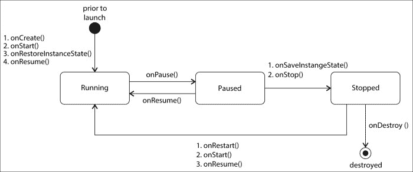
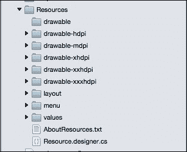

# 第六章：使您的应用程序方向感知

本章将向您介绍处理 Android 应用程序在设备配置变化时的行为的过程。在本章中，我们将涵盖理论概念的全面细节，但不会对`POIApp`进行任何重大更改。本章将涵盖以下主题：

+   Android 在配置变化时的行为

+   锁定 Android 应用程序方向

+   保存活动状态以应对配置变化

+   添加备用资源

+   手动处理方向行为

# Android 在配置变化时的行为

所有现代智能手机和平板电脑都会根据用户旋转设备的方式在纵向和横向模式之间切换。Android 应用程序应响应配置变化并显示适合当前设备配置的适当布局。Android 设备配置可以在运行时以多种形式更改，例如设备方向变化、设备语言更改、设备字体更新、设备连接到外部显示器、设备连接到坞站等。在所有这些早期情况下，Android 都会重新启动正在运行的活动，如果可用，则加载备用资源，以正确加载给定配置的应用程序。活动会经历一系列生命周期方法，例如`OnDestroy()`，然后是`OnCreate()`来处理活动重启行为。

例如，如果您在 Nexus 5 设备上以 1080 x 1920 分辨率在纵向模式下运行应用程序，并且当方向变为横向时，应用程序必须适当地响应以适应 1920 x 1080 维度的布局及其子视图。您可能会问为什么不在布局中调整视图以适应适当的大小？为什么活动需要重新启动？嗯，Android 这样做是为了保持简单。然而，在内部，它做了很多事情，并提供了一些高级功能，以使配置更改更加平滑。

如果设备配置发生变化，Android 只会销毁并重新启动前台的活动，但应用程序实例保持不变。当活动重新启动时，将加载该配置的适当布局。对于此类事件，确保您的应用程序必须恢复活动状态和用户在 UI 上输入的数据非常重要。这可以通过使用`OnSaveInstanceState()`和`OnRestoreInstanceState()`回调方法来实现。

本章探讨了构建平滑、响应和方向感知应用程序的一些关键点。

# 锁定 Android 应用程序方向

根据谷歌设计指南，Android 应用必须响应用户设备的方向，并为给定的方向显示适当的布局。然而，某些类型的应用，如游戏、视频播放器等，旨在仅限制方向为横幅或纵向。对于原生 Android 应用，这可以通过在 `AndroidManifest.xml` 描述文件中的 `<activity>` 声明中使用 `android:screenOrientation` 属性来实现。Xamarin 使这一过程更加简化，并建议你任何时候都不要手动编辑 `AndroidManifest.xml` 文件，而是允许你使用 `[Activity]` 属性自定义属性来设置活动声明中的所有应用程序配置元数据。

如我们从第三章，*创建兴趣点应用* 回忆的那样，我们已经在使用 `[Activity]` 属性的一些属性，例如 `Label`、`MainLauncher` 和 `Icon`。现在为了锁定活动方向行为，我们可以在活动类声明中使用 `ScreenOrientation` 属性。`ScreenOrientation` 属性需要静态地指定给每个需要控制方向锁定的活动。它不能在应用程序的全局范围内进行控制。

`ScreenOrientation` 属性期望 `Android.Content.PM.ScreenOrientation` 枚举中定义的可能常量之一。`ScreenOrientation` 枚举定义了所有设备配置常量，如 `FullSensor`、`FullUser`、`Landscape`、`Locked`、`Nosensor`、`Portrait` 等。

要查看 `ScreenOrientation` 常量的完整集合，请访问官方 Xamarin.Android 文档：[`developer.xamarin.com/api/type/Android.Content.PM.ScreenOrientation/`](http://developer.xamarin.com/api/type/Android.Content.PM.ScreenOrientation/)。

注意，在这本书中，我们将构建 `POIApp` 以响应设备方向和其他不同配置更改事件。以下代码块仅用于演示目的，并且不会与 `POIApp` 示例代码一起继续。你可以添加以下属性来锁定 `POIListActivity` 的方向为仅横幅：

```java
namespace POIApp
{
    [Activity (Label = "POI List", ScreenOrientation = ScreenOrientation.Landscape)]
    public class POIListActivity : Activity
    {
    &#x2026;&#x2026;
    &#x2026;&#x2026;&#x2026;
    }
}
```

将前面的更改应用到 `POIListActivity` 并运行应用。你会注意到 POI 列表屏幕覆盖了设备方向锁定设置，并且它始终以横幅模式显示。

# 动态请求方向

你也可以通过设置 `RequestedOrientation` 属性到你的活动来动态更改所需的活动方向。这允许在需要时随时动态更改方向。在任何地方添加以下代码片段以限制当前运行的活动方向为仅横幅：

```java
RequestedOrientation = ScreenOrientation.Landscape;
```

对 `RequestedOrientation` 属性的更改会影响前台活动，并立即通过使当前活动重新启动来请求指定的方向。您可以使用相同的属性来获取当前活动生效的配置。

# 为配置更改保存活动状态

Android 设备的运行时配置更改会导致前台活动经历重启过程。这种行为旨在简化活动使用给定配置的替代资源重新初始化的过程。在活动经历重新创建过程时，您可能会丢失用户输入的数据或活动的当前状态。对于任何此类事件，所有 Android 应用都必须快速且低成本地保留活动状态，以避免不良的用户体验。以下部分将帮助您深入了解保留活动状态的过程。

在配置更改的情况下，活动会经历一系列生命周期方法，例如 `OnDestroy()` 后跟 `OnCreate()`。在这个过程中，它在销毁活动之前调用 `OnSaveInstanceState()`，以便您可以保存活动状态数据。应用程序状态可以在 `onCreate()` 或 `OnRestoreInstanceState()` 回调方法中保留。为了理解整个过程，我们必须回忆起第一章“Android 应用解剖”中描述的活动生命周期方法。以下图展示了活动生命周期以及 `OnSaveInstanceState` 和 `OnRestoreInstanceState()` 方法的调用流程及其相应的配置更改：



方向的改变会调用 `OnPause()`、`OnSaveInstanceState()`、`OnStop()` 和 `OnDestroy()` 方法，然后是 `OnCreate()`、`OnStart()`、`OnRestoreInstanceState()` 和 `OnResume()`。请记住，这个顺序并不总是正确的。例如，当用户按下设备返回按钮或调用 `Finish()` 方法时，您不需要保存活动状态；因此，它只会调用 `OnPause()`、`OnStop()` 和 `OnDestroy()`，但 `OnSaveInstanceState()` 方法永远不会被调用。

`OnSaveInstanceState()` 和 `OnRestoreInstanceState()` 的默认实现负责保存和保留所有与布局关联并具有 `id` 属性的 Android 视图输入小部件（例如，`EditText`、`CheckBox`、`RadioButton` 等）上的数据。这意味着 Android SDK 在每个视图控件上实现了 `OnSaveInstanceState()` 和 `OnRestoreInstanceState()` 方法。

基于两个因素，Android 决定是否在方向更改时保留附加到视图组的视图的状态。一个因素是`id`属性，另一个是基于为`view.SaveEnabled`属性设置的值。`SaveEnabled`属性检查是否会在该视图中调用`onSaveInstanceState()`方法。`SaveEnabled`的默认值是`true`。

除了`SaveEnabled`属性外，Android 还提供了一个有趣的方法，允许您控制视图层次结构下整个保存状态的行为。例如，如果您在`LinearLayout`下有五个不同的视图，并且您希望不保存包括`LinearLayout`在内的这五个视图的状态，您只需将`LinearLayout`的`SaveFromParentEnabled`属性设置为`false`即可。

对于使用自定义或复合视图的应用程序，您必须手动处理状态恢复。您需要在自定义视图实现中重写`OnSaveInstanceState()`和`OnRestoreInstanceState()`方法以存储您视图的状态。

## 手动保存活动状态

如果您需要手动保存活动状态，您必须在您的活动中重写以下方法，并编写自己的逻辑来在数据包中保存和恢复活动状态。`OnSaveInstanceState()`方法提供了一个`Bundle`实例，我们可以将其用于数据转储，而`OnRestoreInstanceState()`方法返回之前保存的`Bundle`。

`Bundle`是一种特殊的容器，它提供了异构值的键/值映射。`Bundle`通常用于从一个活动解析数据到另一个活动或保存和检索视图状态。`Bundle`类提供了一组重载的`PutXXX()`和`GetXXX()`方法来存储和检索值。

以下代码片段描述了`OnSaveInstanceState()`和`OnRestoreInstanceState()`方法的原型：

```java
protected override void OnSaveInstanceState (Bundle outState)
{
  base.OnSaveInstanceState (outState);
  // Place your logic to save activity state 
}
 protected override void OnRestoreInstanceState (Bundle savedInstanceState)
{
  base.OnRestoreInstanceState (savedInstanceState);
  // Place your logic to restore activity state 
}
```

## 保留 POI 列表滚动位置

到目前为止，我们已经对配置更改时的活动生命周期行为有了很多了解。现在让我们将其实现到`POIApp`中。当 POI 列表增长时，它允许用户垂直滚动以查看所有列表项。假设，用户已经滚动到列表中的第 10 个元素，同时设备方向发生了变化。由于设备配置更改请求，活动重新启动，导致列表从顶部出现。保留列表滚动位置以获得更好的用户体验是一个好主意。

当设备配置更改时，要保留 POI 列表滚动位置，请执行以下步骤：

1.  在`OnSaveInstanceState()`方法中获取第一个可见列表项的索引并将其保存到`Bundle`中：

    ```java
    protected override void OnSaveInstanceState (Bundle outState)
    {
      base.OnSaveInstanceState (outState); 
      int currentPosition = poiListView.FirstVisiblePosition;
      outState.PutInt ("scroll_position", currentPosition);
    }
    ```

    在前面的代码片段中，字符串`scroll_position`用作键，用于在方向更改时保存`ListView`的当前滚动位置。在从`OnRestoreInstanceState()`回调检索数据时，应使用相同的键。

1.  在`OnRestoreInstanceState()`中恢复保存的列表滚动位置。请注意，我们必须使用与保存当前滚动位置相同的键：

    ```java
    int scrollPosition;
    protected override void OnRestoreInstanceState (Bundle savedInstanceState)
    {
      base.OnRestoreInstanceState (savedInstanceState);
      scrollPosition = savedInstanceState.GetInt ("scroll_position");
    }
    ```

1.  将以下代码片段添加到`POIListActivity`类的`DownloadPoisListAsync()`方法中，并将滚动 POI 列表到最后一个保存的滚动位置的队列消息：

    ```java
    poiListView.Post(() =&gt; {
      poiListView.SetSelection(scrollPosition);
    });
    ```

现在运行应用程序，通过改变方向来测试 POI 应用程序；注意滚动位置被保留。

# 构建方向感知布局

Android 允许您添加多个竞争版本的资源，以使应用程序与不同的设备配置兼容。在为给定配置选择正确资源时，Android 系统非常有用。您不需要编写任何代码来查找当前配置并选择适当的资源。您需要做的只是添加多个版本的资源，例如`string.xml`、`.png`可绘制图像或布局 XML 文件，以便在不同情况下选择最佳的资源版本。

假设您的应用程序最初主要针对美国市场，但现在我们期待着针对俄罗斯市场，并支持俄语。在这种情况下，可以添加多个版本的`string.xml`以支持俄语。或者想象一下，用户正在竖屏模式下在平板电脑上运行应用程序，现在设备旋转到横屏方向。屏幕宽度加倍，提供了显示更多信息的机会。在这种情况下，您将需要添加不同方向的活动布局的多个版本。让我们屏住呼吸，期待下一章了解更多关于如何为 Android 平板电脑构建方向感知布局的信息。

添加到应用程序的所有资源都将添加到`Resources`目录下的各个子目录中。默认资源目录结构如下所示：



当没有可用的替代最佳匹配资源时，将作为默认资源添加的资源将被使用。替代资源是为特定配置设计的。

要添加替代资源，您只需使用特定的配置限定符。您可以为设备屏幕尺寸使用的配置限定符有：小、正常、大和超大。例如，对于超大屏幕的布局，如平板电脑布局，应放在**layout-xlarge**目录下。自 Android 3.2 以来，Android 建议您使用`sw<N>dp`配置限定符来为平板电脑定义超大布局。例如，如果您的多窗格平板电脑布局至少需要 600dp 的屏幕宽度，您应将其放置在`layout-sw600dp`目录下。

要为俄语用户提供`strings.xml`文件的翻译版本，您必须将`string.xml`文件放置在`Resources/values-ru/`目录下。

下表显示了允许您为不同屏幕配置提供特殊资源的配置限定符列表：

特征

限定符

描述

屏幕尺寸

小号、正常、大号和超大号

为小号、正常、大号和超大号屏幕尺寸的资源。

l dpi

为低密度（l dpi）屏幕的资源（约 120 dpi）。您现在可以忽略这个资源集，因为市场上没有新的 Android 设备具有 ldpi 密度。

mdpi

为中等密度（mdpi）屏幕的资源（约 160 dpi）。（这是基准密度。）

hdpi

为高密度（hdpi）屏幕的资源（约 240 dpi）。

xhdpi

为超高密度（xhdpi）屏幕的资源（约 320 dpi）。

xxhdpi

为超高密度（xxhdpi）屏幕的资源（约 480 dpi）。

xxxhdpi

为超高超高超高密度（xxxhdpi）屏幕的资源使用（约 640 dpi）。仅用于启动器图标；参见前面的说明。

nodpi

为所有密度的资源。这些是密度无关的资源。系统不会缩放带有此限定符的资源。

设备方向

land

为横向方向的屏幕使用的资源。

port

为纵向方向的屏幕使用的资源。

宽高比

long

为具有比基准屏幕配置显著更高或更宽宽高比（在纵向或横向方向时）的屏幕使用的资源。

不长

为具有与基准屏幕配置相似宽高比的屏幕使用的资源。

在接下来的第七章“为多种屏幕尺寸设计”中，我们将使用替代布局资源来使应用程序兼容 Android 平板电脑。

# 手动处理方向行为

如所述，Android 系统会自动处理配置更改时更新适当的资源。然而，有时出于性能原因，您可能希望限制活动重启并编写自己的逻辑来更新给定配置的适当资源。但请记住，Google 指南不推荐这样做；如果您正在为您的应用程序实现此功能，请自行承担风险。

以下步骤将指导您手动处理应用所需的配置：

1.  将`ConfigurationChanges`属性添加到活动声明中。这允许您声明您想要自己处理的所有在`Android.Content.PM.ConfigChanges`中定义的可能配置值。在运行时，这将在`AndroidManifest.xml`文件中的活动声明中添加`android:configChanges`属性：

    ```java
    [Activity (Label = "POI List", ConfigurationChanges= ConfigChanges.Orientation | ConfigChanges.KeyboardHidden)]
    public class POIListActivity : Activity
    {
    ---
    }
    ```

    在前面的代码语法中，我们说明了我们将手动处理设备方向和滑动键盘状态变化的配置。请注意，前面的声明绕过了整个活动销毁过程，并简单地返回一个回调以通知您有关变化。

1.  在你的活动中重写`OnConfigurationChanged()`。当配置变化之一（如`ConfigurationChanges`属性声明中列出）发生时，将调用此方法：

    ```java
    public override void OnConfigurationChanged (Android.Content.Res.Configuration newConfig)
    {
      base.OnConfigurationChanged (newConfig);
      //update UI to reflect the orientation change
    }
    ```

在这里，在`OnConfigurationChanged()`方法中，你需要更新 UI，以便它反映方向变化。对于我们的`POIApp`，我们允许系统自行处理配置。请注意，本章中使用的所有代码片段仅用于演示目的，我们不会继续使用这些更改来构建本书其余章节中的`POIApp`。

# 摘要

在本章中，我们详细介绍了当设备配置发生变化时，活动行为的变化，迫使活动显示指定的方向并保存和恢复活动状态。下一章将指导你处理为各种设备形态设计应用程序，例如 Android 平板电脑。
