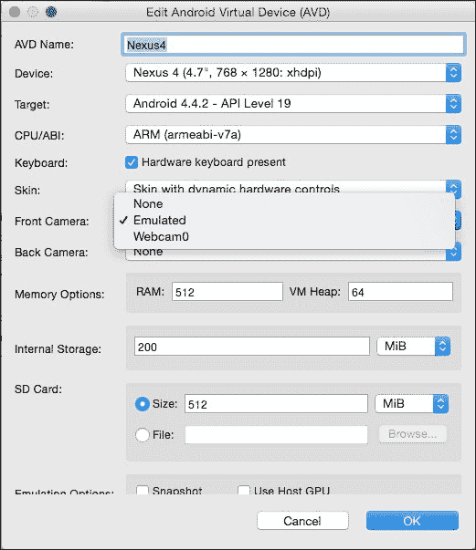
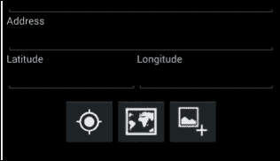

# 第十章：添加相机应用集成

移动计算的一个令人兴奋的特性是，大多数 Android 设备都有一些类型的相机，可以用来捕捉照片和/或视频。本章将指导您完成添加捕捉和上传 POI 图片功能所需的步骤，并将包括以下主题：

+   与设备相机集成的方法

+   相机权限和功能

+   捕获和显示照片

+   使用 HTTP 多部分表单上传上传图片

# 选择集成方法

Android 平台提供了两种不同的方式来集成设备相机功能到您的应用中：

+   使用现有的相机应用通过`Intent`方法进行集成

+   创建自己的自定义活动，直接使用 Android API 与相机交互

第二种方法允许对相机视图如何呈现给用户以及用户如何与视图交互有很高的控制度。然而，第一种方法实现起来非常直接，因为它重用了现有的设备相机应用来捕捉图片。我们将采用`Intent`方法，因为它代表了一种非常实用的添加相机集成的方式。

# 权限和功能

在深入讨论集成设备相机功能的具体细节之前，我们将更详细地讨论与相机相关的通用权限和功能。以下表格包含了可能需要的各种权限。在我们的案例中，我们不需要指定这些权限，因为我们使用的是`Intent`方法，外部相机应用会为我们捕捉图片。外部相机应用需要指定所需的相机权限：

权限

描述

`CAMERA`

这是请求使用设备相机权限的应用所需的；如果您使用的是`Intent`方法，则不需要此权限

`WRITE_EXTERNAL_STORAGE`

此权限是必需的，以便将图像或视频保存到设备的外部存储（SD 卡）

`RECORD_AUDIO`

如果您的应用在视频捕获时记录音频

可以使用应用清单文件中的`<uses-feature>`元素来设置应用特定的功能。`<uses-feature>`声明用于通知关于应用所依赖的硬件和软件功能集合。您可以指定`required=true`来声明应用没有声明的功能将无法运行。功能声明仅用于信息目的。在安装应用之前，Android 系统不会进行验证。

以下表格展示了您可以在应用程序清单声明中定义的一组功能：

功能

描述

`android.hardware.camera`

应用使用设备的相机。如果设备支持多个相机，应用将使用面向屏幕背面的相机。

`android.hardware.camera.autofocus`

子功能。应用使用设备相机的自动对焦功能。

`android.hardware.camera.flash`

子功能。应用程序使用设备摄像头的闪光灯。

`android.hardware.camera.front`

子功能。应用程序使用设备的前置摄像头。

`android.hardware.camera.any`

应用程序至少使用一个可以朝任何方向的摄像头。如果不需要后置摄像头，请优先使用此功能`android.hardware.camera`。

在我们的案例中，我们不会指定任何功能作为要求，但在运行时，我们将检查是否有外部应用程序可用于捕获照片。

# 配置模拟器

如果您正在使用模拟器进行开发，您需要配置它以拥有摄像头。如果您使用的计算机有网络摄像头，模拟器可以使用它作为摄像头；否则，您可以选择使用模拟摄像头。

要配置模拟器以使用摄像头，请执行以下步骤：

1.  从主菜单导航到**工具**并打开**Android 模拟器管理器**。

1.  选择您一直在使用的模拟器并选择**编辑**。

1.  在编辑 AVD 对话框的中间，您将看到两个下拉菜单；一个用于**前置摄像头**，一个用于**后置摄像头**。做出您的选择并点击**确定**：

# 扩展数据服务

由于我们已决定使用外部摄像头应用程序来捕获图片，它将在捕获图片后负责保存图片。我们将必须提供图像将保存的存储路径。为了保存 POI 图像，我们将使用类似于`poiimage<poi id>.jpg`的命名方案。

现在让我们扩展`POIService`类，添加以下附加方法。

## 实现 GetFileName()

让我们在`POIService.cs`中实现`GetFileName()`方法，该方法将负责提供在设备内存中保存图像的绝对路径。绝对路径包括位置和文件名。图像文件将被命名为`poiimage<poi id>.jpg`。以下列表显示了如何构造文件名：

```java
public static string GetFileName (int poiId)
{
  String storagePath = System.IO.Path.Combine (Android.OS.Environment.ExternalStorageDirectory.Path, "POIApp");
  String path = System.IO.Path.Combine (storagePath, "poiimage" + poiId + ".jpg");
  return path;
}
```

## 实现 GetImage()

如前几节所述，图像的保存可以通过相机意图完成。但是，我们需要编写两个辅助方法来从设备存储中读取和删除图像。

让我们添加一个`GetImage()`辅助方法，它将被用来从设备内存位置读取 POI 图像，该位置是之前保存的。将以下列表添加到`POIService.cs`类中：

```java
public static Bitmap GetImage(int poiId)
{
  string filename = GetFileName (poiId);
  if (File.Exists (filename)) {
    Java.IO.File imageFile = new Java.IO.File (filename);
    return BitmapFactory.DecodeFile (imageFile.Path);
  }
  return null;
}
```

## 实现 DeleteImage()

用户通过点击删除操作栏按钮删除`poi`对象后，目前 POI 将从服务器删除。一旦从服务器端删除成功，删除设备内存中的相应 POI 图像是一个好主意。

以下辅助方法用于根据其 POI ID 删除图像：

```java
public void DeleteImage (int poiId)
{
  String filePath = GetFileName (poiId);
  if (File.Exists (filePath)) {
    File.Delete (filePath);
  }
}
```

在本章中，我们不处理删除 POI；然而，为了实现前面描述的更改，您需要在`DeletePOIAsync()`中调用`DeleteImage()`方法：

```java
....
if (response != null || response.IsSuccessStatusCode){
  DeleteImage (poi.Id.Value);
string content = await response.Content.ReadAsStringAsync();
  return content; 
}
....
```

# 从 POIDetailFragment 捕获图像

我们现在准备承担拍照的任务。这涉及到以下任务：

+   添加新的用户界面小部件以启动拍照并显示照片

+   构建一个导航到外部相机应用以拍照的拍照 Intent

+   处理拍照 Intent 的结果并在成功捕获照片后显示照片

以下部分描述了每个步骤的详细信息。

## 添加 UI 元素

我们需要添加一些新的 UI 元素来支持图像捕获；我们需要一个 `ImageButton` 元素来启动捕获图像的过程，还需要一个 `ImageView` 元素来显示捕获的 POI 图像。`ImageButton` 小部件可以添加到位置和地图按钮旁边，而 `ImageView` 元素可以放置在 **名称** 字段上方的第一个小部件。

以下列表显示了 `ImageView` 的定义，它应该放置在 `LinearLayout` 中 POI 名称文本字段之前：

```java
&lt;LinearLayout
    --- &gt;
    &lt;ImageView
        p1:src="img/ic_placeholder"
        p1:layout_width="wrap_content"
        p1:layout_height="200dp"
        p1:id="@+id/poiImageView"
        p1:layout_gravity="center_horizontal"
        p1:scaleType="centerCrop"
        p1:layout_marginBottom="10dp" /&gt;
    &lt;TextView
        p1:text="Name"
        p1:layout_width="fill_parent"
        p1:layout_height="wrap_content"
        p1:id="@+id/textView10" /&gt;
         ---
&lt;/LinearLayout&gt;
```

在 `POIDetailFragment` 中创建一个私有引用对象，并在 `OnCreateView()` 中分配引用：

```java
ImageView _poiImageView;
   ...
_poiImageView = view.FindViewById&lt;ImageView&gt; (Resource.Id.poiImageView);
```

现在，我们需要一个启动相机的按钮。我们将首先将 `ic_new_picture.png` 图标从 `assets` 文件夹复制到项目的 `drawable` 文件夹，并以与之前章节相同的方式将其添加到项目中。

将以下按钮定义添加到包含其他两个按钮的 `LinearLayout` 中：

```java
&lt;ImageButton
    android:src="img/ic_new_picture"
    android:layout_width="wrap_content"
    android:layout_height="wrap_content"
    android:id="@+id/photoImageButton" /&gt;
```

前述布局更改的输出应类似于以下截图：



在 `POIDetailFragment` 中创建一个私有引用对象，并按如下方式在 `OnCreateView()` 中分配引用：

```java
ImageButton _photoImageButton;
   ...
   _photoImageButton = view.FindViewById&lt;ImageButton&gt; (
     Resource.Id.photoImageButton);
   _photoImageButton.Click += NewPhotoClicked;
```

注意，在前述代码片段中，我们将 `NewPhotoClicked()` 事件监听器分配给 `photoImageButton` 按钮。我们将在本章接下来的部分完成 `NewPhotoClicked()` 方法的实现。

## 创建相机 Intent

要启动外部相机应用以拍照，我们再次依赖 `Intent` 类，这次结合了一个动作。以下列表展示了创建具有图像捕获动作的 `Intent` 类：

```java
Intent cameraIntent = new Intent(MediaStore.ActionImageCapture);
```

`MediaStore` 类包含内部和外部存储设备上所有可用媒体的元数据。`MediaStore.ActionImageCapture` 动作告诉 Android 平台，您想要捕获照片，并且愿意使用任何提供这些功能的现有应用。

## 检查已注册的相机应用

在第九章“使 POIApp 具有位置感知能力”中，我们使用 `PackageManager` 检查是否安装了可以处理我们 intent 的地图应用。我们现在需要执行相同的检查以确定可以处理我们的 `ActionImageCapture` intent 的应用。以下列表显示了我们需要执行的逻辑：

```java
PackageManager packageManager = PackageManager;
IList&lt;ResolveInfo&gt; activities = packageManager.QueryIntentActivities(cameraIntent, 0);
if (activities.Count == 0) {
  //display alert indicating there are no camera apps
}
else {
  //launch the camera Intent
}
```

## 通过 Intent 提供附加信息

在我们启动意图之前，我们需要向处理我们请求的相机应用提供一些信息；具体来说，是一个文件名和位置，以及结果照片的最大尺寸。你必须小心提供最大尺寸的值；这可能会引起内存溢出异常的潜在威胁。我们通过向意图添加`Extras`来完成此操作。`MediaStore`类定义了多个标准`Extras`，可以将它们添加到意图中，以控制外部应用如何满足意图。

### 提供文件名和位置

`MediaStore.ExtraOutput`额外可以用来控制外部相机应用在捕获图像时应使用的文件名和位置。我们之前在`POIService`类中添加了`GetFileName()`方法来提供文件路径信息。然而，相机应用期望文件路径是一个`Android.Net.Uri`实例；因此，我们需要将字符串路径转换为`Android.Net.Uri`实例。

这是一个两步过程。首先，我们使用来自数据服务的字符串路径创建一个`Java.IO.File`对象，然后创建一个`Android.Net.Uri`对象。以下列表展示了如何完成 URI 的构建和设置`MediaStore.ExtraOutput`额外：

```java
Java.IO.File imageFile = new Java.IO.File(POIData.Service.GetFilename(_poi.Id.Value));
Android.Net.Uri imageUri = Android.Net.Uri.FromFile (imageFile);
cameraIntent.PutExtra (MediaStore.ExtraOutput, imageUri);
```

### 提供大小限制

`MediaStore.ExtraSizeLimit`额外限制图像大小。如所示，设置起来更为直接：

```java
cameraIntent.PutExtra (MediaStore.ExtraSizeLimit, 1.5 * 1024);
```

## 启动意图

现在我们已经准备好通过调用`StartActivity()`方法启动相机应用。与地图应用不同，在相机意图的情况下，我们期望从活动中返回结果。我们期望相机应用提供一张照片或用户取消拍照的通知。这可以通过传递意图调用`StartActivityForResult()`来实现。`StartActivityForResults()`方法与`OnActivityResult()`活动回调协同工作，以通信意图的结果。

以下列表展示了调用`StartActivityForResult()`的方法：

```java
const int CAPTURE_PHOTO = 0;
.. .
StartActivityForResult(cameraIntent, CAPTURE_PHOTO);
```

注意`StartActivityForResult()`的第二个参数。它是一个名为`requestCode`的整数值，它将在回调中的`OnActivityResult()`作为参数返回，并帮助您识别启动意图的原始原因。最佳实践是为每个可能引起`OnActivityResult()`被调用的`requestCode`定义一个常量值来传递。

注意，当我们从片段中调用`StartActivityForResult()`方法时，结果将始终返回到托管`POIDetailsFragment`的活动`OnActivityResult()`方法。然而，在这种情况下，我们正在`POIDetailsFragment`本身中寻找结果。为此，我们需要覆盖所有托管活动的`OnActivityResult()`方法，并调用`base.OnActivityResult`来触发回调到片段上声明的`OnActivityResult()`方法。

## 完成 NewPhotoClicked()方法

我们以某种碎片化的方式覆盖了许多与启动相机应用相关的主题。以下列表是`NewPhotoClicked()`的完整实现：

```java
int CAPTURE_PHOTO = 100;
void NewPhotoClicked (object sender, EventArgs e)
{
  if (_poi.Id &lt;= 0){
  Toast.MakeText (activity, "You must save the POI before attaching a photo.", ToastLength.Short).Show ();
  return;
  }
   Intent cameraIntent = new Intent (MediaStore.ActionImageCapture);
  PackageManager packageManager = Activity.PackageManager;
  IList&lt;ResolveInfo&gt; activities = packageManager.QueryIntentActivities (cameraIntent, 0);
  if (activities.Count == 0) {
    Toast.MakeText (activity, "No camera app available.", ToastLength.Short).Show ();
  } else {
    string path = POIService.GetFileName (_poi.Id);
    Java.IO.File imageFile = new Java.IO.File (path);
    Android.Net.Uri imageUri = Android.Net.Uri.FromFile (imageFile);
    cameraIntent.PutExtra (MediaStore.ExtraOutput, imageUri);
    cameraIntent.PutExtra (MediaStore.ExtraSizeLimit, 1 * 1024 * 1024);
    StartActivityForResult (cameraIntent, CAPTURE_PHOTO);
  }
}
```

## 处理 Intent 的结果

启动活动通过`OnActivityResult()`回调方法通知 intent 的结果。让我们向`POIListActivity`和`POIDetailActivity`添加以下回调以触发回调到`POIDetailFragment`：

```java
protected override void OnActivityResult (int requestCode, Result resultCode, Intent data)
{
  base.OnActivityResult (requestCode, resultCode, data);
}
```

现在，让我们在`POIDetailFragment`类中重写`OnActivityResult`方法。以下列表显示了`OnActivityResult()`方法的签名：

```java
public override void OnActivityResult (int requestCode, Result resultCode, Intent data)
```

我们在上一节讨论了`requestCode`。`resultCode`参数表示启动的 intent 的结果，其类型为**Result**，可以有以下值：

值

意义

`RESULT_OK`

活动成功完成了请求

`REQUEST_CANCELED`

活动通常由用户操作取消

`REQUEST_FIRST_USER`

可以用于自定义意义的第一个值

第三个参数`data`是`Intent`类型，可以用来从启动的活动传递额外的信息。在我们的案例中，我们只关心`requestCode`和`resultCode`。以下列表显示了`POIDetailFragment`中`OnActivityResult()`的实现：

```java
public override void OnActivityResult (int requestCode, Result resultCode, Intent data)
{
  if (requestCode == CAPTURE_PHOTO) {
    if (resultCode == Result.Ok) {
      Bitmap bitmap = POIService.GetImage (_poi.Id.Value);
      _poiImageView.SetImageBitmap (bitmap);
      if (bitmap != null) {
        bitmap.Dispose ();
        bitmap = null;
      }
    } else {
    Toast.MakeText (Activity, "No picture captured.", ToastLength.Short).show();
    }
  } else {
    base.OnActivityResult (requestCode, resultCode, data);
  }
}
```

注意，当`resultCode`是`RESULT_OK`时，我们将捕获的图片加载到 Bitmap 对象中，然后设置给`_poiImageView`。这导致图片在`POIDetailFragment`布局的顶部显示。如果`resultCode`不是`RESULT_OK`，我们向用户显示一个 toast 消息，指示操作已取消。

我们正在使用`GetImage()`在`POIService`中从内存中检索图片。这是一个简单的实用方法，它接受一个 POI ID 并使用 Android 实用类`BitmapFactory`加载`Android.Graphics.Bitmap`。

到目前为止，我们已经添加了很多代码。运行`POIApp`，从`POIDetails`页面点击添加图片按钮以调用相机。注意，捕获的图片将在`POIDetails`屏幕上显示。

# 使用 HTTP 多部分上传上传图片

我们在`POIApp`示例应用程序中要实现的最后一项功能是将捕获的 POI 图片上传到服务器。目前，我们只将 POI 详情保存在云上，POI 图片存储在用户的设备内存中。将图片上传到服务器会很好，这样我们就不必担心当用户从设备上本地删除它们时丢失图片。

如果用户已经捕获了 POI 的图片并且它可在设备内存中本地使用，那么保存操作将使用多部分表单上传将图片和数据一起发布。否则，它将只发布用于保存操作的 POI JSON 数据。

在我们创建多部分表单数据请求之前，让我们首先了解 Web 服务 API 规范。以下块描述了多部分表单上传的 Web 服务 API 要求：

```java
Endpoint: com.packt.poiapp/api/poi/upload
Request-Type: multipart/form-data POST
    -----BOUNDARY
    Content-Disposition: form-data; name="file"; filename="poiimage1.jpg"
  Content-Type: application/octet-stream
/9j/4AAQSkZJRgABAQEAYABgAAD/2wBDAAgGBgcGBQgHBwcJCQgKDBQNDAsLDBkSEw8UHRofHh0aHBwgJC4nICIsIxwcKDcpLDAxNDQ0Hyc5PTgyPC4zNDL/2wBDAQkJCQwLDBgNDRgyIRwhMjIyMjIyMjIyMjIyMjIyMjIyMjIyMjIyMjIyMjIyMjIyMjIyMjIyMjIyMjIyMjIyMjL===
  -----BOUNDARY
   -----BOUNDARY
  Content-Disposition: form-data; name="poi"; 
  Content type = application/json, Encoding:UTF8
  Body= {"id":"1","latitude":"51.5033","longitude":"0.1197","name":"London Eye","description":"...","image":""}
  -----BOUNDARY
```

注意，前面的 API 规范使用了`multipart/form-data`编码类型。在这本书的早期部分，我们使用 HTTP `POST`方法上传 POI JSON 对象，但现在我们需要发送 POI 数据和位图流，这些数据不能使用`POST`方法上传。我们需要使用`multipart/form-data`编码类型，通过它可以附加图像以及其他消息内容。

一个名为`boundary`的标准分隔符用于分隔多部分消息的每一部分。消息的每一部分都可以定义自己的标准头，例如`Content-Type`和`Content-Disposition`，提供包含其值的文件名。多部分分隔符和头字段始终是 7 位 ASCII，不区分大小写。图像内容位于`Content-Type`头下方，接着是 POI JSON 字符串的值。

想要获取关于多部分`Content-Type`的更详细信息，请搜索**RFC 1341(MIME**)并访问[`www.w3.org/Protocols/rfc1341/7_2_Multipart.html`](http://www.w3.org/Protocols/rfc1341/7_2_Multipart.html)。

现在我们已经了解了上传图像和 POI 数据的 API 规范，让我们继续实施：

1.  在`POIService`类中为`CreateOrUpdatePOIAsync()`方法创建一个重载版本，该方法接受两个参数：`PointOfInterest`对象和 POI 图像`bitmap`：

    ```java
    public async Task&lt;String&gt; CreateOrUpdatePOIAsync(PointOfInterest poi, Bitmap bitmap)
    {
    ...
    }
    ```

1.  添加以下代码片段以将 POI 对象转换为 JSON 对象，然后转换为`StringContent`。由于我们已经在发送 POI 数据时做过类似的事情，因此不需要解释：

    ```java
    var settings = new JsonSerializerSettings ();
    settings.ContractResolver = new POIContractResolver ();
    var poiJson = JsonConvert.SerializeObject (poi, Formatting.None, settings);
    var stringContent = new StringContent(poiJson);
    ```

1.  现在将位图图像转换为字节数组，以便通过多部分表单上传发送`ByteArrayContent`：

    ```java
    byte[] bitmapData;
    var stream = new MemoryStream();
    bitmap.Compress(Bitmap.CompressFormat.Jpeg, 0, stream);
    bitmapData = stream.ToArray();
    var fileContent = new ByteArrayContent(bitmapData);
    ```

    注意，`bitmap.Compress()`方法将位图的压缩版本写入指定的流。第二个整数参数表示压缩质量，范围从`0`到`100`，其中`0`表示低质量，而`100`是最大值（最低质量）。

1.  添加以下附加内容头，如媒体内容类型和内容处置。POI 图像名称以`poiimage<poid>.jpg`格式发送。将图像保存到数据库的服务器将使用此名称：

    ```java
    fileContent.Headers.ContentType = 
    MediaTypeHeaderValue.Parse ("application/octet-stream");
    fileContent.Headers.ContentDisposition = new ContentDispositionHeaderValue("form-data")
    {
        Name = "file",
        FileName = "poiimage" + poi.Id.ToString () + ".jpg"
    };
    ```

1.  现在我们已经准备好了 POI 数据和图像内容，可以将这两个块添加到`MultipartFormDataContent`中。`boundary`是一个随机字符串，用作分隔符，以分隔消息体的每一部分：

    ```java
    string boundary = "---8d0f01e6b3b5daf";
    MultipartFormDataContent multipartContent= new MultipartFormDataContent (boundary);
    multipartContent.Add (fileContent);
    multipartContent.Add(stringContent, "poi");
    ```

1.  声明一个表示上传 POI 图像的 Web 服务端点的字符串常量，使用多部分：

    ```java
    private const string UPLOAD_POI = "http://YOUR_IP:8080/com.packt.poiapp/api/poi/upload";
    ```

1.  现在我们继续使用`HttpClient`类中的`PostAsync()`方法上传表单内容到服务器。以下代码片段演示了如何使用`HttpClient`类向服务器发送数据：

    ```java
    HttpClient httpClient = new HttpClient ();
    HttpResponseMessage response = await httpClient.PostAsync (UPLOAD_POI, multipartContent);
    if (response.IsSuccessStatusCode) {
        string content = await response.Content.ReadAsStringAsync();
        return content;
    }
    return null;
    ```

上传请求的结果会发送回`POIDetailFragment`。

现在我们有了上传图像以及 POI JSON 数据的方法，让我们改变`POIDetailFragment`类中的`SavePOI()`方法中的逻辑。目前，保存操作验证用户输入并通过传递 POI 对象调用`CreateOrUpdatePOIAsync()`。

现在如果用户使用摄像头捕获了 POI 图像，让我们改为调用新创建的覆盖版本的`CreateOrUpdatePOIAsync()`，并传递 Bitmap、POI 和活动实例。将以下逻辑添加到`SavePOI()`方法中：

```java
POIService service = new POIService ();
Bitmap bitmap = null;
if (_poi.Id&gt;0) {
  bitmap = POIService.GetImage (_poi.Id);  
}
 string response;
if (bitmap != null) {
  response = service.CreateOrUpdatePOIAsync (_poi, bitmap);
} else {
  response = service.CreateOrUpdatePOIAsync (_poi);
}
```

为了使我们的应用程序内存效率更高，在你完成使用 Bitmap 实例后销毁它是好主意。将以下代码添加到销毁 Bitmap 内存中：

```java
if (bitmap != null) {
  bitmap.Dispose ();
  bitmap = null;
}
```

我们现在已经完成了`POIApp`应用程序，该应用程序练习了您在开发专业应用程序时需要利用的许多 Xamarin.Android 功能。虽然该应用程序在本质上相对简单，但我们希望它能提供一个良好的 Android 应用程序开发的入门指南。祝您 Xamarin.Android 开发顺利！编码愉快！

# 摘要

在本章中，我们通过添加与摄像头的集成完成了`POIApp`。现在我们有一个演示了 Android 平台许多功能的 App。

在上一章中，我们将讨论各种应用分发渠道以及准备应用程序部署的步骤。
