# 第十一章。将应用发布到应用商店

如果每个人都能享受它，那么一个应用就是有用的，这意味着要找到一种方法使其对大众可用。在本章中，我们将探讨使您的应用准备好部署的各个方面，并讨论将 Android 应用发布到市场的各种选项。在本章中，我们将涵盖以下主题：

+   准备应用发布

+   发布用于上传的已签名 APK

+   不同的应用分发选项

+   在 Google Play 上发布

# 准备应用发布

当您的应用完全开发完成后，您投入大量精力验证每个关键功能模块的时刻至关重要。许多开发者更喜欢使用不同的测试自动化框架（如 Robotium、Appium、Xamarin Test Cloud 等）来测试应用，或者一些开发者使用手动测试来验证目标设备上的应用。一旦您确信应用不包含任何明显的错误并且运行得像预期的那样顺畅，您就可以准备将应用部署到应用商店。

以下部分讨论了在生成发布版 APK 之前需要考虑的各个方面。

## 禁用调试模式

在应用开发过程中，Xamarin Studio 支持使用 **Java 调试 Wire Protocol**（**JDWP**）进行调试。这对于开发目的来说很棒，但对于已部署的应用来说存在安全风险，因此需要在发布的应用中禁用。有两种不同的方法可以实现这一点：

1.  在 `AndroidManifest.xml` 文件中设置应用的 `android:debuggable` 属性。

1.  使用 `AssemblyInfo.cs` 条件指令。

要使用 Android 的 `AndroidManifest.xml` 描述符来移除调试模式，您需要将 `android:debuggable` 属性的值设置为 `false`。以下列表显示了如何从清单文件中关闭 JDWP 调试：

```java
&lt;application ...
  android:debuggable="false" ...
&lt;/application&gt;
```

禁用调试模式的另一种方法是使用 `AssemblyInfo.cs` 文件中的条件指令。以下列表显示了如何使用条件指令根据所选配置关闭或打开 JDWP 调试。这种方法的优势在于它基于当前所选配置：

```java
#if RELEASE
   [assembly: Application(Debuggable=false)]
 #else
   [assembly: Application(Debuggable=true)]
 #endif
```

## 配置链接选项

默认情况下，发布模式会关闭共享运行时并开启链接，以便您的分发 APK 只包含应用所需的 Xamarin.Android 运行时部分。链接器通过执行对编译代码的静态分析来确定哪些程序集、类型和类型成员被应用使用。所有未使用的程序集、类型和成员都被移除，以减少应用的整体大小。

**链接选项**可以在 **Android 构建**部分的**项目选项**对话框中查看和设置：

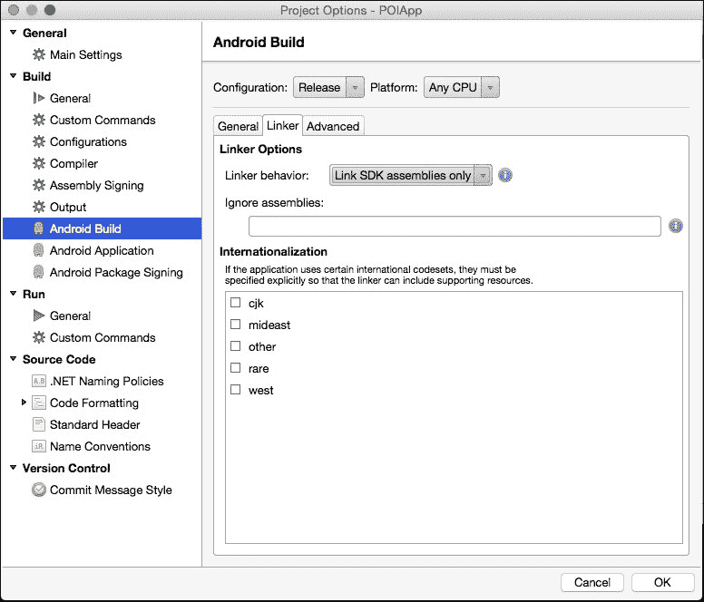

当查看和调整**链接器选项**时，请确保首先从**配置**下拉框中选择**发布**。Xamarin.Android 提供以下链接行为：

+   **不要链接**：这将关闭链接器；不会执行任何链接操作。

+   **仅链接 SDK 组件**：这将仅链接 Xamarin.Android 所需的组件；其他组件将不会链接，它们将以单独的组件形式分发。

+   **链接所有组件**：这将链接应用程序所需的全部组件，而不仅仅是 Xamarin.Android 所需的组件。

### 链接的副作用

在某些情况下，链接可能会产生一些意外的副作用，包括需要类型和成员被意外丢弃。对于在发布模式下编译和链接的应用程序，进行彻底的测试周期非常重要，以确保应用程序不会受到这种副作用的影响。实际上，在大多数情况下，测试应超出初始开发者的测试，并使用 APK 文件在发布模式下进行生成。

如果您遇到与缺失类型相关的运行时异常或构建失败问题，或者难以定位特定方法，您可能需要提供一个自定义链接器文件，该文件向链接器提供有关特定类型或成员的明确指令。

以下列表是一个自定义链接文件的示例，该文件指示链接器始终包含特定类型及其特定成员集：

```java
&lt;?xml version="1.0" encoding="UTF-8" ?&gt;
&lt;linker&gt;
    &lt;assembly fullname="Mono.Android"&gt;
       &lt;type fullname="Android.Widget.AdapterView" &gt;
         &lt;method name="GetGetAdapterHandler" /&gt;
         &lt;method name="GetSetAdapter_Landroid_widget_Adapter_Handler" /&gt;
       &lt;/type&gt;
    &lt;/assembly&gt;
&lt;/linker&gt;
```

可以将自定义链接文件添加到项目中作为简单的 XML 文件。将文件添加到项目后，选择该文件，打开**属性**面板，并从**构建操作**菜单中选择**链接描述**，如图下所示：

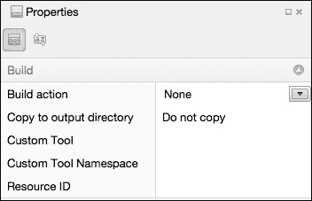

## 选择支持的 ABIs

Android 支持多种不同的 CPU 架构。Android 平台定义了一组**应用程序二进制接口**（**ABIs**），对应不同的 CPU 架构。默认情况下，Xamarin.Android 假定在大多数情况下**armeabi-v7a**是合适的。如果您需要支持额外的架构，那么您必须检查每个适用的架构。这将导致构建过程生成将在所有目标 ABIs 上运行的代码，以及包括适用于每个架构的本地库。

支持的 ABIs 可以在**项目选项**对话框的**Android 构建**部分指定：

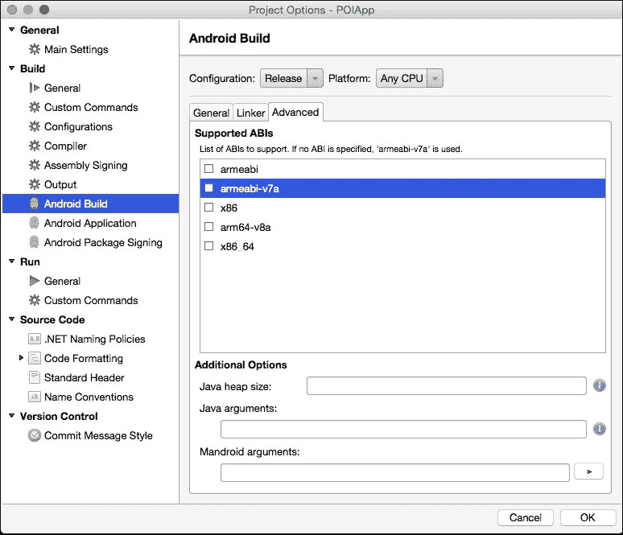

我遇到需要指定附加 ABIs 的场景之一是在测试过程中。我多次与一组测试人员合作；其中一些拥有物理设备，而另一些则使用模拟器。为了支持 x86 模拟器的使用，您需要在支持的 ABIs 列表中包含 x86。

## 验证包名、图标和应用程序版本

在准备发布构建以上传到 Android 市场之前，您需要验证几个额外的清单属性。本节将带您了解这些关键项目。

### **包名**

包名是您应用程序在 Google Play 中的唯一标识符。应用程序包名在`AndroidManifest.xml`文件中定义。一旦您的应用程序使用此名称部署到市场，以后就不能更改它。更改应用程序包名意味着它将被视为一个全新的应用程序。

Android 应用程序包名应该是唯一的，并且名称可以包含大写或小写字母（'A'到'Z'）、数字和下划线（'_'）。通常，使用您的互联网域名所有权作为包名的基础是一种最佳实践。例如，由 Yahoo 发布的应用程序将以`com.yahoo.&lt;app id&gt;`开头。

大多数应用程序设置可以通过直接编辑`AndroidManifest.xml`文件或在项目**选项**窗口中进行控制。要修改`AndroidManifest.xml`中的包名，您需要使用`package`属性，如下面的代码片段所示：

```java
&lt;?xml version="1.0" encoding="utf-8"?&gt;
&lt;manifest 
  package="com.packt.poiapp"&gt;
  ...
&lt;/manifest&gt;
```

在 Xamarin Solution Explorer 中右键单击您的项目，然后选择**选项**以打开**项目选项**窗口。以下截图展示了 Xamarin Studio 中的项目选项窗口：

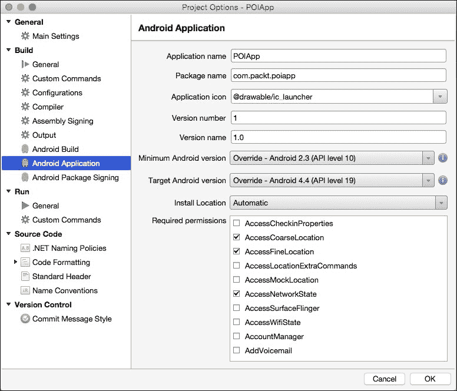

### 应用程序名称和图标

制作一个在设备上工作的应用程序并不足够。您还需要提供一个代表您品牌或产品的优质应用程序图标。毕竟，应用程序图标是用户在设备上安装应用程序后首先注意到的东西。您必须为 mdpi、hdpi、xhdpi 和 xxhdpi 密度的设备准备应用程序启动器图标。

一旦启动器图标准备就绪，请将它们添加到相应屏幕密度的 drawable 资源文件夹中。您可以通过将`android:label`属性设置为`AndroidManifest.xml`文件中的`&lt;application&gt;`元素来设置应用程序名称，并为设置应用程序图标，可以使用`android:icon`属性：

```java
&lt;manifest &#x2026;&#x2026;. &gt;
     &lt;application
android:label="POIApp"
    android:icon="@drawable/ic_launcher"&gt;
&lt;/application&gt;
&lt;/manifest&gt;
```

您可以参考官方 Google 应用程序图标设计指南：[`www.google.com/design/spec/style/icons.html#icons-product-icons`](http://www.google.com/design/spec/style/icons.html#icons-product-icons)。

### **应用程序版本控制方案**

应用程序版本控制方案用于跟踪不同的构建版本。这也帮助在应用程序有可下载的升级版本时通知用户。Android 使用以下两个不同的清单属性来定义构建版本信息：

+   `android:versionCode`：这是一个表示应用程序当前构建版本的整数值。内部，Google Play 使用此属性来处理构建更新过程，例如在应用程序的新版本可用时通知用户。您必须为每个后续版本增加`versionCode`的值。

+   `android:versionName`：这是一个表示应用程序发布版本的字符串。此版本代码将在 Google Play 上向用户公开显示。请注意，此字符串在 Google Play 上不是强制性的，也不在内部使用，但它只是向用户显示。

这两个属性可以从**项目选项**窗口或应用程序清单文件中设置：

```java
&lt;manifest 
  android:versionCode="1"
  android:versionName="1.0"
  package="com.packt.POIApp"&gt;
  ....
  ....
&lt;/manifest&gt;
```

## 审查用户权限

安卓应用程序必须声明它需要访问应用程序中某些功能的权限列表。安卓应用程序权限在`AndroidManifest.xml`文件中使用`<uses-permission>`标签声明。当应用程序正在用户设备上安装时，安卓系统读取清单文件并向用户显示列表。用户必须决定允许权限以完成安装。以下截图显示了下载 Facebook 移动应用程序时的应用程序权限对话框：

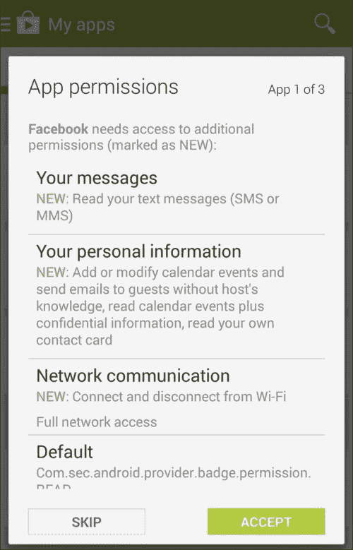

在准备应用程序的发布版本构建时，请确保您的应用程序清单文件仅定义了应用程序所需的权限。例如，一个请求读取通话记录权限的相机应用程序可能会引起用户的不满，并且有很高的可能性用户不会下载您的应用程序。

# 发布用于上传的已签名 APK

完成所有之前的步骤后，我们将进入最后一步，准备一个用于在不同应用商店发布的已签名 APK。以下部分将讨论在 Xamarin Studio 内部生成已签名 APK 的步骤。

## Android 密钥库

**密钥库**是由 Java SDK 中的**keytool**程序创建和管理的安全证书数据库。密钥库是创建安卓应用程序发布版本的重要方面。安卓设备无法运行未经数字签名的应用程序。这可能有些令人惊讶，因为我们已经运行了我们的应用程序一段时间了。在开发过程中，Xamarin.Android 使用**调试密钥库**在从 IDE 运行应用程序时对构建进行签名，并且因此运行在设备上的应用程序。这个密钥库仅用于调试目的，但不会被视为发布应用程序的分发有效密钥库。

密钥库必须得到妥善保管，因为发布应用程序所有未来版本都需要相同的密钥库密钥。如果密钥库丢失，将无法在 Google Play 上发布应用程序的更新。唯一的解决方案是创建一个新的密钥库，并将新版本作为全新的应用程序发布。

可以使用 Java JDK 中提供的**keytool**和**jarsigner**命令行工具创建密钥库。以下命令用于使用 Java keytool 工具创建密钥库：

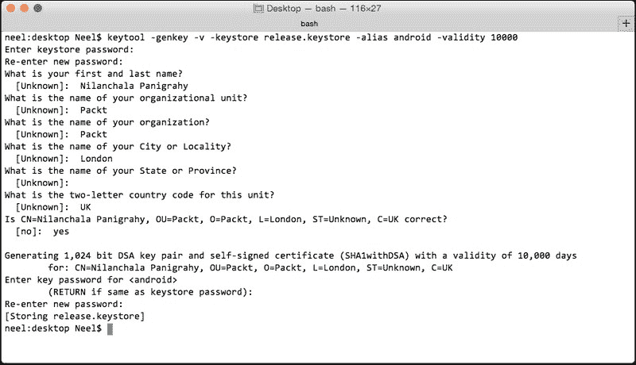

注意，前面的命令提示用户提供密码和其他必需的详细信息以生成**release.keystore**密钥。

虽然可以直接使用命令行 keytool 工具创建和管理 keystore，但 Xamarin.Android 提供了一个用户界面来访问此工具，该界面集成到发布过程中。以下部分将指导您创建 keystore 并为发布准备签名 Android 构建。

## 从 Xamarin.Android 发布

以下步骤将指导您在创建签名`.apk`文件的过程中创建新的 keystore：

1.  在**运行配置**下拉框中，选择**发布**选项：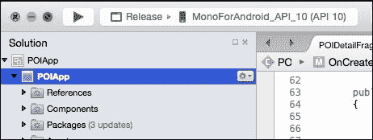

1.  在 Xamarin Studio 工具栏中导航到**构建**|**发布准备**选项。您将看到最新的`POIApp`构建列表，如下截图所示。如果您从未构建过代码，它将为您构建并生成一个：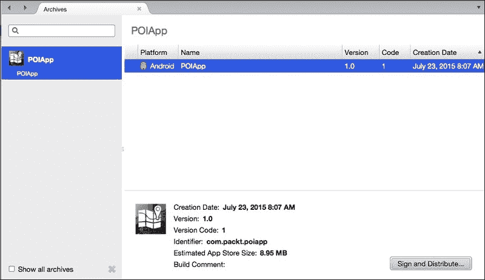

1.  从列表中选择最新构建，然后单击底部的右下角的**签名和分发…**按钮。您将看到两个选项：**临时**或**Google Play**。如果您选择**临时**选项，它将创建一个构建并将其保存在您的磁盘上。您需要手动将应用发布到 Google Play。然而，**Google Play**选项允许您直接从 Xamarin Studio 将应用发布到 Google Play。

    然而，始终创建一个签名构建并将其保存在您的计算机上是一个好主意，这样您可以在将其发布到 Google Play 之前验证所有功能：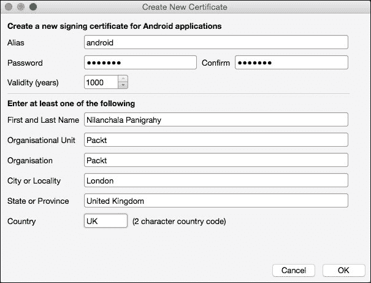

    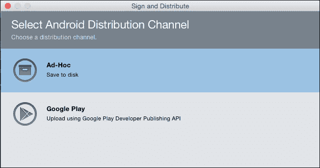

1.  让我们选择**临时**并单击**下一步**。注意，它将打开**Android 签名身份**向导，带有两个按钮：**创建新密钥**和**导入现有密钥**。如果您之前使用 Java keytool 命令行工具创建了 keystore，您需要直接选择**导入现有密钥**。

    在此示例中，我已选择**创建新密钥**按钮来演示 Xamarin Studio 如何简化创建新 keystore 的过程。

1.  选择**创建新密钥**按钮。

1.  填写所有必需的详细信息，例如别名、密码、全名、有效期等，然后选择**确定**以确认：

1.  它将创建一个新密钥并显示**Android 签名身份**对话框。选择密钥并单击**下一步**。

1.  注意，它将显示一个确认对话框，如下截图所示：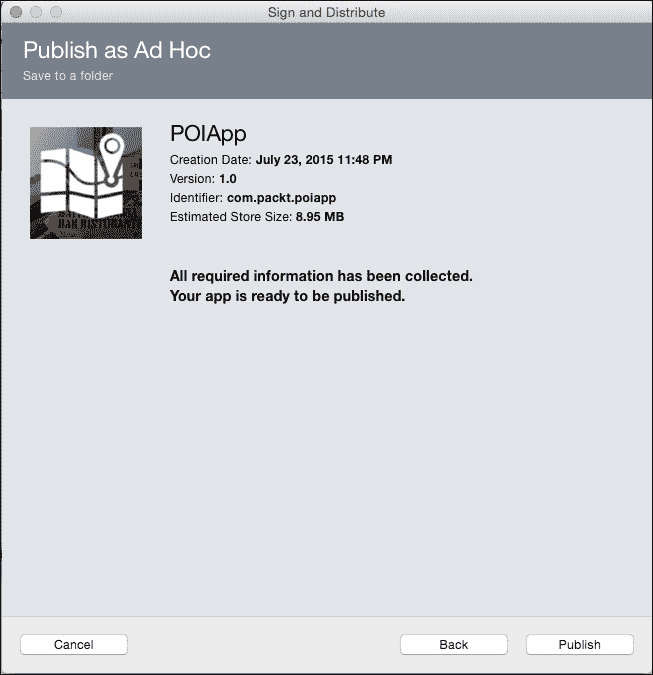

1.  选择**发布**。它将提示您选择保存 apk 文件的存储位置。按照提示，在生成签名 APK 时，您需要提供 keystore 密码：

生成的 APK 已准备好进行最终测试和潜在的分发。

## 重新发布应用

在部署应用程序的第一个版本时创建的密钥库非常重要，应该保持安全。密钥库、别名和密码应该保持安全，以确保只有有权发布应用程序新版本的授权人员才能访问它们。

# 不同的应用分发选项

Android 开发者有几种分发应用程序的选项，包括以下内容：

+   通过私有云或网站链接自发布

+   通过电子邮件附件分发

+   在 Google Play 上发布

+   在第三方应用商店发布

## 通过网站链接或电子邮件自发布

网站链接和电子邮件附件相当直接，易于完成，可能适合一些公司内部使用或由一小群合作伙伴使用的应用程序。

在从网站链接或电子邮件附件安装应用程序之前，你必须首先更新你的设备安全设置，以允许从**未知来源**安装应用程序。让我们看看以下截图：

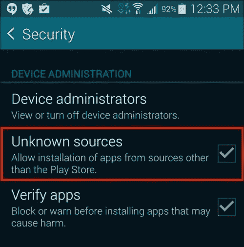

启用此选项后，当你选择电子邮件附件或包含 APK 的网页链接时，将提示你安装应用程序。

注意，对于普通消费者来说，网站链接和电子邮件作为分发手段并不理想。像 Google Play 和 Amazon Appstore 这样的市场与自发布方法相比提供了显著的优势。以下是通过应用商店分发应用程序的一些优势：

+   大多数应用商店都提供审查流程，以确保应用程序不是恶意的。谷歌最近推出了一种应用商店审查流程，该流程验证了违反 Android 开发者政策、构建大小、权限等问题。审查流程加强了 Android 社区，并有助于建立消费者的信任。

+   通过在 App Store 上分发应用程序提供强大的基础设施，以接触数百万消费者。

+   推广应用程序并允许消费者进行内容评级。

+   处理使用订阅或购买的应用程序的财务结算。

## 在 Google Play 上发布

Google Play 是一个理想的市场，可以上传和分发你的应用程序给更广泛的受众。这是一个单一的平台，允许应用发布者分发、广告、通过销售你的应用程序赚钱，并分析应用程序的使用和统计数据。另一方面，每台 Android 设备都预装了 Google Play Android 应用程序，通过这个应用程序，你的发布的应用程序将被发现并下载给用户。

在你的应用程序推向市场之前，从用户那里获得一些真实的反馈总是很有价值的。开发者倾向于将应用程序的 alpha/beta 版本分发给一组用户并收集反馈。Beta 测试可以帮助你从真实用户那里获得早期反馈，并在进入生产阶段之前解决这些问题。

Google Play 允许您设置和分发您应用的 alpha 和 beta 阶段发布版本。在准备并上传到 beta 阶段的应用程序发布版本后，您可以邀请一组您希望分发应用的测试者。收到邀请的测试者可以下载应用，提供反馈并评分您的应用。本书不包括使用 Google Play 测试计划的详细步骤。如需更多详情，您可以访问 [`developer.android.com/distribute/tools/launch-checklist.html`](http://developer.android.com/distribute/tools/launch-checklist.html)。

要将您的应用程序发布到 Google Play，您需要遵循以下描述的一些具体步骤：

1.  要在 Google Play 上分发应用，您需要一个开发者账户。要注册为开发者，需要一次性注册费 25 美元。您可以根据屏幕上的说明注册为开发者，注册链接为 [`play.google.com/apps/publish/signup/`](https://play.google.com/apps/publish/signup/)。

1.  准备在上传应用程序时所需的宣传资产，如图形、视频和宣传信息。以下是一份列表：

    +   准备宣传信息，包括应用程序标题、简短描述和完整描述

    +   高分辨率的应用程序图标，尺寸为 512 w x 512 h

    +   特征图形，尺寸为 1024 w x 500 h

    +   宣传图形，尺寸为 180 w x 120 h

    +   展示您应用的可选宣传 YouTube 视频

1.  一旦准备好 APK 的发布版本和宣传内容，应用程序就可以上传到 Google Play。这是通过登录 Google Play 发布者仪表板完成的：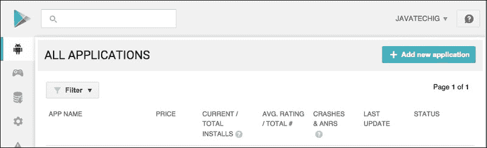

1.  点击**添加新应用**按钮以帮助您上传 APK 的过程：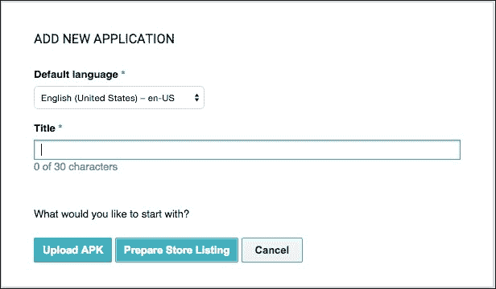

1.  为您的应用在 Google Play 上显示的**标题**提供标题，并点击**上传 APK**。

1.  一旦上传了 APK，您需要通过上传所需的截图和其他宣传材料来完成**商店列表**的详细信息。

1.  在上传过程中，所有应用都必须根据 Google Play 评分系统进行评分。要了解更多关于新的内容评分系统，您可以参考 [`support.google.com/googleplay/android-developer/answer/188189`](https://support.google.com/googleplay/android-developer/answer/188189)。

1.  仪表板上的**定价和分发**选项卡允许您选择应用可用的地理位置。

1.  一旦提供所有必要的详细信息，您现在可以点击**发布应用**按钮，使您的应用可供下载。

## 第三方应用商店

Google Play 并非是您将应用程序分发到全球的唯一选择。您应该考虑使用其他分发渠道，例如 Mall.Soc.io ([`soc.io/apps`](http://soc.io/apps))、GetJar ([`www.getjar.com/`](http://www.getjar.com/))、Amazon Appstore 等等。Google 没有对在其他市场重新分发相同的应用程序施加任何限制。考虑所有可用的选项，以充分利用您的努力。

# 摘要

在本章中，我们简要讨论了准备和签名 APK 发布版本的过程。我们还讨论了开发者可用的不同应用程序分发渠道。

我们现在已经完成了`POIApp`应用程序，该应用程序练习了您在开发专业 Android 应用程序时将需要的许多 Xamarin.Android 功能。然而，本书中还有许多伟大的功能尚未被发现，包括音频、视频、面部识别、蓝牙、NFC 等等。

在本入门指南的背景下，我们简单地没有足够的空间涵盖 Android 支持的所有功能。请确保您访问[`developer.android.com/index.html`](http://developer.android.com/index.html)和[`developer.xamarin.com/`](http://developer.xamarin.com/)以增强您对其他有趣 Android 功能的了解。

我祝愿你在 Xamain.Android 开发中好运！快乐编码！
