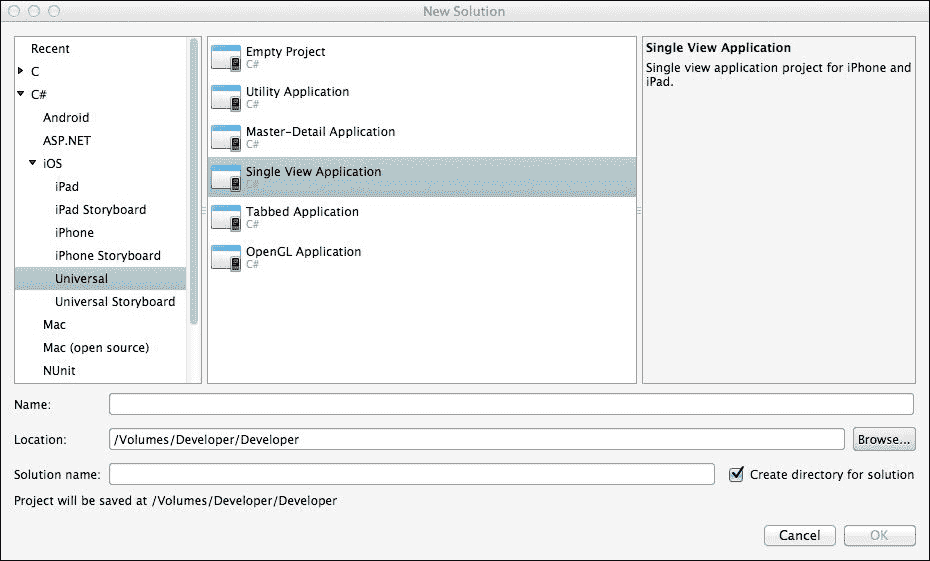
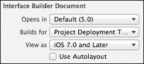

# 第三章 视图和布局

在 iPhone 和 iPad 的层面上，视图可以被认为是你所看到的，但你看到的视图类型（在一定程度上）取决于你创建应用时选择的应用类型。

在本章中，我们将涵盖以下主题：

+   项目及其布局类型

+   确保你的设计适合所有 iOS 设备

+   UI 控件

# 项目类型选择

当你第一次决定创建 iOS 应用时，你会看到以下截图所示的视图：



## 应用类型及其视图类型

项目类型需要一些解释，以下表格中已提供：

| 项目类型 | 视图类型 |
| --- | --- |
| 主-详情 | 基于表格的布局。 |
| 单视图 | 最简单的视图形式。名称并不意味着你的应用只有一个页面，而是指视图不会通过（因此视图 1 可能有跳转到视图 2 的标签页。视图 2 可能是`MT.D`）。 |
| 标签视图 | 一种标准视图，屏幕底部有多个持久标签。视图会变化，但标签保持不变。 |
| OpenGL | 快速、响应式，用于高分辨率游戏。这里不会涉及，因为它超出了本书的范围。 |

在[`oleb.net/blog/2013/05/xcode-project-templates-difference/`](http://oleb.net/blog/2013/05/xcode-project-templates-difference/)可以找到对项目类型的更完整解释。

# iOS 布局

在处理 iPhone（和 iPad）用户界面的布局时，必须考虑许多因素；其中最重要的是屏幕的物理尺寸。虽然使用 Xcode 创建用户界面很容易，但与 Android 设备不同，iOS 并不真正自动调整大小。UI 部分是由于 iOS 中布局的创建方式。

## 画布模型

当我成长的时候，我在学校得到了一个“毛绒布”套件。对于那些不知道这是什么的人来说，毛绒布套件由一块大的背景布组成，你可以在上面粘贴其他布料；这使你能够制作出很多图片。为 iOS 设计也是如此。你可以将用户界面的任何部分拖放到主视图中并留下它。这就是 iOS 拥有其丰富性的部分原因；设计师需要创造，而不是对放置的位置有严格的规则。对于应用来说，UI 元素在屏幕上都有**绝对**的位置，而不是相对于其他对象。然而，这里有一个问题。

如果你增加屏幕尺寸，这些位置保持不变。所以，在 iPhone 4 上看起来不错的东西在 3G 上可能缺失部分，在 iPhone 5 上可能有间隙——不要开始考虑 iPad——因为视图通常位于屏幕中间，通常是挤压在一起的。

## 如何避免这些问题中的某些

最简单的方法是，当使用 Xcode 设计你的 UI 时，你需要在 UI 视图中勾选**使用自动布局**复选框。这会为你完成移动操作。



然而，这里的问题是您需要在每个视图中设置此**使用自动布局**，并且它也不支持 iPhone 3GS。然而，3GS 现在已经非常旧了，可能不值得费心去自动缩放。3GS 支持 iOS 6，但只能通过黑客手段。iOS 5 正接近其生命的终结（在撰写本文时）。 

# 视图和视图控制器

它们听起来很相似，但它们并不相同。将视图控制器和视图视为网页的最简单方法是。一个典型的网页是从服务器提供的信息。内容可能是动态创建的（例如，从数据库查询），但对于用户来说，它只是数据。这将被视为视图。它上面有东西，但没有真正的用户交互。

视图控制器更接近于使用 `ASP.net` 或其他形式的语言构建的网页（例如 PHP）。该网站有一个按钮。按钮有一个事件，然后将其反馈到按钮背后的代码（称为处理代码）。使用 Xcode 创建的视图是网页，带有连接的源文件是服务器。

如前一章所述，`UIViewController`上的对象通过点击控件（以及按住*Ctrl*键）并将小部件拖到连接器入口窗口来与控件的代码（称为处理代码）连接。

## 其他视图

除了视图选择之外，还有许多其他视图可用，如下表所示：

| 视图名称 | 描述 |
| --- | --- |
| **活动指示器** **视图** | 它是一个模态指示器，显示正在发生某事（活动）。这可能是指网页的加载或地图的渲染。 |
| **进度** **视图** | 它显示了活动的进度——给用户一个更好的想法，了解某件事将花费多长时间。 |
| **集合** **视图** | 它显示一组单元格（`CollectionViewCells`）。每个单元格都可以被定义。 |
| **可重用集合视图** | 可重用集合的工作方式如下：假设你有一组单元格，为了论证，它们占据了屏幕。在一个标准集合中，当单元格离开屏幕时，它们仍然被保留在集合中。虽然这使它们返回时的渲染更快，但它们会占用内存空间。可重用集合存储单元格的指针，并在返回屏幕时刷新——然后集合被重用。 |
| **表格视图** | 它将在第四章中介绍，*控制器*。 |
| **图片视图** | 可以将其视为一个图片视图。它没有点击事件，显示图片。然而，它可以在其中播放动画。 |
| **文本视图** | 它显示多行文本。可以是只读的，也可以是读写。 |
| **网页视图** | 它是一个用于渲染 HTML 的视图。HTML 文件可以存储在手机上或远程。 |
| **地图视图** | 它显示带有各种选项的地图。地图将在本书的后面部分介绍。 |
| **滚动视图** | 它是一个设计用来在屏幕上容纳比屏幕尺寸实际允许的更多内容的视图。 |
| **选择视图** | 它是一个用户可定义的选择器。 |
| **广告横幅视图** | 它是用于应用内广告的广告横幅栏。 |
| **GLKit 视图** | 它用于 OpenGL-ES 渲染。 |

我将在本书的其他地方处理这里未涉及到的视图。与所有视图一样，这些视图也需要拖放到 Xcode 中的视图中，然后将其链接到主代码。

### 活动指示器和进度视图

`UIActivityIndicatorView` 类是一个实现起来非常简单的视图。

```swift
var aiActivity = new UIActivityIndicatorView()
{
ActivityIndicatorViewStyle = UIActivityIndicatorViewStyle.Gray,HidesWhenStopped = true,
};
// start the indicator
aiActivity.StartAnimating();
// stop the indicator
aiActivity.StopAnimating();
```

`UIProgressView` 类稍微复杂一些，但仍然相当简单。它通过线程系统来跟踪指示器。让我们先设置一个：

```swift
var pvActivity = new UIProgressView()
{
BackgroundColor = UIColor.Red,Style = UIProgressViewStyle.Bar,
};
pvActivity.SetProgress(0, true);
```

接下来是构建线程例程。`NSAutoreleasePool` 类用作一个临时内存块，一旦大括号内的代码执行完毕，就会释放它。在以下代码中，它允许访问 `InvokeOnMainThread` 方法：

```swift
private void myTestRoutine()
{
    int n = 5;
    for (int i = 0; I < n; ++i)
    {
        Thread.Sleep(1000);
        using (var pool = new NSAutoreleasePool())
        {
            InvokeOnMainThread(delegate
            {
                 pvActivity.Progress = (float)(i + 1) / n;
            });
        }
    }
}
```

最后，将其链接到进度视图：

```swift
Thread t = new Thread(myTestRoutine);
t.Start();
```

### `UIImageView`

一个 `UIImageView` 类可以从 `UIImage` 中引入图像，而 `UIImage` 又可以从多个地方引入图像：

+   `FromFile`：在应用程序结构中存储的文件（例如，如果应用程序有一个名为 `Graphics` 的目录，则 `FromFile` 将指向 `Graphics` | `image.png`）。

+   `FromImage`：从 `CoreImage` 文件加载。

+   `FromResource`：从 `Resources` 目录加载。这些是从应用程序内部嵌入的。

+   `FromBundle`：从主应用程序包中加载一个图像并将其缓存。

+   `LoadFromData`：从应用程序内部创建的图像。

要将文件加载到 `UIImageView`：

```swift
var myImage = new UIImageView()
{
  ContentMode = UIViewContentMode.ScaleAspectFit;
  Image = UIImage.FromFile("Graphics/helloXamarin.png"),
  Frame = new RectangleF(new PointF(20, 20), new SizeF(100, 100)),
};
```

`UIImageView` 类也可以显示动画。进行此操作的主要前提是你应该有一系列要动画化的图像。在我的例子中，我有一个拖拉机的六张图片。车轮是唯一移动的部分。


要开始动画，使用以下代码：

```swift
UIImageView animation = new UIImageView()
{
    Frame = new RectangleF(new PointF(20, 20), newSizeF(100,100)),
    AnimationDuration = 0.5,
    AnimationRepeatCount = 0,
    Center = new PointF(animation.Center.X + 115,animation.Center.Y + 65),
};
animation.AnimationImages = new UIImage[]
{
    UIImage.FromFile("Graphics/track-1.png"),UIImage.FromFile("Graphics/track-2.png"),UIImage.FromFile("Graphics/track-3.png"),UIImage.FromFile("Graphics/track-4.png"),UIImage.FromFile("Graphics/track-5.png"),UIImage.FromFile("Graphics/track-6.png")};
animation.StartAnimating();
```

要停止动画，使用以下命令：

```swift
animation.StopAnimating();
```


### 提示

动画在 第十章 *动画* 中介绍。


### `UICollectionView`

你最可能看到的简单集合视图是一个图片库。将集合视图视为可以扩展的网格视图。每个集合视图由三个不同的项目组成；单元格、辅助视图（数据驱动视图）和装饰视图。

#### 单元格

每个 `UICollectionView` 类将包含 `UICollectionViewCells`。

这些单元格有一个主要内容视图（您可以看到的东西，无论是图片还是应用内部导出的数据），围绕内容视图的是两个背景视图之一：正常或选中。如果内容部分不小于背景，则背景将不可见。

#### 辅助视图

这些是展示与 `UICollectionView` 的每个分区相关的信息的视图。它们是数据驱动的。单元格来自数据源时，辅助视图展示该分区的数据（例如，主视图可能是书的封面，辅助视图可能是目录）。

#### 装饰视图

这些不是生成数据，它们纯粹是为了美观目的。

#### 数据源

`UICollectionView` 类通过 `UICollectionViewDataSource` 类获取其数据。这个类提供信息，例如单元格（从 `GetCell` 获取），辅助视图（从 `GetViewForSupplementaryElement` 获取），分区数量（从 `NumberOfSections` 获取，如果没有实现则为 1），以及每个分区的项目数量（从 `GetItemsCount` 获取）。

#### 单元重用

`UICollectionView` 类将只调用数据源来获取屏幕上项目的单元格。不在屏幕上的项目将被放入队列以供重用。

### UIWebView

`UIWebView` 类将您的设备有效地转换成一个具有 JavaScript 功能以及常规网络功能的网络浏览器，例如，当扩展到 `UITextField` 时，可以后退、前进以及在文本字段中输入 URL。

加载网页很简单，如下面的代码所示：

```swift
var web = new UIWebView();
NSUrl url = new NSUrl("http://www.bbc.co.uk");
web.LoadRequest(new NSUrlRequest(url));
```

在网页加载中，有一些因素需要记住。第一个因素是它通常是一个异步任务；换句话说，某些部分在完成之前就已经完成，并且任务完成之前应用程序流程可能会返回主线程。第二个因素是速度。现在我不会关注第二个因素。

+   为了克服异步任务引起的问题，可以使用以下多个事件：

    +   `LoadStarted`

    +   `LoadFinished`

    +   `LoadError`

    +   布尔值 `IsLoading`

        `IsLoading` 布尔值是一个标志，可以在任何时刻检查以确定是否正在加载（true）或已完成加载（false）。

        例如：

        ```swift
        web.LoadStarted += delegate {
          // start ActivityIndicator here, stops anything else happening
        };
        web.LoadFinished += delegate {
          // stop ActivityIndicator
        };
        web.LoadError += delegate {
          UIAlertView error message
        };
        ```

+   为了前进和后退，可以使用以下方法：

    +   `web.GoBack()`

    +   `web.GoForward()`

    这些方法有一个简单的布尔测试

    +   `web.CanGoBack`

    +   `web.CanGoForward`

+   为了刷新网页，可以使用以下方法：

    ```swift
    web.Reload();
    ```

+   还可以包括缩放支持和页面适配

    ```swift
    web.ScalesPageToFit = true;
    ```

### 地图视图


### 注意

这些是 iOS 地图，而不是 Google 地图（苹果从 iOS 6 开始从使用 Google 地图转向使用自己的地图）。


在 iOS 中，地图需要使用 `CoreLocations` 和 `MapKit`。映射和位置服务将在第十二章外围设备中处理，*外围设备*。

### UIScrollView

有时候屏幕上会显示过多的信息（例如，如果你正在动态生成内容或创建某种形式的绘图应用程序）。在这种情况下，可以使用`UIScrollView`来确保用户可以看到所有内容。

视图（当与`PageEnabled = true;`结合使用时）通过计算页面大小来工作。

假设滚动视图已经在 Xcode 中创建（并命名为`scrollView`），代码如下：

```swift
private List<UIView> viewPages = new List<UIView>();
private int numPages = 4;
private float pad = 10, height =400, width = 300;
public override void ViewDidLoad()
{
     scrollView.Frame = View.Frame;
     scrollView.PagingEnabled = true;
     scrollview.ContentSize = new SizeF(numPages * width + pad +
       2 * pad * (numPages – 1), View.Frame.Height);
```

我们现在有一个有效的页面系统。问题是追踪用户在哪个页面。这可以通过`UIPageControl`来处理。在先前的例子中，跟踪将如下进行：

```swift
private UIPageControl pageNumber;
```

在`ViewDidLoad()`方法中，跟踪将如下进行：

```swift
scrollView.Scrolled += delegate {
    pageNumber.CurrentPage = (int)Math.Round(scrollView.X / width);
};
```

### AdBannerView

你在许多不同的应用程序中都见过这些。这些是顶部广告栏，可以宣传从汽车到快餐等各种商品，通常针对应用程序类型（例如，如果你设计一个提供汽车性能统计的应用程序，广告横幅通常会获得汽车杂志、汽车游戏等广告）。这仅仅是一种为应用程序开发者生成收入的方式。广告支持是`AdSupport`命名空间的一部分。

考虑这些视图的一种简单方式是将其视为一种带有多个关键事件的网页视图：

+   `AdLoaded`: 在广告加载之前，视图不会显示。这使得用户体验不那么侵扰。

+   `FailedToReceive`: 广告下载失败。

## 实现包含多个视图控制器（View Controllers）的视图

实现一个包含多个视图控制器（View Controller）的视图足够简单。比如说我们有两个视图。一个占据屏幕顶部 130 像素的空间；另一个高度为 250 像素。通过将第二个视图作为子视图添加到第一个视图上来实现。

```swift
secondView v2 = new secondView();
v2.Frame = new RectangleF(new PointF(0, 130), newSizeF(320, 250));
View.AddSubview(v2);
```

来自两个视图控制器的所有事件仍然会像通常一样工作（比如说第二个视图是一个网页视图，而第一个有一些按钮，按钮仍然会响应触摸事件，网页视图仍然会响应网络事件）。

然而，当视图 1（父视图）想要对视图 2（子视图）的事件做出反应时，问题就出现了。这也不是那么困难。实际上，在处理第二章中的`MT.D`类时，*用户界面*，父视图通过在另一个类中重写`Selected`事件并使用代理（adelegate）来处理`SubView`事件（如下面的代码示例所示）。

```swift
public class PickerChangedEventArgs : EventArgs
{
    public string SelectedValue { get; set; }
}
```

在处理`UIPickerViewModel`的类中，必须重写`Selected`方法以支持`PickerChangedEventArgs`，如下面的代码所示：

```swift
public override void Selected(UIPickerView picker, int row,int component)
{
    if (PickerChanged != null)
    {
        PickerChanged(this, new PickerChangedEventArgs {
            SelectedValue = myValues[row] });
    }
}
```

最后，在主应用程序中，调用`UIPickerView`类的代码需要在新的事件上触发。

```swift
myPickerViewModel.PickerChanged += (object sender,PickerChangedEventArgs e) => 
{
    myElement.Value = e.SelectedValue;
};
```

# 摘要

在拥有所有这些视图和视图类型的情况下，iPhone 能够适应性地显示各种形式的数据，尽管其复杂，但这也并不奇怪；实际上，它是一个足够简单的系统，可以用来编码。

在下一章中，我们将更深入地探讨控制器。
