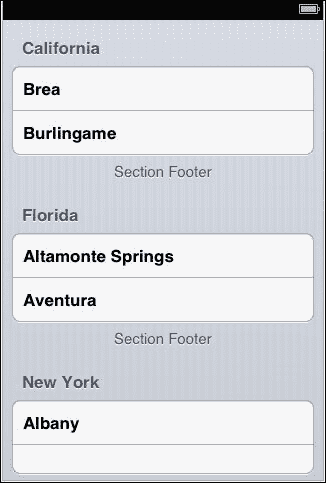
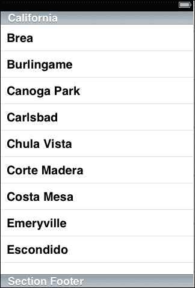
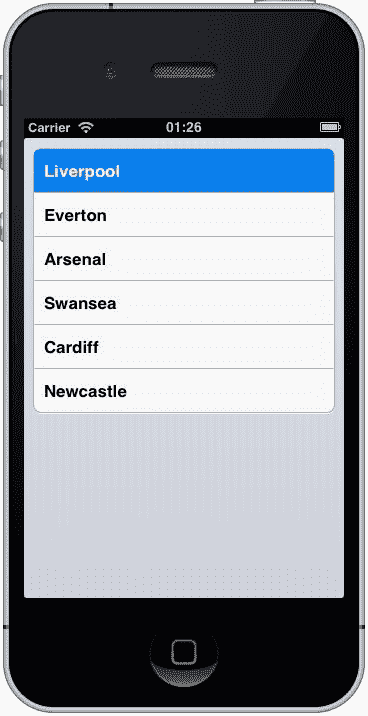
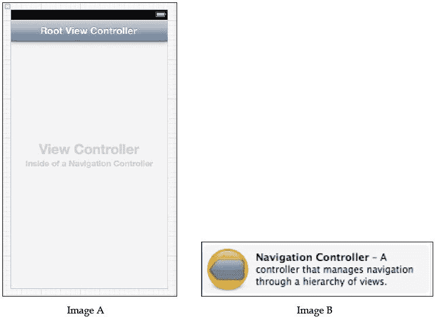
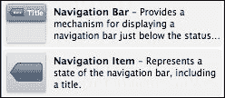
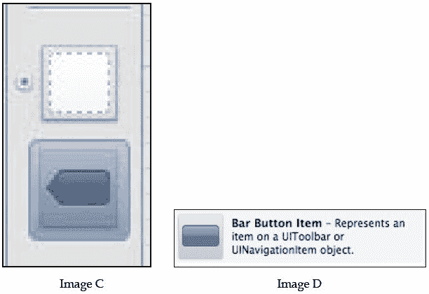
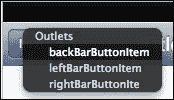
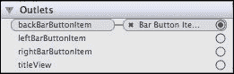
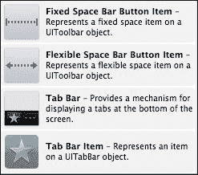
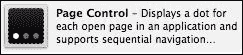

# 第四章。控制器

在 iOS 应用程序开发中，必须有一些形式的控制器，因为 iOS 应用程序开发框架实现了**模型-视图-控制器**（**MVC**）设计模式。iOS 中的控制器分为两类之一：表格或非表格。虽然我在讨论`MonoTouch.Dialog`时提到了`TableView`方法，但我实际上并没有给出很多细节，考虑到它们在 iOS 中的重要性，这至少是相当不诚实的！

在本章中，我们将涵盖以下主题：

+   UITableView 和 UITableViewCell

+   UINavigationController

+   UITabBar

+   UIPageControl

+   GLKit 视图控制器

# UITableView 和 UITableViewCell

`TableView` 方法是 iOS 中的主要工作马。如果你考虑像 Facebook、电子邮件、消息、Twitter 以及许多其他应用程序，它们通过基于列表的界面来显示数据。它可能包含不同的属性（如图像、标题文本、日期和时间、颜色以及一系列其他小部件），但最终，它是一个数据表。

当设置表格时，它可以采用两种格式：*纯文本*和*分组*。分组视图在以下图像中展示：



纯文本视图可以如下查看：



分组方法更适合用户名/密码或设置风格的信息，而纯文本视图最适合纯列表信息（如城市名称、化学元素或推文）。

由于表格需要数据来传播视图，因此通常还会定义一个代理（或源）类。

前一截图中的每个元素（如**Brea**、**Burlingame**和**Canoga Park**）都使用了`UITableViewCell`。数据可以在这些单元格中输入或编辑。

## 创建只读表格

在 Xcode 中，我创建了一个表格，并在其中创建另一个表格并添加了一些英格兰超级联赛球队。最简单的方法是通过列表来实现。

```swift
private List<string> premTeams;

public override void ViewDidLoad() {
  base.ViewDidLoad();
  premTeams = new List<string>(){"Liverpool","Everton","Arsenal","Swansea","Cardiff","Newcastle"};
  tvTableView.Source = new myViewSource(premTeams);
}

private class myViewSource : UITableViewSource {
  private List<string>dupPremTeams;
  public myViewSource(List<string>prems) {
    dupPremTeams = prems;
  }

  public override int RowsInSection(UITableView table,int section) {
    return dupPremTeams.Count;
  }

  public override UITableViewCell GetCell(UITableView tableView,NSIndexPath index) {
    UITableViewCell theCell = new UITableViewCell();
        theCell.TextLabel.Text = dupPremTeams[index.Row];
        return theCell;
    }
}
```

这段简单的代码产生了以下图像。代码所做的只是从 Xcode 中创建的视图显示数据。这是表格最简单的形式：



**利物浦**已被选中（以蓝色显示），但我们并没有对它做任何事情。`UITableView`类的美妙之处在于其背后的力量。当一个单元格被选中时，它可以用来导航到其他地方，在其中输入数据，或者只是简单地在一个选中的单元格值旁边放置一个勾选标记！

要使代码能够对单元格的选择做出反应，必须在`myViewSource`中添加另一个重写，即：

```swift
public override void RowSelected(UITableView tv,NSIndexPath index)
{}
```

在 `RowSelected` 之上，`UITableView` 控件提供了一个 `DetailDisclosureButton`——此按钮允许在单元格内执行多个操作。（比如说，我们有一个元素周期表，旁边有图片和书图标：点击名称会显示原子详情和元素的图片，而书图标会显示历史。）要在 `GetCell` 方法中启用此功能，请考虑以下代码行：

```swift
theCell.Accessory = UITableViewAccessory.DetailDisclosureButton;
```

可用的其他 `UITableViewAccessory` 选项包括 `Checkmark`（在表格中的单选或多选）、`Disclosure`（一个灰色箭头，表示触摸单元格会导致导航）和 `DetailDisclosure`（一个白色箭头）。`UITableViewAccessory` 还有一个 `None` 选项，它有一个放置位置但没有内容。

## `UITableViewCell`

默认情况下，`TableViewCell` 看起来很简洁。与 iOS 中的所有内容一样，单元格可以通过多种方式修改。单元格始终以 `UITableViewCellStyle.Default` 开始。这支持一个带有可选左侧图片的 `TextLabel` 组件。其他样式包括：

| `UITableViewCellStyle` | 它的作用 |
| --- | --- |
| `Subtitle` | 提供两个左对齐字段：`TextLabel` 和 `DetailTextLabel`。可以可选地将图片添加到这两个字段的左侧。`DetailTextLabel` 为灰色，字体大小比 `TextLabel` 小。 |
| `Value1` | 在这个例子中，`TextLabel` 是右对齐且为蓝色。`DetailTextLabel` 是黑色且左对齐。没有可选的图片可用。 |
| `Value2` | 在这个例子中，`TextLabel` 是左对齐且为黑色。`DetailTextLabel` 是右对齐且为蓝色。没有可选的图片可用。 |

### 表格中的可重用单元格

与 `CollectionView` 类似，`TableView` 方法也重用单元格。重用的目的是为了防止应用程序耗尽内存并减慢速度。为此，默认情况下，任何一次只显示 10 个单元格（尽管这个数字可能因单元格和 `UITableView` 的高度而有所不同）。

为了启用这种重用，我示例中的单元格需要使用不同的重载之一进行实例化。

```swift
UITableViewCell theCell = new UITableViewCell(UITableViewStyle.Default, "reuseID");
```

在前面的代码中，`reuseID` 是表格用来识别要重用单元格的标识符。

为了完全展示这一点，我扩展了我们原始示例中的团队列表，并修改了 `GetCell` 方法。所有其他代码保持不变。

```swift
premTeams=newList<string>() {"Arsenal", "Aston Villa","Cardiff City", "Chelsea","Crystal Palace", "Everton","Fulham", "Hull City", "Liverpool", "Man City", "Man United","Newcastle", "Norwich", "Southampton", "Stoke City","Sunderland", "Swansea", "Tottenham", "WBA", "West Ham"
};

private class myViewSource : UITableViewSource {
  public override UITableViewCell GetCell(UITableView tableView,NSIndexPath index) {
      UITableViewCell theCell = tableView.DequeueReusableCell("reuseID");
      if (theCell == null) {
        theCell = new UITableViewCell(UITableViewCellStyle.Default, "reuseID");
        // nothing to reuse, so create a cell}
      theCell.TextLabel.Text = dupPremTeams[index.Row];
      return theCell;
  }
}
```

### 部分（Sections）和行（Rows）

使用 `UITableView` 可以简化分组数据的处理，因为它们使用 `Section` 和 `Row` 系统来识别单元格（这些是 `NSIndexPath` 的两个参数）。

### TableView 上的索引

通过重写 `SectionIndexTitles`，可以在表格的右侧添加一个索引表。点击索引表中的项目将使表格跳转到该值。

```swift
public override string[] SectionIndexTitles(UITableView tableView)
{
  // add the index labels you want [letters are good]
  return sectionTitles.ToArray();
}
```

在 Xcode 中或外部自定义 `UITableViewCell` 组件。说实话，最简单的方法是在 Xcode 中进行。将单元格拖动到空白视图中，并添加您想要其中的小部件。

## 使用 `UITableView` 进行导航

`UINavigationController`提供了带有表格的导航。简单来说，`NavigationController`允许你通过屏幕顶部的标准返回按钮在表视图之间移动。可以使用 Xcode 或纯代码设置导航控制器。

### 在代码中

在`AppDelegate.cs`文件中设置`NavigationController`。

```swift
UIWindow window = new UIWindow(UIScreen.MainScreen.Bounds);
var viewController = new mainController();
UINavigationController rootNavigationController =new UINavigationController();
rootNavigationController.PushViewController(viewController,false);
window.RootViewController = rootNavigationController;
window.MakeKeyAndVisible();
```

这将导航栏放置在屏幕顶部。当显示新视图时，返回按钮变得可见。可以使用以下代码行隐藏返回按钮：

```swift
NavigationItem.HidesBackButton = true;
```

可以使用以下方法隐藏`NavigationController`：

```swift
NavigationController.NavigationBarHidden = true;
```

这里的问题是，当你向前到一个视图并返回时，栏将不再隐藏。必须调用的代码是`ViewWillAppear`方法。

### 使用 Xcode

在 Xcode 中使用`NavigationController`有几种方法。然而，它们可能很难使用。



**导航控制器**（图像 B）创建一个视图，其中控制器栏位于顶部。它有一个大优点，即既有导航部分，也有用于加载视图控制器区域（图像 A）。要使用它，只需创建一个视图控制器，就像你通常做的那样。在`RootViewController`源中，以下代码将其他`ViewController`加载到`RootViewController`中：

```swift
var myViewController = new MyViewController();
myViewController = "My View";
// sets the title and gives a back button

NavigationController.PushViewController(myViewController, true);
```

每个导航控制器都需要一个带有可选导航控制器按钮的栏。



标题栏也可以放置到典型视图中，并以标准方式连接。**导航项**并不像它看起来那样。从项的外观来看，人们可能会认为按钮可以用于类似返回按钮、菜单按钮或可以放置在标题栏上的按钮。**并不是这样**！为此，需要直接在标题栏上添加`BarButtonItem`，并将**导航项**连接到栏，如下所示：



将**Navigation Item**（图像 D）拖到栏上，使其位于视图图标（图像 C）下方。将**Bar Button Item**拖到视图上已经存在的标题栏上。这将为你提供一个带有左侧按钮的栏（假设你将其放置在左侧）。下一步是将**Navigation Item**连接到栏上的按钮。为此，按下*Shift*按钮并将**Navigation Item**拖到**Bar Button Item**上。完成此操作后，你将看到一个菜单，显示该项代表的内容，如下所示：



选择**backBarButtonItem**将得到返回按钮。如果你选择**leftBarButtonItem**或**rightBarButtonItem**，这些将提供可用于其他目的的按钮（例如地址簿的图标或菜单）。要检查是否已建立连接，可以在右侧的输出连接上确认：



要在代码中访问`backBarButtonItem`，可以使用以下类似的方法：

```swift
NavigationItem.BackBarButtonItem.Clicked += delegate {
     NavigationController.PopViewControllerAnimated(true);
     // sends back to the previous view on the stack
};
```

## 使用 UITableView 进行导航

到目前为止，我将假设视图已经有一个有效的表，其中包含一些数据。`UITableView` 的一个关键点是用户可以选择一个表格单元格，并且该单元格可以被移动到另一个视图中。

对于以下代码行：

```swift
RowSelected(UITableView tableView, NSIndexPath indexPath)
```

要启动一个新的 `ViewController`，我们需要做以下事情：

```swift
var newController = new myNextTableViewController(ref_to_data,rows[indexPath.Row]);
newController.Title = rows[indexPath.Row];
parent_controller.NavigationController.PushViewController(myController, true);
tableView.DeselectRow(indexPath, true);
```

这将启动一个新的视图，当选择返回按钮时，视图重新出现。**backBarButtonItem** 标题将显示启动新视图的视图的标题。`DeselectRow` 从视图中移除蓝色选择颜色。如果按下返回按钮时没有调用它，选择仍然会显示为选中状态。

### 返回到 RootView

要返回到视图的顶层，使用以下方法：

```swift
NavigationController.PopToRootViewController(true);
```

# 标签栏

另一种简单的导航方法是通过 `UITabBar`。通常，这些条形位于屏幕底部，但没有任何阻止视图在屏幕顶部也拥有 `UITabBar` 的东西。



将标签栏放置在视图中与将任何其他视图放置在屏幕上相同；将其拖到屏幕上。默认情况下，`TabBar` 中添加了两个 `TabBarItem` 项目。您可以通过将 **Tab Bar Item** 小部件拖到条上添加更多。

每个 `TabBarItem` 都有一个 `Title` 和 `Image` 属性可以设置；然而，这些按钮必须在 Xcode 中设置为 **Custom** 类型。

两个 **Space Bar Button Item** 组件允许在视图之间添加按钮项，并保持它们之间有空间。**Fixed** 之间有有限的空间，而 **Flexible** 允许添加更多按钮，但保持它们等距。

`TabBar` 组件与其他导航机制不同。虽然 `TabBarItem` 当然可以启动一个新的视图，但更常见的是始终使用相同的视图，但新的视图控制器被加载到导航栏（或屏幕顶部的任何内容）和底部 `TabBarItem` 之间的空白框架中。

如果一个包含 `TabBar` 的视图正在动态生成视图并在屏幕上显示，`TabBarItem` 组件也是很好的。

## 在代码中处理标签栏

在您的代码中，需要处理事件的是 **Tab Bar** 而不是 **Tab Bar Item**。**Tab Bar Item** 组件仍然需要连接，因此它们可以在主控制器源中处理。

```swift
tabBar.ItemSelected += TabBarSelected;
```

确定哪个 **Tab Bar Item** 被选中的可能最简单的方法是在每个项目上设置 `Tag` 属性（无论是在 Xcode 中还是在控制器源中）。在 `TabBarSelected` 中，可以找到正确的 `TabBarItem`。

```swift
private void TabBarSelected(object s, EventArgs e)
{
  UITabBar item = (UITabBar)s;
  UITabBarItem item = tb.SelectedItem;
  switch(item.Tag)
    {
      // do something;
    }
}
```

# 页面控制

`UIPageControl` 方法是一个方便的机制，用于标记我们在单个视图中有多页。它通常与 `UIScrollView` 一起使用，以显示 `UIScrollView` 中的页面索引。



它们也可以用于导航。当你点击页面左侧或右侧时，会抛出一个事件以实现页面移动。点的数量表示页数。这个数字可以在代码中随时更改。

# GLKit

`GLKit`视图使应用程序能够使用**嵌入式系统的 OpenGL**（**OpenGL ES**）。动画和图形不在此书的范围之内，但有许多 Xamarin.iOS 示例可用，可以演示如何使用 OpenGL ES。

# 摘要

本章已向你介绍了两种最常用的导航和视图形式的基础知识。虽然`UITableView`无疑非常强大，但当你有能力使用更简单的`MonoTouch.Dialog`类时，它就显得有些繁琐。
