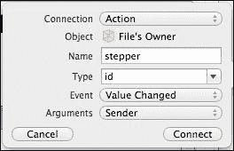

# 第五章。UI 控件

> 用以引用埃德蒙·布莱克阿德的话：“没有控件的 UI 就像没有笔尖的铅笔——毫无意义。”

控件的种类虽然不是很大，但在你可以用它们做什么方面非常灵活。所有控件都可以在 Xcode 中创建，或者在代码中动态创建。

在本章中，我们将涵盖以下主题：

+   控件和部件

+   控件选择

+   控件定制

+   控件参考（Android 和 iOS 交叉参考）

# 控件和部件

当我们提到小部件时，我将其与 UI 控件互换使用。在旧术语中，小部件代表 **WI**n**D**ow gad**GET**。iOS 设备上的屏幕被归类为窗口，因此将屏幕上的任何内容称为小部件是合理的。

# UI 控件

UI 控件直接从 Xcode 中可用。对于在代码中创建，控件名称前缀为 UI，并删除所有/任何空格（除了 **圆角矩形按钮**，它只是 `UIButton`）。**固定空间栏按钮项**和**弹性空间栏按钮项**通过 `UIBarButtonItem` 访问。


## 控件选择

在上一张截图中所显示的大多数控件对于它们的功能来说都很明显，而且足够简单，只需添加并连接到 UI 即可。然而，有一些控件需要与其他控件区别对待，最值得注意的是 `UIButton` 和 `UIStepper`。`UIButton` 类在它能做什么方面非常灵活，而 `UIStepper` 则真正需要作为一个 **动作** 而不是 **出口** 来使用。这意味着它们必须以不同的方式处理。

### UIButton

`UIImageView` 没有附加事件。因此，如果你需要一个可以点击的图像，它们可以被放置在 `UIButton` 类上。

```swift
var r = new UIButton();
r.ImageView = UIImage.FromFile("path/toimage.png");
```

完全可以在按钮上添加文本以及图像，只需将 `UILabel` 添加到按钮上，但这是一个两步的过程。重要的是要记住，当将任何内容放置在另一个视图上时，必须考虑父视图的大小，如下面的代码所示：

```swift
var r = new UIButton();
r.Frame = new RectangleF(0, 0, 100f, 100f);// button 100x100 at 0, 0
var i = new UIImageView(new RectangleF(15f, 2f, 70f, 70f));
i.Image = UIImage.FromFile("path/toimage.png")Scale(new SizeF(70f, 70f));
var l = new UILabel(new RectangleF(2f, 78f, 96f, 20f));
l.Text = "Hello world";
r.AddSubview(i);
r.AddSubview(l);
```

你可以向按钮添加任意多的图像和标签。按钮也可以添加背景图像，如下面的代码所示：

```swift
r.SetBackgroundImage(UIImage.FromFile("path/toimage.png"),UIControlState.Normal);
```

或者，背景可以添加渐变填充，如下面的代码所示：

```swift
var gradient = new CAGradientLayer();
gradient.Colors = new MonoTouch.CoreGraphics.CGColor[]
{
    UIColor.FromRGB(115, 181, 216).CGColor,
    UIColor.FromRGB(35, 101, 136).CGColor
};
gradient.Locations = new NSNumber[]
{
    .5f,
    1f
};
gradient.Frame = r.Layer.Bounds;
r.Layer.AddSublayer(gradient);
r.Layer.MasksToBounds = true;
```

假设，我们之前添加的 `UILabel` 类对于即将到来的文本来说太小了（它不再是`Hello world`，而是“我爱喝热咖啡”），那么标签内的字体大小需要改变。调整大小是通过创建一个边界框（`textSize`），并通过设置字体大小使其适应边界框的高度——而不是宽度——来实现的。

```swift
RectangleF textSize = new RectangleF(i.X, i.Y, i.Width, i.Height);
l.Font = UIFont.SystemFontOfSize(textSize.Height);
l.Text = "I love drinking hot coffee";
```

按钮不必是圆形的——也可以应用自定义形状。让我们看看以下代码中的圆形按钮：

```swift
r.Frame = CGPath.EllipseFromRect(new RectangleF(135f, 180f, 40f, 40f));
//width and height should be same value
r.ClipsToBounds = true;
r.Layer.CornerRadius = 20;//half of the width
r.Layer.BorderColor = UIColor.Red.CGColor;
r.Layer.BorderWidth = 2.0f;
```

为了使这可行，必须包含 `Monotouch.CoreGraphics` 命名空间。

还有其他类型的按钮可供选择（`ContactAdd`、`Custom`、`DetailDisclosure`、`InfoDark`、`InfoLight`、`RoundedRect` 和 `System`）。虽然 `RoundedRect` 是最常用的形式，但其他类型可以在 Xcode 中创建，也可以在您的应用程序代码中创建。

```swift
var myButton = new UIButton(UIButtonType.Custom);
```

以下代码创建了一个类型为 `Custom` 的按钮。其他类型的按钮外观如下所示：


从左到右（系统、自定义、详细披露、信息浅色、信息深色、联系添加）

## UIStepper

`UISteppers` 类需要在连接器中定义为输出和动作（选择 **Event** 为 **Value Changed**）。以下截图显示了典型的动作：



```swift
public override void ViewDidLoad()
{
    base.ViewDidLoad();
    uiStepper.MinimumValue = 0;
    uiStepper.MaximumValue = 10;
    uiStepper.AutoRepeat = true;
    lblCounter.Text = uiStepper.Value.ToString();
}
partial void stepper(NSObject sender)
{
    UIStepper step = (UIStepper)sender;
    lblCounter.Text = step.Value.ToString();
}
```

当点击 Stepper 控件时，会调用 `partial void` 方法，该方法更新计数器，如前述代码所示。如果您只有一个而没有另一个，当应用程序到达具有 `UIStepper` 类的视图控制器时，应用程序将崩溃。

## 其他控件

以下表格将为您提供每个控件的功能和任何使用控件时的注意事项的指示性列表：

| 控件 | 用于 | 注意事项 |
| --- | --- | --- |
| `Label` | 简单标签 | 不响应用户触摸事件 |
| `SegmentedControl` | 单个视图中多个按钮。常用于 `MapViews` 中的不同类型地图 |   |
| `TextField` | 文本输入 | 为密码设置 `SecureTextEntry = true` |
| `Slider` | 选择音量或颜色 | 使用浮点值 |
| `PageControl` | 显示 `scrollview` 区域中有多少 **页面** 的简单方法 |   |
| `DatePicker` | 日期选择器 | 也可以用于时间 |
| `NavigationBar` | 屏幕顶部的导航栏 | 需要一个导航项 |
| `NavigationItem` | 导航栏的导航项 | 需要添加导航控制器以在 Xcode 中定义项类型 |
| `SearchBar` | 搜索栏 | 需要定义动作和输出 |
| `ToolBar` | 用于添加按钮的栏，作为工具 | 用于事件，在处理程序中使用 `Item` 为 `BarButtonItem`。 |
| `BarButtonItem` | 用于工具栏的按钮。按钮上已包含图像和标签 | 不要从该事件中捕获；使用工具栏 |
| `Fixed`/`FlexibleBarButtonItem` | 在工具栏按钮之间提供空间 |   |
| `TabBar` | 用于 tab 视图 | 使用 `Toolbar` 控制器来定义哪个 nib 文件，按下标签时将调用 |
| `TabBarItem` | 用于 `TabBar` 的按钮，类似于 `BarButtonIt` `em` |   |

# 比较 Android 和 iOS UI 控件

以下表格是一个比较列表，旨在为希望移植到或从 Android 移植的人提供帮助：

| Android | iOS | Android 响应事件 | iOS 响应事件 |
| --- | --- | --- | --- |
| `Button` | `UIButton` | 是 | 是 |
| `Text` | `UILabel` | 是 | 否 |
| `ListView` | `TableView` | 是 | 是 |
|   | `TableViewCell` |   | 是 |
| `CheckBox` | `Switch` | 是 | 是 |
| `CheckedTextView` | 带有 `UILabel` 的 `Switch` | 是 | 是 |
| `ProgressBar` | `ActivityIndicatorView` | 是 | 否 |
| `RadioButton` | `MTD.RadioElement` | 是 | 是 |
| `RadioGroup` | `MTD.RadioGroup` | 是 | 否 |
| `SeekBar` | `Slider` | 是 | 是 |
| `TextView` (多种类型) | `TextField` | 是 | 是 |
| `FrameLayout`, `LinearLayout`, `RelativeLayout`, `TableLayout` |  | 是 |  |
| `GridView` | `ComponentView` | 是 | 是 |
| `ScrollView` | `Scrollview` | 是 | 是 |
| `SlidingDrawer` | `ActionBar` | 是 |  |
| `TabHost` | `TabBar` | 否 | 是 |
| `TabWidget` | `TabBarItem` | 是 | 否 |
| `WebView` | `Webview` | 是 | 是 |
| `Gallery` | `ImageGallery` | 是 | 是 |
| `ImageButton` | `Button` | 是 | 是 |
| `ImageView` | `ImageView` | 是 | 否 |
| `MediaController` | `AudioViewController` | 是 | 是 |
| `VideoView` | `VideoViewController` | 是 | 是 |
| `DatePicker` | `DatePicker` | 是 | 是 |
| `TimePicker` | `DatePicker` | 是 | 是 |
| `DialerFilter` | `UIKeyboard` | 是 | 是 |
| `GestureOverlayView` | `Gestures` (约) | 是 | 是 |
| `SurfaceView` | `View` | 是 | 是 |
| `TwoLineListItem` | `MTD`.`MultipleLineElement` | 是 | 是 |
| `View` | `View` | 是 | 是 |
| `Zoom` 按钮 | `Stepper` | 是 | 是 |
| `Zoom` 控件 | `SegmentedControl` | 是 | 是 |

尽管 Android 上有其他在 iOS 上没有，反之亦然，但这些是最常见的。

# 摘要

在 iOS 设备上，有丰富的 UI 控件可以玩转，并且几乎可以定制任何东西，难怪人们喜欢使用它们；它们可以看起来很棒！
