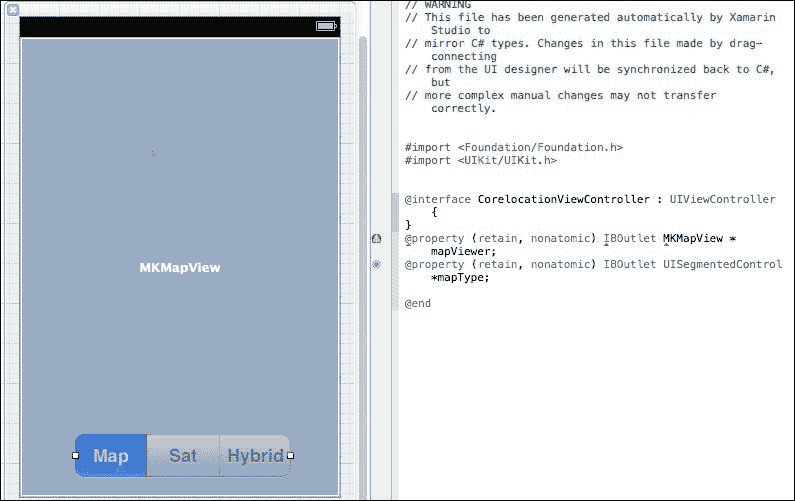
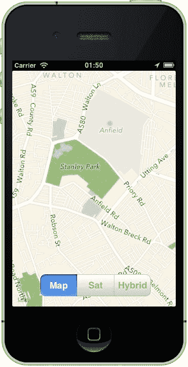
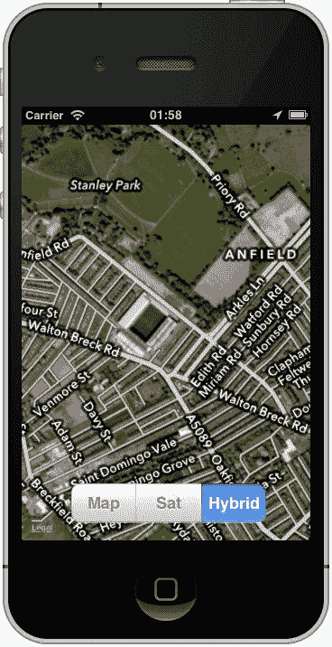
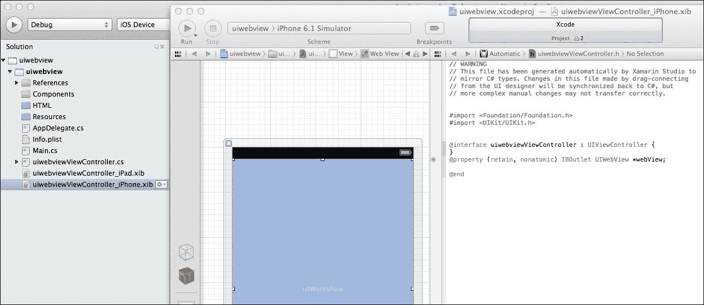

# 第十二章. 外设

拥有智能手机的全部意义在于它不仅仅是一部电话，它还是 GPS、媒体中心、消息系统以及视频系统。简而言之，你口袋里的那个小设备是传说中的“万能的，但精通所有*技艺*。”

在本章中，我们将涵盖以下主题：

+   使用相机

+   地图和 GPS

+   手机存储

+   打电话

+   发送和接收短信

+   访问互联网

+   多媒体

# 使用相机

iPhone 上的相机能够录制静态图像和视频。我们将很快处理视频。

相机可以通过两种方式之一访问。Xamarin 已经在其组件商店中发布了 `Xamarin.Mobile`，它提供了一个跨平台的方法来访问 GPS、相机和通讯录。为了完整性，我们将涵盖原生和组件版本。

## 访问相机（Xamarin.Mobile）

`Xamarin.Mobile` 组件提供了一个简单的方法来访问相机。一个简单的示例方法如下：

```swift
var picker = new MediaPicker ();
if (!picker.IsCameraAvailable)
  Console.WriteLine ("No camera!");
else {
  picker.TakePhotoAsync (new StoreCameraMediaOptions {
    Name = "test.jpg",
    Directory = "MediaPickerSample"
  }).ContinueWith (t => {
    if (t.IsCanceled) {
      Console.WriteLine ("User canceled");
      return;
    }
    Console.WriteLine (t.Result.Path);
  }, TaskScheduler.FromCurrentSynchronizationContext());
}
```

Xamarin 组件的问题在于它目前没有提供访问前置相机的功能；然而，前面的代码将保存点击的图片。

## 访问相机（原生）

相机是通过 `UIImagePickerController` 访问的。要使用它，首先检查设备是否实际上有相机（iPod Touch 没有相机，模拟器也没有）。为此，检查 `IsSourceTypeAvailable` 布尔值。

```swift
var myCamera = UIImagePickerControllerSourceType.Camera;
if (UIImagePickerController.IsSourceTypeAvailable(myCamera))
{
  UIImagePickerController myCameraPicker = newUIImagePickerController();
  myCameraPicker.SourceType = myCamera;
  myCameraPicker.Delegate = new myImageDelegate(this);
  PresentModalViewController(myCameraPicker, true);
}
```

代理处理关闭模态窗口以及您想要的其他任何过程（例如显示图片或保存图片）。一个简单的代理示例如下（如果需要可以扩展）：

```swift
public class myImageDelegate : UIImagePickerControlDelegate
{
  private UIViewController myController;
  public myImageDelegate(UIViewController control) {
    myController = control;
  }
  public override void FinishedPickingMedia (UIImagePickerController thePicker, NSDictionary I) {
    myController.DismissModalViewControllerAnimated(true);
  }
}
```

## 保存到相册（原生）

以下代码将放置在 `myCameraPicker.Delegate` 代码中的 `FinishedPickingMedia()` 方法内，这将以原生方式保存图片到相机胶卷：

```swift
  UIImage myImage = UIImage.FromFile(filename);
  myImage.SaveToPhotoAlbum(delegate (UIImage image, NSError err) {
    Console.WriteLine("Image saved fine"); });
```

# GPS 和地图

这也由 `Xamarin.Mobile` 组件部分覆盖（由于该组件支持的其他平台没有等效方法，`Xamarin.Mobile` 组件中没有复制 `Core Location` 的全部功能）。幸运的是，该组件和 Core Location 可以无缝协作。

## 使用 Xamarin.Mobile 的 GPS

`Xamarin.Mobile` 组件允许您通过 `PositionChanged` 事件监听设备的位置变化，并在位置发生变化时采取行动。以下代码演示了如何使用它：

```swift
var iPhoneLocationManager = new Geolocator();
iPhoneLocationManager.DesiredAccuracy = 5;
iPhoneLocationManager.StartListening(1, 10);
iPhoneLocationManager.PositionChanged += (object sender,PositionEventArgs e) => {
  double geoLocationLong = e.Position.Longitude;
  double geoLocationLat = e.Position.Latitude;
  iPhoneLocationManager.StopListening();
};
```

在分析前面的代码行时，我们遇到了以下术语：

+   `DesiredAccuracy`：这是在触发事件之前所需的距离（以米为单位）。这本身可能会引起问题。任何低于该值的值都意味着事件不会被触发。值太大，精度就会受到影响。

+   `StartListening`：它接受两个参数：`minimumTime` 和 `minDistance`。在这种情况下，它应该在第一分钟内返回，或者如果手机移动超过 10 米。

+   `StopListening`：它停止监听服务。

`Xamarin.Mobile` 模块还提供了一个异步方法——`GetPositionAsync`，用于异步获取您的位置。

```swift
private TaskScheduler sched =TaskScheduler.FromCurrentSynchronizationContext();
private CancellationTokenSource cancel;
geolocator.GetPositionAsync (timeout: 10000,cancelToken: cancel.Token, includeHeading: true).ContinueWith (t=> {
  if (t.IsFaulted)
    Console.WriteLine("Position faulted : {0}".((GeolocationException)t.Exception.InnerException).Error);
  else if (t.IsCanceled)
    Console.WriteLine("Canceled");
      else {
        Console.WriteLine("Timestamp {0}",t.Result.Timestamp.ToString("G"));
        Console.WriteLine("La: {0}", t.Result.Latitude.ToString("N4"));
        Console.WriteLine("Lo: {0}", t.Result.Longitude.ToString("N4"));}}, sched);
```

存储在 `Result` 中的返回值也提供了速度。这并不可靠。使用您自己的方法会更准确，但要做到这一点，您需要知道您已经行驶了多远。

### 计算您的速度

`CoreLocation` 命名空间中有一个名为 `DistanceFrom` 的方法，用于计算距离。该方法的工作方式如下：

1.  获取新位置。

1.  获取旧位置。

1.  创建两个 `CLManager` 实例。

1.  将两个位置的坐标分别放入两个实例中。

1.  使用 `DistanceFrom`。

结果的 `double` 值为您提供以米为单位的距离和以秒为单位的时间，因此您所行驶的速度是以米/秒（即距离/时间）计算的。然而，这里的计算问题可能是考虑了鸟的飞行方式，而不是您的移动方式。例如，如果期望的精度太低，超时时间太高，使用 `DistanceFrom` 的方法仍然可以工作；然而，如果距离不是 100 米，而是显然是 35 米（考虑鸟儿直接飞越田野，而不是沿着道路行走，左转，右转或绕行然后再次左转），距离会更短，因此速度也会相应地改变。

## 使用 Core Location

Core Location 是 GPS 的默认框架。它是一个强大的系统，用于确定设备的定位，其作用范围广泛，包括如何执行。与 iOS 中的许多其他功能一样，在设置 Core Location 框架时需要代理。代理通常处理事件。

### 设置 Core Location 和代理

如以下代码所示，可以设置并使用 Core Location 和代理：

```swift
private CLLocationManager locManager;
public override void ViewDidLoad() {
  base.ViewDidLoad();
  locManager = new CLLocationManager() {
    DesiredAccuracy = CLLocation.AccuracyBest,
  };
}
```

`CLLocationManager` 被设置为期望的精度尽可能高。接下来，为了使其有用，我们首先需要用以下代码捕获任何错误：

```swift
locManager.Failed += (object sender, NSErrorEventArgs e) => {
  UIAlertView alert = new UIAlertView() {
    Title = "Location manager failed",
    Message = string.Format("The following error was encountered –{0}", e.Error.ToString())
  }.Show();
  locManager.StopMonitoring();};
```

一旦错误系统被设置，就需要处理定位变化的监控。

```swift
locManager.LocationsUpdated += (object sender,CLLocationsUpdatedEventArgs e) => {
  CLLocation[] locs = e.Locations;
  Console.WriteLine("lat = {0},long = {1}",locs[0].Coordinate.Latitude,locs[0].Coordinate.Longitude);
};
```

如果应用被暂停，则需要处理以下事件：

```swift
bool paused = false;
locManager.LocationUpdatesPaused += delegate {
  if (!paused)
    locManager.StopUpdatingLocation();
  else
    locManager.StartUpdatingLocation();
  paused = !paused;
};
```

要开始更新监控的检查，请使用以下行代码：

```swift
locManager.StartUpdatingLocation();
```

要停止更新监控的检查，请使用以下行代码：

```swift
locManager.StopUpdatingLocation();
```

`CLLocationManager` 类还允许您监控您移动的方向。

```swift
locManager.UpdatedHeading += (object sender,CLHeadingUpdatedEventArgs e) => {
  CLHeading heading = e.NewHeading.TrueHeading;Console.WriteLine("New heading : {0}", heading.ToString());
};
locManager.StartUpdatingHeading();
```

### 查找用户的位置

拥有坐标是件好事，但谁又能真正说出它们代表什么？例如，如果我要给你 53.431/-2.956 的经纬度坐标，你会知道那是什么地方吗？可能性很大，你不会知道！

这就是反向地理编码发挥作用的地方。`MKReverseGeocoder` 类位于 `MonoTouch.MapKit` 命名空间中。

```swift
private MKReverseGeocoder geoCoder;
geoCoder = new MKReverseGeocoder(locManager.Location.Coordinate);geoCoder.Delegate = new ReverseGeocoder(this);geoCoder.Start(); // geoCoder.Stop() stops the geoCoder
```

与`locManager`不同，`ReverseGeocoder`类必须放置在委托中。`MKReverseGeocoder`不包含任何可以附加的事件。

```swift
private class ReverseGeocoder : MKReverseGeocoderDelegate {
  UIViewController view;
  public ReverseGeocoder(UIViewController myView) {
    view = myView;
  }

  public override void FoundWithPlacemark(MKReverseGeocoder geocoder, MKPlacemark placemark) {
    Console.WriteLine("Address");
    Console.WriteLine("{0}, {1}, {2}, {3}, {4}",placemark.SubThoroughfare,placemark.Thoroughfare,placemark.Locality,placemark.AdministrativeArea,placemark.Country);
  }
}
```

`Xamarin.Mobile`组件不包含执行`ReverseGeocoder`操作的能力。但编写一个并不困难。

在原始示例中，`LocationsUpdated`方法被作为一个内联示例给出。如果将其更改为指向一个方法，则可以执行`ReverseGeolocation`方法：

```swift
private void OnPositionChanged(object sender,PositionEventArgs e) {
  double lng = e.Position.Longitude;
  double lat = e.Position.Latitude;
  CLLocation clloc = new CLLocation(lat, lng);
  CLLocation oldLoc = new CLLocation(prevLat,prevLong);
  CLGeocoder geoRevGeo = new CLGeocoder();
  geoRevGeo.ReverseGeocodeLocation(clloc, GetAddressFromLoc);
}

private void GetAddressFromLoc(CLPlacemark[] place,NSError error) {
  if (place.Length == 0) {
    Console.WriteLine("Don't know where I am – help!");
    return;
  }
  else {
    Console.WriteLine("Address");
    Console.WriteLine("{0}, {1}, {2}, {3}, {4}",place.SubThoroughfare,place.Thoroughfare,placemark.Locality,placemark.AdministrativeArea,placemark.Country);}
}
```

### 添加地图

GPS 的最后一部分是添加地图。为此，需要通过在 Xcode 中添加或在代码中添加来使用`Map`视图。就我的目的而言，我将假设它是通过 Xcode 添加的，并命名为`mapViewer`。有三种类型的地图可供选择，因此还添加了一个`UISegment`控件。



需要设置`mapViewer`对象：

```swift
public override void ViewDidLoad() {
  base.ViewDidLoad();mapViewer.ShowsUserLocation = mapViewer.ZoomEnabled = true;
  mapViewer.MapType = MKMapType.Standard;
  mapViewer.Region = new MKCoordinateRegion(
    new CLLocationCoordinate2D(53.431, -2.956),
    new MKCoordinateSpan(0.5, 0.5)
  );mapViewer.ScrollEnabled = mapViewer.UserInteractionEnabled =true;
}
```

前面代码中传入的坐标对应的结果位置在以下屏幕截图中显示：



下一个阶段是使`UISegment`控件生效：

```swift
mapType.ValueChanged += delegate {
  switch (mapType.SelectedSegment) {
    case 0: mapViewer.MapType = MKMapType.Standard;
            break;
    case 1: mapViewer.MapType = MKMapType.Satellite;
            break;
    case 2: mapViewer.MapType = MKMapType.Hybrid;
            break;
  }
};
```



如果您不知道，地理位置是利物浦足球俱乐部的主场**安菲尔德**。

一些属性需要简要解释：

+   `ShowUserLocation`: 显示一个蓝色点来显示用户的位置

+   `ZoomEnabled`: 允许用户进行缩放

+   `ScrollEnabled`: 允许用户滚动查看视图

+   `UserInteractionEnabled`: 启用放置在地图上的图钉在被点击时（或不）做出响应

+   `MKCoordinateSpan(0.5,0.5)`: 这是缩放设置——数字越小，初始视图的缩放越大

### 添加图钉

当谈到地图时，*图钉*非常有用。虽然一个小蓝点很整洁，但图钉实际上显示了您所在的位置，并且可以添加信息到它。

```swift
MKUserLocation loc = new MKUserLocation() {
  Title = "Anfield stadium",
  Coordinate = new CLLocationCoordinate2D(53.431, -2.956),
  Subtitle = "Home of Liverpool FC",
};mapViewer.AddAnnotationObject(loc);
```

最后，始终将地图居中并固定在屏幕上

```swift
mapViewer.SetCenterCoordinate(loc.Coordinate, true);
```


### 备注

图钉在模拟器上不一定总是有效。


# 手机存储

.NET 在`SpecialFolders`枚举中指定了多个位置（例如`Program Files`、`My Music`和`My Pictures`；完整列表可以在 Microsoft 网站上找到）。由于 iOS 设备的安全限制，其中只有少数可用。最安全的方法是将任何用户数据保存到`My Documents`。在`My Documents`中，您可以创建自己的目录并按自己的喜好使用它们。

# 打电话

这听起来可能有些荒谬。为什么你想编写代码来打电话？按照真正的开发者传统，答案是*为什么不呢？*重要的是要注意，字符串号码只是那样。它不能包含空格、连字符、括号或加号（+）；它只能包含数字。

```swift
private void callNumber(string number) {
  string phoneURLString = string.Format("tel:{0}", number);
  NSUrl phoneURL = new NSUrl(phoneURLString);
  UIApplication.SharedApplication.OpenUrl(phoneURL);
}
```

继续前进...

# 发送和接收短信

iPhone 自带内置的消息软件。然而，有些时候您需要在发送消息之前对其进行编码。然而，苹果公司出于其智慧，不允许您在不通过其自己的消息软件的情况下发送消息。这并不是说您不能以其他方式发送消息（例如通过专门的网站或消息服务），但对于标准用户来说，您不能。

您不能以截获或阻止短信的方式编写代码。iOS 没有提供公开可用的方法来截获和读取短信。考虑到这一点，发送短信是一个相对简单的事情。"MFMessageComposeViewController"位于"MonoTouch.MessageUI"命名空间中。

```swift
private void sendTextMessage(string number, double myLat,double myLong) {
  if (MFMessageComposeViewController.CanSendText) {
    MFMessageComposeViewController message = newMFMessageComposeViewController();
    message.MessageComposeDelegate = newCustomMessageComposeDelegate();
    message.Recipients = new string[] { number };
    message.Body = string.Format("Help! I am currently athttps://maps.google.com/maps?q={0},{1}&z=18 and needassistance", myLat, myLong);
    NavigationController.PresentModalViewController(message,true);
  }
}
public class CustomMessageComposeDelegate :MFMessageComposeViewControllerDelegate {
  public override void  Finished(MFMessageComposeViewController controller,MessageComposeResult result) {
      if (result == MessageComposeResult.Failed ||
        result == MessageComposeResult.Cancelled) {
        UIAlertView alert = new UIAlertView() {
          Title="Message sending error",
          Message="Your message failed to send"
        }.Show();
      }
      controller.DismissViewController(true, null);
  }
}
```

# 访问互联网

通过`UIWebView`控制器访问互联网。在尝试访问网站之前，确保有活跃的网络连接是个好主意。这是通过`NetworkReachability`类完成的。

```swift
using MonoTouch.SystemConfiguration;
NetworkReachability reach = new NetworkReachability("www.bbc.co.uk");
NetworkReachabilityFlags flags = new NetworkReachabilityFlags();
reach.TryGetFlags(out flags);
Console.WriteLine("Network flag = {0}", flags.ToString());
```

`WriteLine`命令将导致以下标志之一：

| 标志 | 值 |
| --- | --- |
| `Reachable` | 主机可达 |
| `IsWWAN` | 通过 EDGE、3G 或 4G 建立连接 |
| `IsLocalDevice` | 连接到本地设备 |
| `ConnectionAutomatic` | 自动建立连接。这是`ConnectionOnTraffic`的别名。 |
| `ConnectionOnTraffic` | 结合`Reachable`和请求数据时建立连接 |
| `ConnectionOnDemand` | 在连接开始时发生。连接在套接字连接后发生。 |
| `ConnectionRequired` | 主机可达，但必须建立连接 |
| `IsDirect` | 直接建立连接 |
| `InterventionRequired` | 连接到主机时，用户必须执行某些操作 |
| `TransientConnection` | 主机可达，但通过一个启动和停止的系统（如 PPP 或任何其他非持久性网络连接） |

假设存在网络连接，下一步是加载网页。

我在第三章中介绍了加载网页和一些设置，*视图和布局*。也可以从您动态生成的数据中加载网页。以下代码示例可以简单地演示这一点。首先，按照以下方式设置应用程序结构，在`.xib`文件中使用`UIWebview`：



HTML 目录可以按照您的意愿命名。我保持简单，只叫它 HTML。当在您的应用程序中生成自己的 HTML 时，您可以选择：

+   从头开始生成自己的文件，保存并获取输出

+   使用`StringBuilder`生成 HTML 文件并输出该字符串

+   混合前两个选项

从本质上讲，两种生成方法相同，区别在于使用`StringBuilder`生成字符串或连接字符串。考虑以下代码行：

```swift
string html = "<html>\n";
html += "<title>Hello World</title>\n";
html += "<body>\n";
html += "<h1>Hello World!</h1>\n";
html += "</body>\n";
html += "</html>";
```

上述代码行应该执行你预期的操作，一旦通过以下代码传递给`UIWebview`：

```swift
webView.LoadHTMLString(string s, NSUrl baseurl);
//The baseurl here would be null.
```

当这些代码行执行其工作，基于应用程序内部的数据使用这些代码行创建你的网页可能会很耗时。一个更简单的方法是从应用程序中的某些 HTML 片段中拉取页眉和页脚。

然而，要从应用程序内部读取文件，需要采取一些步骤。第一步是将要构建的 HTML 片段设置为`BundleResource`。你将加载的是属于捆绑包的文件，而不是应用程序可写文件夹中的文件。第二步是将 HTML 捆绑包加载到源中：

```swift
var documents = NSBundle.MainBundle.BundlePath;
StringBuilder sb = new StringBuilder();
sb.Append(File.ReadAllText(Path.Combine(documents,"HTML/top.html")));
```

`NSBundle.MainBundle.BundlePath`是已安装应用程序的路径。下一步是添加数据；在我的例子中，我添加了一个联赛表格：

```swift
var leagues = (from t in teams
               from p in t.points
               orderby p
               select t).Take(4).ToList(); // takes top 4 only
sb.Append(@"<table width=100%>");
sb.Append(@"<tr width=100%>");
sb.Append(@"<td width=70%>Team name</td>");
sb.Append(@"<td width=10%>Played</td>");
sb.Append(@"<td width=10%>G Diff</td>");
sb.Append(@"<td width=10%>Points</td>");
for (int i = 0; i < 4; ++i) {
  sb.Append(@"<tr width=100%>");
  sb.Append(@"<td width=30%>" + teams[i].TeamName + "</td>");
  sb.Append(@"<td width="10"%>" + teams[i].TeamPlayed.ToString() +"</td>");
  sb.Append(@"<td width="10"%>" + teams[i].TeamGDiff.ToString() +"</td>");
  sb.Append(@"<td width="10"%>" + teams[i].TeamPts.ToString() +"</td>");
  sb.Append(@"</tr>");
}
sb.Append(@"</table>");
sb.Append(File.ReadAllText(Path.Combine(documents,"HTML/bottom.html")));
```

顶部的表格部分可以很容易地成为它自己的 HTML 片段。一旦完成最终的追加，HTML 就准备好了。

```swift
webView.LoadHTMLString(sb.ToString(), null);
```

记住，你正在在应用程序内部创建自己的网页。如果你想包含样式表，你可以；如果你想包含 JavaScript，你也可以；唯一的限制是你可以使用启用 JavaScript 的移动 Safari。

# 多媒体

这是一个非常广泛的话题。幸运的是，使用相机的部分已经在本章的开头进行了介绍。几乎你需要的一切都在`MonoTouch.MediaPlayer`命名空间内。就像使用相机一样，首先检查设备是否具有视频功能是非常重要的，方式与检查相机完全相同（实际上，它使用与相机相同的`IsSourceTypeAvailable(myCamera)`命令）。

## 播放视频

与`webView`一样，视频可以是设备外部的或内部的；如果是内部的，它可能是捆绑包的一部分（这不是一个好主意，因为视频会占用设备大量空间，从而导致下载时间过长），或者位于`My Document`区域（已下载）中，或者在照片胶卷中。

### 外部 URL

我在这里要使用的是 YouTube 上的视频（你可以选择任何你喜欢的视频）。

```swift
var videoPlayer = new MPMoviePlayerController(NSUrl.FromString("http://www.youtube.com/watch?v=cVikZ8Oe_XA"));
videoPlayer.Play();
```

### 内部源

从内部源播放视频可以以类似于外部视频文件的方式执行：

```swift
var videoPlayer = new MPMoviePlayerController(NSUrl.FromFilename("myVideo.mp4"));
videoPlayer.Play();
```

### 从照片库

从相册中选择视频的方式与从照片库中选择图片的方式几乎相同。

```swift
UIImagePickerController ipcPicker = new UIImagePickerController()
{
  SourceType = UIImagePickerControllerSourceType.PhotoLibrary,
  MediaTypes = new [] {"public.movie"},
  Delegate = new ImagePickerDelegate(this)
};
```

上述代码遍历照片库，寻找任何返回`public.movie`类型的文件。如果找到，该文件将被添加到数组中，并且可以通过代理看到。

## 录制视频

这与拍照并没有实质性的区别，只是你有一些可以调整的额外参数，例如`VideoQuality`和`AllowEditing`。

### 要录制视频

录制视频是一个简单的任务，如下面的代码所示：

```swift
var camera = UIImagePickerControllerSourceType.Camera;
UIImagePickerController ipcVideo = new UIImagePickerController()
{
    SourceType = camera,
    MediaTypes = new [] {"movies.public"},
    AllowEditing = true,
    VideoQuality = UIImagePickerControllerQualityType.Medium,
    Delegate = new ImagePickerDelegate(this)
};
```

在前面的示例中，`AllowEditing`已设置为`true`，这意味着用户可以编辑此视频。如果这是意图，则应使用`UIVideoEditorController`执行编辑。此控制器允许三个事件：`Failed`（编辑由于某些原因失败），`UserCancelled`（不言而喻），和`Saved`（用户选择保存编辑；路径在`e.Path`事件中返回）。

### 保存视频

视频处理完毕后，下一步是保存视频：

```swift
UIVideo.SaveToPhotoAlbum(videoPath, delegate (string path,NSError error) {
  Console.WriteLine("Video saved.");
});
```

## 音频系统

iPhone 和 iPad 等设备（以及大多数苹果设备）都配备了出色的音频系统，这允许播放高质量的音频，并且能够进行录音。这些功能可以通过`AVAudioPlayer`类或`SystemSound`获得。如果文件位于应用程序包中，则在构建应用程序时必须将其设置为`Content`。

### 播放

如果音频播放时间少于或超过 30 秒，可以认为是短或长。一般来说，`SystemSound`最适合用于时长少于 30 秒的音频文件，以及未压缩的音频格式，如`.wav`和`.caf`（**核心音频文件**）。`SystemSound`不支持 MP3 文件。

#### 短文件

`SystemSound`方法是一种快速简便地播放音频文件的方式，开销非常小。

```swift
var sound = SystemSound.FromFile("myAudio.caf");
sound.PlaySystemSound();
```

如果你需要播放音频文件，但你处于需要安静的地方（比如图书馆），设备可以通过文件长度振动。

```swift
sound.Vibrate.PlaySystemSound();
```

#### 长的（和压缩的）文件

在这种情况下，`AVAudioPlayer`类发挥了作用，允许你有效地调整功率级别（通道上的音量），暂停，播放和停止音频文件。它还处理压缩音频格式，如 MP3。

#### 设置功率级别

在设置功率级别之前，`AveragePower`和`PeakPower.MeteringEnabled`布尔值必须设置为`true`，并且必须调用名为`UpdateMeters()`的方法。然后只需将`AveragePower(uint)`或`PeakPower(uint)`设置为所需的值（以 dB 为单位）。

#### 播放音频文件

播放音频文件并不困难；选择文件并告诉设备播放。以下代码演示了如何操作：

```swift
var fileToPlay = AVAudioPlayer.FromUrl(NSUrl.FromFilename("myAudio.mp3"));
fileToPlay.Play();
fileToPlay.FinishedPlaying += delegate {
  fileToPlay.Dispose(); // clean up
};
```

#### 调整音量

如果你不希望贝多芬的第九交响曲从你的 iOS 设备中播放出来，降低音量是个好主意，如下所示：

```swift
using MonoTouch.MediaPlayer
var mpPlayer = new MPMusicPlayerController();
mPlayer.Volume = 0.01f; // max volume – range 0 to 1
```

然而，设置音量级别时有一个注意事项：*不要将其设置为零*。这会惹恼 iOS 设备，并随后会惹恼用户，因为设备会非常乐意提醒你音量已设置为`0`。由于该值是一个浮点数，`0.01`与`0`一样可以有效地静音设备。

## 录制音频

录音并不像播放那样简单。虽然 `AVAudioRecorder` 类做了很多工作，但程序员也需要做大量工作来录制音频。关键点是要记住，在发生任何操作之前，必须设置 `NSDictionary`。这个字典包含重要信息，例如音频类型、采样率、质量等。

### 设置音频 `NSDictionary`

`NSDictionary`（以及以 `NS` 开头的任何其他内容）是 `Xamarin.iOS` 利用 `Objective-C` 绑定来允许在 iOS 上使用 .NET 框架进行开发的接口。因此，它不能像普通字典那样设置。为了克服这个障碍，可以使用一个通用的 `NSObject` 对象，一个用于设置，另一个用于描述（这相当于 .NET 中的值和键）。

```swift
var settings = new NSObject[] {
  NSNumber.FromFloat(22050.0f),
  NSNumber.FromInt32((int)AudioFileType.WAVE),
  NSNumber.FromInt32(2),
  NSNumber.FromInt32((int)AVAudioQuality.Min)
};
var keysToSettings = new NSObject[] {
  AVAudioSettings.AVSampleRateKey,
  AVAudioSettings.AVFormatKey,
  AVAudioSettings.AVNumberOfChannelsKey,
  AVAudioSettings.AVEncoderAudioQualityKey
};
var dict = NSDictionary.FromObjectsAndKeys(settings,keysToSettings);
```

#### 准备录音

下一步是设置录音器本身以及保存音频文件的位置。

```swift
var docs = Environment.GetFolderPath(Environment.SpecialFolder.Personal);
var audio = NSUrl.FromFilename(Path.Combine(docs,"testaudio.wav");
var error = new NSError(); // catch the errors
```

#### 录制音频文件

最后，是时候开始录音了。当文件正在记录时，它也会保存在设备上。录音完成后，需要销毁录音器对象。幸运的是，我们可以通过使用 `RecordFor("float time")` 方法来控制录音的时长。

```swift
var myRecorder = AVAudioRecorder.ToUrl(audio, dict, out error);
myRecorder.FinishedRecording += delegate {
  Console.WriteLine("Audio file created");
  myRecorder.Dispose();
};
myRecorder.RecordFor(10f);
```

# 摘要

使用 iOS 设备提供的子系统非常简单，只要记住限制条件，例如只能发送文本而不能接收。设备提供的功能远超普通用户所见，只需稍加想象就能看到如何利用这些功能创建真正优秀的应用程序；从地图到网页视图再到拨打电话，一切都在你的掌控之中。现在，开始吧！
