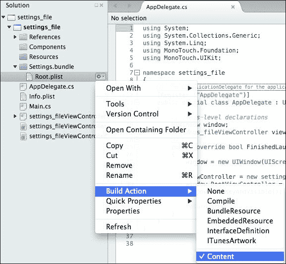

# 第十三章：用户偏好

有时，用户能够存储偏好设置（例如联系人的铃声）是非常有用的。幸运的是，iOS 提供了一个内置的偏好设置系统。如果你只想为 iOS 编写应用程序，这没问题，但如果目的是要创建一个可以用于任何可以使用.NET 的平台的应用程序，则需要不同的方法。

本章涵盖的主题包括：

+   使用内置偏好设置系统

+   自定义偏好设置系统

# 内置系统

首先，需要向应用程序中添加一个名为`Settings.bundle`的特殊文件夹，其中包含一个名为`Root.plist`的文件。

这不是一个普通文件，`.plist`文件需要将**Build Action**设置为**Content**。



`.plist`文件是一个 XML 文件，条目以常规字典对象的形式存储，形式为`<key><type>`，其中类型可以是任何东西（例如`string`、`int`和`double`）。

例如，对于创建以`UISlider`类显示的偏好设置，它将按照以下代码所示进行存储：

```swift
<dict>
    <key>Type</key>
    <string>UISlider</string>
    <key>Key</key>
    <string>My slider</string>
    <key>DefaultValue</key>
    <int>40</int>
    <key>MinimumValue</key>
    <int>0</int>
    <key>MaximumValue</key>
    <int>75</int>
</dict>
```

理解起来很简单，但文件会根据存储的信息量快速增长。

## 读取和写入.plist 文件

幸运的是，从`.plist`文件中读取很简单。所需的一切就是识别值的键以及了解值类型以正确调用相关方法。

```swift
int read = NSUserDefaults.StandardDefaults.IntForKey("DefaultValue");
string name = NSUserDefaults.StandardDefaults.StringForKey("Key");
```

写入文件可以通过两种方式完成。最简单的方法是直接写入文件，如下面的代码所示：

```swift
NSUserDefaults.StandardDefaults["DefaultValue"] = 34;
NSUserDefaults.StandardDefaults["Key"] = "Hello mum!";
```

另一种方法是调用`NSNotificationCenter`类，该类向应用程序广播通知。`NSUserDefaults`类使用这个系统在`Settings`值改变时发出`NSUserDefaultsDidChangeNotifcation`通知。这里的好处是任何`NSObject`类都可以设置为通知的观察者。观察者提供了一个回调方法，如下面的代码所示：

```swift
public mySettingsClass()
{
    NSNotificationCenter.DefaultCenter.AddObserver
    (
        this, new Selector("updateSettings"),
        new NSString ("NSUserDefaultDidChangeNotification"),
        null
    );

    [Export ("updateSettings:")]private void UpdateSettings()
    {
        doSomething();
    }

    private void doSomething()
    {
        // do something here
    }
}
```

# 自定义设置系统

虽然使用内置设置系统可能看起来很有用，但使用 Xamarin 产品系列的目的是在现在支持.NET 的任何平台上能够使用大量相同的代码。虽然，在撰写本文时，Windows Mobile 的市场份额仅为所有智能手机的约三%，但微软不太可能允许这种情况继续，并将推动其庞大的储备力量以促使人们采用他们的智能手机。如果你要计算纯数学，97%的所有智能手机都可以使用.NET 平台进行编码。（Blackberry 为其提供了 mono 的端口，但支持不佳，因此可以忽略。）

因此，存储用户设置需要不同的策略。我们可以使用 SQLite 数据库来存储详细信息，但正如已经指出的那样，对子系统的每次访问都会导致性能下降。

最简单的方法是创建一个`settings`类，并在需要时**序列化**或**反序列化**值。这是一个极其灵活的方法，并且效果非常好。

## 序列化和反序列化数据

以下代码是一个非常简单的序列化器和反序列化器：

```swift
public class Serializer
{
    public static void XmlSerializeObject<T>(T obj, string filePath)
    {
        using (StreamWriter sw = new StreamWriter(filePath))
        {
            XmlSerializer xmlSer = new XmlSerializer(typeof(T));
            xmlSer.Serialize(sw, obj);
        }
    }

    public static T XmlDeserializeObject<T>(string filePath)
    {
        using (StreamReader sr = new StreamReader(filePath))
        {
            XmlSerializer xmlSer = new XmlSerializer(typeof(T));
            return (T)xmlSer.Deserialize(sr);
        }
    }
}
```

上述代码将序列化和反序列化通过它的任何对象类型。这包括如`List<>`和`Dictionary<,>`等泛型类型对象。不要传递接口成员或循环引用（例如，一个引用到另一个对象的对象，该对象又引用到原始对象）——这将导致序列化器崩溃。

## 设置设置文件

与使用`NSUserDefaults.plist`文件不同，这里使用的设置文件仍然是一个 XML 文件，但它不需要设置为任何特定类型。由于它也是一个简单的 XML 文件，因此可以复制并传输到不同平台上的相同应用程序。


### 注意

假设你正在为 iPhone 上的应用程序配置文件，并且你想要在 Android 手机上运行它。你将复制`Settings`文件，并在 Android 手机上运行应用程序，你立即就有了在 iPhone 上设置的设置。


`Settings`文件由两个类组成——`handler`类和`data`类。

### 处理类

处理类负责设置`Settings`文件以及数据类的访问器。以下代码中重现了重要部分：

```swift
public static class myAppData
{
    private static AppSettings appSetting;

    public static AppSettings appSettings
    {
        get
        {
            if (appSetting == null)
            {
                if (File.Exists(AppSettingsFile))
                    appSetting = Serializer.XmlDeserializeObject<AppSettings>(AppSettingsFile);
                else
                {
                    appSetting = new myAppData.AppSettings();
                    Serializer.XmlSerializeObject <AppSettings>(appSetting, AppSettingsFile);
                }
            }
            return appSetting;
        }
        set
        {
            if (value == null)
            {
                throw new ArgumentNullException("value is null!");
            }
            appSetting = value;
            if (File.Exists(AppSettingsFile))
                File.Delete(AppSettingsFile);
            Serializer.XmlSerializeObject <AppSettings>(appSetting, AppSettingsFile);
        }
    }

    private static string pathAppSettingsFile;
    public static string AppSettingsFile
    {
        get
        {
            if (string.IsNullOrEmpty(pathAppSettingsFile))
                pathAppSettingsFile =Path.Combine(Environment.GetFolderPath(Environment.SpecialFolder.MyDocuments"),"AppSettings.xml");
                return pathAppSettingsFile;
          }
    }
}
```

#### 添加访问器

以下代码用于将任何类型的对象传递到配置文件中：

```swift
public static List<string> theAlias
{
    get { return appSettings.TheAlias;}
    set
    {
        AppSettings settings = appSettings;
        settings.TheAlias = value;
        appSettings = settings;
    }
}
```

上述简单的访问器可以根据需要多次复制粘贴。最好的是，`List<>`对象可以是任何类型——你甚至可以在其中有一个完整的类列表！

### 数据类

数据类除了包含与数据处理器类中匹配的访问器列表外，还包含一个默认构造函数，如下所示：

```swift
public class AppSettings
{
    public AppSettings()
    {
    }

    public List<string> TheAlias
    {get;set;}
}
```

使用上述代码，你可能有最灵活的配置和设置系统。

# 摘要

用户设置很重要——谁会愿意每次都要重新设置一切，或者更糟糕的是，每次应用程序更新都要设置？在更新应用程序时，应用程序文件夹中的一个文件将被保留，并且始终可用（除非应用程序被卸载）。存储的用户设置并不总是保证在版本之间持久存在。在本章中，我们看到了两种完全不同的存储配置设置的方法：一种是提供的，另一种是创建的。还有其他方法可以做到这一点，就像我在本章中演示的那样。
