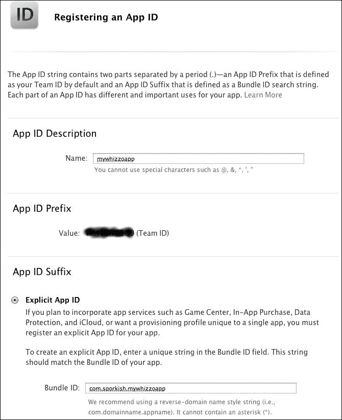
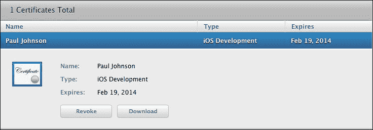
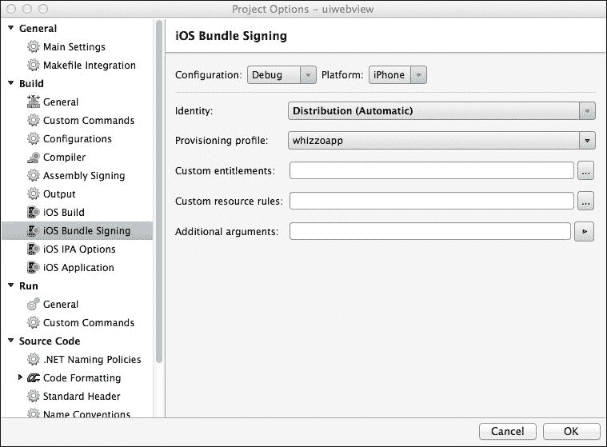
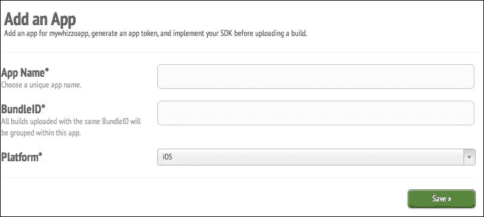
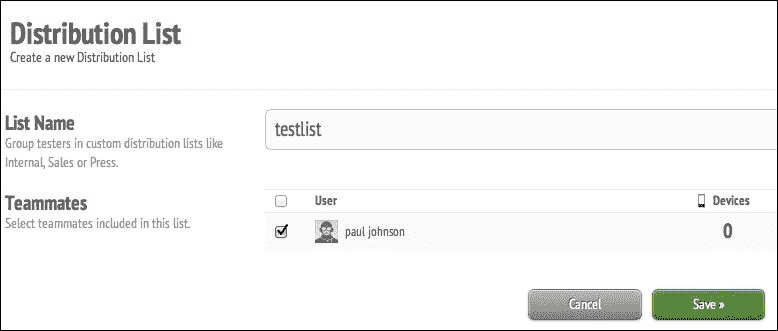
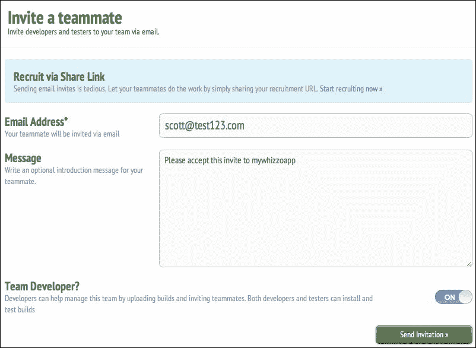
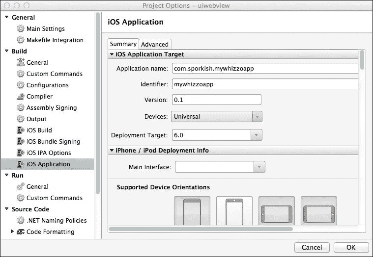
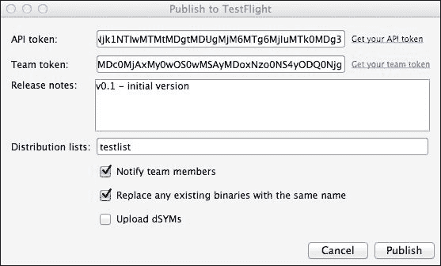
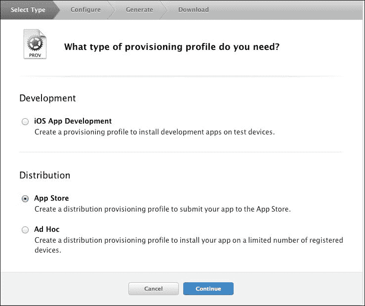
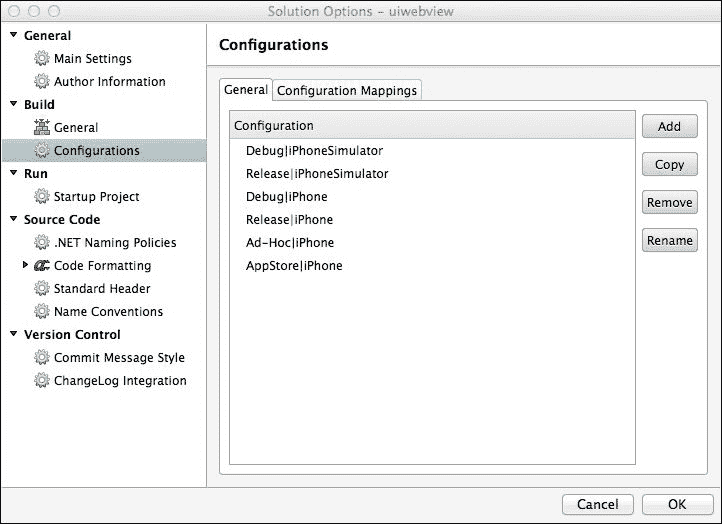

# 第十四章 测试和发布

您的应用已经准备好，等待向全世界发布。您已经坐下来，编码，测试，编码，测试，最后决定您已经创造了世界上最棒的应用，现在是时候将其上传到苹果商店了。问题是只有您测试过它。与 Android 测试不同，iOS 测试并不那么直接，将您的应用放入商店也不是那么简单。

在本章中，我们将涵盖：

+   应用配置和签名

+   使用 TestFlight 测试您的应用

+   打包和签名应用

+   在 App Store 上发布

# 应用配置和签名

对于对自用手机的常规调试，通常不需要您对应用进行签名，因为当您部署到手机时，会使用一个通用的开发者代码。这个代码被称为**配置文件**。我们现在正在进入一个更大的领域，应用需要测试。您可能会想知道为什么您的应用需要其他人进行测试。答案很简单：为了确保最佳的用户体验。

从开发者的角度来看，一款软件遵循一定的模式：A 到 B，B 到 C，C 到 D 或 E，依此类推。当我们测试我们的代码时，我们会走这条路径；用户不会。他们将从 A 到 C 到 F 到 B 再到 C，最后当代码在尝试直接从 C 到 H 时出现异常并崩溃时，他们会大喊。在发布前让更多人测试您的软件，当用户从**Mac App Store**下载应用时，他们会更加满意，而且针对您的负面评论也会更少。

对于测试，您必须分发应用，这并不像上传应用到您的个人网站并说“嘿，去下载并安装”那样简单，就像典型的桌面（或 Android）应用一样。为了确保可用应用的质量，苹果对分发系统有相当严格和严格的要求，即使是测试分发。幸运的是，有一种方法可以在向公众发布之前分发您的应用：*TestFlight*。

# TestFlight

`TestFlight`是一个平台，允许您将测试（或测试版）软件上传到受邀用户（iOS 设备）或注册的 iOS 设备。这是一个免费服务，不会违反苹果的任何规则或规定，而且，不需要设备越狱。设置此服务是一个三步过程：

+   配置

+   邀请

+   构建和上传

## 配置

配置设置设备以允许测试非苹果商店批准的应用。首先，您需要在[`developer.apple.com`](http://developer.apple.com)注册为 iOS 开发者——费用大约为每年 100 美元（在撰写本文时约为 65 英镑）。这是一项年度费用，您确实会得到很多回报。完成之后，您需要登录并为您应用创建一个 ID。

### 注册应用

首先，选择**标识符**：您需要给您的应用起一个名字。在我的例子中，如下所示，我已经使用一个唯一的标识符填写了捆绑名称和应用程序名称——始终将您的应用分开是一个好主意。如果您愿意，这里可以设置一个“捕获所有”的标识符。

灰色区域（在先前的截图中）将是苹果在您首次创建账户时提供给您的 ID。

一旦您对值满意（除非您需要推送通知或应用内购买等功能，您只需创建 ID 即可），您将需要确认详细信息。一旦确认，您将看到一个页面，详细列出您正在开发的所有应用。

### 创建开发者配置文件

一旦您创建了应用 ID，您需要为它创建一个开发者配置文件。

1.  在左侧菜单中，点击**配置文件**然后点击**开发**。您将看到以下屏幕：

1.  在**分发**下，您需要选择**Ad Hoc**。点击**继续**。接下来的几个屏幕都很简单。

1.  从下拉菜单中选择您的应用。完成后，点击**继续**。

1.  接下来，您将看到一个屏幕，要求您选择要用于签名应用的证书。该证书是您独有的。如果您还没有，现在可以快速创建一个新的证书。

### 创建您的证书

启动 Xcode，在**窗口**选项下选择**组织者**。然后选择**设备**选项。您将在左侧看到一个菜单。滚动到**库**并选择**配置文件**。您需要输入您的 Apple ID 和密码。完成后，点击刷新图标。Xcode 会通知您是否没有开发者配置文件，并给您提交一个创建一个的选项。点击带有该选项的按钮。一旦提交请求，证书将被添加到您的密钥链中。将证书保存在安全的地方，并为其设置用户名和密码。这就完成了！

然后，您需要下载并安装证书。在左侧菜单中，点击**证书**。您将有一个选项来加载一个`.cert`文件——这正是您刚刚创建的文件。上传文件，完成后，您将看到以下截图。下载文件，双击安装，工作就完成了。只要您向苹果支付费用，您的证书就是有效的，并且这是您进行开发和分发所需的一切。

### 返回注册您的应用

一旦您选择了您的应用，您就可以选择它需要安装到哪些设备上。如果您没有设备，可以跳过此页面并下载证书。下载后，双击它，配置文件就安装完成了。

### 在 Xamarin Studio 中启用 TestFlight

Xamarin Studio 默认支持`TestFlight`。要使用 Xamarin Studio 启用构建，您需要正确设置项目。

在**项目**下选择您的应用。接下来，需要将其启用为**AdHoc/企业分发**。您可以在 IPA 部分找到它（勾选复选框以启用）。

最后（目前是这样），选择正确的配置；这里，是**分发（自动）**以及应用证书的名称：

## 在 TestFlight 上注册

在`TestFlight`上注册非常简单。创建一个账户，他们将会提供给您一个应用和团队 ID。不用担心记住这些，因为当您构建到`TestFlight`时，Xamarin Studio 会自动获取这些值。

## 邀请和注册设备

注册后，您将被邀请创建一个团队。这是必需的，这样您就可以邀请人们测试您的应用。点击**创建新团队**按钮，输入您想要给该区域的名称，然后点击**保存**。

接下来，您将被邀请上传一个构建版本。这就像在您还没有上课之前就要求您提供汽车一样。在这里上传构建版本是没有意义的，因为没有人能够安装应用！为了实现这一点，测试人员必须在其设备上注册您的开发者配置文件，而这只有在您邀请他们之后才会发生。

在此之前，您需要创建一个应用。点击页面顶部的**应用**链接，然后点击**创建应用**。您将看到以下屏幕：

**应用名称**是应用的通用名称（例如，`mywhizzoapp`）。为了方便，请将**包标识符**与您在 adhoc 配置文件中使用的相同（`com.sporkish.mywhizzoapp`）。您需要将其添加到 Xamarin Studio 中的应用配置文件中（位于**包**下）。创建并保存后，您就可以开始邀请人们了。

邀请和注册某人非常简单。在`TestFlight`网站上，点击顶部的**人员**选项。接下来，创建一个新的分发列表。这些列表非常有用，因为它意味着您可以使用一个账户向大量人员分发大量应用。

给列表命名，由于只有一个人可用（即您自己），选择您的配置文件，然后点击**保存**。

接下来，您需要邀请人们。在左侧菜单中，点击**邀请**。由于还没有邀请测试人员，您将被提示邀请某人。

如果你邀请的人也是你团队中的开发者，请**开启****团队开发者**选项；否则，请保持**关闭**。一旦你点击**发送邀请**按钮，将会给那个人发送一封电子邮件，那个人会接受邀请并注册设备。完成此操作后，你会收到一封电子邮件。

复制设备的`UUID`（或者如果它已经通过电子邮件发送，你可以上传包含设备`UUID`代码的文件），然后前往苹果开发者网站。登录并选择**设备**。在这里你可以添加一个或多个设备。一旦添加，返回到**开发者配置**选项，并启用该设备。你需要重新下载配置文件，并使用 Xcode 再次打开它，然后使用更新的配置重新构建应用。如果不这样做，用户将无法安装应用。

## 构建到 TestFlight

确保你的项目中的**BundleID**与`TestFlight`的**BundleID**相同后，事情变得非常简单。

在完成输入详细信息（类似于前面的截图）后，点击**确定**，并将构建设置为**Ad Hoc**。选择**项目**，然后选择`TestFlight`选项。

初始时，此窗口将是空的。点击**获取你的 API 令牌**，然后点击**获取你的团队令牌**，这将启动你的默认网页浏览器。将这些值复制并粘贴到**发布到 TestFlight**屏幕上的**API 令牌**和**团队令牌**字段（如前述截图所示）。接下来，提供一些关于文件中更改的详细信息，最后选择你已设置的分发列表。确保前两个复选框被勾选（这有助于让人们知道何时上传了某些内容）。

当你完成操作后，点击**发布**，假设没有构建问题，应用将被发送到`TestFlight`，并且通知列表中的测试者会收到通知。

经过几周的测试后，你应该准备好将应用提交给苹果进行分发。这是获得你的应用批准的最终步骤，但你需要注意一些障碍。

## 发布你的应用

测试已完成，并且你已经解决了大多数 bug。可能还有一些 bug 存在，但现在应用表现良好，你准备好将其发布给世界了。

### 应用清单

在你将应用提交给苹果通过其 App Store 发布之前，你必须确保以下事项：

+   正确的数量和尺寸的图标（见下文以获取尺寸）

+   应用需要正确签名

+   必须包含对 iPhone 5 的支持（这包括小部件被正确放置在新更大的可见屏幕区域）

+   你没有使用任何私有 API 或禁止的 API 调用（苹果不希望你使用它无法控制的库，并将丢弃绕过硬件或软件控制或干扰其他软件操作的应用）。

### 图标尺寸

在将您的应用提交给苹果之前，以下所有图标*必须*以正确的尺寸存在。图标的尺寸（以像素为单位）如下：

| iPhone | iPad |
| --- | --- |
| |   |   |
| 应用图标 | 正常 | Retina | iPad 兼容性 | 正常 | Retina |
| 57 x 57 | 114 x 114 | 72 x 72 | 72 x 72 | 144 x 144 |
| |   |   |
| 启动图像 | 正常 | Retina (3.5") | Retina (4") | 正常 | Retina |
| 320 x 480 | 640 x 960 | 640 x 1136 | 768 x 1024 | 1536 x 2048 |
| |   |   |
| iTunes 艺术品 | 正常 | Retina |   |
| 512 x 512 | 1024 x 1024 |   |

# 准备打包

在放置好图标后，接下来需要一个 App Store 配置文件。这的设置方式与**开发者**或**Ad Hoc**配置文件类似：

创建**App Store**配置文件的流程与**Ad Hoc**配置文件生成类似，除了您不需要选择要安装测试软件的设备。下载配置文件，并像为**Ad Hoc**配置文件那样安装它。尽管如此，您仍需要为配置文件提供一个名称。

## 打包您的应用

一旦创建并安装了配置文件，接下来需要为分发打包应用。这并不像看起来那么简单。

您已经创建了一个开发证书；现在需要重复此过程以生成分发证书。执行此操作的过程与开发证书完全相同。完成此操作后，将证书安装到您的密钥链中。

一旦证书安装完成，下一个阶段将在 Xamarin Studio 中进行。

## 创建构建配置

这是创建 iOS 应用所需的配置文件。加载您希望提交的项目。导航到**项目** | **解决方案配置文件**。在左侧，点击**配置**选项，如下所示：

要添加配置文件（假设它尚未存在），请点击**添加**。您将看到一个**新配置**框。您需要按照所示填写此信息。完成此操作后，点击**确定**，然后再次点击**确定**以关闭**解决方案选项**窗口。

如果您创建的应用是通用型（换句话说，适用于 iPhone 和 iPad），平台应该是通用型。如果不是，对于 iPad 应用，平台将是 iPad。

接下来，应用程序需要签名。导航到**项目** | **mywhizzoapp**（或您的应用名称）。在**构建**选项下，选择**iOS 构建**并选择您的 AppStore 配置。之后，选择 iOS 捆绑签名选项。在身份下拉菜单中，将其设置为分发（自动），并将配置文件设置为用于分发的配置文件（而不是用于 TestFlight 分发的配置文件）。

完成这些后，点击 **确定** 以关闭窗口并将应用程序的构建类型设置为 **AppStore**。

为了安全起见，点击 **构建** | **清理所有**，然后 **构建** | **构建所有**。如果一切正常，我们就在 App Store 中了。

# App Store 提交流程

第一步是使用 **iTunes Connect** ([`itunesconnect.apple.com`](https://itunesconnect.apple.com)) 创建一个记录。这是一个简单的流程。描述必须反映应用程序的功能（例如，您不能提交一个实际上是游戏的即时通讯应用程序）。

假设记录已正确创建，点击 **准备上传** 二进制按钮。您将面临一系列问题，您可以通过正确回答这些问题来继续操作。最后一屏将告诉您 App Store 已准备好上传，您可以使用上传工具。但请不要这样做。Xamarin Studio 和 Xcode 有一个更简单的方法，问题更少。第一部分是创建存档。

## 创建存档

导航到 **构建** | **存档**。这将构建应用程序并从中创建一个正确配置以供分发的存档。一旦存档构建完成，代码设计器中将会出现一个**存档**标签。在这里，您可以查看您创建的任何存档。

## 通过 Xcode 提交

启动 Xcode 并导航到 **窗口** | **组织者**。点击 **存档** 标签。您将看到所有用于分发的应用程序列表。选择您想要提交的应用程序，您将看到两个选项：**验证** 和 **提交**。点击 **验证**。如果没有应用程序的问题，请继续到 **提交**。通常，如果应用程序没有正确应用配置文件证书或找不到证书，验证会失败。修复问题，重新存档，并再次验证。

## 提交向导

为了指导您完成提交过程，苹果公司包含了一个非常易于使用的提交向导。您必须确保在此阶段您有一个网络连接，并且应用程序已准备好上传。

点击 **提交**。Xcode 与 **iTunes Connect** 通信并检索您已提交以供上传的应用程序列表。选择您想要提交的应用程序。Xcode 将为您上传存档。一旦上传完成，如果您回到 **iTunes Connect**，您将看到应用程序现在正在等待批准。（请不要担心，这基本上是一个自动化的过程。）一旦批准，您就完成了，您的应用程序现在在 App Store 中。

# 摘要

测试和分发 iOS 应用可能看起来是浪费时间，但最终，控制谁在测试你的应用让你能够挑选和选择你希望测试代码的人。此外，它不允许版本泄露，从而避免给你带来潜在的坏名声。是的，这可能会显得非常控制欲强，但这就是苹果希望你玩的游戏，如果你想通过他们分发你的应用，这就是你必须玩的游戏。
